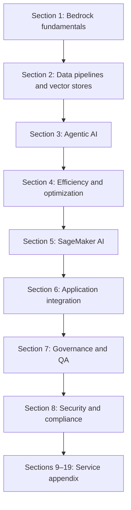

# [AWS GenAI Pro](https://www.udemy.com/course/ultimate-aws-certified-generative-ai-developer-professional/?srsltid=AfmBOooSscuOIXNV8Z1UYMQkANqvgRzw74SaKskIeNUbvkpdunOhBCTb)

* [Course Resources](https://www.sundog-education.com/ultimate-aws-certified-generative-ai-developer-professional-course-materials/)

## :material-school: Course Overview

The course follows a **fundamentals-first** path through the <a href="https://docs.aws.amazon.com/aws-certification/latest/ai-professional-01/ai-professional-01.html">AWS Certified Generative AI Developer - Professional (AIP-C01)</a> exam scope. Sections build on each other rather than mirroring exam domains one-for-one (which would repeat overlapping material).

| Section | Topic | Highlights |
|---|---|---|
| :material-robot: [Section 1](section-1/index.md) | Generative AI fundamentals and Bedrock | Foundation models, fine-tuning, RAG, knowledge bases, guardrails, prompt engineering, prompt flows, enterprise integration |
| :material-database: [Section 2](section-2/index.md) | Managing data for generative AI | Bedrock Data Automation, SageMaker Data Wrangler, Glue, Transcribe, Comprehend, OpenSearch, RDS/Aurora, DynamoDB, S3 |
| :material-account-group: [Section 3](section-3/index.md) | Agentic AI | Bedrock agents, multi-agent workflows, Strands Agents, AgentCore, humans in the loop, Amazon Q |
| :material-speedometer: [Section 4](section-4/index.md) | Operational efficiency and optimization | Token efficiency, model selection, throughput, caching, resilient architectures, cross-Region inference |
| [Section 5](section-5/index.md) | Managing models with SageMaker AI | Processing, training, deployment, Ground Truth, Model Monitor, Clarify, registry, lineage, Neo, pipelines |
| [Section 6](section-6/index.md) | More tools for building AI apps | Lambda, API Gateway, Step Functions, EventBridge, DevOps tools, AppSync, Outposts, Wavelength, Amplify |
| [Section 7](section-7/index.md) | Governance and QA | Prompt management, agent tracing, evaluation, responsible AI, CloudWatch, CloudTrail, X-Ray, Lake Formation |
| [Section 8](section-8/index.md) | Security, identity, and compliance | IAM, KMS, Macie, Secrets Manager, Cognito, WAF, VPC, PrivateLink |
| [Sections 9–19](section-9/index.md) | Other services you should know | Analytics, compute, containers, databases, DevOps, ML, networking, storage—appendix-style review |

## What this lecture covers

This opening lecture introduces the **AWS Certified Generative AI Developer - Professional** certification course. Instructor Frank Kane explains how the course is organized (mapped to the official exam guide and AWS Skill Builder materials, but reordered for less repetition), walks through **every major section** and the AWS services each one covers, and sets expectations for **exam difficulty**, **prerequisites**, and **related certifications**.

## Key definitions (from the lecture)

| Term | Definition |
|---|---|
| **Foundation model (FM)** | Large pre-trained models (GPT-class, Amazon Nova, Titan, Claude, and similar) that generative AI applications are built on top of—not built from scratch in this exam. |
| **Retrieval augmented generation (RAG)** | Grounding model responses by retrieving relevant chunks from your data and injecting them into the prompt—often via <a href="https://docs.aws.amazon.com/bedrock/latest/userguide/kb-how-it-works.html">Amazon Bedrock knowledge bases</a> backed by vector stores. |
| **Embedding vectors** | Numeric representations of text chunks that capture semantic meaning; stored in vector databases for similarity search during RAG. |
| **Agentic AI** | Giving an AI system **tools** so it can interact with external systems, APIs, or enterprise data—not just generate text in isolation. |
| **Cross-Region inference** | Routing Bedrock inference requests across AWS Regions to spread load, improve throughput, and meet capacity needs for some models. |

## How this course is organized

The course is **not** structured strictly around the exam's domain breakdown. Domains overlap heavily, so Frank Kane reorganized the material to:

- **Reduce repetition** across domains
- **Build concepts progressively**—fundamentals first, then data, agents, optimization, deployment, governance, and review topics

## Section-by-section preview

### Section 1: Generative AI fundamentals and Amazon Bedrock

<a href="https://docs.aws.amazon.com/bedrock/latest/userguide/what-is-bedrock.html">Amazon Bedrock</a> is the core AWS service for generative AI. This section covers:

- **Foundation models** and how applications use them
- **Fine-tuning**—data formatting and customization for domain-specific behavior
- **RAG** via knowledge bases and vector stores to inject ground-truth data and reduce hallucinations
- **Optimizing embeddings and vector stores** for retrieval performance
- **Guardrails** to block unsafe outputs and protect against malicious use
- **Prompt engineering** and **prompt management** for reusable, optimized prompts
- **Bedrock Flows** for chaining prompts and steps into larger workflows
- **Enterprise integration** techniques for connecting to internal data sources

See [Section 1: Generative AI Fundamentals and Bedrock](section-1/index.md).

### Section 2: Managing data for generative AI

RAG and knowledge bases require **populating and maintaining** vector stores. This section covers data transformation, ETL, and storage:

| Area | Services and tools |
|---|---|
| Structured extraction from unstructured data | <a href="https://docs.aws.amazon.com/bedrock/latest/userguide/bda-how-it-works.html">Bedrock Data Automation</a> (formerly Bedrock Data Maturation) |
| Data preparation pipelines | SageMaker Data Wrangler, <a href="https://docs.aws.amazon.com/glue/latest/dg/what-is-glue.html">AWS Glue</a> |
| AI enrichment | <a href="https://docs.aws.amazon.com/transcribe/latest/dg/what-is.html">Amazon Transcribe</a>, <a href="https://docs.aws.amazon.com/comprehend/latest/dg/what-is.html">Amazon Comprehend</a> |
| Observability | <a href="https://docs.aws.amazon.com/AmazonCloudWatch/latest/monitoring/WhatIsCloudWatch.html">Amazon CloudWatch</a> |
| Primary vector store (exam focus) | <a href="https://docs.aws.amazon.com/opensearch-service/latest/developerguide/what-is.html">Amazon OpenSearch Service</a>—tuning for GenAI workloads |
| Alternative vector backends | <a href="https://docs.aws.amazon.com/AmazonRDS/latest/UserGuide/CHAP_WhatIs.html">Amazon RDS</a>, <a href="https://docs.aws.amazon.com/AmazonRDS/latest/AuroraUserGuide/CHAP_AuroraOverview.html">Amazon Aurora</a>, DynamoDB-to-OpenSearch integrations |
| Object storage | <a href="https://docs.aws.amazon.com/AmazonS3/latest/userguide/Welcome.html">Amazon S3</a>—lifecycle management and finer points beyond basics |

See [Section 2: Managing Data for Generative AI](section-2/index.md).

### Section 3: Agentic AI

Agentic systems give models **tools** to act in the world:

- <a href="https://docs.aws.amazon.com/bedrock/latest/userguide/agents-how.html">Amazon Bedrock Agents</a> and **multi-agent workflows** (parallel or coordinated specialists)
- **Strands Agents**—a Python SDK for composing agent workflows
- <a href="https://docs.aws.amazon.com/bedrock-agentcore/latest/devguide/what-is-bedrock-agentcore.html">Amazon Bedrock AgentCore</a>—managed deployment at scale with memory, tools, and production features
- **Humans in the loop** for review and escalation on high-stakes decisions
- **Amazon Q** ecosystem—agentic tools for developer productivity (<a href="https://docs.aws.amazon.com/amazonq/latest/qbusiness-ug/how-it-works.html">Amazon Q Business</a>, Q Apps)

See [Section 3: Agentic AI](section-3/index.md).

### Section 4: Operational efficiency and optimization

A major exam theme. Topics include:

- **Context management and token efficiency**—avoid paying for unnecessary tokens
- **Cost-effective model selection**—match simpler models to simpler prompts at runtime
- **Resource utilization and throughput** maximization
- **Caching** to reduce redundant inference and token spend
- **Responsive and resilient AI system** design principles
- **Foundation model performance** optimization and resource allocation
- <a href="https://docs.aws.amazon.com/bedrock/latest/userguide/global-cross-region-inference.html">Bedrock cross-Region inference</a>—load spreading and, for some models, a practical requirement

See [Section 4](section-4/index.md).

### Section 5: Managing models with SageMaker AI

<a href="https://docs.aws.amazon.com/sagemaker/latest/dg/whatis.html">Amazon SageMaker AI</a> is an alternative to Bedrock when you need **more control** or want to deploy **any ML model** (including foundation models):

- Data processing, training, and deployment
- Deployment safeguards (safe rollouts and rollback)
- SageMaker Ground Truth, Model Monitor, Clarify, Model Registry, lineage tracking
- Edge inference with SageMaker Neo
- SageMaker Pipelines for end-to-end GenAI workflows

See [Section 5](section-5/index.md).

### Section 6: Building applications around your AI system

A model alone is not a product. This section covers integration and delivery:

| Role | Services |
|---|---|
| Compute glue | <a href="https://docs.aws.amazon.com/lambda/latest/dg/welcome.html">AWS Lambda</a> |
| API front door | <a href="https://docs.aws.amazon.com/apigateway/latest/developerguide/welcome.html">Amazon API Gateway</a> |
| Resilience and orchestration | <a href="https://docs.aws.amazon.com/step-functions/latest/dg/welcome.html">AWS Step Functions</a> (circuit breakers, error handling), <a href="https://docs.aws.amazon.com/eventbridge/latest/userguide/eb-what-is.html">Amazon EventBridge</a> |
| Dynamic configuration | AWS AppConfig |
| DevOps delivery | CodeBuild, CodeDeploy, CodePipeline |
| GraphQL and front end | <a href="https://docs.aws.amazon.com/appsync/latest/devguide/welcome.html">AWS AppSync</a>, <a href="https://docs.aws.amazon.com/amplify/latest/userguide/welcome.html">AWS Amplify</a> |
| Enterprise edge | AWS Outposts, AWS Wavelength |
| Event buffering | Amazon SQS |

See [Section 6](section-6/index.md).

### Section 7: Governance and quality assurance

- <a href="https://docs.aws.amazon.com/bedrock/latest/userguide/prompt-management-modify.html">Bedrock prompt management</a>—track and reuse prompts across applications
- **Agent tracing**—debug why an agent took a particular action
- **Evaluation techniques** for agents and GenAI applications
- **Responsible AI** principles
- Observability and audit: CloudWatch, <a href="https://docs.aws.amazon.com/awscloudtrail/latest/userguide/cloudtrail-user-guide.html">AWS CloudTrail</a>, <a href="https://docs.aws.amazon.com/xray/latest/devguide/aws-xray.html">AWS X-Ray</a>
- <a href="https://docs.aws.amazon.com/lake-formation/latest/dg/what-is-lake-formation.html">AWS Lake Formation</a> for data access governance

See [Section 7](section-7/index.md).

### Section 8: Security, identity, and compliance

GenAI-specific relevance layered on familiar AWS security services:

| Service | GenAI relevance |
|---|---|
| <a href="https://docs.aws.amazon.com/IAM/latest/UserGuide/introduction.html">AWS IAM</a> | Roles and policies for Bedrock, agents, and data access |
| <a href="https://docs.aws.amazon.com/kms/latest/developerguide/overview.html">AWS KMS</a> | Encryption keys for models, data, and secrets |
| <a href="https://docs.aws.amazon.com/macie/latest/user/what-is-macie.html">Amazon Macie</a> | Discovering sensitive data in S3 corpora used for RAG |
| <a href="https://docs.aws.amazon.com/secretsmanager/latest/userguide/intro.html">AWS Secrets Manager</a> | Storing API keys and credentials securely |
| <a href="https://docs.aws.amazon.com/cognito/latest/developerguide/what-is-amazon-cognito.html">Amazon Cognito</a> | User authentication for GenAI applications |
| <a href="https://docs.aws.amazon.com/waf/latest/developerguide/waf-chapter.html">AWS WAF</a> | Protecting public-facing GenAI APIs |
| <a href="https://docs.aws.amazon.com/vpc/latest/userguide/what-is-amazon-vpc.html">Amazon VPC</a>, <a href="https://docs.aws.amazon.com/vpc/latest/privatelink/what-is-privatelink.html">AWS PrivateLink</a> | Network isolation for sensitive workloads |

See [Section 8](section-8/index.md).

### Sections 9–19: Appendix review

Many in-scope services are **not GenAI-specific** but appear in scenario questions as components of larger systems (analytics, compute, containers, databases, DevOps, networking, storage). Skip lectures you already know from prior certs or experience; review anything unfamiliar—they show up in practice exams and Skill Builder materials.

## Key distinctions / comparisons

| Item | Notes |
|---|---|
| **Course structure vs exam domains** | The course reorders material for learning efficiency; you still need to know all exam domains, just not in domain order. |
| **Bedrock vs SageMaker AI** | Bedrock is managed FM access with minimal ops; SageMaker AI offers deeper control for custom training, deployment, and MLOps. |
| **GenAI Developer Professional vs ML Specialty** | The new exam **replaces** the <a href="https://docs.aws.amazon.com/aws-certification/latest/machine-learning-specialty-01/machine-learning-specialty-01.html">AWS Certified Machine Learning - Specialty (MLS-C01)</a>, phased out in early 2026. MLS was classical ML–heavy; this exam is **generative AI and foundation models**. |
| **Professional vs Associate ML Engineer** | The <a href="https://docs.aws.amazon.com/aws-certification/latest/machine-learning-engineer-associate-01/machine-learning-engineer-associate-01.html">AWS Certified Machine Learning Engineer - Associate (MLA-C01)</a> is the closest prior cert and extra helpful background. |
| **In scope vs helpful background** | Data engineering is **officially out of scope**, but pipeline knowledge helps you reason about scenario answers. |

## :material-certificate: What to expect on the exam

!!! tip "Exam mindset"
    Questions are **scenario-driven**: pick the best architecture or implementation, not isolated trivia. Integration thinking and trade-offs (cost, latency, security, accuracy) matter more than service name recall.

- **Scenario-driven**, not trivia: complex requirements where you pick the **best** architecture or implementation
- **Integration thinking**: understand how services fit together, not just what each service is called
- **Professional difficulty**: comparable challenge level to the retired ML Specialty exam
- Questions assume you can evaluate trade-offs (cost, latency, security, accuracy) in real-world GenAI designs

## Who this certification is for

AWS's official target candidate profile:

- **Two or more years** of AWS plus ML/AI experience
- **One or more years** hands-on implementing generative AI solutions
- **Not a first certification**—Cloud Practitioner–level AWS basics (S3, IAM, security) should already be familiar
- If AWS fundamentals are weak, start with Cloud Practitioner before this professional exam

What the exam **does not** require:

- Building foundation models from scratch
- Classical ML algorithms as a primary focus
- Formal data-engineering or feature-engineering credentials (though data pipeline concepts still appear)

Helpful prior learning:

- <a href="https://docs.aws.amazon.com/aws-certification/latest/ai-practitioner-01/ai-practitioner-01.html">AWS Certified AI Practitioner (AIF-C01)</a> for business-oriented AI context
- Machine Learning Engineer Associate for the closest technical overlap

!!! note "Appendix content"
    Some appendix content in this course is reused from other Sundog certification prep courses—mostly in the later service-review sections.

## Key takeaways

- The course maps to the official exam guide but is **reordered** to reduce overlap and build concepts progressively.
- **Bedrock fundamentals → data → agents → optimization → SageMaker → apps → governance → security → appendix** is the learning path.
- The exam tests **scenario judgment** and **service integration**, not isolated fact recall.
- This professional cert **replaces** the ML Specialty exam and focuses on **generative AI**, not classical ML.
- Prerequisites are real: AWS experience, GenAI familiarity, and prior cert foundations matter.
- Appendix sections (Sections 9–19) are skippable review if you already know those AWS service categories.

## Industry scenarios

- **Financial services compliance chatbot**: A bank builds RAG over policy documents (Section 2 OpenSearch + Section 1 guardrails), deploys Bedrock Agents with human escalation (Section 3), and uses CloudTrail plus prompt management (Sections 7–8) for auditability.
- **SaaS customer-support platform**: A startup routes simple queries to a smaller FM and complex ones to a larger model (Section 4 model selection), caches frequent answers (Section 4 caching), and exposes the API through API Gateway and Lambda (Section 6) with WAF and Cognito (Section 8).
- **Enterprise ML platform team**: An internal platform group fine-tunes models on SageMaker AI (Section 5), deploys agents via AgentCore at scale (Section 3), and uses cross-Region inference (Section 4) to handle global traffic spikes without manual capacity planning.

## External References

- <a href="https://docs.aws.amazon.com/aws-certification/latest/ai-professional-01/ai-professional-01.html">AWS Certified Generative AI Developer - Professional (AIP-C01) exam guide</a>
- <a href="https://docs.aws.amazon.com/bedrock/latest/userguide/what-is-bedrock.html">Amazon Bedrock overview</a>
- <a href="https://docs.aws.amazon.com/bedrock/latest/userguide/kb-how-it-works.html">How Amazon Bedrock knowledge bases work</a>
- <a href="https://docs.aws.amazon.com/bedrock/latest/userguide/guardrails-how.html">How Amazon Bedrock Guardrails works</a>
- <a href="https://docs.aws.amazon.com/bedrock/latest/userguide/flows-create.html">Create and design a flow in Amazon Bedrock</a>
- <a href="https://docs.aws.amazon.com/bedrock/latest/userguide/agents-how.html">How Amazon Bedrock Agents works</a>
- <a href="https://docs.aws.amazon.com/bedrock-agentcore/latest/devguide/what-is-bedrock-agentcore.html">Amazon Bedrock AgentCore overview</a>
- <a href="https://docs.aws.amazon.com/bedrock/latest/userguide/global-cross-region-inference.html">Global cross-Region inference in Amazon Bedrock</a>
- <a href="https://docs.aws.amazon.com/sagemaker/latest/dg/whatis.html">What is Amazon SageMaker AI?</a>
- <a href="https://docs.aws.amazon.com/aws-certification/latest/machine-learning-specialty-01/machine-learning-specialty-01.html">AWS Certified Machine Learning - Specialty (MLS-C01)</a>
- <a href="https://docs.aws.amazon.com/aws-certification/latest/machine-learning-engineer-associate-01/machine-learning-engineer-associate-01.html">AWS Certified Machine Learning Engineer - Associate (MLA-C01)</a>
- <a href="https://docs.aws.amazon.com/aws-certification/latest/ai-practitioner-01/ai-practitioner-01.html">AWS Certified AI Practitioner (AIF-C01)</a>