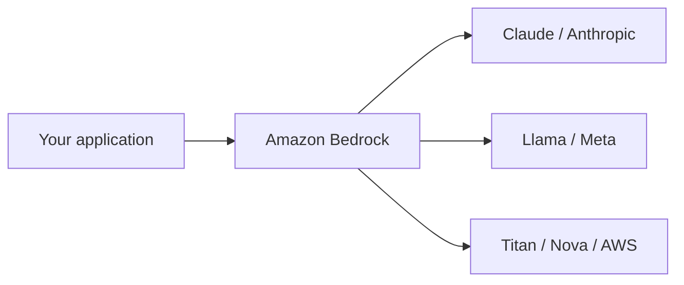
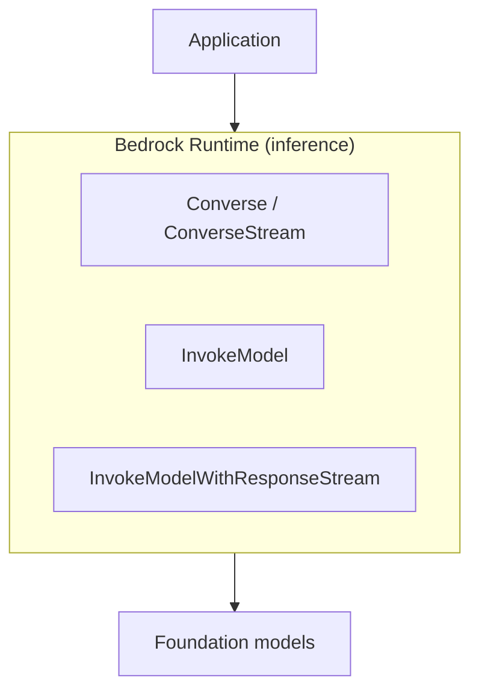
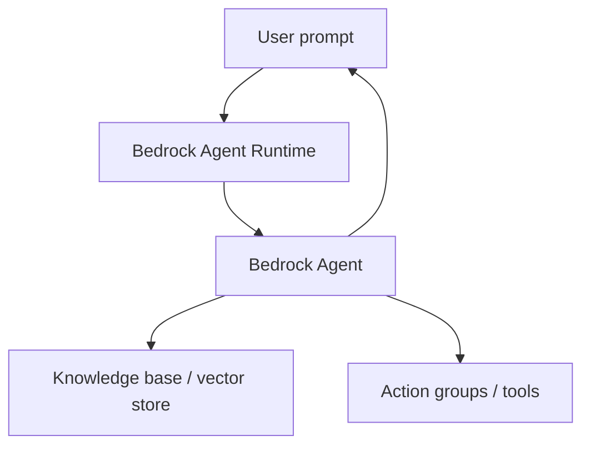

# :material-aws: Amazon Bedrock Overview

!!! note "Marketplace billing"
    Foundation model usage is billed through the **AWS Marketplace** on your AWS bill (separate line items per provider). Check <a href="https://aws.amazon.com/bedrock/pricing/">Bedrock pricing</a> per model—cost optimization is a major exam theme later in the course.

## What this lecture covers

This lecture introduces **generative AI fundamentals** and <a href="https://docs.aws.amazon.com/bedrock/latest/userguide/what-is-bedrock.html">Amazon Bedrock</a>—AWS’s core managed service for building GenAI applications. You will learn what **foundation models** are, survey popular model families (Claude, Llama, Titan, Nova, and others), and see how Bedrock provides a **unified, serverless API** over chat, text, image, and embedding workloads plus **knowledge bases** and **agents**.

## Key definitions (from the lecture)

| Term | Definition |
|---|---|
| **Foundation model (FM)** | A large **pre-trained transformer** model you fine-tune, compose into larger systems, or invoke as-is for chat, Q&A, images, embeddings, or video. |
| <a href="https://docs.aws.amazon.com/bedrock/latest/userguide/what-is-bedrock.html">**Amazon Bedrock**</a> | AWS’s **abstraction layer** over many foundation models: one API surface to swap models, run inference, customize models, and build RAG and agentic apps—**fully serverless**. |
| **Embeddings** | Dense **vectors** that encode the meaning of text chunks; used heavily in retrieval and semantic search (see [Vector Stores and Semantic Search](../vector-stores-and-semantic-search/index.md)). |
| <a href="https://docs.aws.amazon.com/bedrock/latest/userguide/knowledge-base.html">**Knowledge base**</a> | Bedrock’s managed **retrieval augmented generation (RAG)** feature—ingest documents, embed chunks, retrieve context at query time. |
| <a href="https://docs.aws.amazon.com/bedrock/latest/userguide/agents-how.html">**Bedrock agent**</a> | An orchestrated GenAI application that can use **tools**, **action groups**, and **knowledge bases** to perform multi-step, agentic tasks—not just a single model call. |

## Foundation model landscape

Foundation models are the **bedrock** (foundation) you build applications on. Different models excel at different tasks; choosing the right one for cost and capability is a recurring theme in this course.

| Model / family | Provider | Typical use (from the lecture) |
|---|---|---|
| **GPT** (OpenAI) | OpenAI | General-purpose LLM; widely known chat and reasoning baseline. |
| **Claude** (Anthropic) | Anthropic | Popular in Bedrock for Q&A and **workflow automation** (e.g. agentic coding tools); strong at complex multi-step tasks. |
| **Llama** | Meta | Competing open-weights LLM family available through Bedrock. |
| **DeepSeek** | DeepSeek | LLM gaining attention; another foundation-model option in the ecosystem. |
| **DALL·E** | OpenAI | **Image generation** (conceptual counterpart to text LLMs). |
| **Stable Diffusion** | Stability AI | **Image generation** option commonly referenced alongside DALL·E. |
| **Jurassic-2** | AI21 Labs | Multilingual LLM; less prominent now but may appear on broader AI foundation exams. |
| <a href="https://docs.aws.amazon.com/bedrock/latest/userguide/titan-embedding-models.html">**Amazon Titan**</a> | AWS | Strong for **embeddings** (text → vectors); also supports text generation, summarization, and Q&A. |
| <a href="https://docs.aws.amazon.com/bedrock/latest/userguide/model-parameters-nova.html">**Amazon Nova**</a> | AWS | AWS’s newer multimodal model family. |
| <a href="https://docs.aws.amazon.com/bedrock/latest/userguide/model-card-amazon-nova-reel.html">**Amazon Nova Reel**</a> | AWS | **Video generation** from text (lecture: “Nova Reels”). |

!!! tip "Titan and RAG"
    Titan’s embedding strength matters because embeddings power **semantic search** over your documents—the retrieval step in RAG pipelines covered later in [Bedrock Knowledge Bases](../bedrock-knowledge-bases/index.md).

## What is Amazon Bedrock?

Bedrock wraps many third-party and AWS foundation models behind a **single unified API** so you can:

- **Swap models** without rewriting application code—important because better models ship frequently.
- Invoke **chat, text, and image** (multimodal) models from one service.
- Bring **your own** pre-trained or <a href="https://docs.aws.amazon.com/bedrock/latest/userguide/custom-models.html">fine-tuned custom models</a> built from a base FM.
- Use managed **knowledge bases** for RAG and **agents** for tool-using, multi-step workflows.
- Stay **serverless**—no servers, OS patches, or inference fleet management on your side.

Bedrock also integrates with <a href="https://docs.aws.amazon.com/sagemaker-unified-studio/latest/userguide/bedrock.html">Amazon SageMaker Unified Studio</a> when you need deeper control over deployment, tuning, and MLOps (a later course section).

### Marketplace billing model

Bedrock acts as a **marketplace layer** between you and model providers (Anthropic, Meta, etc.). Usage of each underlying FM is billed on your **AWS bill** through the **AWS Marketplace**—separate line items and pricing terms per provider, not a single flat “Bedrock compute” rate. Always check <a href="https://aws.amazon.com/bedrock/pricing/">Bedrock pricing</a> for the models you select.



## Bedrock API surfaces

Bedrock splits **management** (build/configure) from **inference** (run prompts). The lecture highlights four logical groupings:

| API / client | Purpose |
|---|---|
| **Bedrock** (control plane) | Manage, deploy, and train or <a href="https://docs.aws.amazon.com/bedrock/latest/userguide/custom-model-fine-tuning.html">fine-tune</a> models via console or API. |
| <a href="https://docs.aws.amazon.com/bedrock/latest/userguide/conversation-inference.html">**Bedrock Runtime**</a> | **Inference**—send prompts, get completions, embeddings, or streamed responses. |
| **Bedrock Agent** (control plane) | Create and configure **agents**, action groups, and linked knowledge bases. |
| **Bedrock Agent Runtime** | **Invoke agents** and query knowledge bases at runtime. |

Use the **console** for exploration (including the <a href="https://docs.aws.amazon.com/bedrock/latest/userguide/getting-started-console.html">playground</a>); use the **APIs** for production applications.

### Bedrock Runtime entry points

The lecture calls out four main runtime operations for foundation-model inference:

| Operation | Role |
|---|---|
| <a href="https://docs.aws.amazon.com/bedrock/latest/userguide/conversation-inference.html">**Converse** / **ConverseStream**</a> | Multi-turn **chat** with streaming token feedback as the model generates. |
| **InvokeModel** | Single-shot model invocation (model-specific request/response bodies). |
| **InvokeModelWithResponseStream** | Same as InvokeModel with **streaming** output. |



### Agents and knowledge bases at runtime

<a href="https://docs.aws.amazon.com/bedrock/latest/userguide/agents-how.html">Bedrock Agents</a> go beyond a single model call: they orchestrate **multiple models**, **tools**, and **external knowledge** (web, enterprise systems, or your vector store). Agents give your GenAI application the ability to **act**—not only answer from training data.

| Agent Runtime API | Role |
|---|---|
| <a href="https://docs.aws.amazon.com/bedrock/latest/userguide/agents-invoke-agent.html">**InvokeAgent**</a> | Send a prompt to a configured agent; the agent plans, calls tools, and returns a final answer. |
| <a href="https://docs.aws.amazon.com/bedrock/latest/userguide/kb-test-retrieve.html">**Retrieve**</a> | Query a knowledge base **vector store** and return ranked chunks (RAG retrieval only). |
| <a href="https://docs.aws.amazon.com/bedrock/latest/userguide/kb-test-retrieve-generate.html">**RetrieveAndGenerate**</a> | Retrieve context **and** generate a grounded response in one call. |



## Permissions and model access

### IAM best practices

- **Do not use the AWS root account** for Bedrock console or API work—it may appear to work briefly but is the wrong long-term pattern.
- Use an **IAM user or role** with appropriate <a href="https://docs.aws.amazon.com/bedrock/latest/userguide/security-iam.html">Bedrock IAM permissions</a>:
  - **AmazonBedrockFullAccess** for development and configuration.
  - **AmazonBedrockReadOnly** for read-only auditing or consumption-only scenarios.

See [A quick note on model access](../a-quick-note-on-model-access/index.md) for hands-on prerequisites (billing alarms, quotas, Anthropic use-case forms).

### Model catalog access

Historically, enabling a foundation model required **explicit access requests**, terms acceptance, and billing acknowledgment in the model catalog. **As of this recording**, AWS is **phasing out** that extra step—models in the catalog are increasingly usable by default once IAM allows it. Policies evolve; always verify in your account’s **Model catalog** console.

Regardless of access flow, **pricing varies widely by model**—a core optimization skill is matching model power to the task (covered later in this section).

## How to apply it

Minimal illustration: list available models (control plane) and run a Converse call (runtime). Region and model IDs must match your account’s catalog.

```python
import boto3

region = "us-east-1"
bedrock = boto3.client("bedrock", region_name=region)
runtime = boto3.client("bedrock-runtime", region_name=region)

# Control plane: discover model IDs
for model in bedrock.list_foundation_models()["modelSummaries"]:
    print(model["modelId"])

# Runtime: multi-turn chat via Converse API
response = runtime.converse(
    modelId="anthropic.claude-3-sonnet-20240229-v1:0",
    messages=[{"role": "user", "content": [{"text": "Summarize Amazon Bedrock in one sentence."}]}],
)
print(response["output"]["message"]["content"][0]["text"])
```

Next hands-on step: explore models interactively in the [Hands-On with the Bedrock Playground](../hands-on-with-the-bedrock-playground/index.md) lecture.

## Examples

- **Model swap without rewrite**: An internal chatbot starts on Claude Haiku for cost; for complex tickets it switches the same Converse client to Claude Sonnet by changing `modelId` only.
- **Embeddings + RAG prep**: Ingest HR PDFs, embed chunks with **Titan Text Embeddings**, store vectors, then later wire a knowledge base for employee policy Q&A.
- **Agent with tools**: A support agent uses **InvokeAgent** with an action group that creates tickets in Jira when confidence is low—combining FM reasoning with external systems.

## Limitations / edge cases

- **Marketplace pricing** is per-model and per-modality; embedding + generation + agent orchestration each add cost lines.
- Not every FM supports every capability (fine-tuning, streaming, image, video)—check <a href="https://docs.aws.amazon.com/bedrock/latest/userguide/foundation-models-reference.html">model support</a> for your Region.
- Model access policies and default-enable behavior **change over time**; console state beats slide decks.
- SageMaker integration adds power but also operational surface area—use Bedrock alone when serverless simplicity is enough.

## Key takeaways

- **Foundation models** are large pre-trained transformers; Bedrock exposes many providers through one **serverless** API.
- Bedrock is an **abstraction and marketplace layer**—swap models, avoid vendor lock-in at the application layer, and understand **per-model billing**.
- Split APIs mentally: **Bedrock** (manage/customize) vs **Bedrock Runtime** (inference) vs **Agent** / **Agent Runtime** (orchestration + RAG).
- Runtime staples: **Converse**, **InvokeModel**, and streaming variants; agent runtime adds **InvokeAgent**, **Retrieve**, **RetrieveAndGenerate**.
- **Knowledge bases** and **agents** are first-class Bedrock features for RAG and tool-using workflows.
- Use **IAM users/roles**, not root; pick **FullAccess** vs **ReadOnly** deliberately; verify **model catalog** access and **pricing** before labs.

## Industry scenarios

1. **Enterprise AI platform team**: Standardizes on Bedrock’s unified API so product teams can A/B test Claude vs Llama vs Nova without separate vendor integrations—billing stays on the corporate AWS account with Marketplace line-item visibility.
2. **Regulated financial services**: Starts with **read-only** Bedrock access for auditors, **FullAccess** for a sandbox account, and Titan embeddings for semantic search over internal policy PDFs before enabling customer-facing agents.
3. **Media startup**: Prototypes copy with Claude via Converse, marketing images with Stable Diffusion or Nova Canvas, and short promos with **Nova Reel**—all through one AWS service and IAM boundary.

## Internal References

- [Section Intro](../section-intro/index.md)
- [A quick note on model access](../a-quick-note-on-model-access/index.md)
- [Hands-On with the Bedrock Playground](../hands-on-with-the-bedrock-playground/index.md)
- [More Depth on the Bedrock Converse API](../more-depth-on-the-bedrock-converse-api/index.md)
- [Fine-Tuning Foundation Models in Bedrock](../fine-tuning-foundation-models-in-bedrock/index.md)
- [Retrieval-Augmented Generation (RAG)](../retrieval-augmented-generation-rag/index.md)
- [Bedrock Knowledge Bases](../bedrock-knowledge-bases/index.md)
- [Section 1 index](../index.md)

## External References

- <a href="https://docs.aws.amazon.com/bedrock/latest/userguide/what-is-bedrock.html">What is Amazon Bedrock?</a>
- <a href="https://docs.aws.amazon.com/bedrock/latest/userguide/foundation-models-reference.html">Using models with Amazon Bedrock</a>
- <a href="https://docs.aws.amazon.com/bedrock/latest/userguide/model-access.html">Request access to Amazon Bedrock models</a>
- <a href="https://docs.aws.amazon.com/bedrock/latest/userguide/conversation-inference.html">Inference using the Converse API</a>
- <a href="https://docs.aws.amazon.com/bedrock/latest/userguide/service_code_examples_bedrock-runtime.html">Amazon Bedrock Runtime code examples</a>
- <a href="https://docs.aws.amazon.com/bedrock/latest/userguide/agents-how.html">How Amazon Bedrock Agents works</a>
- <a href="https://docs.aws.amazon.com/bedrock/latest/userguide/agents-invoke-agent.html">Invoke an agent from your application</a>
- <a href="https://docs.aws.amazon.com/bedrock/latest/userguide/knowledge-base.html">Amazon Bedrock Knowledge Bases</a>
- <a href="https://docs.aws.amazon.com/bedrock/latest/userguide/kb-test-retrieve-generate.html">RetrieveAndGenerate API</a>
- <a href="https://docs.aws.amazon.com/bedrock/latest/userguide/titan-embedding-models.html">Amazon Titan Text Embeddings models</a>
- <a href="https://docs.aws.amazon.com/bedrock/latest/userguide/model-parameters-nova.html">Amazon Nova models</a>
- <a href="https://docs.aws.amazon.com/bedrock/latest/userguide/custom-models.html">Customize models in Amazon Bedrock</a>
- <a href="https://docs.aws.amazon.com/bedrock/latest/userguide/security-iam.html">Identity and access management for Amazon Bedrock</a>
- <a href="https://docs.aws.amazon.com/bedrock/latest/userguide/getting-started-console.html">Get started in the Amazon Bedrock console</a>
- <a href="https://aws.amazon.com/bedrock/pricing/">Amazon Bedrock pricing</a>
