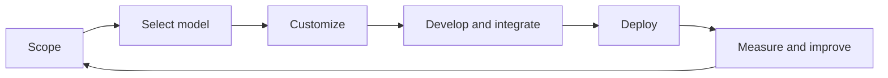

# AWS Well-Architected Tool Generative AI Lens

## What this lecture covers

The <a href="https://docs.aws.amazon.com/wellarchitected/latest/generative-ai-lens/generative-ai-lens.html">AWS Well-Architected Generative AI Lens</a>—a **best-practices guide** (not a service) aligned to the six Well-Architected pillars—and the **generative AI lifecycle** stages the exam may test in **ordering** questions.

## Key definitions (from the lecture)

| Term | Definition |
|---|---|
| **Well-Architected Framework** | AWS guidance organized around **six pillars** that apply across workloads. |
| **Generative AI Lens** | Lens-specific best practices mapping **generative AI** work to those pillars—companion to lenses such as the Machine Learning Lens. |
| **Generative AI lifecycle** | Scoped workflow: scope → select model → customize → develop/integrate → deploy → measure/improve (and iterate). |

## The six pillars (all domains)

| Pillar | Focus |
|---|---|
| **Operational excellence** | Run and monitor systems to deliver business value. |
| **Security** | Protect data and workloads. |
| **Reliability** | Recover from failures; meet demand. |
| **Performance efficiency** | Use resources efficiently. |
| **Cost optimization** | Avoid unnecessary spend. |
| **Sustainability** | Minimize environmental impact of cloud use. |

The Generative AI Lens maps GenAI practices onto **each** pillar—same structure as other Well-Architected lenses.

## Key distinctions / comparisons

| Item | Notes |
|---|---|
| **Lens vs service** | A **review tool and documentation set**—not something you “enable” like Bedrock. |
| **Course coverage vs lens** | Course material covers topics in the lens; the lens is still a useful **pre-exam review**. |
| **Lifecycle order vs ad hoc build** | Exams may ask you to **order** lifecycle phases correctly. |

## The problem (why the lens exists)

- GenAI projects span **model choice, safety, cost, and operations**—easy to optimize one dimension and neglect others.
- Teams need a **checklist** aligned with how AWS frames architecture reviews.
- Certification items may reference the lens or **lifecycle ordering** explicitly.

## The solution: use the lens as review homework

- Read the linked lens pages before the exam (lecture assigns as **homework**).
- Use it to cross-check security, reliability, cost, and operational practices for Bedrock workloads.
- Memorize the **generative AI lifecycle** sequence for drag-and-drop / ordering questions.

### Generative AI lifecycle (exam-friendly order)

```text
1. Scope          — Define what the application should accomplish.
2. Select model   — Choose a foundation model fit for the task.
3. Customize      — Fine-tune, adapt, or augment (RAG, etc.) to meet needs.
4. Develop        — Build and integrate the application.
5. Deploy         — Put the solution into production use.
6. Measure        — Evaluate outcomes and improve; loop back to scope for expansion.
```



!!! tip "Exam tip"
    “Put these steps in order” questions often mirror this lifecycle—verify against the current [Generative AI Lens](https://docs.aws.amazon.com/wellarchitected/latest/generative-ai-lens/generative-ai-lens.html) text if AWS reorders wording.

## Examples

**1. Pre-launch architecture review**

Team runs the Generative AI Lens workbook before production Bedrock agents—security pillar surfaces guardrail and IAM gaps.

**2. Cost pillar checkpoint**

After launch, reviews model selection (smaller model for classification, larger for synthesis) against cost optimization questions in the lens.

**3. Lifecycle ordering question**

Given “deploy, scope, customize, select model, develop”—correct order starts with **scope**, ends with **measure/improve** before restarting the loop.

## Limitations / edge cases

- The lens **does not replace** service-specific docs (Bedrock quotas, guardrails configuration, etc.).
- Lifecycle stages are **iterative**—real projects revisit scope and customization continuously.
- Pillar trade-offs remain (e.g., stronger security controls vs latency/cost).

## Industry scenarios

**1. Healthcare startup**

Uses the security and reliability pillars to document PHI handling, guardrails, and fallback when Bedrock throttles; lifecycle review before HIPAA audit.

**2. Media company video GenAI**

Sustainability and cost pillars drive resolution caps and batch inference; customize stage documents LoRA vs prompt-only choices.

**3. Enterprise platform team**

Operational excellence pillar standardizes logging for Converse API calls; measure stage defines human eval + automated grounding scores.

## Key takeaways

- Generative AI Lens = **best practices**, not a deployable AWS service.
- All six **Well-Architected pillars** still apply to GenAI.
- Know the **lifecycle order**: scope → select → customize → develop → deploy → measure/improve.
- Review the official lens pages before the exam; ordering questions are common.
- Course lectures cover lens topics—use the lens as a **consolidated checklist**.

## References

**In this repo**

- [Amazon Bedrock Overview](../amazon-bedrock-overview/index.md)
- [Bedrock Guardrails](../bedrock-guardrails/index.md)
- [Evaluating RAG Performance](../evaluating-rag-performance/index.md)
- [Enterprise Integration](../enterprise-integration/index.md)
- [Quiz: Bedrock and GenAI Fundamentals](../quiz-bedrock-and-genai-fundamentals/index.md)

**AWS documentation**

- <a href="https://docs.aws.amazon.com/wellarchitected/latest/generative-ai-lens/generative-ai-lens.html">Generative AI Lens - AWS Well-Architected Framework</a>
- <a href="https://docs.aws.amazon.com/wellarchitected/latest/framework/welcome.html">AWS Well-Architected Framework</a>
- <a href="https://docs.aws.amazon.com/wellarchitected/latest/generative-ai-lens/generative-ai-lifecycle.html">Generative AI lifecycle</a>
