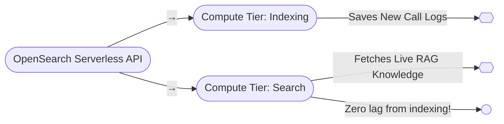

# Amazon OpenSearch Serverless

## OpenSearch Serverless overview

A few words about the more recent serverless version of OpenSearch, and keep in mind this was only introduced in January of twenty twenty-three, and it usually takes at least a year for new technologies to make it onto the exam. So watching this video before twenty twenty-four, you might not even pay too much attention to it, but regardless, you should know this exists, you know, if you're actually gonna go out and apply what you're learning here to the real world, which hopefully is the goal, you should know that OpenSearch serverless is a thing, can make your life even easier.

## On-demand auto-scaling

It provides on-demand auto-scaling, so unlike the managed version of OpenSearch, you don't have to think about the number of underlying servers to manage that for you.

## Collections versus domains

The main difference when using the serverless version versus the managed version is that you don't think about domains anymore, you think about collections. Just another word of how you organize your indices there.

## Search and time series collections

You can create two different kinds of collections, a search collection or a time series type of collection, two different collections.

## Encryption and KMS

OpenSearch Serverless is always encrypted. You give it a KMS key and it does the rest.

## Security policies

You can enforce your own data access policies, and encryption at rest is always required, it's always there with the Serverless version. Configure your security policies across many collections at once, unlike the managed version where you need to have separate policies for each individual domain. It's a little bit easier to use.

## OpenSearch Compute Units

Capacity in the serverless version of OpenSearch is measured in OpenSearch Compute Units or OCUs. You're able to set an upper limit to control your costs if you want to. The lower limit, however, will always be two for indexing and two for search services.

## Console navigation

Beyond that setting it up and using it's pretty much the same as it was in the managed version. You just go to the console, go in search, and now you'll see two different sections there over on the menus on the left. One will be for the managed version, and one will be for the serverless version.

## Future of serverless OpenSearch

I would imagine that over time they'll start to promote the serverless version more, but as of this recording anyway, it's it's still a new thing, so we'll see how it goes.

## Business value of OpenSearch Serverless

Using **Amazon OpenSearch Serverless** instead of the traditional managed version is a massive strategic advantage for your AI Receptionist SaaS company.

When launching a software company, your biggest enemy is **fixed infrastructure costs**—paying for servers that run 24/7 when you don't have enough customers yet to justify the bill. OpenSearch Serverless solves this entirely. It abstracts away clusters, instances, and nodes, operating on an on-demand, auto-scaling model.

Here is the exact business value OpenSearch Serverless injects into your company's architecture and bottom line:

---

### 1. Eliminating the "Idle Server" Capital Drain

As your lecture notes highlighted, with managed OpenSearch, you get billed for instance hours even if the cluster is sitting there doing absolutely nothing. If you are onboarding your first 10 clients, their call volume will be highly unpredictable. One client might get 5 calls a day; another might get 50.

* **The Serverless Advantage:** OpenSearch Serverless automatically scales compute capacity up and down based on the actual volume of search and indexing requests.
* **The Business Value:** If no one is calling your clients at 3:00 AM, your OpenSearch Serverless usage drops down to zero compute consumption. Your infrastructure costs scale perfectly inline with your actual revenue. You protect your cash flow during the critical early stages of your LLC.

### 2. Multi-Tenant Data Isolation Without Massive Overhead

In a multi-tenant SaaS, you must ensure that Client A (e.g., a dental clinic) can never accidentally search or see the call records of Client B (e.g., a law firm).

* **The Serverless Advantage:** With traditional OpenSearch, to guarantee absolute security isolation, you might feel forced to spin up entirely separate managed clusters for high-paying clients, which gets incredibly expensive. With OpenSearch Serverless, you can utilize a feature called **OpenSearch Serverless Collections**.
* **The Business Value:** You can create an isolated "Collection" (essentially a mini, logically separated search engine) for each business that signs up for your SaaS. They get complete, enterprise-grade data isolation and their own independent encryption keys, but you don't have to manage or pay for 50 different underlying server clusters.

### 3. Splitting the Workload: No Audio Lag During Heavy Reports

An AI phone call requires sub-second latency. If your virtual receptionist takes more than a second to retrieve data from its knowledge base, the caller will experience an awkward silence. A major issue with traditional databases is that if a business owner runs a massive data report (e.g., *"Show me all negative call analytics for the last 6 months"*), it hogs the server's CPU and slows down the database for everything else.

* **The Serverless Advantage:** OpenSearch Serverless completely decouples its **Indexing** component (writing call logs) from its **Search** component (reading knowledge bases for live calls).
* **The Business Value:** A business owner can run a massive, heavy analytical search on their dashboard, and it will have **zero impact** on the live phone calls happening simultaneously. The serverless architecture instantly provisions separate compute power for the dashboard user, ensuring your live AI receptionist lines stay fast, crisp, and lag-free.

                          
### 4. Zero Maintenance Layout (Focus on Sales, Not Devops)

As a founder, your time should be spent closing clients, refining the AI's prompts, and building integrations—not monitoring server memory usage or worrying about disk space capacity.

* **The Serverless Advantage:** There are no master nodes to configure, no data nodes to choose, no scaling policies to write, and no upgrades to manage. AWS handles all the patching, security updates, and underlying hardware failures automatically.
* **The Business Value:** You can operate as a lean, agile company. You don't need to hire an expensive DevOps engineer just to keep your search database online and stable.

---

### The Tactical Summary

OpenSearch Serverless changes the financial math of your business. It transforms what used to be a high-cost, high-maintenance enterprise search tool into a **pay-as-you-go utility**. It gives your virtual receptionist platform the capability to handle a massive surge of thousands of simultaneous calls, or scale down to quiet periods effortlessly, all while maintaining strict security compliance for your business clients.