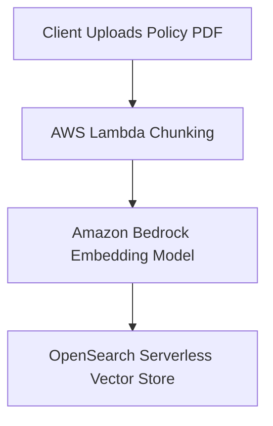
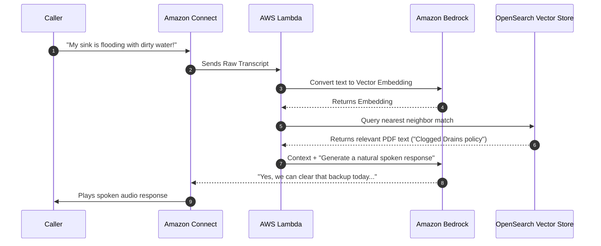

# Using and Tuning OpenSearch as a Vector Store

## What this lecture covers

OpenSearch is a primary vector-store backend for generative AI—especially <a href="https://docs.aws.amazon.com/bedrock/latest/userguide/knowledge-base-create.html">Amazon Bedrock Knowledge Bases</a>—but it is not limited to Bedrock. This lecture covers semantic vs hybrid search, vector search engines and ANN algorithms (HNSW vs inverted file), HNSW tuning parameters, vector compression, sharding strategy for semantic vs hybrid workloads, multi-index routing, and the OpenSearch Neural plugin as an all-in-one embedding + search pipeline.

## Key definitions (from the lecture)

| Term | Definition |
|---|---|
| **Vector store (OpenSearch)** | An OpenSearch index used to store embedding vectors and retrieve the closest chunks for RAG or similar retrieval workflows. |
| **Semantic search** | Find the nearest embedding vector to a query embedding and return the associated text chunk—pure vector similarity, no keyword matching. |
| **Hybrid search** | Combine semantic (embedding) search with traditional keyword search to improve relevancy when vectors alone miss the right context. |
| **Exact nearest neighbor (ENN)** | Computes distance from the query vector to every stored vector; accurate but too slow for production. |
| **Approximate nearest neighbor (ANN)** | Faster, “good enough” nearest-neighbor search that trades perfect accuracy for speed. |
| **HNSW** | Hierarchical Navigable Small World—an ANN algorithm that is fast but RAM-heavy; default choice when speed matters most. |
| **Inverted file (IVF)** | An ANN approach better suited to very large datasets when RAM is constrained; trades recall for speed and memory efficiency. (Instructor shorthand: “IDF.”) |
| **Binary vectors** | Floating-point dimensions compressed to bit sequences for fast distance search—not standalone useful embeddings, but useful for accelerating lookups. |
| **FP16** | 16-bit quantization of embedding vectors (vs 32-bit FP32); still useful embeddings with slightly less precision; HNSW uses this by default. |
| **Hierarchical indices** | A small top-level index that routes queries to domain-specific detail indexes. |
| **Neural plugin** | OpenSearch integration that embeds text and runs vector search in one pipeline; can call Bedrock embedding models. |

## OpenSearch as a GenAI vector store

- **Bedrock Knowledge Bases**: OpenSearch is a prominent vector-store option for Bedrock, with backup-store capability and a serverless option. The exam (in its current form) treats OpenSearch as the primary implementation for backing a Bedrock knowledge base.
- **Not Bedrock-only**: Vector stores in OpenSearch work with other retrieval stacks too—e.g., systems built on Hugging Face models or custom models for retrieval and generation—not only Bedrock revenue flows.
- **Serverless cost note (real world, not exam)**: OpenSearch Serverless is **not** scale-to-zero. A serverless vector collection can still cost on the order of a few hundred dollars per month even when idle—plan budgets accordingly.
- **S3 Vectors (instructor opinion)**: A newer, simpler alternative may eventually reduce reliance on OpenSearch for some Bedrock knowledge-base patterns; worth keeping on your radar outside the exam.

## Semantic vs hybrid search

| Mode | How it works | When it fits |
|---|---|---|
| **Semantic** | Chunk text → embedding vector → find closest stored embedding → return associated chunk | Default RAG pattern; good when meaning-based similarity is enough |
| **Hybrid** | Run embedding similarity **and** keyword/metadata search, then combine results | When pure vectors miss relevant chunks; improves relevancy at the cost of indexing keywords/metadata too |

Pure semantic search compares embedding vectors only. Hybrid search requires indexing keywords (and metadata) **in addition to** vectors, but is a powerful technique when vector-only retrieval under-shoots.

See also: <a href="https://docs.aws.amazon.com/opensearch-service/latest/developerguide/semantic-search.html">Semantic search in Amazon OpenSearch Service</a> and <a href="https://docs.aws.amazon.com/opensearch-service/latest/developerguide/serverless-configure-neural-search.html">Configure Neural Search and Hybrid Search on OpenSearch Serverless</a>.

## Vector search engines in OpenSearch

OpenSearch supports three high-level engines for vector search:

| Engine | Notes |
|---|---|
| **FAISS** (Facebook AI Similarity Search) | What most people use |
| **NMSLIB** (Non-Metric Space Library) | Third-party ANN library option |
| **Apache Lucene** | Native Lucene k-NN integration |

Fundamentally, vector search means: given a query embedding, find the closest stored embedding.

## Exact vs approximate nearest neighbor

| Approach | Behavior | Production use |
|---|---|---|
| **Exact NN** | Distance to every vector; pick minimum | Too slow for real workloads |
| **ANN** | Approximate closest neighbors | Standard trade-off: speed and scale over perfect recall |

## HNSW vs inverted file (IVF)

| Algorithm | Strength | Weakness | Choose when |
|---|---|---|---|
| **HNSW** | Fast, efficient queries | High RAM usage; may not scale on huge datasets | Speed and efficiency matter most; dataset fits in memory budget |
| **Inverted file (IVF)** | Better memory/speed on very large data | Lower recall vs HNSW | Huge dataset and RAM is the bottleneck |

## HNSW tuning parameters (exam focus)

| Parameter | Meaning | Higher value effect |
|---|---|---|
| **M** | Edges per node in the HNSW graph | Denser graph, higher recall, **more memory** |
| **ef_construction** | Size of dynamic list used while building the k-NN graph | **Slower indexing**, better graph quality |
| **ef_search** | How thoroughly the graph is explored at query time | **Higher recall / quality**, **slower search** |

Remember the trade-offs per parameter when tuning a specific workload—not one global “best” setting.

## Vector compression

Embeddings often have **1,000+ dimensions**; a ~300-character text chunk can consume more storage as vectors than as raw text. Different ANN methods apply compression under the hood, but two techniques to know:

| Technique | Idea | Trade-off |
|---|---|---|
| **Binary vectors** | Float dimensions → bit sequences (~32× compression vs 32-bit float per dimension) | Not useful embeddings alone; accelerates distance search |
| **FP16** | Quantize 32-bit floats to 16-bit | Still useful embeddings with slightly less precision; **HNSW default** in the library |

Compression is usually automatic; you rarely configure it directly unless optimizing at scale.

## Sharding strategy for vector workloads

Balance **shard size** with **CPU** so each shard has enough compute. Semantic and hybrid search differ in cross-shard coordination:

| Search type | Shard sizing guidance | Why |
|---|---|---|
| **Semantic (vector-only)** | Larger shards—on the order of **30–50 GB** | Straightforward queries; less cross-shard coordination |
| **Hybrid** | **Smaller shards** | Keyword leg of hybrid search needs more cross-shard coordination |

On **OpenSearch Serverless**, sharding is managed for you. On self-managed clusters, this distinction matters when you partition shards yourself.

Related: [OpenSearch Index Management and Designing for Stability](../20-opensearch-index-management-and-designing-for-stability/index.md) (general sharding guidance).

## Multiple indexes and hierarchical routing

When corpora differ by document type or domain:

- Use **separate indexes** so you can tune shard size, performance, and even **embedding models** per corpus.
- You need **query routing** to pick the right index for each query.

**Hierarchical indices**: a small, fast top-level index whose only job is routing to a detailed per-domain index. Each leaf index can have its own shards, tuning, and embedding model. Alternatives exist (e.g., a foundation model choosing the index), but hierarchical routing is a low-level, deterministic pattern.

## OpenSearch Neural plugin

The <a href="https://docs.aws.amazon.com/opensearch-service/latest/developerguide/serverless-configure-neural-search.html">Neural plugin</a> integrates embedding generation with OpenSearch search in **one pipeline**:

- Send **raw text** → OpenSearch computes embeddings → runs vector query → returns the most relevant chunk.
- Can be an alternative to a full Bedrock Knowledge Base when you want everything inside OpenSearch.
- **Bedrock integration**: the plugin can call a **Bedrock embedding model** during ingest/search so embedding happens inside OpenSearch rather than in a separate service.

## Examples

**Semantic query flow (conceptual):**

```python
# Query side: embed the user question, then k-NN search in OpenSearch
query_embedding = embed("What is the Sunday emergency fee for the West End?")
hits = opensearch.knn_search(
    index="policies",
    vector_field="embedding",
    query_vector=query_embedding,
    k=5,
)
# Return top chunk text from hits for the LLM prompt
context = "\n".join(h["_source"]["text"] for h in hits)
```

**Hybrid index mapping (sketch):** store both `embedding` (dense_vector / k-NN field) and searchable keyword/metadata fields so semantic and keyword legs can be combined.

```json
{
  "mappings": {
    "properties": {
      "text": { "type": "text" },
      "department": { "type": "keyword" },
      "embedding": {
        "type": "knn_vector",
        "dimension": 1536,
        "method": { "name": "hnsw", "engine": "faiss" }
      }
    }
  }
}
```

**HNSW tuning (exam-style trade-off):** raising `ef_search` before a demo retrieval benchmark improves recall on hard queries but increases p99 latency—useful when legal/compliance answers must not miss the right policy paragraph.

## Limitations / edge cases

- **Serverless ≠ free when idle**: budget for baseline serverless vector collection cost.
- **HNSW RAM**: very large corpora may force IVF or other memory-conscious ANN choices.
- **Hybrid cost**: keyword fields and cross-shard keyword work add indexing and query complexity vs pure semantic search.
- **Multi-index**: routing logic (hierarchical or otherwise) must be maintained as domains grow.
- **Binary vectors**: compression for speed, not a replacement for full-precision embeddings in all stages of RAG.

## Industry scenarios

### 1. Enterprise knowledge base on Bedrock + OpenSearch

A financial services firm connects SharePoint policies to a Bedrock Knowledge Base backed by OpenSearch. Semantic search handles paraphrased employee questions; they enable **hybrid search** so exact product codes and regulatory terms still match via keywords. They use **larger shards** while the workload is mostly vector-only, then **smaller shards** after adding hybrid keyword fields for compliance metadata.

### 2. Multi-domain SaaS with hierarchical indices

A healthcare SaaS stores separate corpora per specialty (dental, physical therapy, veterinary). Each specialty gets its own index with a tuned embedding model and shard policy. A **hierarchical top-level index** routes “appointment cancellation policy” queries to the correct specialty index without searching every tenant corpus on every request.

### 3. All-in-one ingest with the Neural plugin

A startup wants minimal moving parts: raw FAQ text ingested into OpenSearch Serverless, **Bedrock Titan embeddings** invoked by the Neural plugin, and k-NN retrieval without standing up a separate embedding microservice. OpenSearch returns the top chunks to their custom Hugging Face generator—OpenSearch as vector store, but not locked to Bedrock for generation.

## Key takeaways

- OpenSearch is the exam’s default mental model for **Bedrock Knowledge Base** vector storage, but works with **any** embedding/retrieval stack.
- **Semantic** = vectors only; **hybrid** = vectors + keywords—index both when relevancy suffers from vectors alone.
- Production search uses **ANN**, not exact NN; know **HNSW (fast, RAM-heavy)** vs **IVF (large data, memory-conscious)**.
- For HNSW, know **M**, **ef_construction**, and **ef_search** trade-offs (memory, index time, recall, query latency).
- Know **binary vectors** (speed) and **FP16** (HNSW default compression).
- **Semantic → larger shards (~30–50 GB)**; **hybrid → smaller shards** because of keyword cross-shard work.
- **Multi-index + hierarchical routing** per domain/model; **Neural plugin** embeds and searches in one pipeline, including Bedrock embedding models.

## Sample business use case

Using Amazon OpenSearch Serverless as a **Vector Store** is the secret sauce for making your AI receptionist intelligent, contextual, and hyper-personalized for each client company.

In traditional search, a database looks for exact words (e.g., matching "plumbing" with "plumbing"). A **Vector Store**, however, converts words, sentences, and business documents into mathematical coordinates (called embeddings) that capture the **semantic meaning** of the text. This means the AI understands concepts, synonyms, and context, regardless of the exact phrasing a caller uses.

For your multi-tenant SaaS business model, turning OpenSearch into your vector engine unlocks three high-value product features you can charge premium rates for:

---

### 1. Zero-Configuration Knowledge Bases for Your Clients

**The Business Value:** If your SaaS targets multiple industries (e.g., realtors, dentists, electricians), you cannot hardcode rules for how the AI should answer questions. Every company has unique pricing, service lists, and policies. A vector store allows your clients to simply upload their existing business PDFs or website URLs, and the AI instantly trains itself.

* **How It Works:** 1. A new client (e.g., a dental office) uploads their "New Patient Policy.pdf" to your SaaS dashboard.
2. An AWS Lambda function breaks the PDF into paragraphs and uses an embedding model (like Amazon Titan Text Embeddings on Bedrock) to turn those paragraphs into vectors.
3. These vectors are saved into the client's isolated **OpenSearch Serverless Vector Index**.



---

### 2. Semantic Intent Matching Mid-Call (The Dynamic RAG Flow)

**The Business Value:** During a live phone call, a customer will ask questions in unpredictable ways. A standard keyword search will fail if the caller uses different terminology than what is written in the company handbook. OpenSearch as a vector store enables Retrieval-Augmented Generation (RAG) that understands *intent*.

* **The Scenario:** A plumbing client’s PDF states: *"We clear clogged drains and sewer backups."* A caller dials in and says: *"Hey, my kitchen sink is backing up with dirty water, can someone fix this today?"*
* **How OpenSearch Resolves It:**
1. **Amazon Connect** streams the caller's text to a **Lambda** function.
2. The Lambda converts the caller's phrase into a vector and queries **OpenSearch Serverless**.
3. Even though the caller said *"kitchen sink backing up with dirty water"* and the PDF says *"clogged drains,"* OpenSearch recognizes that these concepts live in the exact same mathematical neighborhood.
4. OpenSearch instantly pulls the "clogged drains" policy and hands it to **Bedrock**, allowing the receptionist to confidently say: *"Yes, we specialize in clearing sink backups and can get a technician out to you today."*




---

### 3. Hyper-Personalized "Memory" and Conversation Stitching

**The Business Value:** If a customer calls a business multiple times, they hate repeating their story. Standard databases can show old transcripts, but an LLM cannot read hours of old call logs mid-phone call without introducing severe audio latency and massive API bills.

* **How It Works:** 1. At the end of every phone call, you use Bedrock to summarize the key points, and then convert that summary into a vector stored in OpenSearch.
2. When the customer calls back next week, OpenSearch executes a vector search based on their phone number and the current conversational context.
3. It quickly retrieves the *semantic essence* of their past issues (e.g., *"Customer had an ongoing issue with their water heater element last Tuesday"*).
4. This context is injected into Bedrock's memory pool instantly, allowing the AI receptionist to start the call with: *"Hi Frank, are you calling to check on that water heater element we looked at last week?"*

---

### Core Intuition for the SaaS Founder

By utilizing OpenSearch Serverless as a vector store, you aren't just building an IVR menu; you are building an **intelligent context engine**.

This allows you to sell your service as a **"Plug-and-Play Digital Employee."** You can tell your business clients: *"You don't need to learn coding or build complex conversation trees. Just upload your company handbook, and our AI vector store will give your virtual receptionist the intuition to understand exactly what your callers mean, no matter how they phrase it."*


## References

**In this repo**

- [Intro to OpenSearch in GenAI](../17-intro-to-opensearch-in-genai/index.md)
- [Introducing Amazon OpenSearch Service (part 1)](../18-introducing-amazon-opensearch-service-part-1/index.md)
- [Amazon OpenSearch Serverless](../22-amazon-opensearch-serverless/index.md)
- [OpenSearch Index Management and Designing for Stability](../20-opensearch-index-management-and-designing-for-stability/index.md)

**AWS documentation**

- <a href="https://docs.aws.amazon.com/opensearch-service/latest/developerguide/vector-search.html">Vector search - Amazon OpenSearch Service</a>
- <a href="https://docs.aws.amazon.com/opensearch-service/latest/developerguide/serverless-vector-search.html">Working with vector search collections - Amazon OpenSearch Service</a>
- <a href="https://docs.aws.amazon.com/opensearch-service/latest/developerguide/semantic-search.html">Semantic search in Amazon OpenSearch Service</a>
- <a href="https://docs.aws.amazon.com/opensearch-service/latest/developerguide/serverless-configure-neural-search.html">Configure Neural Search and Hybrid Search on OpenSearch Serverless</a>
- <a href="https://docs.aws.amazon.com/bedrock/latest/userguide/knowledge-base-create.html">Create a knowledge base - Amazon Bedrock Knowledge Bases</a>
- <a href="https://docs.aws.amazon.com/opensearch-service/latest/developerguide/s3-vector-opensearch-integration-engine.html">Advanced search capabilities with an Amazon S3 vector engine</a>
