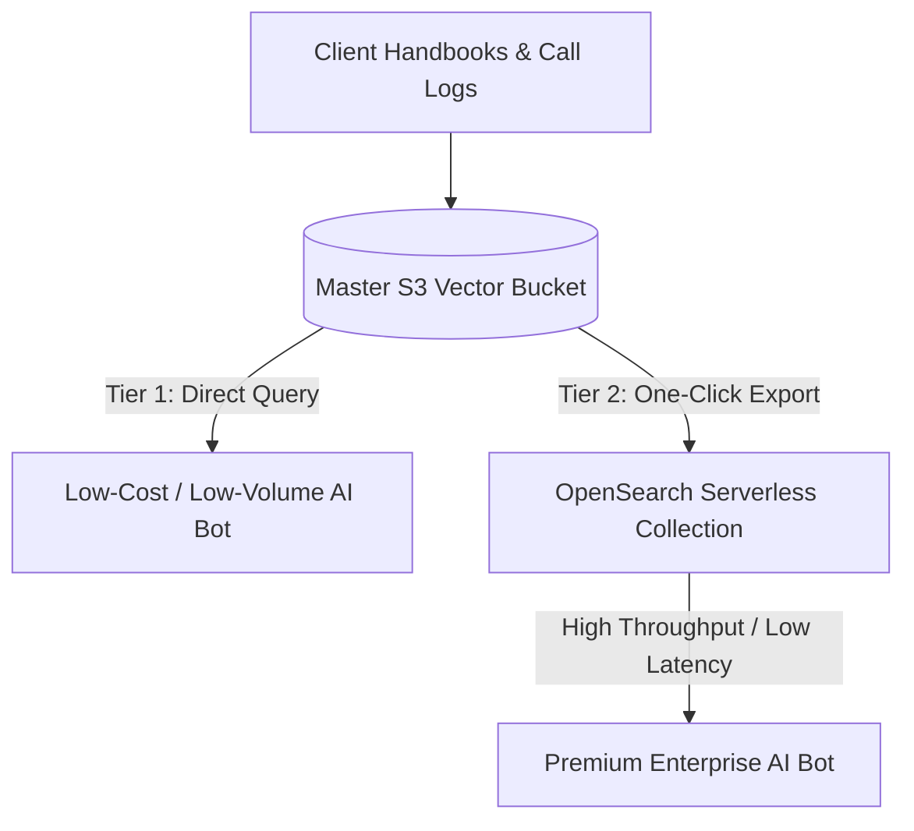

# Amazon S3 Vectors

## Amazon S3 Vectors overview

**Amazon S3 Vectors** changes the economics and data handling of your AI Virtual Receptionist SaaS completely.

AWS natively built vector search capabilities right into Amazon S3 buckets (**S3 Vector Buckets**). This means instead of needing an active database cluster (like a managed OpenSearch instance) to store and query the mathematical embeddings of your data, you can save and search vectors directly inside S3.

AWS designed S3 Vectors to offer **up to a 90% cost reduction** compared to traditional vector databases, while providing sub-second search times.

For your multi-tenant business model, S3 Vectors provides massive business value through a specific architectural tiering strategy.

---

### 1. The Low-Volume / Low-Cost "Cold Tenant" Tier

**The Business Problem:** When scaling a SaaS, you will sign up tiny clients (like a local barber shop or a solo accountant) who only get 2 or 3 calls a day. If you provision an OpenSearch Serverless collection for them, your base infrastructure cost might completely eat into your profit margins.

* **The Implementation Option:** For your lower-priced SaaS tiers, you can use an **S3 Vector Bucket** as their primary knowledge base. When their AI receptionist answers a call and needs to search their uploaded FAQ document, Lambda executes a `QueryVectors` API call directly against the S3 index.
* **The Business Value:** Because S3 is purely pay-per-use object storage, you are spending fractions of a cent. You can profitably sell an AI receptionist plan for as low as $29/month to small businesses because your underlying storage and vector query costs are almost $0.

---

### 2. The Tiered Search Architecture (S3 Vectors + OpenSearch)

**The Business Problem:** High-end enterprise clients need complex "hybrid search" (combining exact keyword lookups, like looking up a specific SKU number, with semantic vector meaning) and ultra-fast, always-on latency under 100ms. S3 Vectors is cheap, but it isn't built for hyper-complex filtering or massive, continuous query throughput.

* **The Implementation Option:** AWS built a native "one-click export" from S3 Vector Indexes to OpenSearch Serverless collections. You can build a **Tiered Search Strategy**:
1. Use S3 Vectors as the permanent, master storage vault for *all* your clients' vectors, historical call logs, and company data.
2. For your high-paying premium clients, use Lambda to spin up an OpenSearch Serverless collection and load their hot data into it for maximum real-time performance.
3. If a premium client downgrades or pauses their subscription, you simply wipe the OpenSearch collection to stop paying for it, knowing their entire vector memory is safely and cheaply preserved inside S3 Vectors.




---

### 3. Infinite Long-Term "Agent Memory"

**The Business Problem:** You want your receptionist to remember a customer's history even if they haven't called in six months. However, keeping millions of historical call embedding vectors loaded into a running database cluster for months just in case someone calls back is an architectural money pit.

* **The Implementation Option:** At the end of every phone call, your workflow Lambda saves the conversation summary embedding vector directly into an S3 Vector Index bucket, tagged with the caller's phone number as metadata.
* **The Business Value:** S3 Vectors can scale up to **2 billion vectors per index**. You can store petabytes of long-term customer context for pennies. When an old customer finally calls back six months later, Lambda does a quick query against the S3 Vector bucket, extracts the historical context, and passes it to Bedrock. Your bot maintains a permanent memory bank without inflating your active database bills.

---

### The Business Intuition: OpenSearch vs. S3 Vectors

To build your product architecture intuition, look at these two vector choices through a financial and performance lens:

| Feature | Amazon OpenSearch Serverless | Amazon S3 Vectors |
| --- | --- | --- |
| **Primary Strength** | Complex filtering, hybrid keyword/vector search, ultra-low warm latency (~100ms). | Outrageously cheap storage, linear usage-based scaling, zero infrastructure setup. |
| **Cost Profile** | Higher base cost, best optimized for heavy, always-on active search traffic. | **90% cheaper.** Pay strictly for uploads and queries. Scales down to absolute zero. |
| **Best Workflow Fit** | Your high-volume enterprise clients who demand complex data searches mid-phone call. | Your entry-level clients, archival data storage, and long-term agent memory logs. |

By pairing S3 Vectors with OpenSearch, your LLC doesn't have to choose between speed and cost. You use S3 Vectors to store everything cheaply, and pipe data into OpenSearch only when a client's business volume and subscription tier justify the higher performance.


## Lecture notes

### What this lecture covers

<a href="https://docs.aws.amazon.com/AmazonS3/latest/userguide/s3-vectors.html">Amazon S3 Vectors</a> integrates vector search directly into S3. This lecture covers setup (vector bucket + index), the `PutVectors` / `QueryVectors` APIs, embedding responsibilities, Bedrock and OpenSearch integrations, performance trade-offs, tiered search strategy, service limits, and ingestion/query best practices.

### Key definitions (from the lecture)

| Term | Definition |
|---|---|
| **S3 Vector bucket** | A specialized S3 bucket type (created in the S3 console alongside standard buckets) for storing vector data—embedding vectors plus structured metadata—for semantic search, Bedrock Knowledge Bases, and similar workloads. |
| **Vector index** | Created inside a vector bucket; you define vector **dimensions** and a **distance metric** (e.g., cosine). S3 manages indexing and optimization after that. |
| **PutVectors** | API to insert embedding vectors (with keys and optional metadata) into a vector index. |
| **QueryVectors** | API to run approximate nearest-neighbor search and return the closest semantic matches. |
| **Tiered search strategy** | Use S3 Vectors for infrequently queried or archival vectors; use OpenSearch for hot, performance-critical workloads needing sub-100ms latency. |
| **S3 Vectors Embed CLI** | Open-source AWS Labs CLI that embeds text/images via Bedrock and writes to or queries an S3 vector index in one command. |

### Key distinctions / comparisons

| Item | Notes |
|---|---|
| **S3 Vectors vs OpenSearch** | S3 Vectors is simpler and ~90% cheaper (instructor note: AWS does not spell out the baseline; likely vs traditional vector DB / open-source setups). OpenSearch requires tuning HNSW and related dials; S3 auto-optimizes for **price performance**. |
| **S3 Vectors vs Bedrock Knowledge Bases (managed path)** | S3 Vectors does **not** create embeddings—you supply vectors. Bedrock Knowledge Bases with S3 Vector Store as backend handles chunking, embedding, and storage for you. |
| **Export S3 → OpenSearch vs OpenSearch-on-S3-backend** | **Export** copies data into OpenSearch (two stores; you can pay for both if you forget to stop querying S3). **Backend mode** gives OpenSearch API/functionality with S3 Vectors storage underneath (managed clusters only). |
| **Performance-critical** | Instructor definition: queries needing **under 100 ms** → OpenSearch Serverless (or similar), not S3 Vectors alone. |

### Setup workflow

1. Create an **S3 Vector bucket** in the S3 console.
2. Create a **vector index** in that bucket—specify dimensions and distance metric.
3. Generate embeddings yourself (typically a Bedrock embedding model).
4. Call <a href="https://docs.aws.amazon.com/AmazonS3/latest/API/API_S3VectorBuckets_PutVectors.html">PutVectors</a> to store vectors + metadata.
5. Call <a href="https://docs.aws.amazon.com/AmazonS3/latest/API/API_S3VectorBuckets_QueryVectors.html">QueryVectors</a> to retrieve nearest neighbors at query time.

S3 handles ongoing optimization; you do not tune ANN graphs the way you would with OpenSearch.

### How to apply it: PutVectors example

Use the same embedding model for ingestion and queries. Each vector has a **key**, **data** (float32 array), and optional **metadata** for retrieval or filtering.

```python
import boto3

client = boto3.client("s3vectors")

client.put_vectors(
    vectorBucketName="my-vector-bucket",
    indexName="faq-index",
    vectors=[
        {
            "key": "policy-001",
            "data": {"float32": [0.12, -0.04, 0.33, "..."]},  # embedding dimensions must match index
            "metadata": {
                "source_text": "We clear clogged drains and sewer backups.",
                "department": "plumbing",
            },
        }
    ],
)
```

Equivalent AWS CLI pattern: `aws s3vectors put-vectors` with bucket name, index name, and vector payload. See the <a href="https://docs.aws.amazon.com/AmazonS3/latest/userguide/s3-vectors-getting-started.html">S3 Vectors getting started tutorial</a>.

### S3 Vectors Embed CLI (alternative interface)

Instead of hand-rolling embeddings + API calls, use the purpose-built <a href="https://docs.aws.amazon.com/AmazonS3/latest/userguide/s3-vectors-cli.html">s3vectors-embed-cli</a> from the AWS Labs GitHub repository:

- **`s3vectors-embed put`** — embed text or images with Bedrock, then store in the index in one step.
- **`s3vectors-embed query`** — embed the query with the same model, then search the index.

Useful for quick experiments; exam focus is more on concepts, limits, and integrations than CLI flags.

### Embeddings: your responsibility vs managed

- **Direct S3 Vectors usage**: You create embedding vectors (Bedrock or any model) and must use the **same model** for indexing and querying.
- **Bedrock Knowledge Bases with S3 Vector Store**: Upload documents; Bedrock manages chunking, embedding, and vector storage. You are still prompted to create a vector bucket during setup.
- **SageMaker Unified Studio**: S3 Vectors integrates with Bedrock in that environment as well.

See <a href="https://docs.aws.amazon.com/AmazonS3/latest/userguide/s3-vectors-integration.html">Using S3 Vectors with other AWS services</a>.

### Service properties and performance trade-offs

| Property | Behavior |
|---|---|
| **Strong consistency** | Vectors are immediately queryable after a successful write. |
| **Auto optimization** | S3 tunes storage/index layout over time for cost—not for sub-100ms latency. |
| **Query latency** | Best case ~100 ms; worst case up to ~1 s. AWS guarantees **sub-second** queries only. |
| **Cost vs speed** | The ~90% savings come with accepting sub-second (not sub-100ms) search. |

### Tiered search and OpenSearch connectivity

**When to use which tier**

| Workload | Recommended store |
|---|---|
| Infrequently queried vectors, archival memory, low-volume tenants | S3 Vectors |
| High query rate, hybrid search, under 100 ms latency | OpenSearch Serverless (or managed OpenSearch) |

**Two OpenSearch integration patterns**

1. **Export / import (copy)** — Move vectors from S3 into OpenSearch for hot search. This is a **copy**, not a live link. After export, delete or stop querying the S3 copy to avoid **double billing**.
2. **OpenSearch with S3 Vectors backend** — Configure a **managed OpenSearch cluster** (not Serverless for this pattern) to use S3 Vectors as its vector engine. You keep OpenSearch functionality at S3 Vectors price/performance (~100 ms–1 s). Fits apps already built on OpenSearch APIs where latency is acceptable.

See <a href="https://docs.aws.amazon.com/opensearch-service/latest/developerguide/s3-opensearch-vector-bucket-integration.html">Import from Amazon S3 Vectors to OpenSearch Serverless</a> and <a href="https://docs.aws.amazon.com/opensearch-service/latest/developerguide/s3-vector-opensearch-integration-engine.html">Advanced search capabilities with an Amazon S3 vector engine</a>.

### Limits (from the lecture)

| Limit | Value |
|---|---|
| Indices per vector bucket | Up to **10,000** |
| Vectors per index | Up to **2 billion** |
| Vectors per bucket (theoretical max) | Up to ~2 trillion across indices—generous for most workloads |

Official caps and additional restrictions: <a href="https://docs.aws.amazon.com/AmazonS3/latest/userguide/s3-vectors-limitations.html">S3 Vectors limitations</a>.

### Best practices for ingestion and query performance

| Practice | Why |
|---|---|
| **Batch writes/deletes** | Up to **500** vectors per API call—much faster than one-at-a-time. |
| **Concurrent requests** | Parallel smaller batches can reach up to **~2,500 vectors/sec** aggregate throughput. |
| **Retry on 429** | Per-index throughput limits exist; exceeding them returns **429**—implement exponential backoff. |
| **Multiple indices** | Many limits are **per index**; separate indices improve throughput and support multi-tenant isolation. |
| **Mark metadata non-filterable** | Fields you only retrieve (not filter on) should be declared **non-filterable** to improve performance. |

Full guidance: <a href="https://docs.aws.amazon.com/AmazonS3/latest/userguide/s3-vectors-best-practices.html">S3 Vectors best practices</a>.

### Industry scenarios

**1. Legal firm — closed-case document archive**

A law firm indexes millions of past case briefs and depositions for occasional research. Queries are rare and latency tolerance is high. They store all embeddings in S3 Vectors (~90% cheaper than keeping everything in OpenSearch). When a high-profile active case needs daily sub-100ms search, they export that subset to OpenSearch Serverless and delete the hot copy from S3 once migrated to avoid double cost.

**2. E-commerce — long-tail product catalog**

A marketplace embeds product descriptions for semantic “find similar items” search. Top-selling SKUs get heavy query traffic; millions of long-tail listings are searched rarely. Hot SKUs live in OpenSearch for fast recommendations at checkout; the full catalog vault stays in S3 Vectors as the durable, cheap master store.

**3. Internal IT — infrequent runbook retrieval**

An enterprise embeds runbooks and postmortems for an internal support bot. Engineers query a few times per day—not a latency-critical phone call. Bedrock Knowledge Bases backed by S3 Vector Store handles embedding and storage; the team skips OpenSearch entirely until query volume justifies a tier upgrade.

### Key takeaways

- S3 Vectors = vector search native to S3: create a **vector bucket**, then a **vector index** (dimensions + distance metric).
- You supply embeddings via `PutVectors`; search via `QueryVectors`—or let **Bedrock Knowledge Bases** manage the pipeline.
- **Strongly consistent**, auto-optimized for **cost**, but only **sub-second** query SLA (~100 ms best, ~1 s worst)—not sub-100ms.
- Use a **tiered search strategy**: S3 for cold/infrequent data; OpenSearch for performance-critical hot data.
- Export to OpenSearch is a **copy**—watch for duplicate storage/query charges.
- Managed OpenSearch can use S3 Vectors as a **backend** when you want OpenSearch APIs at lower cost and acceptable latency.
- Batch (up to 500), parallelize, use multiple indices, retry 429s, and mark non-filterable metadata explicitly.

### References

**In this repo**

- [Using and Tuning OpenSearch as a Vector Store](../23-using-and-tuning-opensearch-as-a-vector-store/index.md)
- [Amazon OpenSearch Serverless](../22-amazon-opensearch-serverless/index.md)

**AWS documentation**

- <a href="https://docs.aws.amazon.com/AmazonS3/latest/userguide/s3-vectors.html">Working with S3 Vectors and vector buckets</a>
- <a href="https://docs.aws.amazon.com/AmazonS3/latest/userguide/s3-vectors-getting-started.html">Tutorial: Getting started with S3 Vectors</a>
- <a href="https://docs.aws.amazon.com/AmazonS3/latest/userguide/s3-vectors-integration.html">Using S3 Vectors with other AWS services</a>
- <a href="https://docs.aws.amazon.com/AmazonS3/latest/userguide/s3-vectors-best-practices.html">S3 Vectors best practices</a>
- <a href="https://docs.aws.amazon.com/AmazonS3/latest/userguide/s3-vectors-limitations.html">Limitations and restrictions</a>
- <a href="https://docs.aws.amazon.com/AmazonS3/latest/userguide/s3-vectors-cli.html">s3vectors-embed-cli</a>
- <a href="https://docs.aws.amazon.com/bedrock/latest/userguide/knowledge-base-create.html">Create a knowledge base - Amazon Bedrock</a>