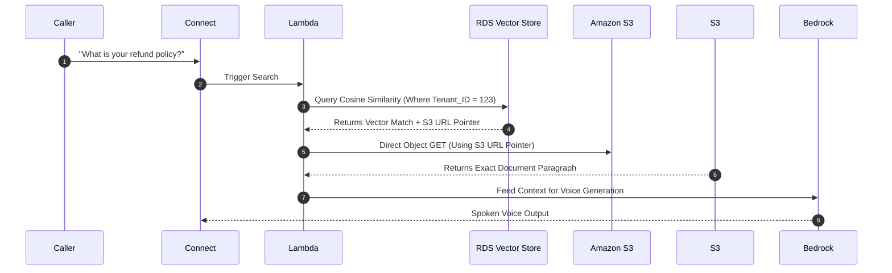

# [Amazon RDS with S3 Document Repositories](https://www.udemy.com/course/ultimate-aws-certified-generative-ai-developer-professional/learn/lecture/53684237#overview)

## **"Pointer-to-Storage" RAG pattern**

By storing vector embeddings in a relational database (like Amazon RDS using its vector features, such as natively modeling vectors in SQL Server using columnstore indexes or using `pgvector` in PostgreSQL) but keeping the actual heavy documents in **Amazon S3**, you create an incredibly scalable and highly profitable framework for your AI Receptionist SaaS.

Here is the exact business value this pattern unlocks for your LLC, broken down into practical implementation choices:

---

### 1. Slashing Database Storage Costs by 90%

**The Business Bottleneck:** Database storage on Amazon RDS is expensive. If you have 500 business clients upload their 50-page employee handbooks, training manuals, and historical case studies directly into an RDS database, your database storage sizes will explode. You will be forced to pay premium costs for high-performance database disks just to hold static text.

* **The Implementation Value:** S3 is the cheapest place on AWS to store flat data. With this pattern, you use a Lambda function to extract the vector mathematical values and store *only* those coordinates in your **RDS Vector Store**. The actual bulk text documents live safely in cheap S3 buckets.
* **The Result:** Your RDS database stays incredibly lightweight and inexpensive, while your unstructured storage costs pennies, protecting your startup capital.

---

### 2. Lighting-Fast Metadata Filtering (Dynamic Client Guardrails)

**The Business Bottleneck:** When a phone call is live, your AI needs to find an answer in less than 500 milliseconds. If it has to scan through massive paragraphs of text directly inside a database while doing a vector search, the call will experience latency lag.

* **The Implementation Value:** Because RDS is a relational database, it excels at metadata indexing. You can tag your vectors with precise transactional metadata columns: `Tenant_ID`, `Industry_Vertical`, `Document_Type`, and `S3_Object_URL`.
* **The Workflow:** When a call lands, your application executes a combined SQL and similarity search: *"Find the closest vector match for the phrase 'refund policy' BUT ONLY where Tenant_ID = 'Client_123'."*

---

### 3. Bulletproof Multi-Tenant Security & Compliance

**The Business Bottleneck:** If a developer makes a small mistake in a vector search prompt, an AI model could inadvertently pull up another company's proprietary document from the database, leading to a catastrophic data breach for your SaaS.
* **The Implementation Value:** This pattern acts as a dual-layer security moat. When RDS returns a pointer, it gives you a raw S3 object key (e.g., `s3://tenant-123-bucket/policies/refunds.txt`). 
* **The Business Security:** Before your backend Lambda function downloads that data from S3, you can write an automatic code check to ensure the active caller's token explicitly matches that exact S3 bucket path. If a hallucination or database bug returns a pointer to `tenant-999`, your Lambda catches the mismatch and blocks the read instantly. You gain an absolute security guarantee that protects your LLC from cross-tenant data leaks.

---

### 4. Seamless Document Updates Without System Re-indexing

**The Business Bottleneck:** In a live business environment, clients change their rules constantly (e.g., changing a diagnostic fee from \$79 to \$89). In traditional vector setups, changing a single line of text can require dropping an entire table and re-calculating thousands of expensive embedding vectors.
* **The Implementation Value:** Because the vector in RDS points to an S3 object location, your clients can overwrite the file in S3 with updated text *without altering the underlying vector address*.
* **The Business Value:** Your software can instantly reflect a client's real-time company updates mid-day, ensuring the virtual receptionist always speaks completely accurate, up-to-date facts to callers.

### Core Business Intuition

Think of **RDS as your virtual library catalog card** (tells you exactly what row, what shelf, and what aisle a concept lives on in fractions of a millisecond) and **S3 as the warehouse floor holding the heavy books**. This allows your SaaS to handle massive, enterprise-level clients with millions of document pages for practically the same infrastructure cost as handling a tiny local storefront.

[Amazon Aurora PostgreSQL with pgvector](https://www.youtube.com/watch?v=e9SHaO9RNzk) is a great resource to explore further. This breakdown details how AWS implements relational vector extensions under the hood, helping you understand how to seamlessly execute similarity searches right next to traditional SQL transactional tables.

