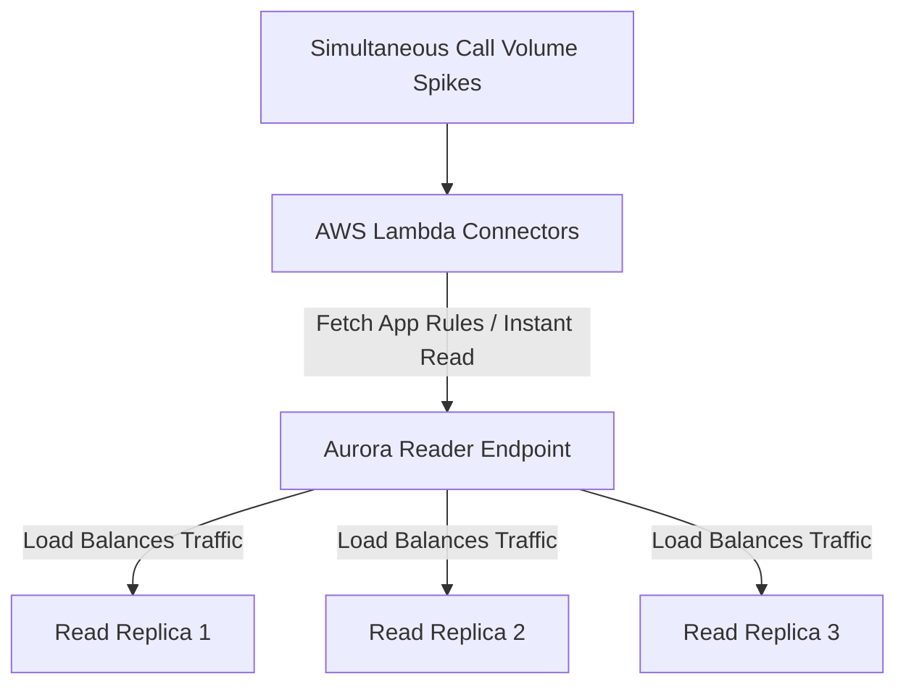
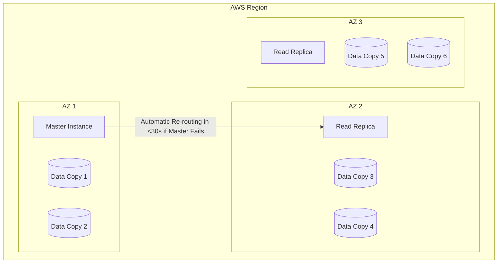

# Amazon Aurora

## Lecture notes

### What this lecture covers

<a href="https://docs.aws.amazon.com/AmazonRDS/latest/AuroraUserGuide/CHAP_AuroraOverview.html">Amazon Aurora</a> is AWS’s proprietary, cloud-optimized relational database engine—compatible with PostgreSQL and MySQL drivers. This lecture gives an exam-oriented overview: performance vs standard RDS, auto-expanding storage, high availability across three AZs, read-replica scaling, **writer/reader endpoints**, and features like **Backtrack**.

### Key definitions (from the lecture)

| Term | Definition |
|---|---|
| **Amazon Aurora** | AWS proprietary database technology (not open source) built for the cloud; compatible with PostgreSQL and MySQL drivers so existing clients connect as usual. |
| **Shared storage volume** | A logical, auto-expanding cluster volume replicated across three AZs; applications do not manage it directly. See <a href="https://docs.aws.amazon.com/AmazonRDS/latest/AuroraUserGuide/Aurora.Overview.StorageReliability.html">Amazon Aurora storage</a>. |
| **Writer endpoint** | A stable DNS name that always points to the current primary (writer) instance, even after failover. See <a href="https://docs.aws.amazon.com/AmazonRDS/latest/AuroraUserGuide/Aurora.Endpoints.Cluster.html">Cluster endpoints for Amazon Aurora</a>. |
| **Reader endpoint** | A stable DNS name that load-balances **connections** across Aurora Replicas so apps do not track individual replica URLs. See <a href="https://docs.aws.amazon.com/AmazonRDS/latest/AuroraUserGuide/Aurora.Endpoints.Reader.html">Reader endpoints for Amazon Aurora</a>. |
| **Aurora Replica** | A read-only DB instance in the cluster; up to **15** per cluster; any replica can be promoted to writer on failure. See <a href="https://docs.aws.amazon.com/AmazonRDS/latest/AuroraUserGuide/Aurora.Replication.html">Replication with Amazon Aurora</a>. |
| **Backtrack** | Rewind an Aurora MySQL cluster to a prior point in time without restoring from a traditional backup (mechanism differs from snapshot/PITR). See <a href="https://docs.aws.amazon.com/AmazonRDS/latest/AuroraUserGuide/AuroraMySQL.Managing.Backtrack.Configuring.html">Configuring backtracking</a>. |

### Aurora vs standard RDS (from the lecture)

| Item | Aurora | Standard RDS (MySQL/PostgreSQL) |
|---|---|---|
| **Engine** | AWS proprietary, cloud-native | Open-source or third-party engines on managed RDS |
| **Performance** | ~**5×** MySQL on RDS; ~**3×** PostgreSQL on RDS (lecture figures) | Baseline managed relational performance |
| **Storage growth** | Auto-expands from **10 GiB** up to **256 TiB** without manual disk monitoring | Storage autoscaling available but Aurora’s shared volume model is distinct |
| **Read replicas** | Up to **15**; typically **sub-10 ms** replica lag | Fewer replicas; slower replication (lecture comparison) |
| **Failover** | Often described as near-instant; **< 30 seconds** on average (lecture) | Multi-AZ failover is slower (lecture comparison) |
| **Cost** | ~**20%** more than RDS at list price | Lower entry cost |
| **Efficiency at scale** | Higher per-dollar efficiency at scale can offset the premium | Can require more operational tuning as load grows |

### Performance and auto-expanding storage

Aurora is **cloud optimized**—AWS applies internal optimizations (the lecture skips deep internals) to deliver large performance gains over MySQL or PostgreSQL on standard RDS.

**Storage behavior (exam-relevant):**

- Starts at **10 GiB** and **grows automatically** as you insert data, up to **256 TiB**.
- DBAs do **not** need to monitor and manually resize disks for normal growth.
- Data is striped across **hundreds of underlying volumes** in the backend—you do not interface with those volumes directly.

### High availability and distributed storage

Every write is stored as **six copies across three Availability Zones**:

| Operation | Quorum | What it means |
|---|---|---|
| **Writes** | **4 of 6** copies | One AZ can fail and writes still succeed |
| **Reads** | **3 of 6** copies | Highly available for read paths |

Additional storage properties from the lecture:

- **Self-healing**: corrupted segments are repaired via peer-to-peer replication in the backend.
- **Shared logical volume**: replication, self-healing, and auto-expansion happen behind the scenes.
- **Striping**: new data blocks land on different volumes across AZs for resilience and throughput.

Think of the mental model: three AZs, one shared cluster volume, six copies of each write spread across them.

### Cluster architecture: one writer, many readers

Aurora clusters resemble **Multi-AZ RDS** at the compute layer but differ in storage and failover:

- **One primary (master) writer** handles all writes by default.
- Up to **15 Aurora Replicas** serve read traffic—that is how you **scale reads**.
- **Any replica can become the new writer** if the primary fails (unlike some RDS read-replica patterns).
- Replicas support **cross-Region replication** for DR or global read scaling. See <a href="https://docs.aws.amazon.com/AmazonRDS/latest/AuroraUserGuide/Aurora.Overview.html">Amazon Aurora DB clusters</a>.

**Failover:** if the writer fails, promotion completes in **under 30 seconds on average** (lecture)—much faster than typical Multi-AZ RDS MySQL failover.

**Exam diagram to remember:** one master, multiple replicas, shared storage that is replicated, self-healing, and auto-expanding in small blocks across AZs.

### Cluster endpoints (exam focus)

Clients should not hard-code individual instance endpoints when the cluster topology changes (failover, autoscaling). Aurora provides two stable DNS endpoints:

| Endpoint | Points to | Use for |
|---|---|---|
| **Writer (cluster) endpoint** | Current primary instance | `INSERT`, `UPDATE`, `DELETE`, DDL, any write |
| **Reader endpoint** | Aurora Replicas (connection load balancing) | Read-heavy queries |

**Writer endpoint behavior**

- Always resolves to the **current master**, even after failover.
- Application connection strings stay the same; Aurora redirects to the new writer automatically.

**Reader endpoint behavior**

- Distributes **connections** across available replicas (not individual SQL statements per connection).
- Essential when **Aurora Auto Scaling** adds or removes replicas—you avoid chasing changing instance URLs. See <a href="https://docs.aws.amazon.com/AmazonRDS/latest/AuroraUserGuide/Aurora.Integrating.AutoScaling.html">Amazon Aurora Auto Scaling with Aurora Replicas</a>.
- Load balancing happens at the **connection** level: each client connection lands on one replica for its lifetime.

**Read replica autoscaling**

- Configure **1–15** replicas with auto scaling policies so capacity tracks read load.
- Pair autoscaling with the **reader endpoint** so new replicas receive traffic without app config changes.

### How to connect (application pattern)

Use the cluster endpoints in your driver connection strings—same PostgreSQL or MySQL drivers as standard RDS:

```python
import psycopg2

# Writes and DDL — always use the writer endpoint
writer = psycopg2.connect(
    host="my-cluster.cluster-xxxxx.us-east-1.rds.amazonaws.com",
    database="appdb",
    user="admin",
    password="REPLACE_WITH_SECRET",
)

# Read-only analytics — use the reader endpoint
reader = psycopg2.connect(
    host="my-cluster.cluster-ro-xxxxx.us-east-1.rds.amazonaws.com",
    database="appdb",
    user="admin",
    password="REPLACE_WITH_SECRET",
)
# Each connection to the reader endpoint is load-balanced to one replica
```

See <a href="https://docs.aws.amazon.com/AmazonRDS/latest/AuroraUserGuide/Aurora.Connecting.html">Connecting to an Amazon Aurora DB cluster</a>.

### Managed features and Backtrack

Beyond storage and endpoints, Aurora bundles standard RDS-style managed operations:

| Capability | Notes |
|---|---|
| **Automatic failover** | Promote a replica when the writer fails |
| **Backup and recovery** | Managed backup workflow (separate from Backtrack) |
| **Isolation and security** | VPC, encryption, IAM database auth (see AWS docs) |
| **Industry compliance** | Same compliance programs as RDS |
| **Push-button / auto scaling** | Scale read replicas based on metrics |
| **Automated patching** | Zero-downtime patching handled in the backend (lecture) |
| **Advanced monitoring** | Performance Insights, CloudWatch |
| **Routine maintenance** | AWS-managed maintenance windows |

**Backtrack (Aurora MySQL)**

- Restore the cluster to an earlier moment—for example, “yesterday at 4 PM,” then adjust to “yesterday at 5 PM.”
- Does **not** rely on traditional backup restore; it uses Aurora’s change record (lecture).
- Useful after accidental `DELETE` or bad migration without a full restore cycle.

### Examples

**1. Read-heavy GenAI metadata service**

A RAG platform stores tenant metadata and ingestion job status in Aurora PostgreSQL. The API tier sends writes to the **writer endpoint** and routes dashboard analytics queries to the **reader endpoint**, adding replicas during peak hours with Aurora Auto Scaling.

**2. Failover without changing the app**

A production MySQL workload points all write traffic at the **writer endpoint**. The primary instance fails; Aurora promotes a replica in under 30 seconds. Existing connection pools reconnect to the same DNS name and reach the new writer.

**3. Undo a bad bulk update with Backtrack**

A DBA runs an `UPDATE` without a `WHERE` clause on an Aurora MySQL cluster. Instead of restoring last night’s snapshot, the team **backtracks** to five minutes before the mistake, then forward to the correct state.

### Industry scenarios

**1. Global SaaS — cross-Region read scaling**

An AI document platform runs Aurora PostgreSQL in `us-east-1` with cross-Region replicas in `eu-west-1`. European users query the local replica via a regional reader endpoint while writes stay in the primary Region—lower latency without splitting the storage model.

**2. E-commerce peak traffic — autoscaling replicas**

A retailer’s product catalog and order history sit on Aurora MySQL. Black Friday read load triggers Aurora Auto Scaling to grow from two to ten replicas. The storefront uses the **reader endpoint** so new replicas absorb traffic without redeploying the app.

**3. Financial services — HA storage quorum**

A payments ledger requires high durability. Aurora’s **6-copy / 3-AZ** storage and **4-of-6 write quorum** mean a single AZ outage does not block commits. The team accepts ~20% higher list cost versus RDS for faster failover and lower replica lag at scale.

### Limitations / edge cases

- **Proprietary engine**: Aurora is not open source—you are on AWS’s implementation and roadmap.
- **One writer by default**: All writes go through a single primary; scale writes by choosing a larger instance class, not by adding writers (unless using advanced multi-master patterns outside this lecture).
- **Reader endpoint is connection-level**: Long-lived connections stay on one replica; it does not round-robin every SQL statement.
- **Backtrack scope**: Backtrack is an **Aurora MySQL** feature with its own window and limitations—not identical to PostgreSQL PITR or snapshot restore.
- **Cost premium**: ~20% more than RDS at list price; savings come from efficiency at scale, not always on small dev clusters.


## Business use cases

This lecture on **Amazon Aurora** introduces the exact database engine you need when your AI virtual receptionist business scales from a handful of local clients to handling millions of phone calls across hundreds of enterprise tenants.

Because Amazon Aurora is a cloud-optimized, auto-expanding relational database that is compatible with PostgreSQL and MySQL, it eliminates the performance bottlenecks of standard databases. In a voice-based SaaS business, it provides four massive structural advantages that directly translate to lower maintenance, higher profitability, and maximum system reliability.

Here is how you can weaponize these specific Aurora features to build business value for your LLC:

---

### 1. Scaling the "Reader Endpoint" for Zero-Lag Mid-Call Lookups

**The Business Challenge:** When an AI receptionist is live on the phone, every millisecond counts. If your AI takes too long to look up data, the conversation has awkward pauses. As your business grows, you might have thousands of AI bots simultaneously querying the database to find client configuration rules, fallback phone numbers, or active calendars. If all those reads hit the same database node, it will choke, slowing down the phone lines.

* **The Aurora Implementation:** You use Aurora’s **Auto-Scaling Read Replicas** and the **Reader Endpoint**.
* **The Business Value:** As call volume spikes during the day, Aurora automatically spins up to 15 read replicas. Your backend Lambda functions route all non-writing queries (like fetching prompt structures or verifying a phone number) directly to the single *Reader Endpoint*, which load-balances the traffic perfectly. This guarantees your AI receptionist always pulls business rules in milliseconds, keeping the live voice crisp and human-like.



---

### 2. Eliminating Database Maintenance Overhead (The Auto-Expanding Storage Moat)

**The Business Challenge:** Standard databases require a DevOps engineer to constantly monitor disk space. If a database runs out of storage because your call logs or customer profiles grew too fast over the weekend, the entire system crashes, your clients miss calls, and your LLC faces immediate contract cancellations.

* **The Aurora Implementation:** Aurora storage automatically grows seamlessly from 10 GB up to 256 TB without manual intervention or downtime.
* **The Business Value:** You don't need to hire a Database Administrator or write complex scripts to resize storage volumes. Whether a client logs 5 phone calls or 50,000 phone calls, the database handles the data expansion natively. You can run a massive enterprise infrastructure as a lean team, keeping your company overhead incredibly low.

---

### 3. Bulletproof Business Continuity: The Six-Copy Storage Engine

**The Business Challenge:** Medical clinics, law firms, and emergency service companies trust your business with their inbound revenue lines. If an AWS data center experiences a physical failure or power outage, and your database goes offline or corrupts data, your clients lose real revenue.

* **The Aurora Implementation:** Aurora automatically writes **six copies of your data across three different Availability Zones (AZs)**, featuring automated peer-to-peer self-healing.
* **The Business Value:** If an entire AWS data center goes completely dark, your system is virtually unaffected. Aurora can lose a data center and still write flawlessly, and it can lose two data centers and still read flawlessly. The instantaneous failover (<30 seconds) means your virtual receptionists never drop an active phone call, allowing you to sell your SaaS with an enterprise-grade **99.99% Availability SLA** that competitors cannot match.



---

### 4. Monetizing the "Backtrack" Feature for Premium Clients

**The Business Challenge:** Clients make mistakes. A manager at a client company might accidentally log into your SaaS dashboard and wipe out an entire week's worth of custom prompt data, customer lists, or configurations, then panic and blame your software.

* **The Aurora Implementation:** Aurora features **Backtrack**, which allows you to rewinding your entire database to an exact point in time (e.g., yesterday at 4:02 PM) in a matter of seconds, without needing to restore from a clunky backup file.
* **The Business Value:** You can package this directly as a premium tier feature called **"Enterprise Undo."** If a client accidentally deletes their database records, your software can instantly roll back the state of their profile to the exact minute before the mistake occurred. This saves the client from operational disaster and turns a potential customer support nightmare into a showcase of your platform's elite capabilities.

### The Executive Intuition: When to Step Up to Aurora

While standard **Amazon RDS** is great for testing your prototype (V1) because it is slightly cheaper, **Amazon Aurora** is the production-ready engine you migrate to the moment you start onboarding paying businesses.

By paying a small 20% premium over standard RDS, you gain a cloud-native engine that eliminates the need for DevOps engineers, survives data center disasters seamlessly, and maintains the blistering speed your AI needs to sound completely natural over the phone.


### Key takeaways

- Aurora is **AWS proprietary**, **PostgreSQL/MySQL compatible**, and **cloud optimized** (~5× MySQL RDS, ~3× PostgreSQL RDS per the lecture).
- Storage **auto-expands** from 10 GiB to 256 TiB; **six copies across three AZs** with **4/6 write** and **3/6 read** quorums plus **self-healing**.
- Cluster pattern: **one writer**, up to **15 read replicas** (sub-10 ms lag), **any replica can promote**, **cross-Region replication** supported.
- **Writer endpoint** → always the current primary; **reader endpoint** → connection load balancing across replicas (critical with autoscaling).
- Failover is **fast** (< 30 s average); Aurora is **~20% more expensive** than RDS but often **more cost-efficient at scale**.
- **Backtrack** lets you rewind Aurora MySQL to a prior point in time without a traditional backup restore.
- For the exam: remember the diagram—**one master, many replicas, shared auto-expanding storage**.

### References

**In this repo**

- [Amazon RDS](../26-amazon-rds/index.md)
- [Amazon Aurora and the pgvector Extension](../31-amazon-aurora-and-the-pgvector-extension/index.md)
- [Dealing with Structured Data](../02-dealing-with-structured-data/index.md)

**AWS documentation**

- <a href="https://docs.aws.amazon.com/AmazonRDS/latest/AuroraUserGuide/CHAP_AuroraOverview.html">What is Amazon Aurora?</a>
- <a href="https://docs.aws.amazon.com/AmazonRDS/latest/AuroraUserGuide/Aurora.Overview.html">Amazon Aurora DB clusters</a>
- <a href="https://docs.aws.amazon.com/AmazonRDS/latest/AuroraUserGuide/Aurora.Overview.StorageReliability.html">Amazon Aurora storage</a>
- <a href="https://docs.aws.amazon.com/AmazonRDS/latest/AuroraUserGuide/Aurora.Replication.html">Replication with Amazon Aurora</a>
- <a href="https://docs.aws.amazon.com/AmazonRDS/latest/AuroraUserGuide/Aurora.Endpoints.Cluster.html">Cluster endpoints for Amazon Aurora</a>
- <a href="https://docs.aws.amazon.com/AmazonRDS/latest/AuroraUserGuide/Aurora.Endpoints.Reader.html">Reader endpoints for Amazon Aurora</a>
- <a href="https://docs.aws.amazon.com/AmazonRDS/latest/AuroraUserGuide/Aurora.Integrating.AutoScaling.html">Amazon Aurora Auto Scaling with Aurora Replicas</a>
- <a href="https://docs.aws.amazon.com/AmazonRDS/latest/AuroraUserGuide/Aurora.Connecting.html">Connecting to an Amazon Aurora DB cluster</a>
- <a href="https://docs.aws.amazon.com/AmazonRDS/latest/AuroraUserGuide/AuroraMySQL.Managing.Backtrack.Configuring.html">Configuring backtracking for an Aurora MySQL DB cluster</a>
