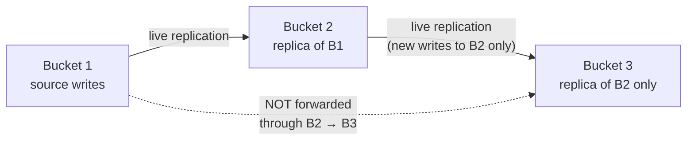

# Amazon S3 - Replication - Notes

## What this lecture covers

Follow-on edge cases for <a href="https://docs.aws.amazon.com/AmazonS3/latest/userguide/replication.html">Amazon S3 replication</a>: what **live replication** does *not* backfill automatically, when to use <a href="https://docs.aws.amazon.com/AmazonS3/latest/userguide/s3-batch-replication-batch.html">S3 Batch Replication</a>, how **delete operations** behave at the destination, and why **replication chaining** does not propagate objects across multiple hops.

## Key definitions (from the lecture)

| Term | Definition |
|---|---|
| **Live replication** | Ongoing, asynchronous copying of **new and updated** objects after a replication rule is enabled on the source bucket. |
| **S3 Batch Replication** | An on-demand job that replicates **existing** objects (and can retry objects that **failed** live replication) using the same replication configuration. |
| **Delete marker** | A placeholder version created when you delete an object **without** specifying a version ID in a versioned bucket; the object appears deleted until the marker is removed. |
| **Replication chaining** | A multi-hop layout where bucket A replicates to bucket B, and bucket B replicates to bucket C. Live replication does **not** forward A’s objects to C through B. |

See [Amazon S3 - Replication](../49-amazon-s3-replication/index.md) for the intro to CRR, SRR, versioning, and IAM prerequisites.

## Live replication vs Batch Replication

After you **enable** a replication rule, <a href="https://docs.aws.amazon.com/AmazonS3/latest/userguide/replication-what-is-isnot-replicated.html">live replication</a> copies **objects created or updated after the rule is in place**. Objects that already existed in the source bucket are **not** automatically backfilled.

| Scenario | Live replication | Batch Replication |
|---|---|---|
| **New uploads after the rule is enabled** | Replicated automatically | Not needed |
| **Objects that existed before the rule** | Not replicated | Use Batch Replication to backfill |
| **Objects that failed live replication** | Stay in `FAILED` status until retried | Batch Replication can target `FAILED` objects |

```bash
# Illustrative flow after enabling a rule on genai-corpus-prod:
# 1. New PUTs under the rule prefix replicate live (async).
# 2. Pre-existing training snapshots do NOT — start a Batch Replication job instead.
aws s3control create-job \
  --account-id 111122223333 \
  --operation '{"S3ReplicateObject": {}}' \
  --report '{"Bucket":"arn:aws:s3:::batch-replication-reports","Format":"Report_CSV_V1","Enabled":true,"ReportScope":"AllTasks"}' \
  --manifest-generator '{"S3JobManifestGenerator": {"ExpectedBucketOwner":"111122223333","SourceBucket":"arn:aws:s3:::genai-corpus-prod","EnableManifestOutput":true,"Filter":{"EligibleForReplication":true}}}'
```

Batch jobs are **on demand**—unlike live replication, you run them when you need a backfill or a retry pass. See <a href="https://docs.aws.amazon.com/AmazonS3/latest/userguide/s3-batch-replication-existing-config.html">Create a Batch Replication job for existing replication rules</a>.

## Delete operations and replication

Delete behavior is a common exam topic because it mixes **optional** replication with a **hard security boundary**.

| Delete type | Replicated to destination? | Notes |
|---|---|---|
| **DELETE without version ID** (creates a delete marker) | **Optional** — enable <a href="https://docs.aws.amazon.com/AmazonS3/latest/userguide/delete-marker-replication.html">delete marker replication</a> on the rule | Keeps source and destination “visibility” aligned when you want deletes to propagate. |
| **DELETE with a specific version ID** | **Never** replicated | Treated as a **permanent deletion** at the source only; the matching version in the destination bucket is **not** removed. |

The version-ID guard exists so a **malicious or mistaken permanent delete** in the source account cannot wipe the replica in the destination bucket—protecting your DR / compliance copy.

```json
{
  "Rules": [
    {
      "Status": "Enabled",
      "Filter": { "Prefix": "embeddings/" },
      "DeleteMarkerReplication": { "Status": "Enabled" },
      "Destination": {
        "Bucket": "arn:aws:s3:::genai-corpus-replica-eu-west-1"
      },
      "Priority": 1
    }
  ],
  "Role": "arn:aws:iam::111122223333:role/s3-replication-role"
}
```

With `DeleteMarkerReplication` enabled, a soft delete in the source adds a delete marker at the destination. A `DELETE` that names a concrete `versionId` still does **not** propagate—only the source loses that version.

## No replication chaining

Live replication is **not transitive**. If:

- **Bucket 1** replicates to **Bucket 2**, and
- **Bucket 2** replicates to **Bucket 3**,

objects originally written to **Bucket 1** are **not** automatically copied into **Bucket 3** via Bucket 2’s rule. AWS treats replicas in Bucket 2 as objects that were **created by another replication rule**, and those replicas are **excluded** from live replication to Bucket 3.



To land Bucket 1’s data in Bucket 3 when Bucket 2 sits in the middle, configure **Bucket 1 → Bucket 3** directly (or run **Batch Replication** on the intermediate bucket). See <a href="https://docs.aws.amazon.com/AmazonS3/latest/userguide/replication-what-is-isnot-replicated.html">What isn't replicated with replication configurations?</a>.

## Examples

**Backfill a Gen-AI corpus after turning on CRR**

A team enables CRR from `prod-rag-documents` to `dr-rag-documents` but the source already holds 2 TB of PDFs. New uploads replicate live; the historical corpus requires a **Batch Replication** job filtered to `EligibleForReplication`.

**Soft delete vs permanent delete in a compliance pair**

An operator removes `reports/2024-q4.json` with a normal delete—both buckets show a delete marker if delete marker replication is on. An admin later issues a version-specific delete to purge PII; the **destination retains** the old version for audit.

**Three-bucket DR mistake**

Architecture sketches `primary → warm-standby → archive` as three buckets with sequential rules. Only objects **written directly to warm-standby** replicate to archive; primary data never “flows through.” Fix: add **primary → archive** CRR or batch-copy from warm-standby.

## Limitations / edge cases

- **Existing objects** and **failed replicas** need **Batch Replication**—live rules alone do not cover them.
- **Delete marker replication** is **opt in**; without it, soft deletes may diverge between source and destination.
- **Version-ID deletes** never replicate—by design, to block cross-bucket destructive deletes.
- **No chaining**: replicas created by one rule are not live-replicated onward; plan **direct** source-to-final-destination rules or batch jobs.
- Batch Replication has its own filters, manifests, and completion reports—see <a href="https://docs.aws.amazon.com/AmazonS3/latest/userguide/batch-ops.html">S3 Batch Operations</a>.

## Industry scenarios

**1. ML training archive backfill (Batch Replication)**

A healthcare analytics team enables CRR for a new `us-west-2` audit bucket after years of imaging metadata already live in `us-east-1`. Live replication handles new studies; **Batch Replication** backfills the legacy prefix so both Regions satisfy retention policy on the same timeline.

**2. Cross-account delete-marker alignment (optional replication)**

A media company replicates user-generated content to a **legal-hold account**. Product engineers soft-delete expired assets in production; with **delete marker replication** enabled, the hold account mirrors “not visible” state while **version-ID purges** in prod cannot silently erase subpoena-ready copies.

**3. Multi-hop DR redesign (no chaining)**

A fintech firm initially chained `transactions-prod → transactions-warm → transactions-cold`. Compliance review finds cold storage never received prod data. They add **direct CRR** from prod to cold and use **Batch Replication** once to seed cold—accepting that warm is a peer replica, not a pipeline stage.

## Key takeaways

- Enable a replication rule → only **new/updated** objects replicate live; **pre-existing** objects need **S3 Batch Replication**.
- Batch Replication also retries objects whose live replication status is **FAILED**.
- **Delete markers** can replicate when you **opt in**; **version-ID deletes** do **not**—protecting destination data from propagated permanent deletes.
- **Replication does not chain**: Bucket 1 → Bucket 2 → Bucket 3 does **not** put Bucket 1’s objects into Bucket 3 via live replication.
- Design **direct** replication paths or use **Batch Replication** when data must reach a bucket more than one hop away.

## References

**In this repo**

- [Amazon S3 - Replication](../49-amazon-s3-replication/index.md) (CRR/SRR intro, prerequisites, use cases)
- [Amazon S3 - Replication - Hands On](../51-amazon-s3-replication-hands-on/index.md) (console/CLI practice)
- [Amazon S3 - Lifecycle Rules](../46-amazon-s3-lifecycle-rules/index.md) (lifecycle deletes vs replication behavior)

**AWS documentation**

- <a href="https://docs.aws.amazon.com/AmazonS3/latest/userguide/s3-batch-replication-batch.html">Replicating existing objects with Batch Replication</a>
- <a href="https://docs.aws.amazon.com/AmazonS3/latest/userguide/replication-what-is-isnot-replicated.html">What does Amazon S3 replicate?</a>
- <a href="https://docs.aws.amazon.com/AmazonS3/latest/userguide/delete-marker-replication.html">Replicating delete markers between buckets</a>
- <a href="https://docs.aws.amazon.com/AmazonS3/latest/userguide/replication.html">Replicating objects within and across Regions</a>
