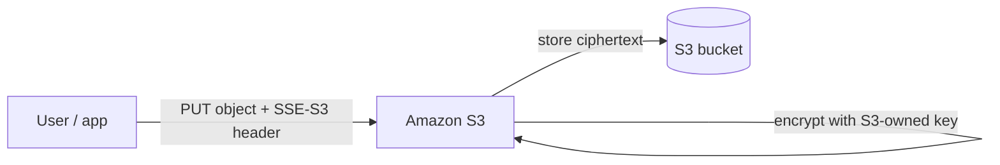
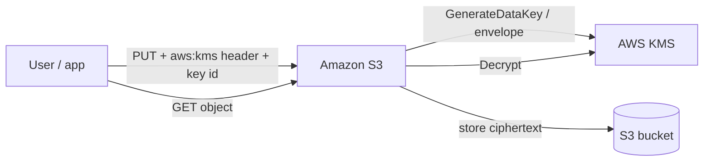
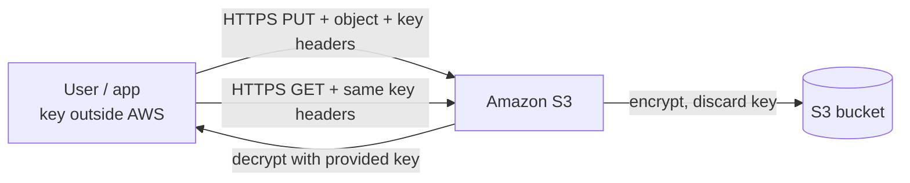
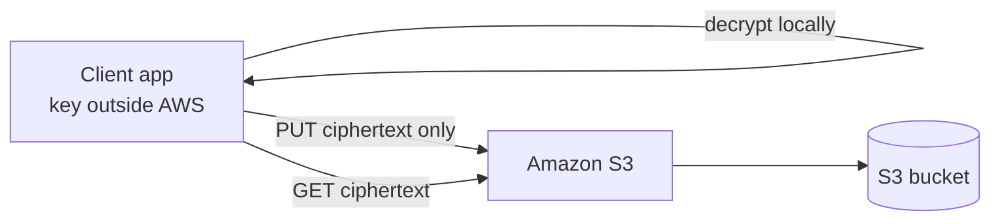

# :material-lock: S3 Encryption

## What this lecture covers

How to <a href="https://docs.aws.amazon.com/AmazonS3/latest/userguide/UsingEncryption.html">encrypt objects in Amazon S3</a>: the four main approaches (**SSE-S3**, **SSE-KMS**, **SSE-C**, and **client-side encryption**), how each one handles keys, and when to pick each on the exam. The lecture also covers **encryption in transit** (TLS/HTTPS) and using a **bucket policy** to block plain HTTP.

## Key definitions (from the lecture)

| Term | Definition |
|---|---|
| **Server-side encryption (SSE)** | S3 encrypts objects **after** upload; ciphertext is stored in the bucket. Three flavors: **SSE-S3**, **SSE-KMS**, and **SSE-C**. |
| **SSE-S3** | <a href="https://docs.aws.amazon.com/AmazonS3/latest/userguide/specifying-s3-encryption.html">Server-side encryption with Amazon S3 managed keys</a>. AWS owns and manages the key; you never see it. Uses **AES-256**. Enabled **by default** for new buckets and new objects. |
| **SSE-KMS** | <a href="https://docs.aws.amazon.com/AmazonS3/latest/userguide/UsingKMSEncryption.html">Server-side encryption with AWS KMS keys</a>. You create and control keys in **AWS KMS**; key usage is auditable via **CloudTrail**. |
| **SSE-C** | <a href="https://docs.aws.amazon.com/AmazonS3/latest/userguide/ServerSideEncryptionCustomerKeys.html">Server-side encryption with customer-provided keys</a>. You manage keys **outside AWS** but send the key with each request; S3 **never stores** the key. |
| **Client-side encryption** | The client encrypts data **before** upload and decrypts **after** download; S3 only ever sees ciphertext. Keys and the full encryption cycle stay on the client. |
| **Encryption in transit** | Also called **SSL/TLS** or encryption **in flight**—protects data while it moves between client and S3 (HTTPS vs HTTP). See <a href="https://docs.aws.amazon.com/AmazonS3/latest/userguide/UsingEncryptionInTransit.html">Protecting data in transit with encryption</a>. |

## Four encryption methods at a glance

| Method | Who manages the key? | Where encryption runs | Exam cue |
|---|---|---|---|
| **SSE-S3** | AWS (S3-owned key) | S3 server-side | Simplest default; no key access for you |
| **SSE-KMS** | You (via KMS CMK) | S3 server-side | Need **KMS permissions** to read; **CloudTrail** audit; watch **KMS API quotas** |
| **SSE-C** | You (outside AWS) | S3 server-side | Key in **HTTP headers** every request; **HTTPS required**; S3 discards key after use |
| **Client-side** | You (client) | Client before/after S3 | Plaintext never leaves your app unencrypted; use **client encryption libraries** |

!!! info "🔒 Encryption in transit"
    Use **HTTPS/TLS** for data in flight. A bucket policy can **deny** `aws:SecureTransport` false to block plain HTTP—pair with SSE at rest for defense in depth.

## SSE-S3 (Amazon S3 managed keys)

- Encryption uses a key that is **handled, managed, and owned by AWS**—you **never** have access to it.
- Algorithm: **AES-256**.
- Request header (when explicitly specifying SSE-S3 on `PUT`):

  `x-amz-server-side-encryption: AES256`

- **Default** for new buckets and new objects—uploads are encrypted at rest without extra configuration.



```bash
# Explicit SSE-S3 on upload (often unnecessary when bucket default is SSE-S3)
aws s3 cp training-corpus/part-0001.json s3://genai-corpus-prod/raw/ \
  --server-side-encryption AES256
```

## SSE-KMS (AWS KMS keys)

- Instead of an S3-owned key, you manage keys in **AWS KMS**.
- **Advantages from the lecture**: user control over the key, and **audit** of key usage through **CloudTrail** (every KMS key use is logged).
- Request header:

  `x-amz-server-side-encryption: aws:kms`

  (plus the KMS key id/ARN you want to use)

- **Extra access layer**: to read an object you need permission on the **object** and on the **KMS key** used to encrypt it.

### KMS API quota limitation

Because SSE-KMS uses the KMS API (for example **GenerateDataKey** on upload and **Decrypt** on download), each S3 read/write can consume KMS requests. Regional KMS quotas are roughly **5,000–30,000 requests per second** (increase via the <a href="https://docs.aws.amazon.com/general/latest/gr/aws_service_limits.html">Service Quotas</a> console). At very high throughput—many parallel GETs/PUTs—all encrypted with SSE-KMS—you can hit **throttling** even when TLS is fine.



```bash
# Upload with a specific customer managed KMS key
aws s3 cp embeddings/chunk-42.bin s3://genai-corpus-prod/vectors/ \
  --server-side-encryption aws:kms \
  --ssekms-key-id arn:aws:kms:us-east-1:111122223333:key/abcd1234-5678-90ab-cdef-EXAMPLE11111
```

## SSE-C (customer-provided keys, server-side)

- Keys are managed **outside AWS**, but encryption still happens **on the S3 side**.
- You transmit the key to S3; S3 **never stores** it—keys are **discarded after use**.
- **HTTPS is mandatory** (keys travel in headers).
- You must pass encryption key material in **HTTP headers on every** upload, download, copy, or head request.



See <a href="https://docs.aws.amazon.com/AmazonS3/latest/userguide/specifying-s3-c-encryption.html">Specifying SSE-C</a> for required header names (`x-amz-server-side-encryption-customer-key`, etc.).

## Client-side encryption

- Easiest to implement with an **S3 client-side encryption library** (encrypt on `PutObject`, decrypt on `GetObject`).
- The client **encrypts locally** before sending data to S3; on retrieval, **decryption happens on the client** after download.
- The client **fully manages** keys and the encryption lifecycle; S3 stores only ciphertext.



See <a href="https://docs.aws.amazon.com/AmazonS3/latest/userguide/UsingClientSideEncryption.html">Protecting data by using client-side encryption</a>.

## Encryption in transit (TLS / HTTPS)

- S3 exposes two endpoint styles: **HTTP** (not encrypted in flight) and **HTTPS** (TLS—encrypted in flight).
- Always prefer **HTTPS** so data is protected between client and S3 (the browser “lock” icon is the same idea).
- **SSE-C requires HTTPS** because you send key material in headers.
- In practice most AWS SDKs and CLI calls use HTTPS by default.

### Force HTTPS with a bucket policy

Attach a bucket policy that **denies** requests when `aws:SecureTransport` is **false** (plain HTTP). When the condition is true, the client used **HTTPS**.

```json
{
  "Version": "2012-10-17",
  "Statement": [
    {
      "Sid": "RestrictToTLSRequestsOnly",
      "Effect": "Deny",
      "Principal": "*",
      "Action": "s3:*",
      "Resource": [
        "arn:aws:s3:::genai-corpus-prod",
        "arn:aws:s3:::genai-corpus-prod/*"
      ],
      "Condition": {
        "Bool": {
          "aws:SecureTransport": "false"
        }
      }
    }
  ]
}
```

The lecture’s example targeted `s3:GetObject`; a `Deny` on `s3:*` with the same condition blocks **all** S3 API calls over HTTP. See <a href="https://docs.aws.amazon.com/AmazonS3/latest/userguide/example-bucket-policies.html#example-bucket-policies-use-case-HTTP-HTTPS-1">Restrict access to only HTTPS requests</a>.

## Examples

**Default SSE-S3 for a RAG document bucket**

A team uploads PDFs and JSON chunks to `genai-corpus-prod`. With default bucket encryption (SSE-S3), every new object is AES-256 encrypted at rest with no KMS policy to maintain—good for low-friction internal corpora.

**SSE-KMS for regulated model artifacts**

Fine-tuned weights land in S3 encrypted with a **customer managed KMS key**. Security reviews CloudTrail for `Decrypt`/`GenerateDataKey` events. An inference service role needs `kms:Decrypt` on that key **and** `s3:GetObject` on the prefix.

**SSE-C for a partner integration with keys off AWS**

A vendor keeps AES-256 keys in their HSM. Their uploader sends each object over **HTTPS** with SSE-C headers; S3 never persists the key. Downloads fail unless the same key headers are supplied again.

## Limitations / edge cases

- **SSE-KMS throughput**: heavy parallel traffic can exhaust **KMS request quotas**; consider **S3 Bucket Keys** (covered in later material) or SSE-S3 where audit/control requirements allow.
- **SSE-C operational burden**: you must supply key headers on **every** API call; loss of the key means **permanent** data loss.
- **Client-side encryption**: your application owns key rotation, backup, and library compatibility—S3 cannot re-encrypt on your behalf without a new upload path.
- **Encryption at rest ≠ encryption in transit**: an SSE-encrypted object can still be fetched over HTTP unless you **enforce HTTPS** (bucket policy, SCP, or VPC endpoint policy).
- **Reading SSE-KMS objects** always requires **dual** authorization: S3 object access **and** KMS key policy/IAM for that CMK.

## Industry scenarios

**1. Healthcare imaging archive (SSE-KMS + HTTPS enforcement)**

A hospital stores DICOM slices in S3 with **SSE-KMS** and a dedicated CMK per environment. Compliance auditors pull **CloudTrail** KMS events. A bucket policy denies `aws:SecureTransport: false` so legacy on-prem agents cannot fall back to HTTP.

**2. Financial ML feature store (SSE-S3 default, SSE-KMS for sensitive tiers)**

Daily batch features use default **SSE-S3** for cost and simplicity. A smaller prefix holding PII-derived features switches to **SSE-KMS** with stricter key policies and quarterly access reviews.

**3. Media SaaS with bring-your-own-key (client-side or SSE-C)**

A video platform lets enterprise customers keep master keys in their vault. Clips are **client-side encrypted** before upload; only customer apps hold decrypt capability. A legacy integration still on **SSE-C** is migrated to HTTPS-only endpoints and header-based key delivery until the SDK path is retired.

## Key takeaways

- S3 offers **four** object encryption paths: **SSE-S3**, **SSE-KMS**, **SSE-C**, and **client-side encryption**—know **who holds the key** and **where encryption runs**.
- **SSE-S3** is the **default** (AES-256, AWS-managed key, simplest operationally).
- **SSE-KMS** adds **key control** and **CloudTrail auditing**, but reads/writes also need **KMS permissions** and can hit **KMS API quotas** at scale.
- **SSE-C** = your key, sent per request over **HTTPS**; S3 **never stores** the key.
- **Client-side encryption** keeps plaintext off the wire and out of S3—your app owns the full crypto lifecycle.
- **Encryption in transit** is separate: use **HTTPS**; enforce it with a bucket policy denying requests when **`aws:SecureTransport`** is **false**.

## References

**In this repo**

- [Amazon S3 - Replication](../49-amazon-s3-replication/index.md) (replicating encrypted objects—SSE-S3, SSE-KMS, SSE-C)
- [Amazon S3 - Replication - Notes](../50-amazon-s3-replication-notes/index.md) (batch replication and delete behavior with encrypted buckets)
- [About DSSE-KMS](../53-about-dsse-kms/index.md) (dual-layer KMS encryption—follow-on topic)
- [S3 Default Encryption](../55-s3-default-encryption/index.md) (bucket default encryption settings)

**AWS documentation**

- <a href="https://docs.aws.amazon.com/AmazonS3/latest/userguide/UsingEncryption.html">Protecting data with encryption</a>
- <a href="https://docs.aws.amazon.com/AmazonS3/latest/userguide/specifying-s3-encryption.html">Specifying SSE-S3</a>
- <a href="https://docs.aws.amazon.com/AmazonS3/latest/userguide/UsingKMSEncryption.html">Using SSE-KMS</a>
- <a href="https://docs.aws.amazon.com/AmazonS3/latest/userguide/ServerSideEncryptionCustomerKeys.html">Using SSE-C</a>
- <a href="https://docs.aws.amazon.com/AmazonS3/latest/userguide/UsingClientSideEncryption.html">Client-side encryption</a>
- <a href="https://docs.aws.amazon.com/AmazonS3/latest/userguide/UsingEncryptionInTransit.html">Protecting data in transit with encryption</a>
- <a href="https://docs.aws.amazon.com/AmazonS3/latest/userguide/replication-config-for-kms-objects.html">Replicating encrypted objects</a>
