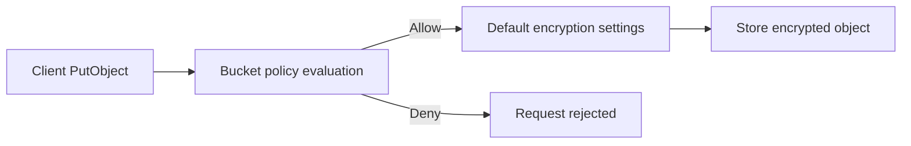

# S3 Default Encryption

## What this lecture covers

A short recap of <a href="https://docs.aws.amazon.com/AmazonS3/latest/userguide/default-bucket-encryption.html">S3 default bucket encryption</a> versus using a <a href="https://docs.aws.amazon.com/AmazonS3/latest/userguide/example-bucket-policies.html#example-bucket-policies-use-case-encryption">bucket policy to require encryption</a>: what happens automatically on upload, how to change the bucket default (for example to **SSE-KMS**), and why a **Deny** policy can still block uploads even when default encryption is enabled.

## Key definitions (from the lecture)

| Term | Definition |
|---|---|
| **Default bucket encryption** | The encryption type S3 applies to **new object uploads** when the `PUT` request does **not** include server-side encryption headers. Today that baseline is <a href="https://docs.aws.amazon.com/AmazonS3/latest/userguide/specifying-s3-encryption.html">SSE-S3</a> (AES-256, Amazon S3 managed keys). |
| **SSE-S3 (default)** | Server-side encryption with keys owned and managed by AWS. Applied **automatically** to new objects in your buckets at **no extra charge** (lecture and AWS default-encryption guidance). |
| **Changing the default** | You can configure the bucket default to another supported mode—for example <a href="https://docs.aws.amazon.com/AmazonS3/latest/userguide/UsingKMSEncryption.html">SSE-KMS</a>—so uploads without explicit headers still use that setting. |
| **Bucket policy enforcement** | A bucket policy can **deny** `s3:PutObject` (and similar writes) when the request lacks the encryption headers you require—for example **SSE-KMS**, **SSE-S3**, or **SSE-C**. |
| **Evaluation order (exam)** | **Bucket policies are evaluated before default encryption applies.** If the policy denies the request, S3 never reaches the step where default encryption would encrypt the object. |

## Default encryption vs bucket policy

| Item | Notes |
|---|---|
| **Default encryption** | Convenience and safety net: if a client uploads **without** encryption headers, S3 still encrypts at rest using the bucket default (today **SSE-S3** unless you change it). |
| **Bucket policy** | **Mandatory** control: refuse API calls that do not match your required encryption headers—even if default encryption would have handled the object. |
| **When both matter** | Default encryption protects “forgot to set headers” uploads. A policy forces a **specific** algorithm (or KMS key) for compliance—e.g. “only SSE-KMS with **this** CMK.” |
| **Exam trap** | A bucket with default **SSE-S3** can still **deny** uploads that omit `aws:kms` if the policy requires SSE-KMS. Default encryption does **not** override an explicit **Deny**. |

## Default bucket encryption today

- **All buckets** now have default encryption; new objects are encrypted with **SSE-S3** unless you configure otherwise (lecture).
- Applies to **new objects** stored in the bucket when encryption is not specified on the `PUT` request.
- You can change the default—for example to **SSE-KMS**—via console, CLI, REST API, or SDK. See <a href="https://docs.aws.amazon.com/AmazonS3/latest/userguide/bucket-encryption.html">Setting default server-side encryption behavior for Amazon S3 buckets</a>.
- **SSE-C is not supported** as a bucket default encryption type (AWS docs); you can still **require** SSE-C via bucket policy conditions on customer-provided encryption headers.



## Forcing encryption with bucket policies

The lecture’s examples are **Deny** rules on upload when the request lacks the encryption you mandate:

| Requirement | Policy idea (lecture) | Typical condition focus |
|---|---|---|
| **SSE-KMS only** | Deny `PutObject` if the request is not using AWS KMS (no `aws:kms` / no KMS key id in headers). | `s3:x-amz-server-side-encryption` or absence of `s3:x-amz-server-side-encryption-aws-kms-key-id` |
| **SSE-S3 only** | Deny unless the server-side encryption header specifies S3-managed encryption (`AES256`). | `s3:x-amz-server-side-encryption` = `AES256` |
| **SSE-C only** | Deny if there is no **customer-side** encryption algorithm header (lecture wording: “customer-side algorithm”). | Customer-provided encryption headers (see <a href="https://docs.aws.amazon.com/AmazonS3/latest/userguide/ServerSideEncryptionCustomerKeys.html">SSE-C</a>) |

AWS documents a **require SSE-KMS** pattern that denies writes when the KMS key id header is missing:

```json
{
  "Version": "2012-10-17",
  "Id": "RequireSSEKMS",
  "Statement": [
    {
      "Sid": "DenyObjectsThatAreNotSSEKMS",
      "Effect": "Deny",
      "Principal": "*",
      "Action": "s3:PutObject",
      "Resource": "arn:aws:s3:::genai-artifacts-prod/*",
      "Condition": {
        "Null": {
          "s3:x-amz-server-side-encryption-aws-kms-key-id": "true"
        }
      }
    }
  ]
}
```

Example aligned with the lecture—**deny unless SSE-S3 is explicitly requested** (stricter than relying on default alone):

```json
{
  "Version": "2012-10-17",
  "Statement": [
    {
      "Sid": "DenyPutWithoutSSE-S3Header",
      "Effect": "Deny",
      "Principal": "*",
      "Action": "s3:PutObject",
      "Resource": "arn:aws:s3:::legacy-partner-inbox/*",
      "Condition": {
        "StringNotEquals": {
          "s3:x-amz-server-side-encryption": "AES256"
        }
      }
    }
  ]
}
```

For **SSE-C**, policies typically check that customer encryption headers are present on the request (exact keys are listed under Amazon S3 condition keys in the <a href="https://docs.aws.amazon.com/service-authorization/latest/reference/list_amazons3.html">service authorization reference</a>).

## Why bucket policy runs before default encryption

- Authorization (including bucket policy **Deny**) happens **first**.
- If the policy rejects the upload, the object is **not** written and default encryption is never applied to that request.
- If the policy **allows** the upload and the client sends **no** encryption headers, S3 uses the bucket’s **default encryption** configuration.
- If the client **does** send encryption headers, S3 uses the **request** encryption settings (per AWS default-encryption behavior notes).

## How to apply it

**View or set default encryption (CLI):**

```bash
# Read current default encryption configuration
aws s3api get-bucket-encryption --bucket genai-corpus-prod

# Set default to SSE-KMS with a specific CMK
aws s3api put-bucket-encryption --bucket genai-corpus-prod \
  --server-side-encryption-configuration '{
    "Rules": [{
      "ApplyServerSideEncryptionByDefault": {
        "SSEAlgorithm": "aws:kms",
        "KMSMasterKeyID": "arn:aws:kms:us-east-1:111122223333:key/01234567-89ab-cdef-0123-456789abcdef"
      },
      "BucketKeyEnabled": true
    }]
  }'
```

**Upload with explicit encryption (bypasses “which default?” ambiguity when policies are strict):**

```bash
# Explicit SSE-KMS (satisfies many “require KMS” bucket policies)
aws s3 cp fine-tuned-model.tar.gz s3://genai-artifacts-prod/models/ \
  --server-side-encryption aws:kms \
  --ssekms-key-id arn:aws:kms:us-east-1:111122223333:key/01234567-89ab-cdef-0123-456789abcdef
```

## Examples

**RAG corpus bucket—rely on default SSE-S3**

An internal team uploads thousands of JSON chunks daily. They omit encryption headers; **default SSE-S3** still encrypts every new object at rest with no KMS key policies to maintain.

**Regulated artifacts—default SSE-KMS plus policy**

Security sets bucket default to **SSE-KMS** with a production CMK and adds a bucket policy that **denies** `PutObject` unless the KMS key id header matches that CMK. A misconfigured CI job that only relies on default **SSE-S3** in another account fails closed instead of silently storing non-compliant objects.

**Partner feed—require SSE-C headers**

A vendor integration must use **customer-provided keys**. The bucket default stays **SSE-S3**, but a policy **denies** uploads without customer encryption algorithm headers, forcing their uploader to send SSE-C on every `PutObject`.

## Limitations / edge cases

- **Existing objects** are not re-encrypted when you enable or change default encryption—only **new** uploads after the change (AWS default-encryption notes).
- **Default encryption cannot be SSE-C**; use policies or client headers for SSE-C workflows.
- **Policy vs default mismatch** is a common exam scenario: default **SSE-S3** does not satisfy a policy that mandates **SSE-KMS** headers on every upload.
- **SSE-KMS default** inherits **KMS quotas** and permissions; high-throughput apps may need **S3 Bucket Keys** or architectural tuning (see [S3 Encryption](../52-s3-encryption/index.md)).
- **Replication and logging destinations** have their own encryption constraints (for example access-log destination buckets often must use **SSE-S3** per AWS guidance).

## Industry scenarios

**1. Enterprise data lake landing zone**

A platform team enables default **SSE-S3** on all raw ingestion buckets for baseline protection. A separate **compliance** prefix bucket switches default to **SSE-KMS** and attaches a bucket policy requiring the enterprise CMK so analytics tools cannot accidentally land PCI-scoped files with only implicit SSE-S3.

**2. MLOps model registry**

Training pipelines write versioned model binaries to S3. Default encryption is **SSE-KMS** with a dedicated CMK and **Bucket Key** enabled for cost. The security team adds a **Deny** policy blocking `PutObject` unless the KMS key id header matches the registry CMK—so a developer laptop using the AWS CLI without `--ssekms-key-id` cannot bypass the standard.

**3. B2B document exchange (SSE-C)**

A insurance partner uploads claim bundles with **SSE-C**. The receiving bucket keeps default **SSE-S3** for internal ops, but the partner-facing prefix uses a bucket policy that rejects uploads missing customer encryption headers, while an SCP still requires **HTTPS** (`aws:SecureTransport`) for all S3 access.

## Key takeaways

- **Default encryption** is on for S3 buckets; **SSE-S3** encrypts new objects automatically when uploads omit encryption headers.
- You can **change** the default (for example to **SSE-KMS**) without requiring every client to remember headers—unless a **bucket policy** says otherwise.
- **Bucket policies** can **force** a specific encryption mode by **denying** `PutObject` when required headers are missing (SSE-KMS, SSE-S3, or SSE-C examples from the lecture).
- **Bucket policy evaluation comes before default encryption**—a **Deny** stops the upload; default settings never “fix” a rejected request.
- For exams: distinguish **“encrypted by default”** from **“encrypted the way compliance requires.”** Use **default** for breadth; use **policy** for mandatory algorithm/key rules.

## References

**In this repo**

- [S3 Encryption](../52-s3-encryption/index.md) (SSE-S3, SSE-KMS, SSE-C, client-side, HTTPS enforcement)
- [About DSSE-KMS](../53-about-dsse-kms/index.md) (dual-layer default option in console/API)

**AWS documentation**

- <a href="https://docs.aws.amazon.com/AmazonS3/latest/userguide/default-bucket-encryption.html">Configuring default encryption</a>
- <a href="https://docs.aws.amazon.com/AmazonS3/latest/userguide/bucket-encryption.html">Setting default server-side encryption behavior for Amazon S3 buckets</a>
- <a href="https://docs.aws.amazon.com/AmazonS3/latest/userguide/example-bucket-policies.html#example-bucket-policies-use-case-encryption">Bucket policy examples: Requiring encryption</a>
- <a href="https://docs.aws.amazon.com/AmazonS3/latest/userguide/specifying-s3-encryption.html">Specifying SSE-S3</a>
- <a href="https://docs.aws.amazon.com/AmazonS3/latest/userguide/UsingKMSEncryption.html">Using SSE-KMS</a>
- <a href="https://docs.aws.amazon.com/AmazonS3/latest/userguide/ServerSideEncryptionCustomerKeys.html">Using SSE-C</a>
- <a href="https://docs.aws.amazon.com/AmazonS3/latest/userguide/default-encryption-faq.html">Default encryption FAQ</a>
