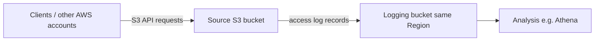
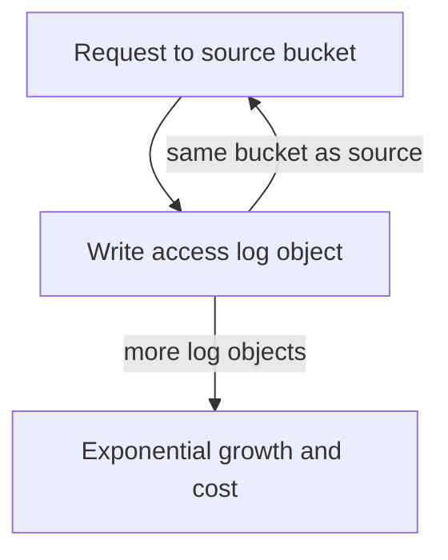

# S3 Access Logs

## What this lecture covers

<a href="https://docs.aws.amazon.com/AmazonS3/latest/userguide/ServerLogs.html">Amazon S3 server access logging</a>: why you enable it, what gets recorded (including denied requests), where logs land, how to analyze them (for example with <a href="https://docs.aws.amazon.com/athena/latest/ug/what-is.html">Amazon Athena</a>), and the critical exam trap of pointing the logging bucket at the same bucket you are monitoring.

## Key definitions (from the lecture)

| Term | Definition |
|---|---|
| **S3 access logs (server access logging)** | A feature that records **requests made against an S3 bucket** and delivers those records as **log files (objects)** in a separate **destination (logging) bucket**. See <a href="https://docs.aws.amazon.com/AmazonS3/latest/userguide/enable-server-access-logging.html">Enabling Amazon S3 server access logging</a>. |
| **Source bucket** | The bucket whose access you want to audit—the bucket receiving `GET`, `PUT`, `LIST`, and other S3 API traffic. |
| **Destination / logging bucket** | The **target** bucket where S3 writes consolidated log files. It must be in the **same AWS Region** as the source bucket (lecture). |
| **Authorized and denied requests** | **Both** successful and **failed** requests are logged—whether the caller was allowed or denied access (lecture). Useful for security audits and troubleshooting misconfigured policies. |
| **Log format** | Access logs follow a fixed, space-delimited field layout documented by AWS. See <a href="https://docs.aws.amazon.com/AmazonS3/latest/userguide/LogFormat.html">Amazon S3 server access log format</a>. |

## How server access logging works



1. Clients (any AWS account, or anonymous where applicable) send requests to your **source bucket**.
2. You **enable server access logging** on that bucket and specify a **destination bucket** (and optionally a prefix) in the same Region.
3. S3 periodically consolidates access records and **writes log files as objects** into the logging bucket.
4. You query or scan those log objects with analytics tools—for example **Amazon Athena** over S3 (lecture).

| Item | Notes |
|---|---|
| **What is logged** | Requests against the source bucket—**authorized or denied** (lecture). |
| **Where logs go** | Objects in a **separate logging bucket** in the **same Region** (lecture). |
| **Typical next step** | Analyze logs with SQL/analytics—**Athena** is the example from the lecture. |
| **Log layout** | Defined field-by-field in the official <a href="https://docs.aws.amazon.com/AmazonS3/latest/userguide/LogFormat.html">log format</a> documentation. |

## Enabling logging (conceptual)

The lecture focuses on the idea rather than console clicks (hands-on follows in the next lesson). At a high level you:

1. Create or choose a **dedicated logging bucket** in the **same Region** as the source bucket.
2. Grant the S3 log delivery principal permission to write to that bucket (console can add this automatically—see <a href="https://docs.aws.amazon.com/AmazonS3/latest/userguide/enable-server-access-logging.html#grant-log-delivery-permissions-general">Permissions for log delivery</a>).
3. Enable logging on the **source** bucket and set the **target bucket** (and a **prefix** such as `logs/` to keep keys organized).

```bash
# Illustrative: enable logging on a source bucket
aws s3api put-bucket-logging \
  --bucket genai-training-data-prod \
  --bucket-logging-status '{
    "LoggingEnabled": {
      "TargetBucket": "org-s3-access-logs-us-east-1",
      "TargetPrefix": "genai-training-data-prod/"
    }
  }'
```

Use a **prefix per source bucket** when many buckets log to one destination—it simplifies lifecycle rules and Athena partitioning. See also [Amazon S3 - Lifecycle Rules](../46-amazon-s3-lifecycle-rules/index.md) (expire old access logs after N days).

## The logging loop trap (exam warning)

**Never set the logging bucket to the same bucket you are monitoring** (lecture).

| Misconfiguration | What happens |
|---|---|
| **Source bucket = logging bucket** | Each log write is itself a new object in the monitored bucket, which generates **another log entry**, which generates **another log entry**—an **infinite logging loop**. |
| **Cost impact** | Log objects multiply **exponentially**; storage and request charges grow quickly (lecture: “you will pay a lot of money”). |
| **Exam takeaway** | Use a **separate** logging bucket (lecture: “don’t try this at home”). AWS also documents this anti-pattern in <a href="https://docs.aws.amazon.com/AmazonS3/latest/userguide/ServerLogs.html">Logging requests with server access logging</a>. |



## Examples

**Security audit after a public-read scare.** A data platform team enables access logging on `customer-uploads-prod` with logs delivered to `security-audit-logs-us-west-2`. They run Athena queries on the log prefix to list **403 Forbidden** and unexpected **GET** requests from unfamiliar accounts—catching policy mistakes the same day.

**Cost investigation.** FinOps sees a spike in `LIST` and `GET` calls against a model-artifacts bucket. Server access logs (queried in Athena) show a misconfigured CI job polling the bucket every few seconds. They fix the pipeline and add a lifecycle rule to expire logs after 90 days.

**Multi-bucket central logging.** An ML org logs ten training-data buckets into one Regional logging bucket, each with its own **target prefix** (`project-a/`, `project-b/`, …). Analysts partition Athena tables by prefix and date without mixing traffic from different workloads.

## Industry scenarios

1. **Healthcare research (compliance).** A genomics lab must demonstrate who accessed patient-derived datasets in S3. Server access logs land in a locked-down logging bucket; Athena + IAM-restricted queries produce monthly access reports for auditors without touching raw study data.

2. **Media / ML training pipeline.** A video ML team stores terabytes of clips in S3. When an external partner reports unexpected downloads, engineers enable access logging retroactively on the shared bucket and trace **requester account**, operation, and object key from log files—pinpointing a cross-account policy that was too permissive.

3. **SaaS multi-tenant storage.** A startup serves customer files from per-tenant prefixes in shared buckets. After a support ticket alleges unauthorized access, they correlate **denied** and **allowed** log lines for that prefix, then tighten bucket policies and enable ongoing logging to a central security account’s logging bucket in the same Region.

## Limitations / edge cases

- **Logging loop**: Using the monitored bucket as its own logging destination causes runaway log growth—always use a **separate** destination bucket (lecture).
- **Same Region required**: The destination logging bucket must be in the **same AWS Region** as the source bucket (lecture).
- **Not a real-time SIEM replacement**: Logs are delivered as periodic files; for live alerting many teams also use <a href="https://docs.aws.amazon.com/AmazonS3/latest/userguide/cloudtrail-logging.html">AWS CloudTrail data events</a> or export logs to analytics/security pipelines. Server access logging is best-effort per AWS—see <a href="https://docs.aws.amazon.com/AmazonS3/latest/userguide/troubleshooting-server-access-logging.html">Troubleshoot server access logging</a>.

## Key takeaways

- Enable **server access logging** when you need an audit trail of **all S3 requests** against a bucket—**including denied access**.
- Logs are stored as **objects in another S3 bucket** in the **same Region**, in a documented **log format** suitable for tools like **Amazon Athena**.
- Flow: **requests → source bucket → logging enabled → log files in logging bucket → analyze**.
- **Never** point logging at the **same bucket** you monitor—it creates an **infinite logging loop** and **runaway storage cost**.
- Prefer a **dedicated logging bucket** (and prefixes per source bucket) plus **lifecycle expiration** for old log objects.

## References

**In this repo**

- [Amazon S3 - Lifecycle Rules](../46-amazon-s3-lifecycle-rules/index.md) (expire access logs; expiration use case)
- [S3 Default Encryption](../55-s3-default-encryption/index.md) (encrypting buckets—including log buckets)

**AWS documentation**

- <a href="https://docs.aws.amazon.com/AmazonS3/latest/userguide/ServerLogs.html">Logging requests with server access logging</a>
- <a href="https://docs.aws.amazon.com/AmazonS3/latest/userguide/enable-server-access-logging.html">Enabling Amazon S3 server access logging</a>
- <a href="https://docs.aws.amazon.com/AmazonS3/latest/userguide/LogFormat.html">Amazon S3 server access log format</a>
- <a href="https://docs.aws.amazon.com/AmazonS3/latest/userguide/troubleshooting-server-access-logging.html">Troubleshoot server access logging</a>
- <a href="https://docs.aws.amazon.com/AmazonS3/latest/userguide/security-best-practices.html">Security best practices for Amazon S3</a> (monitoring and auditing)
