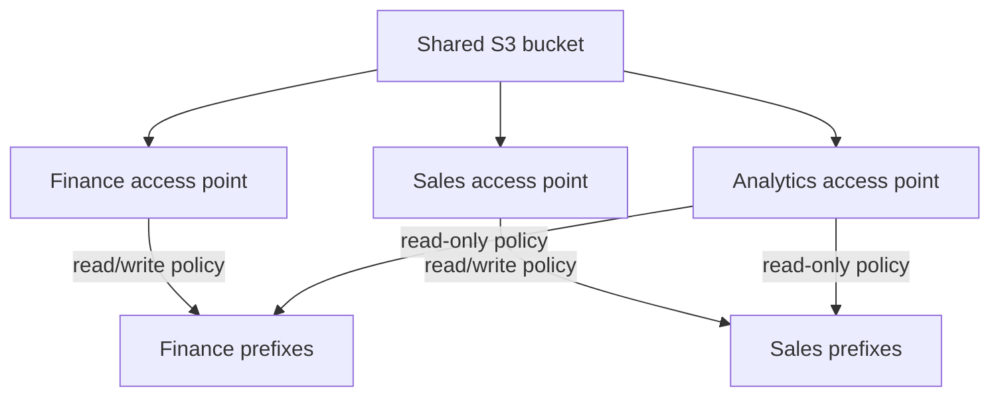
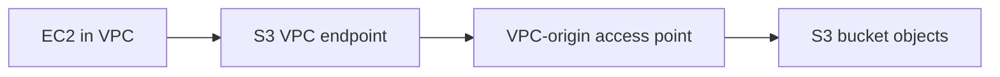

# S3 Access Points

## What this lecture covers

<a href="https://docs.aws.amazon.com/AmazonS3/latest/userguide/access-points.html">Amazon S3 access points</a>: why a single, growing bucket policy becomes hard to manage on shared datasets, how named access points with their own policies simplify security, and how **VPC-origin** access points plus **VPC endpoint policies** add a private network path to S3.

## Key definitions (from the lecture)

| Term | Definition |
|---|---|
| **S3 access point** | A **named network endpoint** attached to a data source (for example a bucket). Callers use the access point’s **DNS name** (or alias) instead of addressing the bucket directly. See <a href="https://docs.aws.amazon.com/AmazonS3/latest/userguide/access-points-naming.html">Referencing access points</a>. |
| **Access point policy** | A resource policy attached to an access point. It looks and behaves **much like a bucket policy**, but restrictions apply **only to requests made through that access point** (lecture). See <a href="https://docs.aws.amazon.com/AmazonS3/latest/userguide/access-points-policies.html">Configuring IAM policies for using access points</a>. |
| **Network origin** | Where requests to the access point may come from: **Internet** (public endpoint) or **VPC** (requests must originate from the specified VPC). Set at **create** time; you cannot change it later (AWS docs). See <a href="https://docs.aws.amazon.com/AmazonS3/latest/userguide/access-points-vpc.html">Creating access points restricted to a virtual private cloud</a>. |
| **VPC endpoint (for S3)** | A gateway in your VPC that lets resources (for example an EC2 instance) reach S3 **without traversing the public internet**. Required to use **VPC-origin** access points from inside the VPC (lecture). See <a href="https://docs.aws.amazon.com/vpc/latest/userguide/vpc-endpoints-s3.html">Gateway endpoints for Amazon S3</a>. |
| **VPC endpoint policy** | A policy on the VPC endpoint that controls which S3 resources principals in the VPC may call. For access-point traffic it must allow both the **access point** and the **underlying bucket** (lecture and AWS docs). See <a href="https://docs.aws.amazon.com/vpc/latest/userguide/vpc-endpoints-access.html">Control access to VPC endpoints using endpoint policies</a>. |

## Key distinctions / comparisons

| Item | Notes |
|---|---|
| **Bucket policy vs access point policy** | A bucket policy governs **direct** bucket access. An access point policy governs access **through that access point only**; direct bucket API calls still follow the bucket policy (lecture). |
| **Internet vs VPC network origin** | **Internet** access points can be used from anywhere (subject to IAM and policies). **VPC** access points reject requests that do not originate from the configured VPC—useful for private workloads (lecture). |
| **One bucket, many access points** | Each team or use case gets its own endpoint and policy (finance read/write, sales read/write, analytics read-only)—instead of one monolithic bucket policy (lecture). |
| **Delegating control to access points** | AWS recommends a simple bucket policy that **delegates** access control to access points in your account, so day-to-day permissions live on the access points. See <a href="https://docs.aws.amazon.com/AmazonS3/latest/userguide/access-points-policies.html#access-points-delegating-control">Delegating access control to access points</a>. |

## The problem (why you need it)

- A shared bucket may hold **many datasets** (for example financial data, sales data) and serve **many users** or teams (lecture).
- You *could* express everything in one **complex, asymmetric bucket policy** and keep extending it as users and prefixes grow (lecture).
- Over time that single policy becomes **hard to read, audit, and change**—security management does not scale with the organization (lecture).

## The solution

Push **per-audience security** from the bucket into **separate access points**, each with its own policy:



| Access point (lecture example) | Policy intent |
|---|---|
| **Finance** | Read/write to **finance** data only |
| **Sales** | Read/write to **sales** data only |
| **Analytics** | **Read-only** access to **both** finance and sales data |

- With the right **IAM permissions**, finance users connect only through the finance access point (finance slice of the bucket), sales users through sales, and analytics through a single read-only endpoint spanning both areas (lecture).
- Result: **simpler, scalable access management**—policies are attached per access point instead of one ever-growing bucket policy (lecture).

## How access points work

1. **Create** an access point on a bucket (or other supported data source).
2. Attach an **access point policy** (similar JSON to a bucket policy) scoped to that endpoint.
3. Grant users/applications **IAM permission** to use that access point ARN.
4. Clients connect using the access point’s **DNS name** or alias—not only the bucket name (lecture).
5. Choose **network origin**: **Internet** or **VPC** when you create the access point (lecture; immutable afterward per AWS).

## VPC-origin access points and VPC endpoints

For **private** access from a VPC (for example an EC2 instance that should not reach S3 over the public internet):

1. Create an access point with **VPC** network origin (lecture).
2. Create an **S3 VPC endpoint** in that VPC so traffic stays on the AWS network.
3. Configure the **VPC endpoint policy** to allow calls to **both**:
   - the **target bucket** (and object ARNs), and
   - the **access point** (and object ARNs under it) (lecture).



**Three layers of security** (lecture): **VPC endpoint policy**, **access point policy**, and permissions at the **bucket / IAM** level (AWS evaluates access point and underlying bucket together).

## How to apply it

**Example access point policies** (illustrative—align `Resource` ARNs with your account, Region, and prefix layout):

```json
{
  "Version": "2012-10-17",
  "Statement": [
    {
      "Effect": "Allow",
      "Principal": { "AWS": "arn:aws:iam::123456789012:role/FinanceApp" },
      "Action": ["s3:GetObject", "s3:PutObject"],
      "Resource": "arn:aws:s3:us-east-1:123456789012:accesspoint/finance-ap/object/finance/*"
    }
  ]
}
```

```json
{
  "Version": "2012-10-17",
  "Statement": [
    {
      "Effect": "Allow",
      "Principal": { "AWS": "arn:aws:iam::123456789012:role/AnalyticsTeam" },
      "Action": ["s3:GetObject"],
      "Resource": [
        "arn:aws:s3:us-east-1:123456789012:accesspoint/analytics-ap/object/finance/*",
        "arn:aws:s3:us-east-1:123456789012:accesspoint/analytics-ap/object/sales/*"
      ]
    }
  ]
}
```

**VPC endpoint policy fragment** (must include bucket *and* access point resources—lecture):

```json
{
  "Version": "2012-10-17",
  "Statement": [
    {
      "Effect": "Allow",
      "Principal": "*",
      "Action": ["s3:GetObject", "s3:PutObject"],
      "Resource": [
        "arn:aws:s3:::company-data-lake/*",
        "arn:aws:s3:us-east-1:123456789012:accesspoint/finance-ap/object/*"
      ]
    }
  ]
}
```

**Create a VPC-restricted access point** (AWS CLI pattern from official docs):

```bash
aws s3control create-access-point \
  --name finance-vpc-ap \
  --account-id 123456789012 \
  --bucket company-data-lake \
  --vpc-configuration VpcId=vpc-1a2b3c
```

## Examples

**Finance vs sales on one bucket.** A company stores `finance/` and `sales/` prefixes in `company-data-lake`. Instead of one bucket policy with dozens of principal blocks, they create `finance-ap` and `sales-ap`, each granting read/write only to its prefix. IAM roles map teams to the correct access point ARN.

**Analytics read-only across both areas.** A BI service needs to read finance and sales objects but must not write. An `analytics-ap` access point uses a read-only policy on both prefix trees; engineers revoke write at the access point without touching finance or sales policies.

**Private ingestion from a VPC.** A training pipeline runs on EC2 in a private subnet. A VPC-origin access point plus an S3 gateway endpoint and tight endpoint policy lets instances `PutObject` training shards without internet egress—while a separate internet-origin access point still serves external partners under a different policy.

## Industry scenarios

1. **Enterprise data platform (finance + sales silos).** A retailer’s lake bucket holds regulated finance extracts and operational sales feeds. Platform engineers delegate bucket access to access points: finance analysts get a VPC-only finance endpoint, sales ops get a sales endpoint, and a central analytics role uses a read-only access point spanning both—simplifying audits and onboarding.

2. **Generative AI / ML feature store.** An ML team shares one artifacts bucket for embeddings, prompts, and evaluation sets. Data scientists receive a read-only access point; the training pipeline uses a write-capable access point limited to `raw/` prefixes; production inference uses yet another endpoint with least privilege—avoiding one brittle bucket policy for every model version.

3. **Healthcare analytics in a private VPC.** Patient-derived datasets must stay off the public internet. VPC-origin access points, private DNS for the S3 endpoint, and endpoint policies that explicitly list bucket and access point ARNs let approved EC2 and SageMaker jobs read data while security teams retain separate policies per research group.

## Limitations / edge cases

- Access points support **object operations** (for example `GetObject`, `PutObject`), not every S3 control-plane action (for example deleting the bucket)—see <a href="https://docs.aws.amazon.com/AmazonS3/latest/userguide/access-points-service-api-support.html">Access point compatibility</a>.
- **Network origin is fixed at creation**; you cannot flip an access point from Internet to VPC later (AWS docs).
- An access point policy is **not sufficient alone**: the **underlying bucket** (or delegated bucket policy) must also permit the same access, and **IAM** must allow using the access point (lecture + AWS).
- VPC-origin setups require a correctly scoped **VPC endpoint policy** covering **both** the access point and bucket ARNs—omitting either causes denied requests (lecture).
- Direct bucket access **bypasses** access point policies; restrict direct access when access points are your primary control plane.

## Key takeaways

- **Access points** are named endpoints with their own **DNS names**, **policies**, and optional **VPC-only** network origin—ideal for **shared buckets** with many audiences (lecture).
- Prefer **per-team or per-use-case access points** (finance, sales, analytics) over one sprawling bucket policy.
- **Access point policies** resemble bucket policies but apply **only** to traffic through that access point.
- **VPC-origin** access points keep S3 traffic private; pair them with an **S3 VPC endpoint** whose policy allows **both** the access point and the bucket.
- Security stacks in layers: **IAM**, **access point policy**, **bucket policy** (often delegated), and **VPC endpoint policy** for private access.
- Access points help you **scale access management** as users and datasets grow without rewriting a monolithic bucket policy.

## References

**In this repo**

- [A note about S3 regional namespaces](../48-a-note-about-s3-regional-namespaces/index.md) (Regional endpoints and access patterns)
- [S3 Default Encryption](../55-s3-default-encryption/index.md) (encrypting objects accessed via access points)
- [S3 Access Logs](../56-s3-access-logs/index.md) (auditing requests—including via access points when logging is enabled on the bucket)

**AWS documentation**

- <a href="https://docs.aws.amazon.com/AmazonS3/latest/userguide/access-points.html">Managing access to shared datasets with access points</a>
- <a href="https://docs.aws.amazon.com/AmazonS3/latest/userguide/access-points-policies.html">Configuring IAM policies for using access points</a>
- <a href="https://docs.aws.amazon.com/AmazonS3/latest/userguide/access-points-vpc.html">Creating access points restricted to a virtual private cloud</a>
- <a href="https://docs.aws.amazon.com/AmazonS3/latest/userguide/creating-access-points.html">Creating an access point</a>
- <a href="https://docs.aws.amazon.com/vpc/latest/userguide/vpc-endpoints-s3.html">Gateway endpoints for Amazon S3</a>
- <a href="https://docs.aws.amazon.com/vpc/latest/userguide/vpc-endpoints-access.html">Control access to VPC endpoints using endpoint policies</a>
- <a href="https://docs.aws.amazon.com/AmazonS3/latest/userguide/security-best-practices.html">Security best practices for Amazon S3</a>
