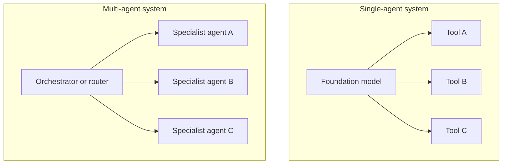
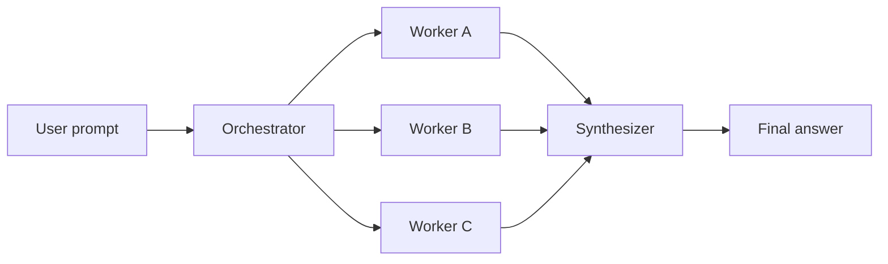
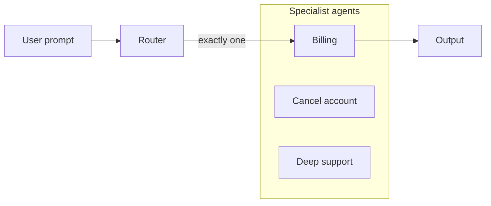
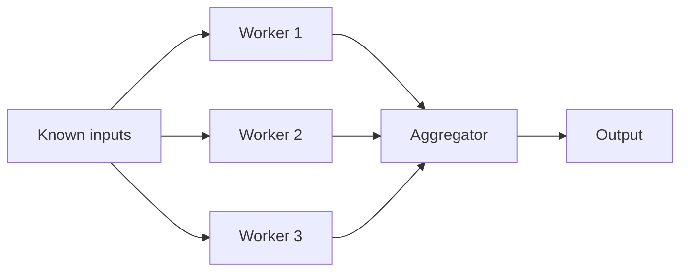
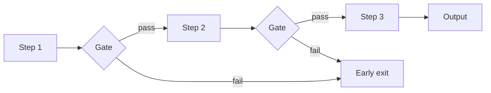
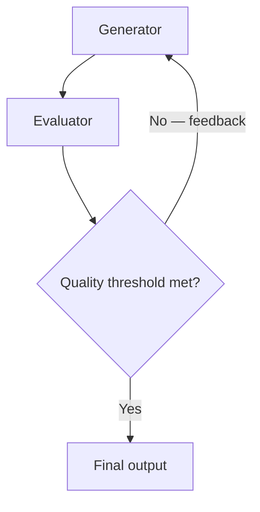

# Multi-Agent Workflows

## What this lecture covers

Building on single-agent (augmented LLM) systems, this lecture introduces **multi-agent workflows**: composing multiple specialized agents that can run **in sequence**, **in parallel**, or **independently**. It explains when multi-agent designs are justified, surveys popular **orchestration patterns** (orchestrator, routing, parallelization, prompt chaining, evaluator–optimizer), and maps them to AWS concepts such as <a href="https://docs.aws.amazon.com/bedrock/latest/userguide/flows-how-it-works.html">Amazon Bedrock Flows</a>, <a href="https://docs.aws.amazon.com/bedrock/latest/userguide/agents-multi-agent-collaboration.html">multi-agent collaboration in Bedrock Agents</a>, **Agent Squad**, and **Strands Agents**.

## Key definitions (from the lecture)

| Term | Definition |
|---|---|
| **Single-agent system / augmented LLM** | One foundation model armed with a suite of **tools** (lookups, APIs, code execution, etc.) to act on the world. |
| **Multi-agent system** | Many such agents working together—each **self-contained**, specialized, and able to run independently, in sequence, or in parallel. |
| **Orchestrator agent** | An agent whose job is to **break a user prompt into subtasks** and farm them out to specialized worker agents. |
| **Worker / specialist agent** | An agent tuned for one domain with its own tools and memory; executes a slice of the overall task. |
| **Synthesizer / aggregator** | Combines worker outputs into the final response (or metrics, votes, etc.). |
| **Router** | Classifies a prompt and **directs it to the best-fit agent**—by task type, complexity, keywords, or agent descriptions. |
| **Gate (in prompt chaining)** | A checkpoint in a sequential chain that validates progress; can **bail early** if quality or direction is wrong. |
| **Guardrails** | Checks on input or output to ensure the system is not doing disallowed or unsafe things; can run as parallel workers. |
| **Evaluator–optimizer loop** | One agent **generates**, another **evaluates** quality, and the cycle repeats until output is good enough. |

## Key distinctions / comparisons

| Item | Notes |
|---|---|
| **Single agent vs multi-agent** | Single agent = one FM + many tools. Multi-agent = many **specialized FMs/agents**, each with a focused tool set and context—similar in spirit to giving tools, but agents are **peers or workers**, not just functions. |
| **Tools on one agent vs agents on an orchestrator** | Attaching tools extends one model; attaching **specialist agents** to an orchestrator lets each worker **focus without context pollution** from unrelated work. |
| **Orchestrator vs parallelization** | **Orchestrator** dynamically **plans and splits** unknown tasks. **Parallelization** skips planning—you **already know** what to run in parallel (fixed inputs). |
| **Routing vs orchestration** | **Routing** picks **one** best agent for a single classification need. **Orchestration** may invoke **many** workers and merge results. |
| **Parallel vs sequential (prompt chaining)** | Parallel workers run at once (e.g., translate to five languages). **Prompt chaining** passes each step’s output to the next; can add **gates** to stop early. |
| **When to use multi-agent** | Only for **genuinely complicated** problems—too many tools, overloaded prompts with heavy conditionals, or workflows needing specialization and isolation. |

## Single-agent recap and the multi-agent idea

A **single-agent system** gives one foundation model tools to look up information, call APIs, browse the web, or run code. A **multi-agent system** puts **many** of these together:

- Agents can be **specialized** for different tasks (code review, optimization, re-architecture).
- They can run **in parallel**, **in sequence**, or **independently**.
- Each agent is **self-contained**—it focuses on its task without carrying the full system context in one window.

Think of it like human teams: specialists with narrow expertise often outperform one generalist juggling every tool and every sub-problem at once.

## The problem (why you need it)

- **Too many tools on one agent** — the FM may struggle to **choose the right tool**, and the **limited context window** gets crowded with irrelevant instructions and history.
- **Overly complex prompts** — long conditional logic in a single prompt is a signal the workflow may belong in **multiple specialized agents** with a clearer structure.
- **Tasks that benefit from isolation** — e.g., parallel language translation where each worker should not see the others’ partial work in the same context (cleaner, but **more expensive**).

## When *not* to use multi-agent

For **simple use cases**, do not reach for a complex multi-agent design. Reserve these patterns for **really complicated problems** where specialization, routing, or parallel decomposition clearly helps.

## Multi-agent workflow patterns

The lecture walks through five common patterns. These are **conceptual models** for understanding agentic AI; they may not appear as verbatim exam items, but they clarify how real systems (including AWS services) are assembled.

### 1. Orchestrator pattern

- **Orchestrator** — reads the prompt and splits work into **parallel (or sequential) subtasks**.
- **Workers** — specialized agents with the tools and tuning needed for each subtask.
- **Synthesizer** — merges worker outputs into one coherent response.

**Examples**

- **Coding pipeline** — separate agents for code review, performance optimization, and re-architecture over the same codebase, possibly in sequence.
- **Multi-language translation** — one worker per target language running **in parallel**; synthesizer waits for all and returns combined output.
- Each worker maintains **its own memory**, so context is not polluted by unrelated subtasks—**more capable, higher cost**.

On AWS, <a href="https://docs.aws.amazon.com/bedrock/latest/userguide/agents-multi-agent-collaboration.html">multi-agent collaboration in Amazon Bedrock Agents</a> uses a **supervisor–collaborator** hierarchy in this spirit, and <a href="https://docs.aws.amazon.com/prescriptive-guidance/latest/agentic-ai-patterns/workflow-orchestration-agents.html">workflow orchestration agents</a> describe coordinating multistep work across subagents.

### 2. Routing pattern

- **Router** decides **which agent** should handle the request.
- Matching can use **keywords**, **intent classification**, or **natural-language descriptions** of what each agent does (“this agent handles balance inquiries—route here”).
- Useful when you need a **single classification** before execution.

**Examples**

- **Model tier by complexity** — simple prompts route to a **smaller, cheaper** model; hard reasoning tasks route to a **larger** model (similar to how ChatGPT saves cost by not always invoking the biggest model).
- **Customer service** — classify query type (balance, cancel account, deep support) and route to the matching specialist agent.

AWS mappings mentioned in the lecture: **Agent Squad** (covered later in this section), <a href="https://docs.aws.amazon.com/bedrock/latest/userguide/flows-how-it-works.html">Amazon Bedrock Flows</a>, and <a href="https://docs.aws.amazon.com/prescriptive-guidance/latest/agentic-ai-frameworks/strands-agents.html">Strands Agents</a>. See also <a href="https://docs.aws.amazon.com/prescriptive-guidance/latest/agentic-ai-patterns/workflow-for-routing.html">workflow for routing</a>.

### 3. Parallelization pattern

Like orchestration, but the **orchestrator is replaced by fixed inputs**—you **know upfront** what to run.

**Examples**

- **Multiple guardrails at once** — run different <a href="https://docs.aws.amazon.com/bedrock/latest/userguide/guardrails-how.html">Bedrock Guardrails</a> (or custom checks) **in parallel** on input or output.
- **Parallel evaluations** — workers score the same system output with different metrics; aggregator presents combined results.
- **Voting / ensemble** — workers solve the **same problem different ways**; aggregator **tallies votes** for diversity of thought and a more robust final answer.

### 4. Prompt chaining pattern

<a href="https://docs.aws.amazon.com/bedrock/latest/userguide/flows-how-it-works.html">Amazon Bedrock Flows</a> was originally centered on this idea: a **discrete sequence** of steps where each agent processes the **previous agent’s output**.

- Does **not** require parallelism—strictly **sequential**.
- **Gates** at any step ask: “Is this still on track?” If things go sideways, **exit early** and avoid paying for later steps.
- **Examples** — translate a document step-by-step; build slides from an outline section-by-section (sequential or parallel per section, depending on design).

See <a href="https://docs.aws.amazon.com/prescriptive-guidance/latest/agentic-ai-patterns/workflow-for-prompt-chaining.html">workflow for prompt chaining</a>.

### 5. Evaluator–optimizer pattern

- **Generator** produces a draft (code, search results, document, etc.).
- **Evaluator** reviews quality and sends **actionable feedback** (“fix these security issues”).
- Loop until output is **good enough**.

**Examples**

- **Code review loop** — generator writes code; reviewer agent flags security holes; generator revises until approved.
- **Iterative search** — broad search pass, evaluator judges relevance, generator refines queries for deeper, finer-grained results.

## Pattern selection (quick reference)

| Pattern | Best when… | AWS / course touchpoints |
|---|---|---|
| **Orchestrator** | Task must be **dynamically decomposed** into specialist subtasks | Bedrock multi-agent collaboration, orchestration guidance |
| **Routing** | One **classification** picks the right specialist | Agent Squad, Flows, Strands |
| **Parallelization** | Work units are **known in advance**; speed or ensemble matters | Guardrails, parallel evaluators, voting |
| **Prompt chaining** | Fixed **sequential pipeline** with optional early exit | Bedrock Flows, Step Functions + Bedrock |
| **Evaluator–optimizer** | Quality must **iterate** until a bar is met | Code review, refined search |

## Examples

1. **Repository modernization** — orchestrator splits a legacy monolith refactor into “security audit,” “performance profile,” and “API boundary design” workers; synthesizer produces a unified migration plan.
2. **Global product launch copy** — parallel translation workers (EN → JA, DE, ES, FR) each with isolated memory; synthesizer bundles localized strings for the CMS.
3. **Support triage** — router classifies “where is my refund?” vs “close my account” vs “speak to a human”; only the matching specialist agent runs, saving tokens and reducing tool-selection errors.

## Limitations / edge cases

- **Cost** — each agent carries its own FM call, tools, and memory; parallel workers multiply spend.
- **Complexity** — debugging multi-agent flows is harder than a single agent with a few tools.
- **Over-engineering** — conditional-heavy single prompts and “agent sprawl” are both smells; match pattern to problem size.
- **Exam scope** — specific pattern names may not be tested directly, but they explain **why** services like Flows, Agent Squad, and multi-agent Bedrock exist.

## Key takeaways

- **Multi-agent systems** compose specialized, self-contained agents that can run in parallel, in sequence, or independently—extending the single augmented-LLM model.
- Use multi-agent designs when you have **too many tools**, **overloaded prompt logic**, or tasks that benefit from **context isolation**—not for simple problems.
- **Orchestrator** → dynamic split → workers → **synthesizer**; **routing** → one best agent; **parallelization** → known parallel work without a planner.
- **Prompt chaining** sequences steps with optional **gates** for early exit; **evaluator–optimizer** loops until quality is sufficient.
- On AWS: **Bedrock Flows** (chaining/routing), **Bedrock Agents multi-agent collaboration** (supervisor/workers), **Agent Squad** and **Strands** (routing/composition)—covered in later lectures in this section.

## Industry scenarios

1. **Software engineering platform** — A platform team deploys orchestrator-led coding agents: one worker runs static analysis, another proposes optimizations, a third drafts API docs; a synthesizer opens a single pull-request summary for human review—avoiding one mega-agent with dozens of conflicting tools.
2. **Multilingual contact center** — A router classifies intent (billing, technical, retention); parallel guardrail workers screen PII and toxic language on every turn; the chosen specialist agent handles the case with a focused tool set (CRM lookup vs troubleshooting runbooks).
3. **Research assistant for analysts** — Evaluator–optimizer loop: generator produces an executive summary from retrieved filings; evaluator checks citations and completeness; loop continues until the summary passes compliance thresholds before publication.

## References

- [LLM Agents in Bedrock](../01-llm-agents-in-bedrock/index.md)
- [Strands Agents](../04-strands-agents/index.md)
- [Agent Squad](../05-agent-squad/index.md)
- [Short and Long-Term Agent Memory](../03-short-and-long-term-agent-memory/index.md)
- <a href="https://docs.aws.amazon.com/prescriptive-guidance/latest/agentic-ai-patterns/introduction.html">Agentic AI patterns and workflows on AWS</a>
- <a href="https://docs.aws.amazon.com/prescriptive-guidance/latest/agentic-ai-patterns/agentic-workflow-patterns.html">Agentic workflow patterns</a>
- <a href="https://docs.aws.amazon.com/bedrock/latest/userguide/agents-multi-agent-collaboration.html">Use multi-agent collaboration with Amazon Bedrock Agents</a>
- <a href="https://docs.aws.amazon.com/bedrock/latest/userguide/flows-how-it-works.html">How Amazon Bedrock Flows works</a>
- <a href="https://docs.aws.amazon.com/prescriptive-guidance/latest/agentic-ai-patterns/workflow-for-routing.html">Workflow for routing</a>
- <a href="https://docs.aws.amazon.com/prescriptive-guidance/latest/agentic-ai-patterns/workflow-for-prompt-chaining.html">Workflow for prompt chaining</a>
- <a href="https://docs.aws.amazon.com/bedrock/latest/userguide/guardrails-how.html">How Amazon Bedrock Guardrails works</a>
- <a href="https://docs.aws.amazon.com/prescriptive-guidance/latest/agentic-ai-frameworks/strands-agents.html">Strands Agents (AWS Prescriptive Guidance)</a>
