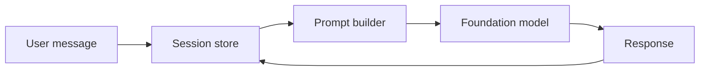
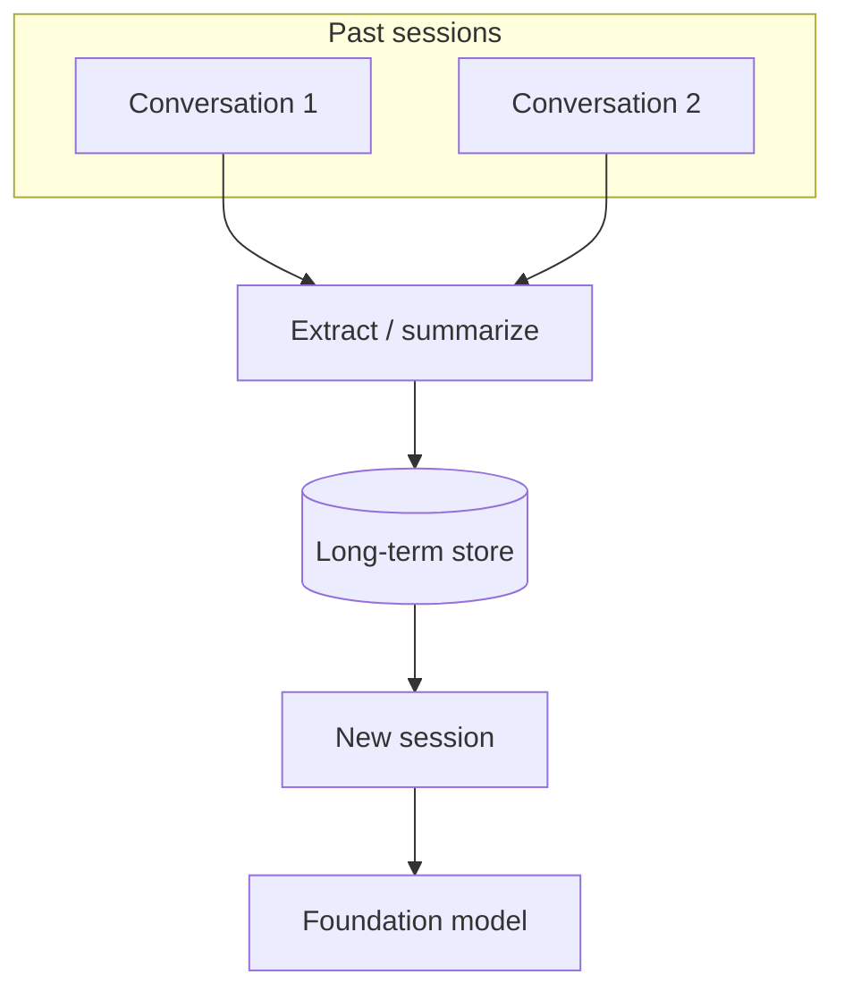

# Short and Long-Term Agent Memory

## What this lecture covers

Agents need **memory** the way people do—split into **short-term** (the current session) and **long-term** (insights and facts that persist across sessions). This lecture defines both types, what gets stored (conversation turns, tool calls, uploads, preferences, summaries), where you might store it (in-process memory, caches, databases, managed services), and how **knowledge bases** relate but differ from interaction memory.

## Key definitions (from the lecture)

| Term | Definition |
|---|---|
| **Short-term memory** | Context for the **current session**—conversation history and in-session events (tool calls, uploads, etc.) that let the agent resolve references like “do that again” or “what about tomorrow?” |
| **Long-term memory** | **Persistent** knowledge drawn from past sessions—verbatim transcripts, **summaries**, learned **user preferences**, and **explicit facts** the user asked to remember. |
| **Session** | A bounded interaction window; short-term memory lives here and is folded into the prompt as prior context. |
| **Memory record** | A stored unit of memory; a unified store may hold records with **different strategies** per memory kind (preferences vs semantic facts vs session summaries). |
| **Knowledge base (as memory)** | Long-lived **external** contextual information (documents, corpora)—related to “memory” but usually **not** the same as remembering **past user–agent interactions**. |

## Key distinctions / comparisons

| Item | Notes |
|---|---|
| **Short-term vs long-term** | Short-term = **this conversation / session** (immediate context). Long-term = **across sessions** (resume old chats, personalize, recall “remember this”). |
| **Verbatim vs summarized long-term** | You can store full past conversations **or** **summaries** that seed new sessions without replaying every token. |
| **Inferred vs explicit long-term facts** | The agent may **infer** preferences (coding style, tools, interests, job) **or** store **explicit** facts when the user says “remember this.” |
| **DynamoDB for short vs long term** | <a href="https://docs.aws.amazon.com/amazondynamodb/latest/developerguide/HowItWorks.CoreComponents.html">DynamoDB</a> works for **either**—short-term session state **or** durable long-term records; the **semantics** (TTL, summarization, extraction) differ, not necessarily the database choice. |
| **Agent interaction memory vs knowledge base** | Interaction memory = **what happened between user and agent**. Knowledge bases = **outside context** (docs, policies, product catalogs)—long-lived, but not a substitute for session/personal memory. |

## Short-term memory

Short-term memory is what makes **multi-turn conversation** possible. When you refer to something you said earlier—“do that again,” “the thing we discussed above,” “what about tomorrow?”—the agent relies on **conversation history** stored for **this session**.

Mechanically, prior turns (and related session events) are assembled into **one large prompt** that includes **prior context** plus the current user message. That context is not only chat text—it can include **events** from the session:

- **Tool invocations** and their results
- **Files or data uploaded** during the session
- Other **session-scoped** activity

### Where short-term memory can live

| Store | Typical use |
|---|---|
| **In-process memory** | Simplest; fine for single-instance, ephemeral sessions. |
| **Distributed cache** (e.g. <a href="https://docs.aws.amazon.com/AmazonElastiCache/latest/dg/WhatIs.html">ElastiCache</a>) | Shared session state across scaled agent workers. |
| **Document / key-value stores** (e.g. MongoDB, DynamoDB) | Durable or shared short-term state when you outgrow process memory. |

## Long-term memory

Long-term memory is **persistent**. Examples from everyday products: reopening a **year-old ChatGPT thread**, or the assistant weaving in **things it “knows” about you** in a **new** conversation.

Long-term content can include:

- **Full past conversations** (resume where you left off)
- **Summaries** of past sessions (compressed background for new chats)
- **Inferred user profile** — coding style, favorite tools, interests, role
- **Explicit user facts** — when the user says “remember this”

Conceptually you might use a **unified memory store**, but **different memory types** can use **different strategies**:

| Memory kind | Example strategy |
|---|---|
| **User preferences** | Structured profile fields or preference vectors |
| **Semantic facts** | Fact records keyed by topic or entity |
| **Session summaries** | Periodic summarization jobs writing compact narrative state |

## Where to store memory

The lecture lists several options—often **build-your-own** vs **managed**:

| Option | Notes |
|---|---|
| **DynamoDB** | Flexible for session or long-term records at scale. |
| **SQLite** | Default in the **OpenAI SDK** for small to medium solutions. |
| **RDS / Aurora** | Relational fit for small to medium deployments with SQL tooling. |
| **<a href="https://docs.aws.amazon.com/bedrock-agentcore/latest/devguide/memory.html">Amazon Bedrock AgentCore Memory</a>** | Managed memory you **attach to agents**—short- and long-term types, extraction strategies, less custom plumbing. |
| **Strands SDK + MemZero** | Integration path mentioned for Strands-based agents. |
| **Knowledge bases** | Long-lived **external** context (<a href="https://docs.aws.amazon.com/bedrock/latest/userguide/knowledge-base.html">Amazon Bedrock Knowledge Bases</a>)—complementary to, not the same as, **interaction** memory. |

On AWS, <a href="https://docs.aws.amazon.com/bedrock/latest/userguide/sessions.html">Bedrock session management APIs</a> provide another pattern: create a session, store invocations and steps, retrieve history, end or delete the session—with quotas such as idle timeout and retention you must design around.

## Examples

1. **Follow-up resolution (short-term)** — User: “What’s the weather in Seattle?” then “What about tomorrow?” Short-term history binds “tomorrow” to **Seattle weather**, not a new city.
2. **Travel preference (long-term, inferred)** — User often picks window seats; the agent stores that preference and **proactively** offers window seats in a later booking session.
3. **Explicit fact (long-term)** — User: “Remember my employee ID is 48291.” That fact is written to long-term storage and available in future sessions without re-entry.

## Limitations / edge cases

- **Context window limits** — Even with short-term memory, stuffing **entire** session history into every prompt eventually hits FM **token limits**; summarization or selective retrieval becomes necessary.
- **Storage ≠ intelligence** — Persisting transcripts does not automatically produce useful long-term memory; **extraction and summarization strategies** matter.
- **Knowledge base confusion** — A rich document corpus does **not** replace remembering **this user’s** prior chats and stated preferences.
- **Cost and retention** — Verbatim long-term storage of every turn scales in **storage and replay cost**; summaries trade fidelity for efficiency.
- **Multi-agent systems** — Workers may keep **isolated short-term memory** per subtask (see [Multi-Agent Workflows](../02-multi-agent-workflows/index.md)); long-term memory may need **shared** or **per-user** scopes.

## Key takeaways

- **Short-term memory** = current **session** context (chat + tools + uploads) folded into the prompt so multi-turn dialogue works.
- **Long-term memory** = **persistent** knowledge across sessions—transcripts, summaries, inferred preferences, and explicit “remember this” facts.
- One logical memory system can use **different storage strategies** per memory type (preferences vs facts vs summaries).
- **DynamoDB**, caches, SQLite, and RDS are common **DIY** backends; **AgentCore Memory** and **MemZero (Strands)** offer managed or integrated paths.
- **Knowledge bases** hold **external** domain context; **interaction memory** holds **user-specific** history—both are “long-lived,” but serve different purposes.

## Industry scenarios

1. **Customer support platform** — Short-term memory tracks the **active ticket** thread (prior messages, tool lookups, attachments). Long-term memory stores **account preferences**, past issue summaries, and explicit notes (“always escalate billing disputes to Tier 2”) so returning customers get continuity without repeating themselves.
2. **Developer coding assistant** — Short-term memory holds the **current repo session** (files touched, commands run, last refactor). Long-term memory captures **coding style**, preferred frameworks, and standing rules (“use pytest, not unittest”) so new projects inherit the developer’s norms automatically.
3. **Enterprise sales copilot** — Short-term memory supports a **live meeting** (questions asked, CRM lookups, draft emails). Long-term memory retains **client facts**, prior deal summaries, and relationship history so prep for the next quarter’s call starts from a synthesized profile, not a blank slate.

## References

- [LLM Agents in Bedrock](../01-llm-agents-in-bedrock/index.md)
- [Multi-Agent Workflows](../02-multi-agent-workflows/index.md)
- [AgentCore Memory and Tools](../07-agentcore-memory-and-tools/index.md)
- <a href="https://docs.aws.amazon.com/bedrock-agentcore/latest/devguide/memory.html">Add memory to your Amazon Bedrock AgentCore agent</a>
- <a href="https://docs.aws.amazon.com/bedrock-agentcore/latest/devguide/memory-get-started.html">Get started with AgentCore Memory</a>
- <a href="https://docs.aws.amazon.com/bedrock/latest/userguide/sessions.html">Store and retrieve conversation history with session management APIs</a>
- <a href="https://docs.aws.amazon.com/bedrock/latest/userguide/agents-memory-view.html">View memory sessions (Bedrock Agents)</a>
- <a href="https://docs.aws.amazon.com/bedrock/latest/userguide/knowledge-base.html">Retrieve data and generate AI responses with Amazon Bedrock Knowledge Bases</a>
- <a href="https://docs.aws.amazon.com/amazondynamodb/latest/developerguide/HowItWorks.CoreComponents.html">Core components of Amazon DynamoDB</a>
- <a href="https://docs.aws.amazon.com/AmazonElastiCache/latest/dg/WhatIs.html">What is Amazon ElastiCache?</a>
