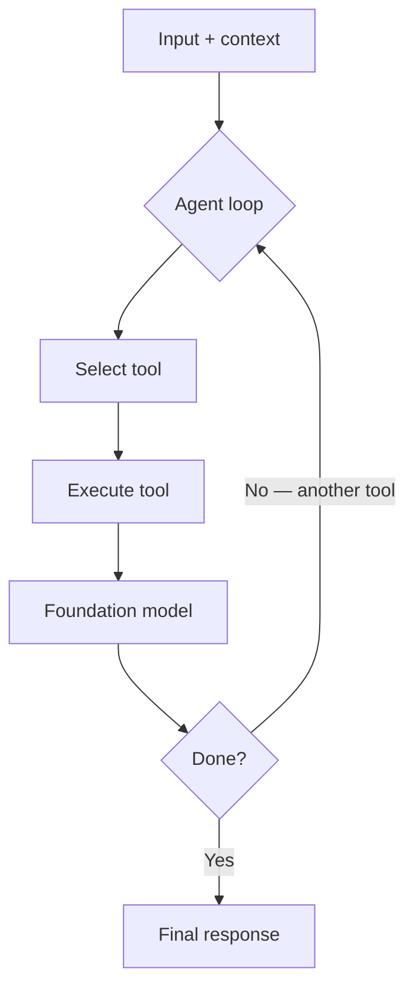
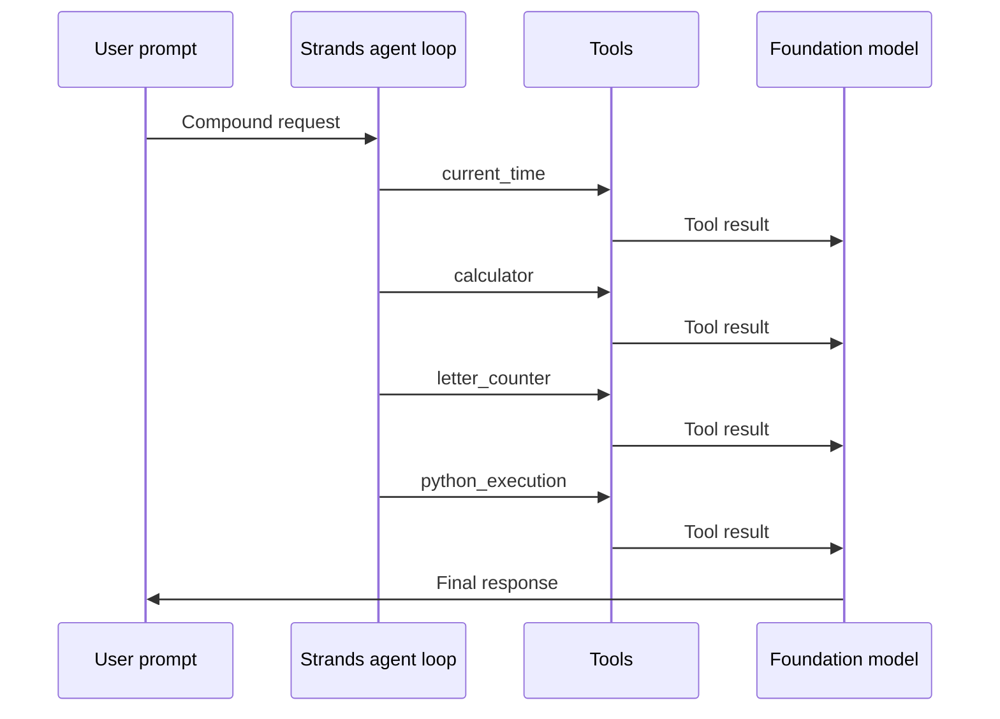

# Strands Agents

## What this lecture covers

After multi-agent workflows in theory, this lecture answers **how to implement them in code**. It introduces <a href="https://docs.aws.amazon.com/prescriptive-guidance/latest/agentic-ai-frameworks/strands-agents.html">Strands Agents</a>—Amazon’s open-source Python SDK for specialized agents and multi-agent systems—contrasts it with other agent frameworks, surveys **built-in tools** and **AWS integration**, and explains the **Strands agent loop** with a minimal code walkthrough.

## Key definitions (from the lecture)

| Term | Definition |
|---|---|
| **Strands Agents** | An **open-source** agent SDK (initially released by Amazon) for building specialized agents and **multi-agent** systems in **Python**—exam-focused in this course. |
| **Strands agent loop** | The internal **reason–act–observe** cycle: input + context → **select tool** → **execute** → foundation model judges **done or repeat** → final response. |
| **Tool (in Strands)** | A callable capability the agent can invoke (built-in or **custom** Python); the model picks tools during the loop. |
| **Custom tool** | A Python function you define (often with a **tool decorator**) and register on the agent’s tool list. |
| **Built-in tools** | Pre-packaged integrations (calculator, current time, Python execution, AWS via boto3, etc.) so you do not wire everything yourself. |
| **Model Context Protocol (MCP)** | A standard way to attach **external** context and capabilities via MCP servers (covered in more depth in a later lecture). |
| **MemZero (lecture naming)** | Built-in memory integration in Strands for **short- and long-term** memory and **personalization** (see [Short and Long-Term Agent Memory](../03-short-and-long-term-agent-memory/index.md)). |

## Key distinctions / comparisons

| Item | Notes |
|---|---|
| **Strands vs other SDKs** | Alternatives include OpenAI Agents SDK, CrewAI, LangGraph, Google’s agent tooling, and others. Strands is **competitive** and **AWS-aligned**—the one this certification emphasizes. |
| **Strands vs Bedrock-only building blocks** | Strands is a **code-first SDK** for composing agents; it complements managed patterns such as <a href="https://docs.aws.amazon.com/bedrock/latest/userguide/flows-how-it-works.html">Amazon Bedrock Flows</a> and <a href="https://docs.aws.amazon.com/bedrock/latest/userguide/agents-multi-agent-collaboration.html">Bedrock multi-agent collaboration</a> (see [Multi-Agent Workflows](../02-multi-agent-workflows/index.md)). |
| **AWS-tight vs model-agnostic** | **Tight AWS integration** (Bedrock, Lambda, Step Functions, boto3, knowledge bases, Polly, etc.) when you build on AWS—but you can also target **OpenAI** and other providers; not locked to AWS only. |
| **Conceptual patterns vs Strands** | Patterns like orchestrator, routing, and parallelization are **ideas**; Strands is one **implementation path** (including **agent swarms** for complex multi-agent setups). |
| **Knowledge base vs MemZero memory** | <a href="https://docs.aws.amazon.com/bedrock/latest/userguide/knowledge-base.html">Bedrock Knowledge Bases</a> supply **external corpus** context for RAG; MemZero-style memory tracks **interaction** and **user-specific** persistence—different jobs (see memory lecture). |
| **Token-level LLM vs character counting** | Foundation models reason over **tokens** (word-like chunks), not raw characters—so tasks like “count the letter R in strawberry” fail unless you add a **tool** that counts characters deterministically. |

## Why Strands Agents

Multi-agent designs need a **practical SDK**, not only diagrams. Strands lets you:

- Create **specialized agents** and **multi-agent** / swarm-style systems in Python.
- Apply the same **task decomposition** and **collaborative problem-solving** patterns from [Multi-Agent Workflows](../02-multi-agent-workflows/index.md).
- Lean on **native AWS hooks** when your agentic stack runs on AWS—calling <a href="https://docs.aws.amazon.com/bedrock/latest/userguide/what-is-bedrock.html">Amazon Bedrock</a> foundation models, <a href="https://docs.aws.amazon.com/lambda/latest/dg/welcome.html">AWS Lambda</a>, <a href="https://docs.aws.amazon.com/step-functions/latest/dg/welcome.html">AWS Step Functions</a>, and other services agents often orchestrate.

Because it is **open source** and model-flexible, teams outside AWS can still adopt it; the exam emphasis here is the **AWS-integrated** path.

## Capabilities highlighted in the lecture

| Area | What Strands supports |
|---|---|
| **Multimodal** | Text, **speech**, **images**, and **video** (aligned with multimodal FMs on Bedrock). |
| **MCP** | Connect to **external MCP servers** for extra context or tools. |
| **Multi-agent** | **Coordinate swarms** of agents for complex workflows. |
| **Models** | Bedrock models by default; other LLM APIs (e.g. OpenAI) when needed. |

## Built-in tools and integrations

The lecture stresses a **rich built-in tool suite** so agents can act in the real world without bespoke glue for every action:

| Capability | Role |
|---|---|
| **boto3 / AWS SDK** | Invoke **any AWS API** from an agent via the standard Python client. |
| **Bedrock Knowledge Bases** | **RAG** and data lookups against managed retrieval stores. |
| **MemZero** | **Short- and long-term** memory and **personalization** across sessions. |
| **Python execution** | Run arbitrary **Python** for logic the model should not guess. |
| **HTTP** | Call external **REST** (or similar) web APIs. |
| **Shell** | Run **shell commands** on the host (powerful—treat as high risk). |
| **Files** | Read/write **local files** when explicitly enabled. |
| **Agent swarms** | **Multi-agent coordination** for decomposed work. |
| **Amazon Polly** | **Speech output** for voice-oriented agents. |
| **Common utilities** | Examples from the demo: **calculator**, **current time**, plus **custom** tools you author. |

Anything you can wrap in Python can become a **custom tool**—the built-ins are shortcuts for frequent agentic tasks.

## The Strands agent loop

Conceptually, Strands does not answer in one shot. **Input** (user message) plus **context**—from a knowledge base, uploaded prompt material, or session memory—enters the **agent loop**:

1. **Select** the best tool for the current sub-need.
2. **Execute** that tool and return results to the foundation model.
3. **Decide** whether the task is complete or another tool pass is required (subtasks may chain **multiple** tool calls).
4. When satisfied, emit the **final response**.



This matches the **model-first** “agent loop” described in AWS prescriptive guidance and Strands documentation—tool use is iterative, not a single function call.

## How to apply it (minimal Python shape)

The exam is unlikely to require writing Strands code, but you should recognize the **few-line** pattern: define tools, construct an `Agent` with a tool list, then `agent("...")` to run the loop.

```python
from strands import Agent, tool  # illustrative imports — see Strands quickstart

@tool
def letter_counter(word: str, letter: str) -> int:
    """Count occurrences of a letter in a word (character-level)."""
    return word.lower().count(letter.lower())

agent = Agent(
    tools=[
        letter_counter,
        "calculator",           # built-in
        "current_time",         # built-in
        "python_execution",     # built-in
    ],
)

response = agent(
    "What time is it? Compute 15% tip on $84. "
    "Count the letter r's in 'strawberry'. "
    "Then run a short Python snippet to format the results."
)
# Loop may call: current_time → calculator → letter_counter → python_execution → final answer
```

**Why `letter_counter` exists:** LLMs often miss character counts because they operate on **tokens**, not individual letters. A deterministic tool fixes that class of error.

### Example tool sequence (from the lecture demo)

For a compound user message, the loop might proceed as:

| Step | Tool chosen | Purpose |
|---|---|---|
| 1 | **current_time** | Answer “what time is it?” |
| 2 | **calculator** | Arithmetic (e.g. percentage / tip) |
| 3 | **letter_counter** (custom) | Count **r** in “strawberry” |
| 4 | **python_execution** | Format or combine prior results |
| 5 | — | Model returns **final** natural-language output |



## Examples

1. **AWS operations copilot** — An agent with boto3 tools lists idle EC2 instances, invokes a Lambda remediation function, and summarizes findings—same loop, different tools.
2. **RAG + memory support bot** — Knowledge-base tool for policy docs, MemZero for “remember my account tier,” calculator for proration—multi-turn loop across a session.
3. **Voice-enabled assistant** — Multimodal input, Polly for spoken replies, MCP server for ticketing system context.

## Limitations / edge cases

- **Powerful tools = risk** — Shell, file, and arbitrary Python execution can damage hosts or leak data; scope IAM, sandboxes, and allowlists in production.
- **Loop cost** — Each tool round trip adds **latency** and **model tokens**; compound prompts are more expensive than single-shot chat.
- **Not a replacement for all AWS agent products** — Managed Bedrock Agents, Flows, and AgentCore features may fit better when you want fully managed runtime, governance, or console-first design.
- **Exam framing** — Know **what Strands is for**, the **agent loop**, major **built-in tools**, and **AWS integrations**; line-by-line SDK syntax is secondary.

## Key takeaways

- **Strands Agents** is the course’s primary **Python SDK** for implementing multi-agent and tool-using agents on AWS.
- It is **open source**, **multimodal**, supports **MCP**, and ships many **built-in tools** (boto3, knowledge bases, MemZero, HTTP, Python, shell, swarms, Polly, etc.).
- The **Strands agent loop** repeatedly **selects → executes → evaluates** tools until the model is ready to answer.
- **Custom tools** (e.g. character-level letter counting) fix FM weaknesses; **built-in tools** cover common agent chores with little code.
- Tight integration with **Bedrock**, **Lambda**, and **Step Functions** makes Strands a strong fit for AWS-native agentic systems; other model providers remain optional.

## Industry scenarios

1. **Cloud center of excellence** — Platform engineers standardize on Strands so product teams deploy agents that call approved Lambda wrappers and Step Functions workflows for change management, with boto3 access constrained by IAM permission sets.
2. **Internal knowledge + personalization** — A support engineering team combines Bedrock Knowledge Bases for runbooks with MemZero long-term memory for engineer preferences (CLI vs console, region defaults), reducing repeated context in incident bridges.
3. **Legacy modernization program** — A modernization squad uses multi-agent Strands swarms (specialists for dependency analysis, test generation, and API mapping) aligned with prescriptive guidance examples such as large-scale .NET transform programs—human reviewers gate merges while agents iterate in the tool loop.

## References

- [Multi-Agent Workflows](../02-multi-agent-workflows/index.md)
- [Short and Long-Term Agent Memory](../03-short-and-long-term-agent-memory/index.md)
- [LLM Agents in Bedrock](../01-llm-agents-in-bedrock/index.md)
- <a href="https://docs.aws.amazon.com/prescriptive-guidance/latest/agentic-ai-frameworks/strands-agents.html">Strands Agents (AWS Prescriptive Guidance)</a>
- <a href="https://docs.aws.amazon.com/bedrock-agentcore/latest/devguide/strands-sdk-memory.html">Strands Agents SDK memory (Amazon Bedrock AgentCore)</a>
- <a href="https://docs.aws.amazon.com/bedrock/latest/userguide/knowledge-base.html">Amazon Bedrock Knowledge Bases</a>
- <a href="https://docs.aws.amazon.com/bedrock/latest/userguide/what-is-bedrock.html">What is Amazon Bedrock?</a>
- <a href="https://docs.aws.amazon.com/lambda/latest/dg/welcome.html">What is AWS Lambda?</a>
- <a href="https://docs.aws.amazon.com/step-functions/latest/dg/welcome.html">What is AWS Step Functions?</a>
- <a href="https://docs.aws.amazon.com/polly/latest/dg/what-is.html">What is Amazon Polly?</a>
- <a href="https://boto3.amazonaws.com/v1/documentation/api/latest/index.html">Boto3 documentation</a>
- <a href="https://strandsagents.com/docs/user-guide/concepts/agents/agent-loop/">Strands Agents — Agent loop</a>
- <a href="https://strandsagents.com/docs/user-guide/concepts/tools/">Strands Agents — Tools overview</a>
- <a href="https://strandsagents.com/docs/user-guide/quickstart/python/">Strands Agents — Python quickstart</a>
- <a href="https://modelcontextprotocol.io/">Model Context Protocol</a>
