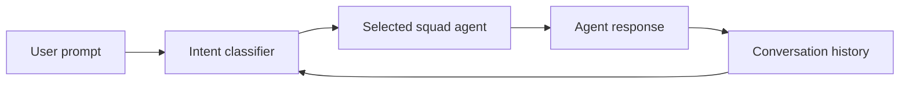
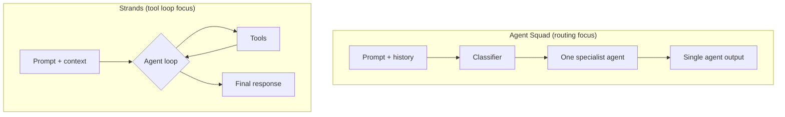

# Agent Squad

## What this lecture covers

This lecture introduces **AWS Agent Squad**—an Amazon-originated agentic SDK focused on **orchestration through routing**. It explains how Agent Squad **classifies intent**, picks one agent from a **squad**, runs that agent, and optionally **persists conversation history** for future routing. The lecture also contrasts Agent Squad with **Strands Agents** and **Amazon Bedrock Flows**, notes **Bedrock Agents** integration, and flags **exam-style “when to choose which”** guidance.

## Key definitions (from the lecture)

| Term | Definition |
|---|---|
| **AWS Agent Squad** | An Amazon-originated agentic AI **SDK** (not open source, per this lecture) for **orchestrating** a group of specialized agents—called out on the **exam guide** even though its long-term direction is uncertain. |
| **Intent classification / classifier** | The component that reads a user prompt (and optional history) and decides **which squad agent** is the best fit. |
| **Router** | Agent Squad’s primary role: **route one prompt to one agent**, then return **that agent’s output**—not a broad multi-step planner by default. |
| **Squad of agents** | A set of specialized agents (e.g., billing, loans, tech support); the classifier selects **exactly one** to handle a given request. |
| **Conversation history (in Agent Squad)** | Saved turns from prior agent interactions that feed back into the **classifier** on later inputs and can be **passed along** to the selected agent—giving a lightweight **memory** layer. |
| **Supervisor agent** | A newer Agent Squad capability that **coordinates multiple specialized agents** in more complex ways—bringing behavior **closer to Strands-style** multi-agent coordination. |
| **Pre-built agents and classifiers** | Ready-made Agent Squad components you can adopt instead of wiring every agent and routing rule from scratch. |

## Key distinctions / comparisons

| Item | Notes |
|---|---|
| **Agent Squad vs Strands Agents** | **Agent Squad** = **routing problem** (pick the right specialist, run it, return its answer). **Strands** = **tool use inside a single agent loop** (reason → act → observe repeatedly). Exam focus: **routing → Agent Squad**; **tool loop → Strands**. |
| **Agent Squad vs Amazon Bedrock Flows** | **Flows** excel at **discrete step chains**; on their own they may lack richer **conversation memory** and **multi-flow orchestration**. Agent Squad can **extend Flows** with those capabilities. |
| **Agent Squad vs doing routing in Strands or Flows** | The **same routing pattern** can be implemented with Strands or Flows—Agent Squad is **not the only path**, and the lecture questions whether it will remain the preferred one. |
| **Narrow router vs broad orchestrator** | Agent Squad’s default sweet spot is **one classification → one agent → one response**. A **supervisor agent** adds more complex multi-agent coordination but routing remains the core story. |
| **Python vs TypeScript** | Both languages are supported; **TypeScript is the primary API in official examples**—a reason to consider Agent Squad if your team is TypeScript-first. |

## The problem (why routing exists)

Customer and internal AI systems often expose **many specialists**—Bedrock Agents for billing, loans, or technical support—but users ask **one natural-language question** at a time. You need a layer that:

- **Understands intent** without making the user pick a menu.
- **Selects the best-fit agent** from a squad.
- **Preserves context** across turns so follow-up questions route correctly.
- **Integrates cleanly** with agents you already deployed in <a href="https://docs.aws.amazon.com/bedrock/latest/userguide/agents.html">Amazon Bedrock Agents</a>.

That is the **routing pattern** described in [Multi-Agent Workflows](../02-multi-agent-workflows/index.md)—Agent Squad is one AWS-aligned implementation.

## How Agent Squad works

At a high level, Agent Squad is a **classifier-driven router** with optional **history-aware** classification:

1. A **user prompt** arrives (plus optional **session/user identifiers**).
2. The **classifier** considers the prompt and **conversation history**.
3. Agent Squad **selects one agent** from the squad and **executes** it.
4. The agent’s **response** is returned to the caller.
5. The interaction can be **saved to conversation history**, which informs **future** classification and context passed to agents.



Compared with the **Strands agent loop** (select tool → execute → repeat until done), Agent Squad’s default path is **shorter**: classify once, delegate once, answer once—unless you adopt **supervisor-style** coordination for harder multi-agent cases.



## Capabilities highlighted in the lecture

| Area | What Agent Squad offers |
|---|---|
| **Intelligent intent classification** | Routes prompts to the **most suitable** squad member using context and content. |
| **Conversation memory** | Persists history for **future routing** and **cross-agent context** sharing. |
| **Pre-built agents & classifiers** | Accelerates setup with **ready-made** components. |
| **Bedrock Agents integration** | Reference an existing agent by **ID** and invoke it with **minimal code**. |
| **Bedrock Flows extension** | Adds **conversation memory** and **orchestration** atop Flows where native Flow features are insufficient. |
| **Supervisor agent** | Coordinates **multiple specialized agents** for more complex workflows—closer to Strands-style multi-agent behavior. |
| **Dual language SDK** | **Python** and **TypeScript**; TypeScript examples are **primary** in documentation samples. |

## Value proposition (per the lecture)

Agent Squad’s current value is less “replace every agent framework” and more **fill gaps around Bedrock building blocks**:

- **Bedrock Flows alone** may not give you everything for **persistent conversation memory** and **intelligent routing between flows**.
- **Bedrock Agents** you already built can be **wired in by ID** instead of re-implementing invoke logic.
- For a **pure routing** problem, Agent Squad is a **purpose-built** option—though Strands or Flows can implement the same idea.

## How to apply it

The lecture emphasizes **low ceremony** when calling existing Bedrock Agents. A TypeScript-style setup (matching the primary examples in Agent Squad docs) looks conceptually like this:

```typescript
import { AgentSquad, AmazonBedrockAgent } from "agent-squad";

const orchestrator = new AgentSquad();

orchestrator.addAgent(
  new AmazonBedrockAgent({
    name: "Loan Agent",
    description: "Handles loan and interest-rate inquiries",
    agentId: "your-agent-id",
    agentAliasId: "your-agent-alias-id",
  })
);

const response = await orchestrator.routeRequest(
  "What is the base rate for a 30-year loan?",
  "user123",
  "session456"
);
```

Key ideas from the sample:

- Register agents with a **name** and **description**—descriptions help the **classifier** route correctly (same pattern as router agents in [Multi-Agent Workflows](../02-multi-agent-workflows/index.md)).
- **`routeRequest`** takes the user message plus **user** and **session** identifiers so **history** can accumulate across turns.
- **`AmazonBedrockAgent`** wraps a deployed Bedrock agent—you supply **`agentId`** and **`agentAliasId`** from the Bedrock console or API.

## Examples

1. **Retail banking assistant** — Squad members: `BalanceAgent`, `LoanAgent`, `FraudAgent`. Classifier reads “What’s my APR on the home loan?” and routes to `LoanAgent` only; history keeps loan context if the user follows up with “And for 15 years?”
2. **Flow enhancement** — You already built three <a href="https://docs.aws.amazon.com/bedrock/latest/userguide/flows-how-it-works.html">Amazon Bedrock Flows</a> (intake, fulfillment, escalation). Agent Squad adds **cross-flow memory** and picks which flow runs next based on evolving conversation state.
3. **TypeScript microservice** — A Node.js API fronting multiple Bedrock Agents uses Agent Squad’s **TypeScript SDK** to classify and invoke agents without maintaining custom routing Lambdas per intent.

## Limitations / edge cases

- **Uncertain product trajectory** — As of the lecture recording, Agent Squad had **not been updated in roughly five months**; the instructor is unsure it will remain the preferred routing approach.
- **Not open source (lecture framing)** — Contrasts with **open-source Strands**; treat licensing and availability as an adoption factor if your org requires OSS.
- **Narrow default use case** — Core pattern is **one agent per request**; broad decomposition, parallel workers, or heavy tool loops fit **Strands**, **Flows**, or **supervisor** modes better.
- **Overlap with other AWS tools** — The **same routing behavior** can be built with Strands or Flows; Agent Squad is one option, not a requirement.
- **Exam scope** — Expect **when to choose Agent Squad vs Strands** (routing vs tool loop), plus awareness of **Bedrock integration** and **Flows extension**—not deep SDK trivia.

## Key takeaways

- **Agent Squad** is an Amazon-originated **orchestration/router** SDK: **classify intent → run one squad agent → return that output**.
- It adds **conversation history** that feeds **future classification** and **agent context**—a differentiator versus bare Flows routing.
- **Pre-built agents/classifiers**, **Bedrock Agent ID integration**, and **Flows extensions** reduce glue code for AWS-native squads.
- **TypeScript-first examples** make it attractive for Node/TS teams; Python is also supported.
- **Supervisor agent** moves toward **multi-agent coordination**, but the lecture still positions **Strands** as the tool-loop specialist.
- For the **exam**: **routing problem → Agent Squad**; **single-agent tool use loop → Strands**; know Agent Squad is on the **exam guide** even if its future is unclear.

## Industry scenarios

1. **Contact-center modernization** — A bank keeps specialist **Bedrock Agents** (cards, mortgages, fraud) and adds Agent Squad in a Lambda or container front door so IVR/chat utterances **auto-route** without rebuilding each agent’s invoke path; session history stops repeat authentication questions from misrouting follow-ups.
2. **Internal developer portal** — Platform engineering exposes squads for **CI/CD**, **cost**, and **security** Bedrock Agents behind one chat UI. Agent Squad’s classifier reads engineer prompts (“Why did my pipeline fail?” vs “Show my AWS spend”) and picks the right specialist with minimal custom routing code—especially when the portal is already **TypeScript**.
3. **Flows-first team hitting memory limits** — A team standardized on **Bedrock Flows** for regulated workflows adds Agent Squad to layer **persistent conversation memory** and **intelligent hand-offs between flows** without rewriting every flow definition—supervisor mode later for escalations that need multiple agents.

## References

- [Multi-Agent Workflows](../02-multi-agent-workflows/index.md)
- [Strands Agents](../04-strands-agents/index.md)
- [LLM Agents in Bedrock](../01-llm-agents-in-bedrock/index.md)
- <a href="https://docs.aws.amazon.com/prescriptive-guidance/latest/agentic-ai-patterns/workflow-for-routing.html">Workflow for routing (AWS Prescriptive Guidance)</a>
- <a href="https://docs.aws.amazon.com/prescriptive-guidance/latest/agentic-ai-patterns/routing-dynamic-dispatch-patterns.html">Routing dynamic dispatch patterns (AWS Prescriptive Guidance)</a>
- <a href="https://docs.aws.amazon.com/bedrock/latest/userguide/flows-how-it-works.html">How Amazon Bedrock Flows works</a>
- <a href="https://docs.aws.amazon.com/bedrock/latest/userguide/agents.html">Automate tasks using AI agents (Amazon Bedrock Agents)</a>
- <a href="https://docs.aws.amazon.com/bedrock/latest/userguide/agents-multi-agent-collaboration.html">Multi-agent collaboration in Amazon Bedrock Agents</a>
- <a href="https://docs.aws.amazon.com/prescriptive-guidance/latest/agentic-ai-frameworks/strands-agents.html">Strands Agents (AWS Prescriptive Guidance)</a>
- <a href="https://awslabs.github.io/agent-squad/">Agent Squad documentation</a>
- <a href="https://awslabs.github.io/agent-squad/agents/built-in/amazon-bedrock-agent">Agent Squad — Amazon Bedrock Agent integration</a>
