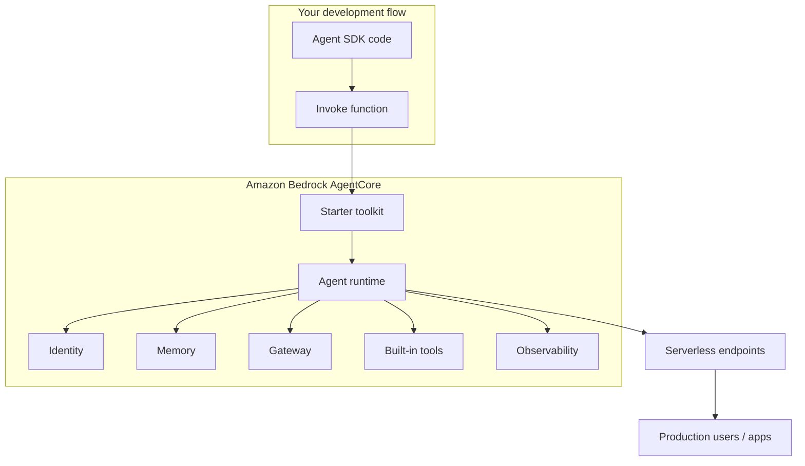
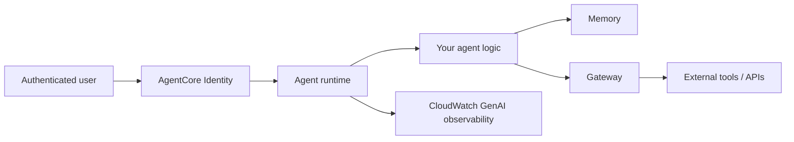
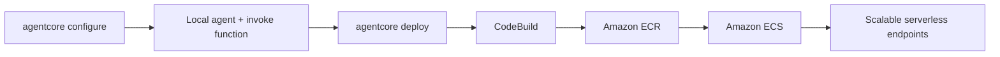

# Amazon AgentCore Introduction

## What this lecture covers

This lecture introduces <a href="https://docs.aws.amazon.com/bedrock-agentcore/latest/devguide/what-is-bedrock-agentcore.html">Amazon Bedrock AgentCore</a>—a newer Bedrock-related service for **deploying and operating AI agents at scale**. It explains why local agent prototypes (for example with [Strands Agents](../04-strands-agents/index.md)) are easy to write but hard to productionize, how AgentCore’s **serverless runtime** and **starter toolkit** simplify that path, which **capabilities** ship out of the box (identity, memory, gateways, tools, observability), and how the **agent runtime** works under the hood.

## Key definitions (from the lecture)

| Term | Definition |
|---|---|
| **Amazon Bedrock AgentCore** | A managed platform for **deploying and operating agentic AI systems at scale**—serverless by default, framework-agnostic, with integrated identity, memory, gateways, tools, and observability. |
| **Agent runtime** | Where AgentCore **hosts your agent** in production (lecture: on **ECS** under the hood), exposing **serverless endpoints** you invoke without managing containers yourself. |
| **Starter toolkit** | A guided CLI workflow (`agentcore configure`, `agentcore deploy`) that walks through deployment choices—region, authentication, packaging—and automates build and deploy steps. |
| **Invoke function** | The entry point you provide; AgentCore wraps **any agent framework** around this function and runs it in the managed runtime. |
| **AgentCore Identity** | Authentication and credential management for agent applications—integrate identity providers so not everyone on the internet can hit your agent endpoints. |
| **AgentCore Memory** | Managed **short- and long-term memory** you bolt onto an agent SDK—especially tight with Strands—without building your own distributed memory store. |
| **AgentCore Gateway** | A layer for **managing access between your agent and external tools**, including authentication at the tool boundary. |
| **Built-in tools** | Minimal but useful out-of-the-box capabilities (e.g., **code generation**, **code execution**); your agent SDK’s own tools remain another path. |
| **GenAI observability (CloudWatch)** | CloudWatch integration for tracking agent **usage and performance**—a specific feature to remember for the exam. |

## Key distinctions / comparisons

| Item | Notes |
|---|---|
| **Local prototype vs production deployment** | Writing an agent locally with an SDK is **minimal code**; shipping it at scale means **Docker, ECR, ECS**, auth, memory, monitoring—where many projects stall. AgentCore targets that **deployment gap**. |
| **AgentCore vs DIY container ops** | Starter toolkit path: you do **not** need to know Docker/ECR/ECS. **Lower-level path**: bring your own containers and ECS instances when you want **more control**. |
| **Framework-agnostic vs Strands-first** | AgentCore wraps **OpenAI Agents SDK**, **LangGraph**, **CrewAI**, **Strands**, or anything with an invoke entry point. **Strands** gets **tighter integration** (especially memory) and more examples—not a requirement. |
| **AgentCore vs Bedrock Agents** | You are **not required** to use <a href="https://docs.aws.amazon.com/bedrock/latest/userguide/agents.html">Amazon Bedrock Agents</a>; AgentCore is a **general-purpose runtime** for code-first agent frameworks. |
| **Managed memory vs local SQL** | A **local SQL instance** does not meet **distributed, robust long-term memory** needs in production; AgentCore Memory is **tailored for agentic workloads** (see [Short and Long-Term Agent Memory](../03-short-and-long-term-agent-memory/index.md)). |
| **Built-in tools vs SDK tools** | AgentCore’s bundled tools are **minimal**; if your SDK already exposes rich tools, that is usually the better primary path. |

## The problem (why you need it)

Teams can build impressive **toy or standalone** agent apps locally, but the **deployment step** is where projects often fail:

- Packaging and shipping agents means wrestling with **containers**, **ECR**, **ECS**, and related ops.
- Exposed agents without **authentication** can rack up **foundation model and tool usage bills** from uncontrolled traffic.
- **Memory**, **tool auth**, and **observability** need **distributed, production-grade** implementations—not ad hoc local stores and manual CloudWatch wiring.

AgentCore addresses the **“works on my laptop → works for real users at scale”** transition.

## The solution

AgentCore provides a **serverless environment** that deploys and operates your agent for you. You supply an **invoke function** and your chosen framework; AgentCore handles hosting, scaling endpoints, and much of the surrounding platform plumbing.



Compared with wiring **Docker → ECR → ECS → auth → memory → logs** yourself, the default AgentCore path is **configure, deploy, invoke**.

## AgentCore capabilities (lecture tour)

| Capability | Role |
|---|---|
| **Agent wrapping / runtime** | Hosts the agent you built in Strands, OpenAI SDK, CrewAI, LangGraph, etc. |
| **Identity** | Integrates with identity providers—for example <a href="https://docs.aws.amazon.com/bedrock-agentcore/latest/devguide/identity-idp-cognito.html">Amazon Cognito</a>—so callers must **authenticate** before using your AI system. |
| **Built-in tools** | Lightweight defaults such as **code generation** and **code execution**; SDK-defined tools remain valid. |
| **Memory** | **Short- and long-term** managed memory that integrates into agent SDKs—**especially Strands**—without you operating the storage tier. |
| **Gateway** | Controls **agent ↔ external tool** access and **authentication at that layer**. |
| **Observability** | Ties into **CloudWatch**, including **GenAI observability**, so usage and performance are visible without custom instrumentation for every metric. |



Memory is called out as **especially valuable**: storing interaction history at scale is a **real-world problem** AgentCore solves (covered earlier in [Short and Long-Term Agent Memory](../03-short-and-long-term-agent-memory/index.md); deeper AgentCore coverage in [AgentCore Memory and Tools](../07-agentcore-memory-and-tools/index.md)).

## Starter toolkit and deployment workflow

The **starter toolkit** is the fast path:

1. Run **`agentcore configure`** — interactive prompts for deployment region, authentication choices, and related settings.
2. Develop locally with your SDK (Strands is a **good default** when you already chose AgentCore).
3. Run **`agentcore deploy`** — AgentCore builds and ships the agent without you managing the pipeline details.

Under the hood the toolkit uses services such as **CodeBuild** and deploys images to **ECR**, but that complexity stays **hidden** on the default path. If you need **more control**, you can still **build your own Docker containers** and run on **your own ECS** configuration.



**Multiple endpoints** are supported so the deployment **scales** with demand. An **observability dashboard** tracks **usage and performance**, integrated with CloudWatch’s **GenAI observability** feature.

## How to apply it (optional)

Illustrative CLI flow from the lecture (exact flags evolve with the toolkit):

```bash
# Guided setup: region, auth, deployment options
agentcore configure

# Ship the agent; toolkit handles build/push/hosting
agentcore deploy
```

For a full walkthrough, see <a href="https://docs.aws.amazon.com/bedrock-agentcore/latest/devguide/agentcore-get-started-cli.html">Get started with Amazon Bedrock AgentCore</a> and <a href="https://docs.aws.amazon.com/bedrock-agentcore/latest/devguide/create-deploy-agent.html">Create and deploy your agent</a>.

## Examples

1. **Strands agent → production** — You prototype a multi-tool Strands agent locally, add **AgentCore Memory** for session continuity, run `agentcore configure` with **Cognito** auth, then `agentcore deploy` to get a secured, scalable endpoint without authoring a Dockerfile.
2. **LangGraph crew, AWS-hosted** — A team standardizes on LangGraph but runs on AWS; they wrap their graph’s invoke handler in AgentCore Runtime so **gateways** mediate CRM and internal API tools with consistent credentials.
3. **Framework swap, same runtime** — Platform engineering exposes one AgentCore deployment pattern; product teams supply different SDKs (CrewAI vs OpenAI Agents SDK) as long as each exposes a compatible **invoke function**—Strands teams still get the smoothest **memory** story.

## Limitations / edge cases

- **Strands is optional but favored** — Any framework works; **memory integration** and **examples** are richest for Strands today.
- **Built-in tools are minimal** — Expect **code gen / execution**-style helpers, not a full replacement for SDK or custom tool libraries.
- **Control vs convenience** — The starter toolkit **abstracts** Docker/ECR/ECS; advanced teams may prefer **self-managed containers and ECS** for custom networking or compliance.
- **Auth is not optional in production** — Without **Identity** (e.g., Cognito-backed access), public endpoints risk **runaway FM and tool costs**.
- **Not the only AWS agent product** — Bedrock Agents, Flows, and Agent Squad solve overlapping but distinct problems; AgentCore is the **deploy-any-framework runtime** story.

## Key takeaways

- **AgentCore** closes the gap between **local agent prototypes** and **production deployment at scale**—serverless endpoints without you operating Docker/ECR/ECS on the default path.
- It is **framework-agnostic**: provide an **invoke function**; OpenAI SDK, LangGraph, CrewAI, and Strands all qualify—**Strands** has the **tightest memory integration**.
- The **starter toolkit** (`configure`, `deploy`) automates choices for region, auth, and packaging; **CodeBuild** and **ECR** run behind the scenes.
- Core services to remember: **runtime**, **Identity**, **Memory**, **Gateway**, **built-in tools**, and **CloudWatch GenAI observability**.
- **Multiple scalable endpoints** and an **observability dashboard** support real-world traffic and ops.
- For the exam: know AgentCore as the answer when the question is **deploying/operating custom agent code at scale**, not only building agents in a SDK locally.

## Industry scenarios

1. **Fintech copilot launch** — A team builds a Strands-based trading assistant locally in days, but compliance requires **authenticated users**, **audit logs**, and **horizontal scale**. AgentCore deploys the same invoke handler with **Cognito Identity**, **CloudWatch GenAI observability**, and **auto-scaled endpoints**—avoiding a bespoke ECS pipeline before go-live.
2. **Enterprise integration hub** — An internal platform wraps LangGraph agents that call dozens of REST tools. **AgentCore Gateway** centralizes **tool authentication** and access policies so each agent team does not embed OAuth secrets in repo code; memory stores user-specific context across sessions.
3. **Startup MVP to paid tier** — A small team ships a CrewAI support bot as a demo, then hits traffic spikes after launch. They redeploy through AgentCore’s starter toolkit, turn on **Identity** to gate free vs paid users, and rely on **managed memory** instead of a single SQLite file—cutting surprise Bedrock bills from anonymous abuse.

## References

- [Strands Agents](../04-strands-agents/index.md)
- [Short and Long-Term Agent Memory](../03-short-and-long-term-agent-memory/index.md)
- [AgentCore Memory and Tools](../07-agentcore-memory-and-tools/index.md)
- [AgentCore Bedrock Import, Gateway, and Identity](../08-agentcore-bedrock-import-gateway-and-identity/index.md)
- <a href="https://docs.aws.amazon.com/bedrock-agentcore/latest/devguide/what-is-bedrock-agentcore.html">What is Amazon Bedrock AgentCore?</a>
- <a href="https://docs.aws.amazon.com/bedrock-agentcore/latest/devguide/agents-tools-runtime.html">Host agent or tools with Amazon Bedrock AgentCore Runtime</a>
- <a href="https://docs.aws.amazon.com/bedrock-agentcore/latest/devguide/agentcore-get-started-cli.html">Get started with Amazon Bedrock AgentCore</a>
- <a href="https://docs.aws.amazon.com/bedrock-agentcore/latest/devguide/create-deploy-agent.html">Create and deploy your agent</a>
- <a href="https://docs.aws.amazon.com/bedrock-agentcore/latest/devguide/identity-overview.html">Overview of Amazon Bedrock AgentCore Identity</a>
- <a href="https://docs.aws.amazon.com/bedrock-agentcore/latest/devguide/identity-idp-cognito.html">Amazon Cognito (AgentCore Identity)</a>
- <a href="https://docs.aws.amazon.com/bedrock-agentcore/latest/devguide/memory.html">Add memory to your Amazon Bedrock AgentCore agent</a>
- <a href="https://docs.aws.amazon.com/bedrock-agentcore/latest/devguide/gateway-create.html">Create an Amazon Bedrock AgentCore gateway</a>
- <a href="https://docs.aws.amazon.com/AmazonCloudWatch/latest/monitoring/AgentCore-Agents.html">Amazon Bedrock AgentCore (CloudWatch GenAI observability)</a>
- <a href="https://docs.aws.amazon.com/prescriptive-guidance/latest/agentic-ai-frameworks/amazon-bedrock-agentcore.html">Amazon Bedrock AgentCore (AWS Prescriptive Guidance)</a>
