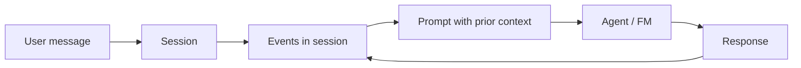
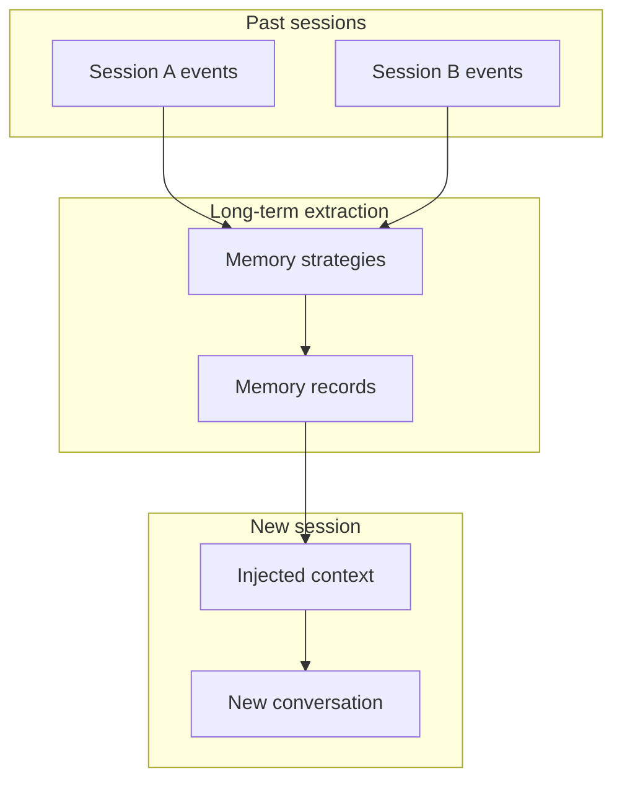
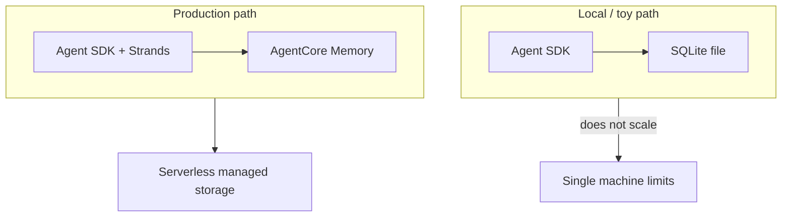
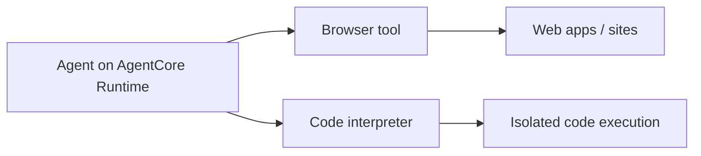

# AgentCore Memory and Tools

## What this lecture covers

This lecture goes deeper into <a href="https://docs.aws.amazon.com/bedrock-agentcore/latest/devguide/what-is-bedrock-agentcore.html">Amazon Bedrock AgentCore</a> beyond the runtime: how <a href="https://docs.aws.amazon.com/bedrock-agentcore/latest/devguide/memory.html">AgentCore Memory</a> provides managed **short- and long-term memory** (sessions, events, memory records, and built-in strategies), why that beats local stores like SQLite at production scale, and which **built-in tools** AgentCore ships today—a **browser tool** and a **code interpreter**—and when to use them versus your agent SDK’s own tools.

## Key definitions (from the lecture)

| Term | Definition |
|---|---|
| <a href="https://docs.aws.amazon.com/bedrock-agentcore/latest/devguide/memory.html">**AgentCore Memory**</a> | A managed, serverless memory service you bolt onto agent applications—especially with the <a href="https://docs.aws.amazon.com/bedrock-agentcore/latest/devguide/strands-sdk-memory.html">Strands SDK</a>—without building distributed storage yourself. |
| **Short-term memory** | The **immediate session context**: chat history and in-session events so the agent can resolve “do that again” or follow-up references within the **current conversation**. |
| **Session** | The object that embodies the conversation you are in; the short-term memory API is organized around **sessions** and **events** within them. |
| **Event** | A unit of activity within a session (for example a turn in the conversation); short-term memory is captured and retrieved via session-scoped events. |
| **Long-term memory** | **Persistent** knowledge across sessions—resuming past chats, **extracted insights**, **user preferences**, **session summaries**, and **explicit facts** the user asked to remember. |
| **Memory record** | A structured unit of long-term memory **derived from agent interactions**; the long-term API is organized around records with configurable **strategies**. |
| <a href="https://docs.aws.amazon.com/bedrock-agentcore/latest/devguide/long-term-configuring-built-in-strategies.html">**Memory strategies**</a> | Built-in extraction patterns for organizing memory records—lecture highlights **user preferences**, **semantic facts**, and **session summaries**. |
| <a href="https://docs.aws.amazon.com/bedrock-agentcore/latest/devguide/browser-tool.html">**AgentCore Browser tool**</a> | A built-in capability that lets an agent **take control of a browser** to interact with the web. |
| <a href="https://docs.aws.amazon.com/bedrock-agentcore/latest/devguide/code-interpreter-tool.html">**AgentCore Code Interpreter**</a> | A built-in tool that runs code in a **safe, isolated container**—lecture: **Python**, **JavaScript**, or **TypeScript**. |

## Key distinctions / comparisons

| Item | Notes |
|---|---|
| **Short-term vs long-term** | Short-term = **this session right now** (turn-by-turn context). Long-term = **across sessions** (preferences, summaries, facts, resumable history). See also [Short and Long-Term Agent Memory](../03-short-and-long-term-agent-memory/index.md). |
| **Verbatim history vs summaries** | Long-term memory can store **full past conversations** or **condensed summaries**—more efficient for **storage** and **token usage** when seeding new sessions. |
| **Inferred vs explicit long-term facts** | The system can **learn preferences** over time (coding style, favorite tools) **or** store facts when the user says **“remember this.”** |
| **AgentCore Memory vs local SQLite** | Frameworks like the OpenAI Agents SDK may offer a **SQLite** memory backend—fine for **toy apps**, but it **does not scale** for distributed, serverless production workloads. AgentCore Memory targets **scale**. |
| **AgentCore tools vs SDK tools** | Browser and code interpreter overlap with tools many SDKs already provide; **choose based on scale and ops**—AgentCore tools are aimed at **production-grade, managed** execution. |
| **AgentCore vs Bedrock Agents** | AgentCore Memory integrates with **your code-first agent** (Strands, LangGraph, etc.); it is not the same product as <a href="https://docs.aws.amazon.com/bedrock/latest/userguide/agents.html">Amazon Bedrock Agents</a>. |

## Short-term memory in AgentCore

Short-term memory is what makes **multi-turn conversation** work. When you say “do that thing again,” the agent needs the **chat history and immediate session context** to know what “that thing” refers to.

In AgentCore, the short-term API centers on:

- **Session objects** — represent the conversation you are in.
- **Events within the session** — capture what happened during that session.

This maps to AgentCore’s model of **turn-by-turn interactions within a single session**—recent history the agent can pull into the prompt without the user repeating themselves.



For organization details (session ID, actor ID), see <a href="https://docs.aws.amazon.com/bedrock-agentcore/latest/devguide/memory-organization.html">Memory organization in AgentCore Memory</a>.

## Long-term memory in AgentCore

Long-term memory goes beyond “reload my old chat.” It supports:

- **Resuming past sessions** — pick up where you left off.
- **Extracted insights** — higher-level summaries of what you were doing.
- **Session summaries** — store condensed versions instead of every verbatim turn (saves **storage** and **tokens** when reused).
- **Learned user preferences** — coding style, favorite tools, interests—applied in **future** conversations.
- **Explicit facts** — when the user says “remember this,” store it durably.

The long-term API is organized around **memory records**: structured information derived from interactions. Records are grouped by **memory strategies**—built-in options the lecture calls out include:

| Strategy (lecture) | Purpose |
|---|---|
| **User preferences** | Persistent profile of how the user likes to work or what they prefer. |
| **Semantic facts** | Factual information extracted from conversations. |
| **Session summaries** | Condensed recap of a session rather than full transcript replay. |

Building extraction, consolidation, and retrieval pipelines yourself is **painful**; AgentCore provides these capabilities **out of the box**, with **easy integration** when you use the **Strands SDK**.



## The problem (why managed memory matters)

If you build an agent system from scratch, you must solve:

- **Where** conversation state lives across scaled workers.
- **How** to extract and store preferences, facts, and summaries—not just raw chat logs.
- **How** to keep token budgets sane when bringing history into new prompts.

Other agent SDKs may ship a **local SQLite** memory implementation. That works for **small desktop experiments**, but:

- It **does not scale** across many users and concurrent sessions.
- It is **not serverless**—you operate the storage tier yourself.

<a href="https://docs.aws.amazon.com/bedrock-agentcore/latest/devguide/what-is-bedrock-agentcore.html">AgentCore</a> is aimed at **deploying agents into production at scale**, not toy problems on a laptop. **Memory at large scale** is part of that story.



## Built-in AgentCore tools

AgentCore also ships a small set of **built-in tools** (the lecture expects this list to **grow over time**). Today:

| Tool | What it does |
|---|---|
| <a href="https://docs.aws.amazon.com/bedrock-agentcore/latest/devguide/browser-tool.html">**Browser tool**</a> | Lets the agent **control a browser** to interact with websites and web applications. |
| <a href="https://docs.aws.amazon.com/bedrock-agentcore/latest/devguide/code-interpreter-tool.html">**Code interpreter**</a> | Runs code in a **safe, isolated container**—**Python**, **JavaScript**, or **TypeScript**. |

These capabilities often **overlap** with tools already bundled in agentic SDKs you might wrap AgentCore with. You decide whether to use **AgentCore’s managed tools** (scale, isolation, AWS ops) or the **framework’s built-in tools** (convenience during local dev).



See <a href="https://docs.aws.amazon.com/bedrock-agentcore/latest/devguide/harness-tools.html">Connect to tools</a> for how tools attach to agents in the broader AgentCore model.

## How to apply it (optional)

Illustrative flow aligned with the lecture and AWS getting-started docs:

1. **Create** an AgentCore Memory store (console, CLI, or SDK).
2. **Write events** to capture short-term session history.
3. **Configure strategies** (preferences, semantic facts, session summaries) for long-term extraction.
4. **Retrieve memory records** when starting or continuing conversations.
5. Optionally attach **Browser** or **Code Interpreter** tools instead of—or alongside—SDK-native tools.

```python
# Conceptual shape (Strands + AgentCore Memory — see AWS examples for exact APIs)
from strands import Agent
# AgentCore Memory integrates via Strands; events go to sessions, records to strategies

agent = Agent(
    tools=[...],  # AgentCore browser / code interpreter OR SDK tools
    memory=agentcore_memory_client,  # managed short + long term
)

# Each turn: session events capture short-term context
agent("Do that analysis again, but for Q3")

# Long-term: preferences and summaries surface in later sessions automatically
```

Hands-on walkthrough: <a href="https://docs.aws.amazon.com/bedrock-agentcore/latest/devguide/memory-get-started.html">Get started with AgentCore Memory</a>, <a href="https://docs.aws.amazon.com/bedrock-agentcore/latest/devguide/browser-quickstart.html">Get started with AgentCore Browser</a>, and <a href="https://docs.aws.amazon.com/bedrock-agentcore/latest/devguide/code-interpreter-getting-started.html">Get started with AgentCore Code Interpreter</a>.

## Examples

1. **Support bot with session continuity** — A Strands agent writes each turn to **session events** so “what about my refund?” resolves against the same ticket thread; **session summary** strategy condenses closed tickets for efficient reuse.
2. **Developer copilot preferences** — Over weeks, **user preference** strategy learns the engineer favors **TypeScript** and **pytest**; a new session opens with those defaults without re-prompting.
3. **Browser + interpreter for research agent** — An agent uses **Browser tool** to pull live pricing from a vendor site and **Code Interpreter** to normalize CSV exports—both running in AgentCore’s isolated environments rather than on the developer laptop.

## Limitations / edge cases

- **Strategy list may expand** — The lecture names three built-in strategies; AWS docs also document additional built-in options (for example **episodic**). Treat the lecture list as **exam-critical minimums**, not an exhaustive catalog.
- **Tool overlap with SDKs** — You may not need AgentCore Browser or Code Interpreter if your framework already covers those workflows locally; the trade-off is **managed scale vs dev simplicity**.
- **Not a substitute for knowledge bases** — Long-term **interaction memory** complements but does not replace document corpora and RAG-style knowledge stores (see [Short and Long-Term Agent Memory](../03-short-and-long-term-agent-memory/index.md)).
- **Strands has the smoothest memory path** — Other frameworks integrate (LangChain/LangGraph examples exist), but **Strands** is called out for **easiest AgentCore Memory** wiring.

## Key takeaways

- AgentCore is **more than runtime**—**Memory** and **built-in tools** address production gaps local prototypes skip.
- **Short-term memory** = **sessions + events** for the **current conversation**; **long-term memory** = **memory records** organized by **strategies** (preferences, semantic facts, session summaries).
- **Summaries and extracted insights** reduce **storage and token** cost versus replaying every past message verbatim.
- **SQLite-style local memory** from other SDKs is fine for toys; **AgentCore Memory** is **serverless and scalable** for real deployments.
- **Built-in tools** today: **browser** (web interaction) and **code interpreter** (Python/JS/TS in isolation)—choose AgentCore vs SDK tools based on **scale**.
- For the exam: expect AgentCore Memory and tools to **grow in importance** alongside the runtime story introduced in [Amazon AgentCore Introduction](../06-amazon-agentcore-introduction/index.md).

## Industry scenarios

1. **Global SaaS onboarding assistant** — A product team prototypes with in-memory history, then hits multi-region traffic. They migrate to **AgentCore Memory** so **session events** sync across scaled runtime workers and **preference records** personalize onboarding without a shared SQLite file on one container.
2. **Compliance-heavy financial research** — Analysts need agents that browse internal portals and run ad hoc calculations. **AgentCore Browser** and **Code Interpreter** run in **isolated, managed sandboxes** with audit-friendly ops—replacing brittle “run Playwright on a developer VM” setups.
3. **Healthcare scheduling bot** — Patients return months later; **session summary** and **semantic fact** strategies recall appointment constraints and explicit “remember my preferred clinic” facts—without stuffing entire old transcripts into every new prompt (lower **token** spend, faster responses).

## References

- [Short and Long-Term Agent Memory](../03-short-and-long-term-agent-memory/index.md)
- [Strands Agents](../04-strands-agents/index.md)
- [Amazon AgentCore Introduction](../06-amazon-agentcore-introduction/index.md)
- [AgentCore Bedrock Import, Gateway, and Identity](../08-agentcore-bedrock-import-gateway-and-identity/index.md)
- <a href="https://docs.aws.amazon.com/bedrock-agentcore/latest/devguide/what-is-bedrock-agentcore.html">What is Amazon Bedrock AgentCore?</a>
- <a href="https://docs.aws.amazon.com/bedrock-agentcore/latest/devguide/memory.html">Add memory to your Amazon Bedrock AgentCore agent</a>
- <a href="https://docs.aws.amazon.com/bedrock-agentcore/latest/devguide/memory-get-started.html">Get started with AgentCore Memory</a>
- <a href="https://docs.aws.amazon.com/bedrock-agentcore/latest/devguide/memory-organization.html">Memory organization in AgentCore Memory</a>
- <a href="https://docs.aws.amazon.com/bedrock-agentcore/latest/devguide/long-term-configuring-built-in-strategies.html">Configure built-in strategies</a>
- <a href="https://docs.aws.amazon.com/bedrock-agentcore/latest/devguide/strands-sdk-memory.html">Strands Agents SDK (AgentCore Memory)</a>
- <a href="https://docs.aws.amazon.com/bedrock-agentcore/latest/devguide/browser-tool.html">Interact with web applications using AgentCore Browser</a>
- <a href="https://docs.aws.amazon.com/bedrock-agentcore/latest/devguide/code-interpreter-tool.html">Execute code using AgentCore Code Interpreter</a>
- <a href="https://docs.aws.amazon.com/bedrock-agentcore/latest/devguide/harness-tools.html">Connect to tools (AgentCore)</a>
