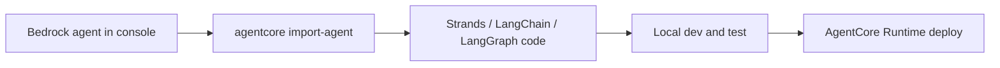
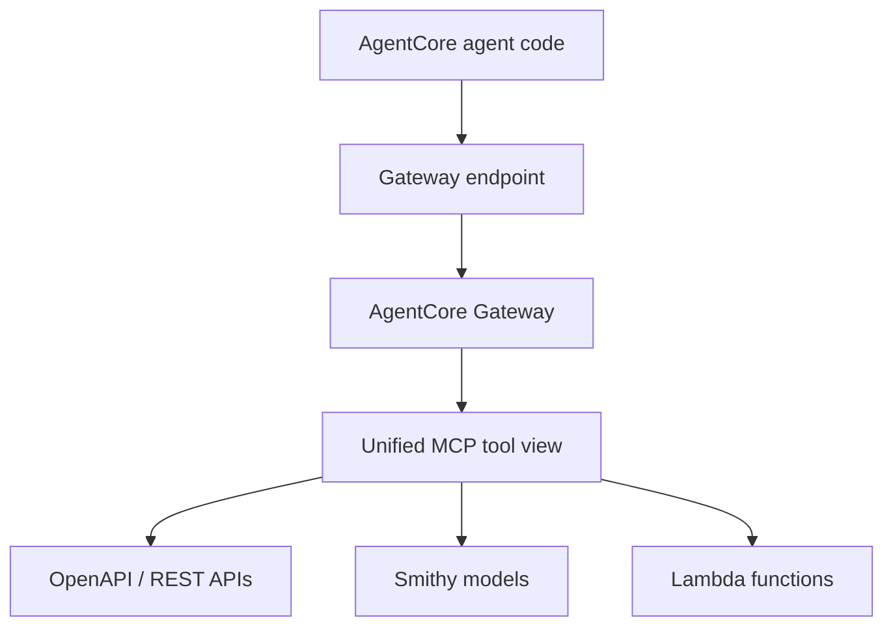
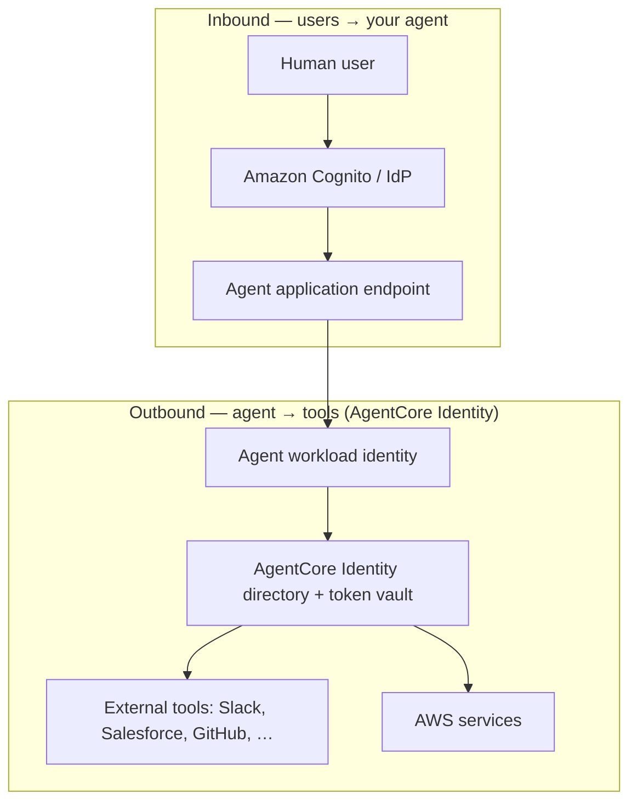

# AgentCore Bedrock Import, Gateway, and Identity

## What this lecture covers

This lecture introduces three more <a href="https://docs.aws.amazon.com/bedrock-agentcore/latest/devguide/what-is-bedrock-agentcore.html">Amazon Bedrock AgentCore</a> capabilities: **importing an existing <a href="https://docs.aws.amazon.com/bedrock/latest/userguide/agents.html">Amazon Bedrock Agents</a> agent into code-first AgentCore projects**, using <a href="https://docs.aws.amazon.com/bedrock-agentcore/latest/devguide/gateway.html">AgentCore Gateway</a> to connect external tools at scale, and understanding <a href="https://docs.aws.amazon.com/bedrock-agentcore/latest/devguide/identity.html">AgentCore Identity</a> as **workload identity for agents talking to tools**—distinct from end-user login to your agent application.

## Key definitions (from the lecture)

| Term | Definition |
|---|---|
| **Bedrock agent import** | A workflow that takes a Bedrock console agent and converts it into a **code-first project** (default: <a href="https://docs.aws.amazon.com/bedrock-agentcore/latest/devguide/using-any-agent-framework.html">Strands</a>; optionally LangChain/LangGraph) you can extend, test, and deploy through AgentCore. |
| <a href="https://docs.aws.amazon.com/bedrock-agentcore/latest/devguide/gateway.html">**AgentCore Gateway**</a> | A managed layer that **unifies external capabilities as MCP tools**, tracks **gateway endpoints** your AgentCore code references, and centralizes **authorization and credentials** for tool access. |
| **Gateway target** | A backend the gateway connects to—lecture highlights **OpenAPI** interfaces, **Smithy** models, and **Lambda functions**; AWS docs also cover MCP servers and integration templates. |
| **Gateway endpoint** | The access point in AgentCore through which your agent **discovers and invokes** tools exposed by the gateway. |
| <a href="https://docs.aws.amazon.com/bedrock-agentcore/latest/devguide/identity.html">**AgentCore Identity**</a> | **Agent/workload identity** for secure access to **external tools and AWS services**—a central directory and credential store for **agents**, not human users logging into your app. |
| **User authentication (inbound)** | How **people** authenticate to your GenAI application—lecture: typically **Amazon Cognito** plus AgentCore’s Cognito integration; **separate** from AgentCore Identity’s outbound/workload focus. |
| **Semantic tool selection** | Gateway capability beyond connectivity: helps the agent **choose the right tool** for the task (AWS: natural-language **semantic search** over tools). |

## Key distinctions / comparisons

| Item | Notes |
|---|---|
| **Bedrock Agents deployment vs import + AgentCore** | Bedrock Agents has **built-in mechanisms** to deploy agents at scale in Bedrock. Import makes sense when you want to **extend** an existing Bedrock agent with **more extensive custom logic** and ship the result through **AgentCore Runtime**. |
| **SDK/MCP tools vs AgentCore Gateway** | Most agent frameworks can call tools—including external ones via MCP—**locally or ad hoc**. Gateway adds **managed, scalable** tool connectivity with **central auth/credentials** and a **unified MCP surface**. |
| **User identity vs agent identity** | **User identity** = who is using your agent app (Cognito/OAuth login). **Agent identity** = the **application’s identity** when it connects to Slack, Salesforce, AWS APIs, etc. AgentCore Identity targets the **second** problem. |
| **AgentCore Identity vs Cognito User Pools** | Lecture analogy: Identity is **like a Cognito user pool**, but for **agents/workloads**, not people—central registry, policies, and credential storage for non-human callers. |
| **AgentCore vs Bedrock Agents (after import)** | Import produces **framework code** (Strands by default) that behaves like **any other AgentCore agent**—develop locally, test, deploy via the starter toolkit/CLI. See [Amazon AgentCore Introduction](../06-amazon-agentcore-introduction/index.md). |

## Importing Bedrock agents into AgentCore

### The problem (why import)

You may already have a **working Bedrock agent** in the console with knowledge bases, action groups, and prompts tuned for your use case. Bedrock can deploy that agent on its own—but if you need to **build on top of it**—custom orchestration, extra tools, memory patterns, or multi-agent composition—staying purely in the console agent builder can become limiting.

### The solution

AgentCore can **import** a specified Bedrock agent and emit a **codebase** in your chosen framework. From there the project follows the normal AgentCore loop: **develop → test → deploy**.



| Step (lecture) | What happens |
|---|---|
| Run **`agentcore import-agent`** | Points at the Bedrock agent you specify. |
| Code generation | Converts the agent into **Strands SDK** code by default; **LangChain** and **LangGraph** are optional outputs. |
| Output directory | Writes the generated project to the directory you choose. |
| Next steps | Extend the code, test it, and deploy—**same as any other AgentCore agent**. |

Illustrative CLI shape (exact flags: see <a href="https://docs.aws.amazon.com/bedrock-agentcore/latest/devguide/develop-agents.html">AgentCore CLI</a> and <a href="https://docs.aws.amazon.com/bedrock-agentcore/latest/devguide/agentcore-get-started-cli.html">Get started with AgentCore</a>):

```bash
# Lecture workflow — import an existing Bedrock agent into a code-first AgentCore project
agentcore import-agent \
  --agent-id <your-bedrock-agent-id> \
  --output-dir ./my-imported-agent \
  --framework Strands   # or LangChain / LangGraph
```

After import, use `agentcore dev` and `agentcore deploy` like a greenfield AgentCore project ([Strands Agents](../04-strands-agents/index.md)).

## AgentCore Gateway

### The problem (external tools at scale)

Agents need **external tools**—APIs, functions, SaaS systems. Your framework may already invoke tools (including via MCP), but wiring **many integrations**, **rotating credentials**, and **consistent auth** across environments does not scale when every agent team rolls its own connectors.

### The solution

<a href="https://docs.aws.amazon.com/bedrock-agentcore/latest/devguide/gateway-core-concepts.html">AgentCore Gateway</a> makes **everything look like an MCP tool internally**. External APIs, Lambda functions, and other services appear as **MCP-compatible tools** to your agent. The gateway **tracks gateway endpoints** your AgentCore application code references, and it **manages authorization and credentials centrally** in the cloud.



### Target types (lecture + AWS)

| Target (lecture) | Role |
|---|---|
| **OpenAPI interfaces** | REST APIs described by OpenAPI specs; gateway **translates MCP ↔ REST**. |
| **Smithy models** | AWS’s interface-definition language for services and SDKs; gateway generates MCP tools from Smithy definitions. |
| **Lambda functions** | Custom business logic exposed as invocable MCP tools. |

Gateway also supports **MCP servers**, **API Gateway REST APIs**, and **1-click integrations** (Salesforce, Slack, Jira, etc.) per AWS docs—see <a href="https://docs.aws.amazon.com/bedrock-agentcore/latest/devguide/gateway-supported-targets.html">Supported gateway targets</a>.

### Semantic tool selection

Gateway is not only **connectivity**. It offers **semantic tool selection**—when many tools are registered, the agent can **find and pick the right tool** for the job. AWS implements this as **natural-language semantic search** over the tool catalog: <a href="https://docs.aws.amazon.com/bedrock-agentcore/latest/devguide/gateway-using-mcp-semantic-search.html">Search for tools with a natural language query</a>.

### Auth and credentials (centralized)

- **Inbound**: control which clients/agents may call the gateway (OAuth/JWT, IAM SigV4, etc.)—see <a href="https://docs.aws.amazon.com/bedrock-agentcore/latest/devguide/gateway-using-auth.html">Authorize and authenticate to a gateway</a>.
- **Outbound**: gateway uses **credential providers** and execution roles to call targets securely—credentials stay **centralized**, not scattered in agent source code.

Hands-on: <a href="https://docs.aws.amazon.com/bedrock-agentcore/latest/devguide/gateway-quick-start.html">Get started with AgentCore Gateway</a> and <a href="https://docs.aws.amazon.com/bedrock-agentcore/latest/devguide/gateway-agent-integration.html">Create an agent that uses your gateway</a>.

## AgentCore Identity

### What Identity is *not*

**AgentCore Identity is not** the OAuth/login story for **users accessing your agent UI or API**. That is a **different problem**: how humans authenticate to your GenAI application—lecture expectation: **Amazon Cognito** with AgentCore’s Cognito integration for **inbound** access. See <a href="https://docs.aws.amazon.com/bedrock-agentcore/latest/devguide/identity-idp-cognito.html">Amazon Cognito with AgentCore</a> and <a href="https://docs.aws.amazon.com/bedrock-agentcore/latest/devguide/identity-getting-started-cognito.html">Build your first authenticated agent</a>.

### What Identity *is*

Identity addresses **the agent’s own ID** when connecting to **external services and tools**—and to **AWS services**. The lecture notes the trend of treating AI agents **like principals** (almost like people): each agent has an **identity**, credentials, and policies governing **outbound** access.



| Capability (lecture) | Detail |
|---|---|
| **Central agent identity repository** | Unified directory for **agent/workload identities**—analogous to a Cognito user pool, but **for agents**. |
| **Secure credential storage** | Store credentials for talking to external tools **safely in the cloud** (AWS: encrypted token vault). |
| **OAuth 2.0 support** | Built-in credential providers for **Google, GitHub, Slack, Salesforce, and Atlassian** (Jira). |
| **AWS + third-party access** | Secure access to **external tools** and **AWS services** under workload identity controls. |

For exam depth: know **inbound user auth (Cognito) vs outbound agent identity (Identity)**, the **Cognito user pool analogy**, and that **OAuth providers** are pre-integrated for common SaaS tools. Implementation depth is large—see <a href="https://docs.aws.amazon.com/bedrock-agentcore/latest/devguide/identity-overview.html">Overview of AgentCore Identity</a> and <a href="https://docs.aws.amazon.com/bedrock-agentcore/latest/devguide/key-features-and-benefits.html">Features of AgentCore Identity</a> when building production systems.

## How to apply it (optional)

Typical capability stack after this lecture:

1. **Import** (optional) — `agentcore import-agent` if migrating from Bedrock Agents.
2. **`agentcore add gateway`** — register OpenAPI/Lambda/Smithy targets; deploy gateway endpoints.
3. **Configure Identity** — create workload identities and OAuth/API-key **credential providers** for outbound tool access.
4. **Wire agent code** — reference gateway endpoints; let Identity broker tokens instead of embedding secrets.
5. **Protect inbound access** — Cognito (or another IdP) so only authenticated users invoke your runtime.

```python
# Conceptual pattern: agent uses Gateway MCP endpoint + Identity-managed credentials
# (See AWS gateway-agent-integration and Identity SDK examples for exact APIs.)

from strands import Agent

agent = Agent(
    tools=[gateway_mcp_client],  # tools discovered via Gateway MCP tools/list or semantic search
    # Outbound OAuth/API keys resolved through AgentCore Identity at runtime — not hard-coded
)

agent("Summarize my open Jira tickets and post a digest to Slack")
```

## Examples

1. **Extend a Bedrock HR agent** — Import a Bedrock agent that already answers policy questions; add Strands code for **custom escalation logic** and deploy via AgentCore with **Memory** from [AgentCore Memory and Tools](../07-agentcore-memory-and-tools/index.md).
2. **Gateway-backed IT ops agent** — Register **OpenAPI** (ticketing API), **Lambda** (runbook executor), and **Slack** (1-click target) on one gateway; agent picks tools via **semantic search** instead of a hard-coded tool list.
3. **Identity for SaaS automation** — Agent workload identity stores **Salesforce** and **GitHub** OAuth tokens in the **token vault**; users log in via **Cognito**, but the **agent principal** calls SaaS APIs with scoped, auditable credentials.

## Limitations / edge cases

- **Import is a starting point, not a full parity guarantee** — Generated Strands/LangGraph code reflects the Bedrock agent at import time; complex customizations may still require manual refactoring.
- **Gateway vs raw MCP in your SDK** — For a **single** external MCP server and a prototype, direct MCP from the framework may suffice; Gateway pays off with **many targets**, **enterprise auth**, and **semantic discovery**.
- **Identity depth vs exam scope** — Lecture: Identity is **complicated in production** (OAuth flows, token exchange, vault policies)—you likely need **conceptual** knowledge for the exam, not every RFC detail.
- **Do not conflate Identity with Cognito** — Cognito (or similar) for **users**; AgentCore Identity for **agent/workload outbound access**—both may appear in one architecture.

## Key takeaways

- **`agentcore import-agent`** converts an existing **Bedrock agent** into **Strands** (or LangChain/LangGraph) code so you can **extend and deploy** through AgentCore.
- **AgentCore Gateway** normalizes **OpenAPI, Smithy, Lambda**, and more as **MCP tools**, with **central credentials** and **semantic tool selection**.
- **AgentCore Identity** manages **agent/workload identity** and **secure outbound credentials**—not end-user login to your agent app.
- **User authentication** (typically **Cognito** + AgentCore integration) and **agent identity** (Identity service) solve **different sides** of a secure agent architecture.
- Built-in OAuth providers include **Google, GitHub, Slack, Salesforce, and Atlassian**—a high-value exam fact alongside Gateway and import.

## Industry scenarios

1. **Insurance claims assistant migration** — A team built a Bedrock Agents prototype with action groups; they **import** it to Strands, add **Gateway** connectors to legacy mainframe APIs (OpenAPI), and use **Identity** so the agent—not developers—holds scoped credentials for each backend.
2. **Enterprise developer platform** — Platform engineering exposes **one Gateway endpoint** per environment; hundreds of internal agents reuse the same **MCP tool catalog** with **semantic search** instead of maintaining duplicate integrations per squad.
3. **Regulated financial workflow bot** — **Cognito** gates which employees can invoke the agent (**inbound**); **AgentCore Identity** ensures the agent’s **Salesforce** and **document-store** access uses **vaulted OAuth tokens** with audit trails (**outbound**)—satisfying separation between human login and machine-to-service auth.

## Internal References

- [Amazon AgentCore Introduction](../06-amazon-agentcore-introduction/index.md)
- [AgentCore Memory and Tools](../07-agentcore-memory-and-tools/index.md)
- [Strands Agents](../04-strands-agents/index.md)
- [LLM Agents in Bedrock](../01-llm-agents-in-bedrock/index.md)
- [Model Context Protocol (MCP)](../11-model-context-protocol-mcp/index.md)

## External References

- <a href="https://docs.aws.amazon.com/bedrock-agentcore/latest/devguide/what-is-bedrock-agentcore.html">What is Amazon Bedrock AgentCore?</a>
- <a href="https://docs.aws.amazon.com/bedrock/latest/userguide/agents.html">Amazon Bedrock Agents</a>
- <a href="https://docs.aws.amazon.com/bedrock-agentcore/latest/devguide/develop-agents.html">AgentCore CLI and development interfaces</a>
- <a href="https://docs.aws.amazon.com/bedrock-agentcore/latest/devguide/agentcore-get-started-cli.html">Get started with AgentCore CLI</a>
- <a href="https://docs.aws.amazon.com/bedrock-agentcore/latest/devguide/using-any-agent-framework.html">Use any agent framework with AgentCore</a>
- <a href="https://docs.aws.amazon.com/bedrock-agentcore/latest/devguide/create-deploy-agent.html">Create and deploy your agent</a>
- <a href="https://docs.aws.amazon.com/bedrock-agentcore/latest/devguide/gateway.html">AgentCore Gateway</a>
- <a href="https://docs.aws.amazon.com/bedrock-agentcore/latest/devguide/gateway-core-concepts.html">Gateway core concepts</a>
- <a href="https://docs.aws.amazon.com/bedrock-agentcore/latest/devguide/gateway-using-mcp-semantic-search.html">Gateway semantic tool search</a>
- <a href="https://docs.aws.amazon.com/bedrock-agentcore/latest/devguide/gateway-quick-start.html">Get started with AgentCore Gateway</a>
- <a href="https://docs.aws.amazon.com/bedrock-agentcore/latest/devguide/identity.html">AgentCore Identity</a>
- <a href="https://docs.aws.amazon.com/bedrock-agentcore/latest/devguide/identity-overview.html">Overview of AgentCore Identity</a>
- <a href="https://docs.aws.amazon.com/bedrock-agentcore/latest/devguide/key-features-and-benefits.html">Features of AgentCore Identity</a>
- <a href="https://docs.aws.amazon.com/bedrock-agentcore/latest/devguide/identity-idp-cognito.html">Amazon Cognito with AgentCore</a>
