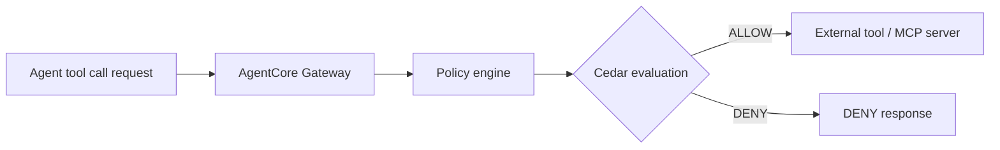
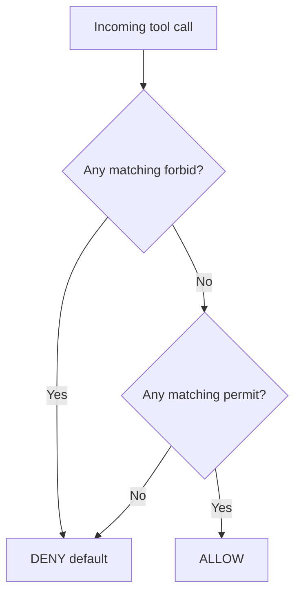

# AgentCore Policies

## What this lecture covers

This lecture introduces <a href="https://docs.aws.amazon.com/bedrock-agentcore/latest/devguide/policy.html">Policy in Amazon Bedrock AgentCore</a>—a gateway-integrated control plane that intercepts agent **tool calls** and enforces **fine-grained rules** on what agents may do, under which conditions, before external APIs or MCP servers are invoked. You will see how policies relate to <a href="https://docs.aws.amazon.com/bedrock-agentcore/latest/devguide/gateway.html">AgentCore Gateway</a>, how <a href="https://docs.aws.amazon.com/bedrock-agentcore/latest/devguide/policy-understanding-cedar.html">Cedar</a> expresses those rules, and how to author and test them from the **console** or **code**.

## Key definitions (from the lecture)

| Term | Definition |
|---|---|
| <a href="https://docs.aws.amazon.com/bedrock-agentcore/latest/devguide/policy.html">**Policy in AgentCore**</a> | A recent AgentCore capability that gives **tighter control** over what agents are allowed to do—and in **what situations**—before tool calls reach external systems. |
| <a href="https://docs.aws.amazon.com/bedrock-agentcore/latest/devguide/policy-create-engine.html">**Policy engine**</a> | A collection of Cedar policies that **evaluates and authorizes** agent tool calls; you create an engine, define policies in it, then **associate it with one or more gateways**. |
| <a href="https://docs.aws.amazon.com/bedrock-agentcore/latest/devguide/policy-understanding-cedar.html">**Cedar**</a> | Open-source policy language used to define **who can do what, under what conditions**; AgentCore stores and evaluates Cedar policies at the gateway boundary. |
| **Principal / action / resource** | Cedar **scope** components: **who** is calling (principal), **what tool operation** is requested (action), and **which gateway** is targeted (resource). See <a href="https://docs.aws.amazon.com/bedrock-agentcore/latest/devguide/policy-scope.html">Policy scope</a>. |
| **Contextual validation** | The policy engine validates the **full request context**—including tool input arguments and identity claims—before applying Cedar rules. |
| <a href="https://docs.aws.amazon.com/bedrock-agentcore/latest/devguide/policy-enforcement-modes.html">**Enforcement mode**</a> | How the gateway applies decisions: **`LOG_ONLY`** (evaluate and log without blocking) or **`ENFORCE`** (actively allow or deny operations). |

## Key distinctions / comparisons

| Item | Notes |
|---|---|
| **Policy vs agent code** | Policies are enforced **outside the agent’s code** at the gateway—more reliable than embedding checks the agent could bypass or omit. |
| **Policy vs Gateway alone** | Gateway connects agents to tools and manages credentials; **Policy** adds a **deterministic authorization layer** on every tool invocation. |
| **Gateway required** | Policies are **integrated with AgentCore gateways**—you must use gateways to use Policy in AgentCore. |
| **`forbid` vs `permit`** | Best practice: **default deny** with explicit **`permit`** rules; use **`forbid`** to block specific cases even when a broad permit exists. Cedar uses **forbid-overrides-permit** evaluation. |
| **Console vs code** | Console is the simplest path for a tour; AWS also documents a full **code-based** walkthrough via CLI, Boto3, and the AgentCore starter toolkit. See <a href="https://docs.aws.amazon.com/bedrock-agentcore/latest/devguide/policy-getting-started.html">Getting started with Policy in AgentCore</a>. |
| **`LOG_ONLY` vs `ENFORCE`** | Like a web application firewall in **count/monitor** mode vs **block** mode—test policies in log-only before turning on enforcement. |

## The problem (why you need Policy)

- <a href="https://docs.aws.amazon.com/bedrock-agentcore/latest/devguide/gateway.html">AgentCore Gateway</a> lets agents talk to **external services** and perform **tool calls** with real credentials—powerful, but you must **trust** what the agent will do with that access.
- Without a boundary, an agent might **misinterpret business rules**, call the wrong tool, or act **outside its intended authority** (for example, processing a high-value refund automatically).
- Embedding authorization in agent logic is fragile: different teams, frameworks, and prompt changes can **drift** or **skip** checks.

## How Policy works

When an agent requests a tool action, the call flows through the gateway. If a **policy engine** is attached, every request is **intercepted and evaluated** against Cedar policies **before** the gateway invokes external tools or MCP backends.



| Step | What happens |
|---|---|
| Agent invokes a tool | Request enters the **gateway** (not direct ad-hoc calls to backends). |
| Policy intercept | The attached **policy engine** evaluates the request against stored Cedar policies. |
| Decision | **`ENFORCE`**: block or allow the operation. **`LOG_ONLY`**: log what *would* happen without blocking. |
| Tool execution | Only **allowed** requests proceed to **external APIs / MCP servers**. |

Because enforcement sits **outside agent code**, security teams get a consistent gate even when agent implementations change.

## Cedar policies and default deny

Policies are written in **Cedar**—but you do **not** have to master Cedar syntax to start. The console supports **natural-language** generation and a **form-based** editor that emits Cedar for you.

### Refund threshold example (lecture)

A **refund agent** calling `process_refund` should run **only when the refund amount is under $200**—high-ticket refunds route to a human instead of autonomous processing:

```cedar
permit(
  principal,
  action == AgentCore::Action::"RefundTool___process_refund",
  resource == AgentCore::Gateway::"<gateway-arn>"
)
when {
  context.input.amount < 200
};
```

(AWS getting-started examples use similar patterns with different thresholds; adjust amounts to your business rules.)

### Default deny and evaluation model

AgentCore follows Cedar’s **default deny** posture aligned with least privilege:



| Rule | Behavior |
|---|---|
| **Default deny** | If **no policy matches**, the request is **denied**. |
| **Explicit permit** | At least one matching **`permit`** is required to allow access (and no matching **`forbid`**). |
| **Forbid wins** | Any matching **`forbid`** **denies** the call even if a permit also matches. |
| **`unless` on forbid** | Defines when a forbid rule **does not apply**—it does **not** grant permission by itself. |

## Contextual validation

The policy engine performs **contextual validation** as part of evaluation:

- Validates the **whole authorization context** before deciding.
- Checks **tool input parameters** against what the policy expects (for example, `context.input.amount`).
- Validates **identity-related claims** available to the policy (OAuth JWT **sub** and tags when the gateway uses OAuth authorization; IAM ARN when using IAM authorization). See <a href="https://docs.aws.amazon.com/bedrock-agentcore/latest/devguide/policy-scope.html">Policy scope</a> for **`AgentCore::OAuthUser`** vs **`AgentCore::IamEntity`** principals.

## Enforcement modes

Like a **WAF** in monitor vs block mode, Policy supports two gateway enforcement settings:

| Mode | Behavior |
|---|---|
| **`LOG_ONLY`** | Evaluates policies and **logs** allow/deny decisions **without blocking**—use to **test and validate** rules safely. |
| **`ENFORCE`** | **Actively allows or denies** agent operations based on policy decisions. |

**Best practice:** run new policies in **`LOG_ONLY`** first so you do not accidentally deny legitimate traffic, then switch to **`ENFORCE`** once behavior looks correct. Observability metrics and spans for policy decisions are published to CloudWatch—see <a href="https://docs.aws.amazon.com/bedrock-agentcore/latest/devguide/observability-policy-metrics.html">Policy observability data</a>.

## Policy authoring options

You can define policies three ways (lecture + AWS docs):

| Method | When to use |
|---|---|
| **Natural language → Cedar** | Describe intent in plain English; the service generates a **first-cut Cedar policy**. Requires a deployed gateway and policy engine with schema context. See <a href="https://docs.aws.amazon.com/bedrock-agentcore/latest/devguide/policy-natural-language.html">Writing policies in natural language</a>. |
| **Form-based editor** | More precise control over **effect** (`permit` / `forbid`), **principal scope**, **resource scope**, **actions**, and **conditions** (for example, `input.amount < 200`). |
| **Direct Cedar** | Full control; console validates syntax. Start from **sample policies** in the UI. See <a href="https://docs.aws.amazon.com/bedrock-agentcore/latest/devguide/policy-create-policies.html">Create a policy</a>. |

### Console example: deny claims missing a description

Sample **forbid-unless** pattern from the lecture—block filing an insurance claim **unless** the input includes a **description**:

```cedar
forbid(
  principal is AgentCore::OAuthUser,
  action == AgentCore::Action::"InsuranceAPI___file_claim",
  resource == AgentCore::Gateway::"<gateway-arn>"
)
unless {
  context.input has description
};
```

Read **`forbid … unless`** carefully: you are denying **by default** for that scope except when the **`unless`** condition holds.

### Console example: role-based permit (natural language)

Plain-English intent from the lecture:

> Allow users with the role **insurance agent** to **update coverage** when coverage type is **liability** or **collision** and the policy is **active** (Okta-backed roles in the demo).

Natural-language generation needs a **concrete gateway** with defined **principals, actions, and resources**—without those, generation may fail because the schema context is incomplete (as shown in the live demo).

## Console workflow

Typical setup path from the lecture:

1. **Create a policy engine** — name, optional description, optional **KMS encryption** for stored policies.
2. **Associate the engine with a gateway** — all gateways or a **specific gateway** (policies are gateway-scoped).
3. **Define policies** — pick samples, use natural language, or use the form editor; Cedar output is **validated** in the UI.
4. **Choose enforcement mode** — start with **`LOG_ONLY`**, observe decisions, then **`ENFORCE`**.
5. **Observe behavior** — review allow/deny outcomes via gateway/policy observability.

!!! warning "Cross-Region inference"
    Policy authoring (natural-language generation) may use <a href="https://docs.aws.amazon.com/bedrock-agentcore/latest/devguide/cross-region-inference.html">cross-region inference</a> within your geography—the console warns that **prompts and results may be processed outside your home region** (data at rest stays in the origin region). Confirm this meets **regulatory and residency** requirements before use.

## Code-based setup (alternative to console)

You can implement the same architecture entirely in code:

- **Boto3** (`bedrock-agentcore-control`) or **AWS CLI** to create policy engines, policies, and gateway associations—see <a href="https://docs.aws.amazon.com/bedrock-agentcore/latest/devguide/policy-create-engine.html">Create a policy engine</a> and <a href="https://docs.aws.amazon.com/bedrock-agentcore/latest/devguide/create-gateway-with-policy.html">Create gateway with Policy Engine</a>.
- **AgentCore CLI** guided tutorial: create a project, add a gateway + Lambda target + policy engine, deploy, and test refund rules—see <a href="https://docs.aws.amazon.com/bedrock-agentcore/latest/devguide/policy-getting-started.html">Getting started with Policy in AgentCore</a>.

Illustrative CLI shape from AWS docs:

```bash
# Create project, gateway, target, and policy engine (tutorial flow)
agentcore create --name PolicyDemo --defaults
cd PolicyDemo

agentcore add gateway --name PolicyGateway --authorizer-type NONE --runtimes PolicyDemo

agentcore add policy-engine --name RefundPolicyEngine \
  --attach-to-gateways PolicyGateway \
  --mode ENFORCE
```

IAM permissions for gateway execution roles and policy APIs are documented in <a href="https://docs.aws.amazon.com/bedrock-agentcore/latest/devguide/policy-permissions.html">AgentCore Gateway and Policy IAM Permissions</a>.

## Examples

1. **Autonomous refund cap** — Permit `process_refund` only when `context.input.amount < 200`; larger refunds are denied at the gateway so a human workflow must handle them.
2. **Insurance claim quality gate** — Forbid `file_claim` unless `context.input` includes a **description**, preventing empty or incomplete automated filings.
3. **Role-scoped coverage updates** — Permit updates only for principals with an **insurance agent** role/tag and only when coverage type is **liability** or **collision** and status is **active**.

## Limitations / edge cases

- **Gateways are mandatory** — Policy does not apply to tool calls that bypass AgentCore Gateway.
- **Natural language needs schema context** — NL→Cedar generation requires a **deployed gateway and policy engine** with known principals/actions/resources; vague prompts without a selected gateway may fail.
- **Start in `LOG_ONLY`** — Turning on **`ENFORCE`** without testing can block legitimate agent traffic.
- **Cross-region inference** — Policy authoring may process prompts/results outside your primary region (within geography, or globally for some origins); evaluate against compliance needs.
- **Cedar specificity** — No wildcard actions; reference tools explicitly or group them with **gateway targets**. See <a href="https://docs.aws.amazon.com/bedrock-agentcore/latest/devguide/policy-scope.html">Policy scope</a>.
- **Prefer forbid + default deny** — The form allows **`permit`-only** policies, but the lecture stresses **least privilege** and **default deny** as security best practice.

## Key takeaways

- **Policy in AgentCore** addresses the **trust gap** when agents use Gateway to call external tools with real credentials.
- Policies are enforced at the **gateway boundary**, **outside agent code**, on **every tool call**.
- Rules are expressed in **Cedar**, with **natural language** and **form** helpers so you do not need to be a Cedar expert to start.
- Evaluation is **deny by default**; **`forbid` overrides `permit`**; use **`LOG_ONLY`** to test before **`ENFORCE`**.
- **Contextual validation** covers tool inputs and identity claims relevant to the gateway’s auth mode.
- Associate a **policy engine** with one or more **gateways**; optional **KMS encryption** protects stored policy definitions.
- AWS documents both **console** and **code/CLI** paths—the getting-started tutorial mirrors the lecture’s refund-threshold scenario.

## Industry scenarios

1. **Retail customer-service bot** — A returns agent uses Gateway to call the OMS refund API. Policy permits autonomous refunds under **$200** but denies larger amounts, forcing escalation to a human agent—preventing costly model mistakes during peak season.
2. **Insurance FNOL automation** — An agent files first-notice-of-loss claims via Gateway. A **forbid-unless-description** policy blocks incomplete submissions while still allowing straight-through processing for well-formed claims—reducing bad data in core systems.
3. **Enterprise platform guardrails** — Platform engineering attaches one **policy engine** to shared dev/stage/prod gateways: **`LOG_ONLY`** in non-prod validates new Cedar rules against real agent traffic, then **`ENFORCE`** in prod gives security a **single, auditable** control plane (CloudWatch metrics/spans) independent of each squad’s agent framework.

## Internal References

- [AgentCore Bedrock Import, Gateway, and Identity](../08-agentcore-bedrock-import-gateway-and-identity/index.md)
- [Amazon AgentCore Introduction](../06-amazon-agentcore-introduction/index.md)
- [AgentCore Memory and Tools](../07-agentcore-memory-and-tools/index.md)
- [Model Context Protocol (MCP)](../11-model-context-protocol-mcp/index.md)
- [Strands Agents](../04-strands-agents/index.md)

## External References

- <a href="https://docs.aws.amazon.com/bedrock-agentcore/latest/devguide/policy.html">Policy in Amazon Bedrock AgentCore: Control Agent-to-Tool Interactions</a>
- <a href="https://docs.aws.amazon.com/bedrock-agentcore/latest/devguide/policy-getting-started.html">Getting started with Policy in AgentCore</a>
- <a href="https://docs.aws.amazon.com/bedrock-agentcore/latest/devguide/policy-understanding-cedar.html">Understanding Cedar policies</a>
- <a href="https://docs.aws.amazon.com/bedrock-agentcore/latest/devguide/policy-scope.html">Policy scope</a>
- <a href="https://docs.aws.amazon.com/bedrock-agentcore/latest/devguide/policy-create-engine.html">Create a policy engine</a>
- <a href="https://docs.aws.amazon.com/bedrock-agentcore/latest/devguide/policy-create-policies.html">Create a policy</a>
- <a href="https://docs.aws.amazon.com/bedrock-agentcore/latest/devguide/policy-natural-language.html">Writing policies in natural language</a>
- <a href="https://docs.aws.amazon.com/bedrock-agentcore/latest/devguide/policy-enforcement-modes.html">Policy enforcement modes</a>
- <a href="https://docs.aws.amazon.com/bedrock-agentcore/latest/devguide/policy-generation-validation.html">Policy generation: per-policy validation</a>
- <a href="https://docs.aws.amazon.com/bedrock-agentcore/latest/devguide/use-gateway-with-policy.html">Use an AgentCore Gateway with Policy in AgentCore</a>
- <a href="https://docs.aws.amazon.com/bedrock-agentcore/latest/devguide/create-gateway-with-policy.html">Create gateway with Policy Engine</a>
- <a href="https://docs.aws.amazon.com/bedrock-agentcore/latest/devguide/policy-permissions.html">AgentCore Gateway and Policy IAM Permissions</a>
- <a href="https://docs.aws.amazon.com/bedrock-agentcore/latest/devguide/observability-policy-metrics.html">Policy observability data</a>
- <a href="https://docs.aws.amazon.com/bedrock-agentcore/latest/devguide/cross-region-inference.html">Cross-region inference (Memory, Policy, Evaluations)</a>
- <a href="https://docs.aws.amazon.com/bedrock-agentcore/latest/devguide/gateway.html">AgentCore Gateway</a>
- <a href="https://docs.aws.amazon.com/bedrock-agentcore/latest/devguide/what-is-bedrock-agentcore.html">What is Amazon Bedrock AgentCore?</a>
- <a href="https://www.cedarpolicy.com/en">Cedar policy language (open source)</a>
