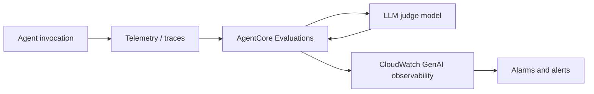
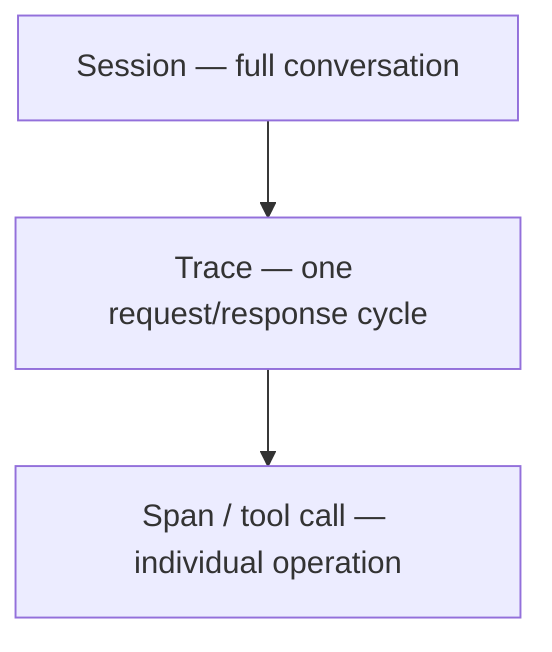
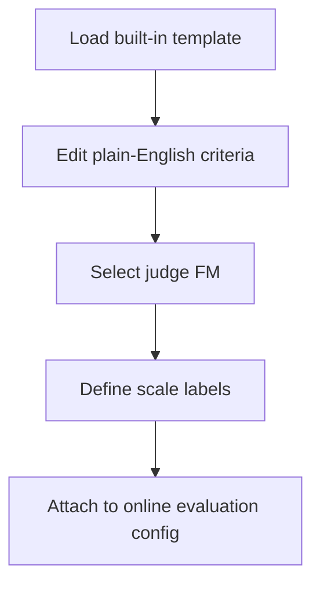

# AgentCore Evaluators

## What this lecture covers

This lecture introduces <a href="https://docs.aws.amazon.com/bedrock-agentcore/latest/devguide/evaluations.html">AgentCore Evaluations</a>—another pillar of **trust** for production agents. You will see how automated assessments measure task quality, edge-case handling, and consistency; how results land in <a href="https://docs.aws.amazon.com/bedrock-agentcore/latest/devguide/observability.html">AgentCore Observability</a> on <a href="https://docs.aws.amazon.com/AmazonCloudWatch/latest/monitoring/CloudWatch-GenAI-Observability.html">CloudWatch GenAI observability</a>; how **built-in** and **custom** evaluators work; and how to control **cost**, **sampling**, and **data-residency** implications of **cross-region inference**.

## Key definitions (from the lecture)

| Term | Definition |
|---|---|
| <a href="https://docs.aws.amazon.com/bedrock-agentcore/latest/devguide/evaluations.html">**AgentCore Evaluations**</a> | Automated tools that assess how well an agent performs tasks, handles edge cases, and maintains consistency—supporting adoption by building measurable trust. |
| **LLM-as-a-Judge** | Each evaluation uses **another foundation model** to score the agent’s output; every metric consumes additional tokens. |
| <a href="https://docs.aws.amazon.com/bedrock-agentcore/latest/devguide/built-in-evaluators-overview.html">**Built-in evaluators**</a> | Pre-configured prompt templates (for example `Builtin.Helpfulness`) with optimized judge models; you can **extend** the idea but not modify the built-in templates themselves. |
| <a href="https://docs.aws.amazon.com/bedrock-agentcore/latest/devguide/custom-evaluators.html">**Custom evaluators**</a> | Evaluators you define with your own judge model, prompt, and **scale** mappings—often starting from a built-in template. |
| <a href="https://docs.aws.amazon.com/bedrock-agentcore/latest/devguide/create-online-evaluations.html">**Online evaluation configuration**</a> | A continuous monitoring setup that applies selected evaluators to live agent traffic (or log data) with optional filters and sampling. |
| **Evaluation level** | Where scoring runs: **session** (whole conversation), **trace** (one request–response cycle), or **span / tool call** (individual tool invocation). |
| <a href="https://docs.aws.amazon.com/bedrock-agentcore/latest/devguide/evaluations-cross-region-inference.html">**Cross-region inference (evaluations)**</a> | Built-in evaluations automatically route judge-model work to an optimal region; data may be **transmitted and processed** outside the request’s home region (encrypted in transit). **Cannot be disabled** for evaluations. |

## Key distinctions / comparisons

| Item | Notes |
|---|---|
| **Built-in vs custom evaluators** | Built-ins are ready-made prompt templates and judge models; customs let you pick the **judge FM**, write plain-English criteria, and define **scale labels** (binary or ranged). |
| **Judge model vs agent model** | Best practice: use a **different** model as judge than the one running the agent— a “second opinion” on quality. |
| **Agent endpoint vs CloudWatch log group** | Usually you evaluate an **AgentCore agent endpoint**; you can also point evaluations at **CloudWatch log groups** from **non–AgentCore** agents. |
| **Session vs trace vs span** | **Session** = full conversation context; **trace** = one invocation cycle; **span / tool call** = granular operation (ideal for tool-selection metrics). See <a href="https://docs.aws.amazon.com/bedrock-agentcore/latest/devguide/observability-telemetry.html">Sessions, traces, and spans</a>. |
| **100% vs sampled evaluation** | Evaluations are **token-expensive**; use **filters** and **sampling** (0.01%–100%) instead of scoring every call. |
| **Observability vs evaluations** | Observability captures telemetry (latency, traces, logs); **evaluations** add **quality scores** (faithfulness, harmfulness, etc.) into the same CloudWatch GenAI observability views—with **alarms** on thresholds. |

## The problem (why you need evaluations)

- AI agents must be **trustworthy** before organizations adopt them at scale—you need evidence they do the **right thing**, not just that they respond quickly.
- Manual spot-checking does not scale across sessions, tool calls, and edge cases.
- Without automated quality measurement, harmful outputs, hallucinations, or tool misuse can go unnoticed until users complain.

## The solution

<a href="https://docs.aws.amazon.com/bedrock-agentcore/latest/devguide/how-it-works-evaluations.html">AgentCore Evaluations</a> integrates with common agent stacks—**Strands**, **LangGraph**, **OpenTelemetry**, **OpenInference**—and scores agent behavior using **LLM judges**. Results flow into **AgentCore observability insights** in CloudWatch, where you can dashboard metrics and configure **alarms** when scores cross thresholds.



### Evaluation levels (session, trace, span)

Evaluations can run at three granularities aligned with AgentCore observability hierarchy:



| Level | When to use it (lecture) |
|---|---|
| **Session** | Holistic conversation quality—helpfulness, coherence across turns. |
| **Trace** | Per-invocation checks on each agent run. |
| **Span / tool call** | **Tool selection accuracy** and **tool parameter accuracy**; can filter or sample tool calls only. |

## Built-in evaluators

Built-in metrics ship as **prompt templates**. The lecture groups them into **response quality**, **task completion**, **component-level**, and **safety** categories.

### Response quality metrics

| Evaluator | What it measures |
|---|---|
| **Correctness** | Is the output **factually correct** compared to known **ground truth**? See <a href="https://docs.aws.amazon.com/bedrock-agentcore/latest/devguide/ground-truth-evaluations.html">Ground truth evaluations</a>. |
| **Helpfulness** | From the user’s perspective—was the response actually helpful? |
| **Conciseness** | Delivers needed information in **as few words as practical**—not overly verbose. |
| **Instruction following** | How well did the agent follow the instructions it was given? |
| **Faithfulness** | Is the response **supported by relevant context or sources**—can you back up what was said? |
| **Response relevance** | Is the answer **relevant to the user’s query**? |
| **Coherence** | Is there a **logical structure** to the output? |
| **Usefulness** | Is the agent being **evasive** or **refusing** when it should not—or appropriately refusing when it should? |

### Task completion metrics

| Evaluator | What it measures |
|---|---|
| **Goal success rate** | Did the agent achieve a defined goal—for example, did generated code actually run? |

### Component-level metrics

| Evaluator | What it measures |
|---|---|
| **Tool selection accuracy** | Did the agent pick the **right tool** for the job? |
| **Tool parameter accuracy** | Did it pass the **correct parameters** into that tool? |

### Safety metrics

| Evaluator | What it measures |
|---|---|
| **Harmfulness** | Detects **harmful** content in agent outputs. |
| **Stereotyping** | Detects **stereotypical** or socially problematic statements. |

The lecture dashboard example monitored five evaluators at once: **faithfulness**, **helpfulness**, **correctness**, **harmfulness**, and **stereotyping**—each broken out as its own metric series in CloudWatch.

## Controlling cost: filters and sampling

Every evaluator invokes **another LLM**, so token usage adds up quickly.

- **Do not evaluate everything by default**—apply evaluators only where they matter.
- **Filters** — restrict to traces or tool calls where a property **equals / not equals / greater than** a value (target known-problematic patterns).
- **Sampling rate** — evaluate a random subset (lecture: anywhere from **0.01%** to **100%**); a small random sample may be enough for ongoing monitoring.

## Custom evaluators

When built-ins are close but not exact, create a <a href="https://docs.aws.amazon.com/bedrock-agentcore/latest/devguide/create-evaluator.html">custom evaluator</a>:

1. **Load a template** from an existing built-in (for example faithfulness) instead of starting from scratch.
2. Edit the **plain-English prompt** that defines the metric (lecture example: adapt faithfulness into a **refusal** evaluator with more specific criteria).
3. Built-in templates include placeholders for **conversation history** and the **assistant turn / system response** so the judge sees full agent context.
4. Choose a **judge foundation model** (lecture: wide model choice—often **not** the same model as the agent).
5. Tune judge **temperature**, **top_p**, **max output tokens**, and optional **stop sequences** to control randomness and cost.
6. Define **scale types** after the prompt:
   - **Binary** — e.g. `0` → label “no”, `1` → label “yes”.
   - **Ranged** — map numeric bands to labels (lecture faithfulness example: `0–25%` → “not at all”, `25–50%` → “not generally”, and so on).



## Cross-region inference and data residency

Evaluations **automatically use cross-region inference** to pick an optimal region for judge processing.

- Data **remains associated** with where the request originated, but may be **transmitted and processed in other regions** (always **encrypted** in transit).
- **There is no toggle to disable** cross-region inference for evaluations—important for **data-residency** and regulatory settings.
- The console **warns** about this when you open **Assess → Evaluation**.

See <a href="https://docs.aws.amazon.com/bedrock-agentcore/latest/devguide/cross-region-inference.html">Cross-region inference in AgentCore Memory, Policy, and Evaluations</a>.

## Console workflow (lecture tour)

From the **AgentCore dashboard**: **Assess → Evaluation**.

### Create an evaluation configuration

| Step | Details |
|---|---|
| Basics | **Name**, optional **description**, **timeout** (lecture default ~5 minutes—longer runs may mean excess resource use). |
| Enable | Optionally **enable immediately** when creation finishes. |
| Data source | **Agent endpoint** (typical for AgentCore agents) or **CloudWatch log group** (external agents). |
| Target | Select the **agent** and **endpoint** to evaluate. |
| Metrics | Pick **built-in** and/or **custom** evaluators across quality, task, component, and safety categories. |
| Scope controls | **Filters** on properties; **sampling rate** for cost control; **tool-call sub-selection** when evaluating at span level. |
| IAM | Grant permissions via **create and use a new service role** (recommended default) or an existing role—evaluations need access to endpoints, logs, and judge models. See <a href="https://docs.aws.amazon.com/bedrock-agentcore/latest/devguide/evaluations-prerequisites.html">Prerequisites</a>. |
| Create | Save the configuration; if enabled, evaluation begins on matching traffic. |

### View results

Results appear under **GenAI observability → Amazon Bedrock AgentCore** in CloudWatch—the same place as other AgentCore observability insights. From there you can chart individual metric configurations, compare evaluators over time, and attach **CloudWatch alarms** when scores degrade (for example sudden spikes in **harmfulness**).

## How to apply it

Illustrative filter + sampling mindset (exact property names depend on your telemetry schema):

```python
# Pseudocode: evaluate 5% of tool calls where tool_name == "process_refund"
evaluation_config = {
    "evaluators": ["Builtin.Correctness", "Builtin.ToolSelectionAccuracy"],
    "level": "SPAN",  # tool-call / span level
    "sampling_rate": 0.05,
    "filter": {"property": "tool_name", "operator": "EQUALS", "value": "process_refund"},
}
```

For **correctness** with ground truth, AWS documents pairing evaluators with expected responses and trajectories—see <a href="https://docs.aws.amazon.com/bedrock-agentcore/latest/devguide/ground-truth-evaluations.html">Ground truth evaluations</a>.

## Examples

1. **Customer-support agent** — Monitor **helpfulness**, **faithfulness**, and **response relevance** at **trace** level with **10% sampling**; alarm if **faithfulness** drops below threshold after a knowledge-base update.
2. **Code-generation agent** — Track **goal success rate** (did the code run?) and **instruction following** at **session** level; use **correctness** with ground-truth test prompts in CI-style batch runs.
3. **Tool-heavy workflow agent** — Evaluate **tool selection accuracy** and **tool parameter accuracy** at **span** level, filtered to high-risk tools only, with **1% sampling** to control judge-token cost.

## Limitations / edge cases

- **Cost** — Each metric is an extra LLM call; unfiltered 100% evaluation on busy endpoints can be expensive.
- **Cross-region inference is mandatory** for evaluations—may conflict with strict data-residency policies.
- **Built-in templates are fixed** — customize behavior via **custom evaluators**, not by editing built-ins in place.
- **Permissions matter** — misconfigured IAM blocks data access or judge-model invocation; use the documented service role path when unsure.
- **Timeout** — evaluations exceeding the configured timeout (lecture: ~5 minutes) likely indicate runaway judge workloads.
- **External agents** — possible via **CloudWatch log groups**, but you must ensure telemetry format and observability ingestion are compatible.

## Key takeaways

- **AgentCore Evaluations** automate **quality and safety** measurement—essential for trusting agents in production.
- Scores integrate with **AgentCore Observability** in **CloudWatch GenAI observability**, alongside standard **alarms**.
- **Built-in evaluators** cover response quality, goal success, tool accuracy, and safety (**harmfulness**, **stereotyping**); **custom evaluators** extend criteria with your own judge prompts and **scale labels**.
- Run evaluations at **session**, **trace**, or **span / tool-call** granularity depending on the metric.
- Control spend with **filters** and **sampling**; prefer a **different judge model** than the agent model.
- **Cross-region inference** is always on for evaluations—plan for encryption and residency requirements up front.
- Console path: **Assess → Evaluation** → create configuration → select data source, metrics, IAM → view results under **Bedrock AgentCore** in GenAI observability.

## Industry scenarios

1. **Regulated financial advisory bot** — Compliance requires proof agents stay **faithful** to approved disclosures. The team enables **faithfulness** and **correctness** (with ground-truth FAQ answers) on **5% sampled traces**, with CloudWatch **alarms** paging the model-ops channel if **harmfulness** or **stereotyping** scores spike after a prompt change.
2. **DevOps incident-response agent** — The agent selects among many runbook tools. Platform engineers evaluate **tool selection** and **tool parameter accuracy** at **span** level, filtered to production-incident sessions only, catching systematic wrong-tool patterns before they cause prolonged outages.
3. **Retail product-discovery assistant** — Product owners track **helpfulness**, **conciseness**, and **response relevance** at **session** level across peak shopping weeks. A **custom refusal evaluator** (forked from the faithfulness template) ensures the bot declines out-of-scope requests consistently, mapped to binary **yes/no** labels for executive dashboards.


## Internal References

- [Amazon AgentCore Introduction](../06-amazon-agentcore-introduction/index.md)
- [AgentCore Memory and Tools](../07-agentcore-memory-and-tools/index.md)
- [AgentCore Bedrock Import, Gateway, and Identity](../08-agentcore-bedrock-import-gateway-and-identity/index.md)
- [AgentCore Policies](../09-agentcore-policies/index.md)
- [Strands Agents](../04-strands-agents/index.md)
- [Multi-Agent Workflows](../02-multi-agent-workflows/index.md)
- [Short and Long-Term Agent Memory](../03-short-and-long-term-agent-memory/index.md)

## External References

- <a href="https://www.udemy.com/course/ultimate-aws-certified-generative-ai-developer-professional/learn/lecture/53623741#overview">Strands Agents, Amazon Bedrock AgentCore, Agent Squad</a>
- <a href="https://docs.aws.amazon.com/bedrock-agentcore/latest/devguide/evaluations.html">Evaluate agent performance with AgentCore Evaluations</a>
- <a href="https://docs.aws.amazon.com/bedrock-agentcore/latest/devguide/how-it-works-evaluations.html">How AgentCore Evaluations works</a>
- <a href="https://docs.aws.amazon.com/bedrock-agentcore/latest/devguide/built-in-evaluators-overview.html">Built-in evaluators</a>
- <a href="https://docs.aws.amazon.com/bedrock-agentcore/latest/devguide/custom-evaluators.html">Custom evaluators</a>
- <a href="https://docs.aws.amazon.com/bedrock-agentcore/latest/devguide/create-evaluator.html">Create evaluator</a>
- <a href="https://docs.aws.amazon.com/bedrock-agentcore/latest/devguide/create-online-evaluations.html">Create online evaluation</a>
- <a href="https://docs.aws.amazon.com/bedrock-agentcore/latest/devguide/evaluations-prerequisites.html">AgentCore Evaluations prerequisites</a>
- <a href="https://docs.aws.amazon.com/bedrock-agentcore/latest/devguide/ground-truth-evaluations.html">Ground truth evaluations</a>
- <a href="https://docs.aws.amazon.com/bedrock-agentcore/latest/devguide/evaluations-cross-region-inference.html">Cross region inference for AgentCore Evaluations</a>
- <a href="https://docs.aws.amazon.com/bedrock-agentcore/latest/devguide/cross-region-inference.html">Cross-region inference (Memory, Policy, Evaluations)</a>
- <a href="https://docs.aws.amazon.com/bedrock-agentcore/latest/devguide/observability.html">AgentCore Observability</a>
- <a href="https://docs.aws.amazon.com/bedrock-agentcore/latest/devguide/observability-telemetry.html">Sessions, traces, and spans</a>
- <a href="https://docs.aws.amazon.com/bedrock-agentcore/latest/devguide/observability-view.html">View observability data for AgentCore agents</a>
- <a href="https://docs.aws.amazon.com/AmazonCloudWatch/latest/monitoring/CloudWatch-GenAI-Observability.html">CloudWatch generative AI observability</a>
- <a href="https://docs.aws.amazon.com/bedrock-agentcore/latest/devguide/what-is-bedrock-agentcore.html">What is Amazon Bedrock AgentCore?</a>
