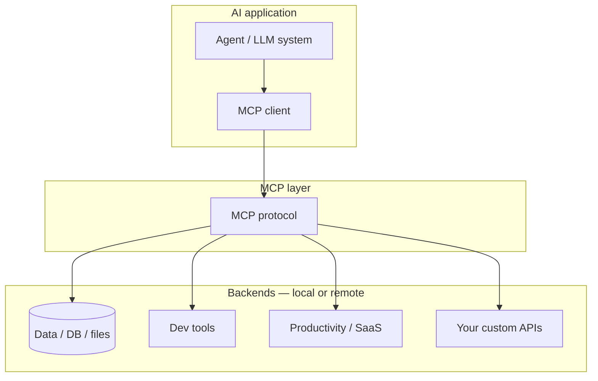
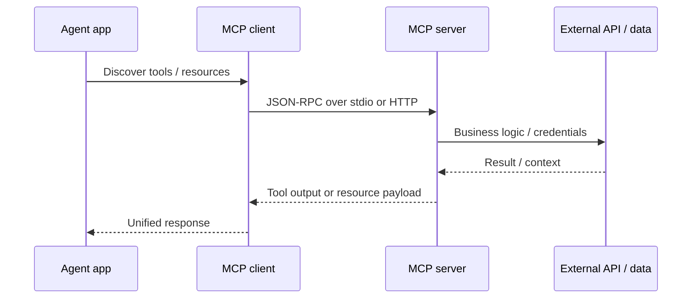
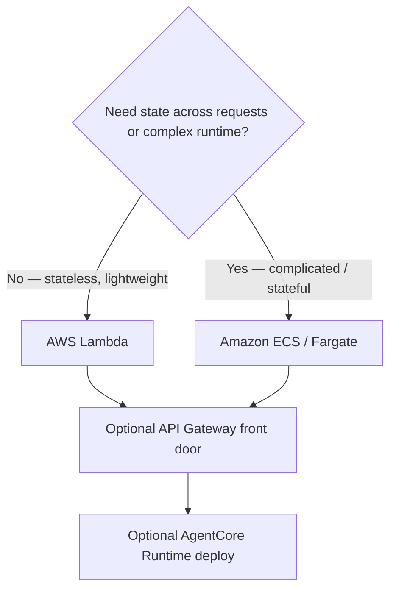
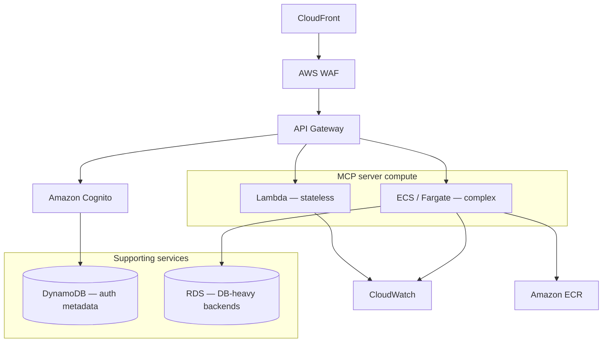

# Model Context Protocol (MCP)

## What this lecture covers

This lecture introduces the <a href="https://modelcontextprotocol.io/">Model Context Protocol (MCP)</a>—a standardized interface for how AI applications and agents connect to **external tools and context**. You will see why MCP matters for agentic systems, how **tools**, **resources**, and **prompts** work, real-world MCP servers (GitHub, Jira, databases, Slack, and more), and **exam-focused** guidance on **hosting your own MCP servers on AWS** (including <a href="https://docs.aws.amazon.com/lambda/latest/dg/welcome.html">AWS Lambda</a>, <a href="https://docs.aws.amazon.com/AmazonECS/latest/developerguide/Welcome.html">Amazon ECS</a> / <a href="https://docs.aws.amazon.com/AmazonECS/latest/developerguide/AWS_Fargate.html">Fargate</a>, <a href="https://docs.aws.amazon.com/bedrock-agentcore/latest/devguide/runtime-mcp.html">AgentCore Runtime</a>, and <a href="https://docs.aws.amazon.com/apigateway/latest/developerguide/welcome.html">Amazon API Gateway</a>).

## Key definitions (from the lecture)

| Term | Definition |
|---|---|
| **Model Context Protocol (MCP)** | An open standard (originated by Anthropic) for **interactions between agents and tools**—often described as a **“USB-C port for AI applications”**: one consistent plug for context, capabilities, and third-party (or first-party) systems. |
| **MCP server** | A service that implements MCP and exposes **tools**, **resources**, and/or **prompts** back to an MCP **client** (your agent application or SDK). |
| **MCP client** | The agent-side component that speaks MCP to discover and invoke server capabilities—use **MCP client libraries** rather than hand-rolling the protocol. |
| **Tools** | Callable capabilities the agent can invoke (for example “create Jira ticket”, “query PostgreSQL”). |
| **Resources** | Additional **context** the server can supply (files, records, documents) without necessarily being a single “function call.” |
| **Prompts** | Server-provided guidance on **how to use** that server’s capabilities effectively. |
| **JSON-RPC 2.0** | The **data layer** of MCP (lecture: awareness-level detail). |
| **stdio transport** | Local MCP pattern: client and server communicate over **standard input/output** (typical for IDE/coding assistants on a developer machine). |
| **HTTP streaming transport** | Remote MCP pattern: client reaches an MCP server over the network via **streamable HTTP** (external or enterprise-hosted servers). |

## Key distinctions / comparisons

| Item | Notes |
|---|---|
| **Local vs remote MCP** | **Local** (stdio): same machine as the agent, often no client–server auth; good for dev tools and personal credentials. **Remote** (HTTP): centralized control, versioning, and **authN/authZ**—required for multi-tenant enterprise use. See <a href="https://docs.aws.amazon.com/prescriptive-guidance/latest/mcp-strategies/mcp-hosting-strategy.html">MCP hosting strategy</a>. |
| **Third-party vs your own servers** | MCP is the **same interface** whether the backend is SaaS (GitHub, Atlassian) or code you wrote—uniform discovery and invocation for the agent. |
| **Direct MCP in SDK vs <a href="https://docs.aws.amazon.com/bedrock-agentcore/latest/devguide/gateway.html">AgentCore Gateway</a>** | SDKs (including Strands) can call MCP servers directly. **Gateway** adds a **single managed endpoint**, credential brokering, semantic tool search, and unified MCP targets at scale (see [AgentCore Bedrock Import, Gateway, and Identity](../08-agentcore-bedrock-import-gateway-and-identity/index.md)). |
| **Lambda vs ECS/Fargate (exam framing)** | **Lambda**: **stateless**, **lightweight** MCP servers with **no cross-request state**. **ECS** (often **Fargate**): **more complicated** workloads—persistent connections, heavier dependencies, or state you must keep across requests. |
| **AgentCore Runtime vs DIY Lambda/ECS** | You can host MCP on Lambda/ECS yourself **or** deploy MCP servers through <a href="https://docs.aws.amazon.com/bedrock-agentcore/latest/devguide/runtime-mcp.html">AgentCore Runtime</a> (managed protocol contract, session headers, OAuth patterns). |
| **Exam focus vs full architecture** | Certification material emphasizes **choosing Lambda vs ECS** and using **client libraries**; AWS blog / prescriptive guidance adds **Cognito**, **WAF**, **CloudFront**, observability, and container registry patterns around the same core. |

## The problem (why you need MCP)

- Agents need **more than the foundation model**: live data, enterprise systems, files, APIs, and SaaS workflows.
- Without a standard, every team builds **custom connectors** with different auth, discovery, and error shapes—hard to reuse and hard to secure at scale.
- **Third-party and internal capabilities** should look the same to the agent so you can swap or add tools without rewriting the agent loop.

## The solution

MCP defines a **consistent interaction pattern** for extending LLM/agent systems with external **context** and **capabilities**. Your AI application talks to an MCP layer; that layer fronts databases, filesystems, dev tools, productivity apps, or custom business APIs—**local or external**, all presented uniformly to the agent.



### Protocol stack (lecture)

| Layer | Technology | Typical use |
|---|---|---|
| **Application primitives** | Tools, resources, prompts | What the server exposes to agents |
| **Data** | JSON-RPC 2.0 | Message format between client and server |
| **Transport** | stdio **or** HTTP streaming | **stdio** for local subprocess servers; **HTTP** for remote enterprise servers |



## SDK support (including Strands)

MCP is **table stakes** for modern agent SDKs—most frameworks include MCP client support. In this course, <a href="https://docs.aws.amazon.com/prescriptive-guidance/latest/agentic-ai-frameworks/strands-agents.html">Strands Agents</a> has **MCP baked in**, so Strands-based agents can attach external MCP servers for extra tools and context without custom wire protocols (see [Strands Agents](../04-strands-agents/index.md)).

## Real-world MCP server examples (lecture)

| Example | What agents gain |
|---|---|
| **GitHub** | Interact with repositories—commits, metadata, repo information through a common interface. |
| **Atlassian (Jira)** | Read or act on **Jira tickets** automatically in workflows. |
| **PostgreSQL** | Query **local**, **enterprise**, or external databases via MCP tools. |
| **Slack** | Integrate **Slack messages** into agent context or actions. |
| **Google Maps** | Location and mapping capabilities for travel or logistics agents. |
| **Udemy** | Udemy Business partners can surface **relevant courses** for a given market via MCP. |

These illustrate the pattern: **one protocol**, many backends—your agent’s client code stays similar while capabilities differ.

## Deploying your own MCP servers on AWS (exam focus)

The certification path emphasizes **where** to run a custom MCP server and **how** to expose it safely.

### Hosting choice: Lambda vs ECS



| Hosting option | When the lecture recommends it |
|---|---|
| <a href="https://docs.aws.amazon.com/lambda/latest/dg/welcome.html">**AWS Lambda**</a> | **Stateless**, **lightweight** MCP servers—no state to maintain between invocations; fits Lambda’s execution model. |
| <a href="https://docs.aws.amazon.com/AmazonECS/latest/developerguide/Welcome.html">**Amazon ECS**</a> (with <a href="https://docs.aws.amazon.com/AmazonECS/latest/developerguide/AWS_Fargate.html">**Fargate**</a>) | **More complicated** servers—longer-lived processes, richer dependencies, or **state** across requests (similar to how AgentCore itself runs containerized workloads). |
| <a href="https://docs.aws.amazon.com/bedrock-agentcore/latest/devguide/runtime-mcp.html">**AgentCore Runtime**</a> | Managed path to **deploy and invoke MCP servers** with AgentCore’s MCP protocol contract (streamable HTTP, session affinity, OAuth). |
| <a href="https://docs.aws.amazon.com/apigateway/latest/developerguide/welcome.html">**Amazon API Gateway**</a> | Recommended pattern to **expose MCP HTTP endpoints** to clients—TLS termination, throttling, and integration with auth in front of Lambda or container targets. |
| **MCP client libraries** | **Do not reinvent** JSON-RPC, capability negotiation, or transport details—use official/community client SDKs. |

AgentCore also supports **Lambda-backed MCP targets** in gateway configurations (see <a href="https://docs.aws.amazon.com/bedrock-agentcore/latest/devguide/gateway-core-concepts.html">Gateway core concepts</a> and MCP tool types).

### Extended production architecture (beyond the exam)

AWS **prescriptive guidance** and architecture blog material wrap the same Lambda/ECS core with enterprise controls:



The **exam** still centers the **inner decision**: **Lambda for simple stateless MCP**, **ECS for complicated/stateful**—not every box in the diagram.

## How to apply it

### Conceptual Strands + MCP pattern

```python
# Illustrative pattern — connect Strands agent to remote MCP tools (exact API per Strands version)
from strands import Agent
from strands.tools.mcp import MCPClient  # module name may vary by SDK version

mcp = MCPClient(transport="streamable-http", url="https://api.example.com/mcp")
tools = mcp.list_tools()

agent = Agent(
    model="us.amazon.nova-pro-v1:0",  # example Bedrock model id
    tools=tools,
)

response = agent("Summarize open Jira tickets for sprint 42")
```

### AgentCore Runtime MCP server sketch

AWS documents a minimal **FastMCP** server deployed to AgentCore—**stateless HTTP** by default:

```python
from mcp.server.fastmcp import FastMCP

mcp = FastMCP(host="0.0.0.0", stateless_http=True)

@mcp.tool()
def add_numbers(a: int, b: int) -> int:
    """Add two numbers together"""
    return a + b

if __name__ == "__main__":
    mcp.run(transport="streamable-http")
```

See <a href="https://docs.aws.amazon.com/bedrock-agentcore/latest/devguide/runtime-mcp.html">Deploy MCP servers in AgentCore Runtime</a> and <a href="https://docs.aws.amazon.com/bedrock-agentcore/latest/devguide/runtime-mcp-protocol-contract.html">MCP protocol contract</a> for path (`/mcp`), ARM64 container, and OAuth requirements.

## Examples

1. **Coding assistant + local GitHub MCP** — IDE agent spawns a **stdio** GitHub MCP server using the developer’s credentials; no remote hop while editing a repo.
2. **Enterprise Jira agent** — Remote **HTTP** Atlassian MCP server behind **API Gateway** and **Cognito**; only authenticated employees trigger ticket reads/updates.
3. **Analytics agent over PostgreSQL** — MCP tools wrap read-only SQL against a warehouse; **Lambda** hosts stateless query tools; heavy ETL stays in the database layer.

## Limitations / edge cases

- MCP standardizes the **interface**, not **security**—remote servers need explicit **auth**, **tenant isolation**, and **least-privilege** access to downstream APIs.
- **Local MCP** simplifies dev iteration but makes **version control**, **patching**, and **compliance** harder when every user runs their own server binary.
- **Stateful** MCP features (multi-turn elicitation, sampling) require **stateful HTTP** mode on AgentCore—do not force a stateless Lambda design when the protocol needs session continuity.
- Choosing **ECS** for “complicated” workloads increases **operational surface** (images, task definitions, scaling)—use it when requirements justify the cost, not by default.

## Key takeaways

- MCP is the **standard plug** between agents and **external tools/context**—third-party or custom, local or remote.
- Servers expose **tools**, **resources**, and **prompts**; the wire format is **JSON-RPC 2.0** over **stdio** (local) or **HTTP streaming** (remote).
- **Strands** and most agent SDKs treat MCP support as **expected**, not optional.
- **Exam**: host **stateless, lightweight** custom MCP on **Lambda**; **complicated/stateful** on **ECS/Fargate**; also know **AgentCore Runtime**, **API Gateway** exposure, and **MCP client libraries**.
- **AgentCore Gateway** is the managed **MCP gateway** pattern for many backends with centralized auth and discovery.
- Full AWS architecture guidance adds **edge security and observability** around the same Lambda/ECS core—see <a href="https://docs.aws.amazon.com/prescriptive-guidance/latest/mcp-strategies/introduction.html">Model Context Protocol strategies on AWS</a>.

## Industry scenarios

1. **Platform engineering MCP catalog** — A company publishes approved MCP servers (GitHub, Jira, internal CRM) in an internal registry; developers attach them to **Kiro/IDE agents** locally while production agents hit **remote** servers behind **API Gateway** and **Cognito**.
2. **Customer-support copilot** — Agents use **Slack** and **PostgreSQL** MCP servers to pull recent conversations and order history, with **Lambda**-hosted stateless tools for read-only queries and **ECS** for a session-heavy summarization service.
3. **Learning and development portal** — An HR bot uses the **Udemy Business** MCP server to recommend courses by role and region, governed by the same MCP client code that already calls **Atlassian** for onboarding tasks.

## Internal References

- [Strands Agents](../04-strands-agents/index.md)
- [Amazon AgentCore Introduction](../06-amazon-agentcore-introduction/index.md)
- [AgentCore Memory and Tools](../07-agentcore-memory-and-tools/index.md)
- [AgentCore Bedrock Import, Gateway, and Identity](../08-agentcore-bedrock-import-gateway-and-identity/index.md)
- [AgentCore Policies](../09-agentcore-policies/index.md)
- [OpenAPI and Tool Usage](../12-openapi-and-tool-usage/index.md)

## External References

- <a href="https://modelcontextprotocol.io/">Model Context Protocol</a>
- <a href="https://docs.aws.amazon.com/prescriptive-guidance/latest/mcp-strategies/introduction.html">Model Context Protocol strategies on AWS</a>
- <a href="https://docs.aws.amazon.com/prescriptive-guidance/latest/mcp-strategies/mcp-hosting-strategy.html">MCP hosting strategy</a>
- <a href="https://docs.aws.amazon.com/bedrock-agentcore/latest/devguide/runtime-mcp.html">Deploy MCP servers in AgentCore Runtime</a>
- <a href="https://docs.aws.amazon.com/bedrock-agentcore/latest/devguide/runtime-mcp-protocol-contract.html">AgentCore MCP protocol contract</a>
- <a href="https://docs.aws.amazon.com/bedrock-agentcore/latest/devguide/gateway.html">Amazon Bedrock AgentCore Gateway</a>
- <a href="https://docs.aws.amazon.com/bedrock-agentcore/latest/devguide/gateway-core-concepts.html">Gateway core concepts</a>
- <a href="https://docs.aws.amazon.com/bedrock-agentcore/latest/devguide/gateway-targets-mcp.html">MCP targets in AgentCore Gateway</a>
- <a href="https://docs.aws.amazon.com/bedrock-agentcore/latest/devguide/gateway-target-MCPservers.html">MCP server targets</a>
- <a href="https://docs.aws.amazon.com/lambda/latest/dg/welcome.html">AWS Lambda</a>
- <a href="https://docs.aws.amazon.com/AmazonECS/latest/developerguide/Welcome.html">Amazon ECS</a>
- <a href="https://docs.aws.amazon.com/AmazonECS/latest/developerguide/AWS_Fargate.html">AWS Fargate on ECS</a>
- <a href="https://docs.aws.amazon.com/apigateway/latest/developerguide/welcome.html">Amazon API Gateway</a>
- <a href="https://docs.aws.amazon.com/cognito/latest/developerguide/what-is-amazon-cognito.html">Amazon Cognito</a>
- <a href="https://docs.aws.amazon.com/prescriptive-guidance/latest/agentic-ai-frameworks/strands-agents.html">Strands Agents (AWS Prescriptive Guidance)</a>
