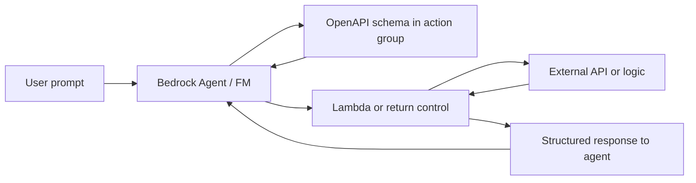
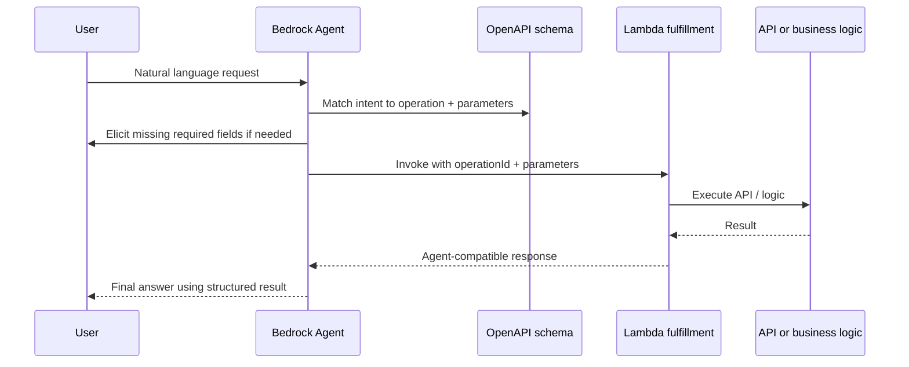

# OpenAPI and Tool Usage

## What this lecture covers

This lecture explains **OpenAPI** (formerly **Swagger**) as a strict, machine-readable contract for tool interfaces—and why that contract matters when a **foundation model** or **agent** calls external tools in generative and agentic AI systems. You will see how schemas define **inputs**, **outputs**, and **error conditions**, and how <a href="https://docs.aws.amazon.com/bedrock/latest/userguide/agents-action-create.html">Amazon Bedrock action groups</a> use OpenAPI to make <a href="https://docs.aws.amazon.com/bedrock/latest/userguide/agents.html">Bedrock Agents</a> tool use more **reliable and consistent** (including uploading a schema to <a href="https://docs.aws.amazon.com/AmazonS3/latest/userguide/Welcome.html">Amazon S3</a> or pasting it in the console).

## Key definitions (from the lecture)

| Term | Definition |
|---|---|
| **OpenAPI** | A specification for defining **interfaces between web services** (lecture: formerly known as **Swagger**). In agentic AI, the same idea applies to the **interface between your FM/agent and the tools it calls**. |
| **API schema / OpenAPI schema** | A JSON or YAML document that **explicitly** describes operations, parameters, request/response bodies, and responses—so the agent knows what to send and what to expect back. |
| **Tool (agentic AI)** | A callable capability outside the model (API, Lambda, calculator, CRM lookup, etc.). A **strict schema** helps the model invoke the tool correctly and interpret results. |
| **<a href="https://docs.aws.amazon.com/bedrock/latest/userguide/agents-action-create.html">Action group</a>** | In Bedrock Agents, the container for **actions** (tools). The lecture: this is **how Bedrock agents call tools**—the action group **uses** your OpenAPI definition to guide orchestration. |
| **`operationId`** | A unique identifier for each API operation in the schema (like a function name). Bedrock maps agent tool calls to these operations when fulfillment runs (often via <a href="https://docs.aws.amazon.com/bedrock/latest/userguide/agents-lambda.html">Lambda</a>). |

## Key distinctions / comparisons

| Item | Notes |
|---|---|
| **OpenAPI vs ad hoc tool prompts** | OpenAPI forces **explicit** parameter names, types, required flags, response shapes, and documented errors—reducing ambiguous or malformed tool calls compared to informal “call this API somehow” instructions. |
| **OpenAPI action groups vs function details** | Bedrock lets you define actions with a full **OpenAPI schema** (map to real API operations) or simpler **function details** (parameter list the agent elicits). OpenAPI fits when you want **operation-level** structure aligned with existing REST APIs. See <a href="https://docs.aws.amazon.com/bedrock/latest/userguide/action-define.html">Define actions in the action group</a>. |
| **OpenAPI for Bedrock Agents vs <a href="https://modelcontextprotocol.io/">MCP</a>** | Both standardize how agents reach external capabilities. **OpenAPI** is the native contract for **Bedrock action groups**; **MCP** is a separate open protocol for tools/resources/prompts (see [Model Context Protocol (MCP)](../11-model-context-protocol-mcp/index.md)). **AgentCore Gateway** can also expose **OpenAPI-backed REST** as MCP tools. |
| **S3-hosted schema vs inline console editor** | Upload the schema file to **S3** and reference it when creating the action group, **or** paste/edit in the **Bedrock console** inline OpenAPI editor (available when adding/editing action groups on an existing agent). |

## The problem (why you need it)

- Without a shared contract, the FM must **guess** parameter names, types, HTTP methods, and response formats—leading to **wrong arguments**, **wrong endpoints**, or **misinterpreted** tool output.
- Agentic systems chain multiple steps; if one tool call returns data in an unexpected shape, later reasoning steps break down.
- Production agents need **consistent, repeatable** tool behavior—not one-off prompt luck.

## The solution

Use **OpenAPI** to **standardize function definitions** between your foundation model, your agent runtime, and each tool:

- **Input parameters** — names, locations (`path`, `query`, `body`), types, and what is **required**
- **Expected output** — response status codes, media types, and property descriptions the agent uses in follow-on steps
- **Error conditions** — documented failure responses (e.g. `400`) so the agent can reason about retries or user clarification

In Bedrock, the **action group** loads this schema so the agent can **select the right operation**, **elicit missing parameters**, invoke your fulfillment path (commonly Lambda), and **process results** in the shape the schema describes.



## OpenAPI in generative and agentic AI

Originally aimed at **web service interoperability**, OpenAPI’s structured **paths**, **operations**, **parameters**, and **responses** map naturally to **tool definitions** for LLMs:

| Schema element | Agentic role |
|---|---|
| **`description` / `summary`** | Tells the FM **when** to use this operation and what it does |
| **`parameters` / `requestBody`** | Defines what to **extract** from the user or prior steps |
| **`responses`** | Defines what comes back so the FM can **summarize**, **chain** another call, or ask for clarification |
| **Error responses** | Documents expected failure modes instead of silent hallucination after a bad call |

The lecture stresses: a **very strict definition** of the tool interface is what makes tool use **more reliable**.

## How Bedrock uses OpenAPI (action groups)

Per <a href="https://docs.aws.amazon.com/bedrock/latest/userguide/agents-api-schema.html">Define OpenAPI schemas for your agent's action groups</a>:

1. Create an action group on your agent.
2. Provide an OpenAPI **3.0.0** schema (JSON or YAML)—either:
   - **Upload** to S3 and reference the object, or
   - Use the **inline OpenAPI editor** in the AWS Management Console (with validation).
3. Connect **fulfillment** (typically a Lambda you configure) so invoked operations run in your environment.
4. The agent uses the schema at runtime to choose **`operationId`**, required inputs, and how to use **response properties** in orchestration.



## Examples

### Calculator tool (lecture-style OpenAPI sketch)

The lecture references a **calculator** tool definition on the slide—a concrete illustration of explicit inputs and outputs:

```yaml
openapi: 3.0.0
info:
  title: Calculator API
  version: 1.0.0
  description: Basic arithmetic for agent-assisted math.
paths:
  /calculate:
    post:
      summary: Evaluate a mathematical expression
      description: Use when the user needs an accurate numeric result; pass a single expression string.
      operationId: calculate
      requestBody:
        required: true
        content:
          application/json:
            schema:
              type: object
              required:
                - expression
              properties:
                expression:
                  type: string
                  description: Arithmetic expression to evaluate, e.g. "(12.5 * 4) + 3"
      responses:
        "200":
          description: Numeric result of the expression
          content:
            application/json:
              schema:
                type: object
                properties:
                  result:
                    type: number
                    description: Evaluated value
        "400":
          description: Invalid or unsupported expression
```

A paired Lambda (or your app) performs the actual evaluation and returns JSON matching the `200` schema so the FM does not rely on fragile mental math.

### Weather operation (AWS documentation pattern)

Bedrock’s user guide includes a minimal **getWeather** path parameter schema—same idea: one operation, explicit `location`, typed response. See the **Example API schemas** section in <a href="https://docs.aws.amazon.com/bedrock/latest/userguide/agents-api-schema.html">Define OpenAPI schemas for your agent's action groups</a>.

### Insurance claims workflow (multi-operation schema)

AWS documents a richer example (`getAllOpenClaims`, `identifyMissingDocuments`, `sendReminders`) where **descriptions** steer the agent across a **sequence** of API calls—returned claim IDs feed the next operation. That pattern matches real **case management** agents.

## How to apply it

**Console path (lecture):** paste or edit the OpenAPI document in the Bedrock UI when configuring the action group.

**S3 path (lecture):** upload `openapi.yaml` / `openapi.json` to a bucket, then point the action group at that object when you <a href="https://docs.aws.amazon.com/bedrock/latest/userguide/agents-action-add.html">add an action group</a>.

Minimal checklist when authoring schemas for agents:

| Checklist item | Why it matters |
|---|---|
| Set `"openapi": "3.0.0"` | Required for Bedrock action groups |
| Unique **`operationId`** per operation | Tool-use models need stable function identifiers |
| Clear **`description`** on each operation | Primary signal for **when** the FM should call the tool |
| Mark **`required`** parameters accurately | Drives user elicitation before invocation |
| Describe **`responses`** properties | Enables correct summarization and multi-step plans |
| Align Lambda handler with **`operationId`** and parameter names | Prevents fulfillment mismatches |

## Limitations / edge cases

- Bedrock supports a **subset** of OpenAPI 3.0—for example, the **`enum`** field for restricting parameter values is **not** supported; document allowed values in **`description`** instead (<a href="https://docs.aws.amazon.com/bedrock/latest/userguide/agents-api-schema.html">agents-api-schema</a>).
- The lecture’s spoken “OpenAI schema” refers to **OpenAPI**—do not confuse with the OpenAI API product.
- Inline console editing is tied to **agent/action group lifecycle** (editing after the agent exists); S3 upload suits **CI/CD** and large, shared API definitions.
- Schema quality is not automatic: vague descriptions still produce poor routing; pair OpenAPI with strong **action group instructions** and tested Lambda contracts.
- For human approval before sensitive operations, AWS supports optional confirmation fields in the schema (see `x-requireConfirmation` in the Bedrock OpenAPI guide).

## Key takeaways

- **OpenAPI** (formerly Swagger) standardizes **machine-readable** tool/API contracts—critical for reliable **FM ↔ tool** interactions in agentic systems.
- Schemas should spell out **inputs**, **output format**, and **errors** so the model both **calls** and **interprets** tools correctly.
- In Bedrock, **action groups** consume OpenAPI to orchestrate tool use; supply schemas via **S3** or the **console editor**.
- Treat each `paths` entry as a **tool the agent can choose**, with `operationId` as the stable function name at fulfillment time.
- Strict schemas reduce ambiguity; they complement (rather than replace) good **natural-language** action-group instructions and secure Lambda implementation.

## Industry scenarios

1. **Insurance claims assistant** — OpenAPI defines `getAllOpenClaims`, document-gap checks, and reminder APIs; the Bedrock agent elicits `claimId` when required and chains responses across operations—matching regulated workflows where each API step must be auditable.
2. **E-commerce support agent** — Product catalog and order-status REST APIs are already described in OpenAPI; the team uploads specs to S3, maps operations to Lambda that calls internal services, and keeps the FM from inventing parameter names like `order` vs `orderId`.
3. **Field service scheduling** — A technician-facing agent uses OpenAPI to call `createWorkOrder` and `assignTechnician` with explicit datetime and location fields; documented `409` responses let the agent explain scheduling conflicts instead of hallucinating success.

## Internal References

- [LLM Agents in Bedrock](../01-llm-agents-in-bedrock/index.md)
- [Model Context Protocol (MCP)](../11-model-context-protocol-mcp/index.md)
- [AgentCore Bedrock Import, Gateway, and Identity](../08-agentcore-bedrock-import-gateway-and-identity/index.md)
- [Humans in the Loop](../13-humans-in-the-loop/index.md)

## External References

- <a href="https://docs.aws.amazon.com/bedrock/latest/userguide/agents-api-schema.html">Define OpenAPI schemas for your agent's action groups in Amazon Bedrock</a>
- <a href="https://docs.aws.amazon.com/bedrock/latest/userguide/action-define.html">Define actions in the action group</a>
- <a href="https://docs.aws.amazon.com/bedrock/latest/userguide/agents-action-add.html">Add an action group to your agent in Amazon Bedrock</a>
- <a href="https://docs.aws.amazon.com/bedrock/latest/userguide/agents-action-create.html">Use action groups to define actions</a>
- <a href="https://docs.aws.amazon.com/bedrock/latest/userguide/agents-lambda.html">Configure Lambda functions to send agent data</a>
- <a href="https://docs.aws.amazon.com/bedrock/latest/userguide/agents.html">Automate tasks in your application using AI agents</a>
- <a href="https://docs.aws.amazon.com/bedrock-agentcore/latest/devguide/gateway-schema-openapi.html">OpenAPI schema targets (AgentCore Gateway)</a>
- <a href="https://swagger.io/specification/">OpenAPI Specification</a>
