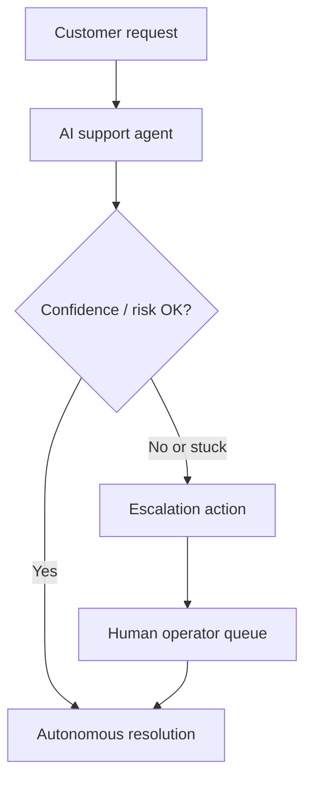
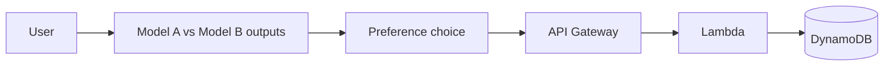

# :material-account-supervisor: Humans in the Loop

## What this lecture covers

This lecture explains **human-in-the-loop (HITL)** as a way to extend generative and agentic AI systems when automation alone is not enough—whether that means a person refining AI output, an agent **escalating** uncertain work to an operator, or **collecting human preferences** to compare models and improve behavior over time. You will see how **confidence thresholds**, **ticketing integrations** (including via [Model Context Protocol (MCP)](../11-model-context-protocol-mcp/index.md)), and a simple **<a href="https://docs.aws.amazon.com/apigateway/latest/developerguide/welcome.html">Amazon API Gateway</a> → <a href="https://docs.aws.amazon.com/lambda/latest/dg/welcome.html">AWS Lambda</a> → <a href="https://docs.aws.amazon.com/amazondynamodb/latest/developerguide/Introduction.html">Amazon DynamoDB</a>** stack support feedback collection and analysis.

## Key definitions (from the lecture)

| Term | Definition |
|---|---|
| **Human in the loop (HITL)** | Injecting **human judgment** into an AI system—anywhere from editing a draft to approving a high-risk action or rating model outputs. |
| **Escalation criteria** | Rules that tell an automated workflow when a case is **too complex, uncertain, or stuck** and should be routed to a human operator instead of continuing autonomously. |
| **Confidence score / risk assessment** | Internal signals the agent uses to decide whether its answer is reliable enough; if confidence falls **below a threshold**, the system may escalate. |
| **Human feedback (preference data)** | Explicit signals from users—thumbs up/down, choosing between two responses, rankings—that capture **what humans prefer** so you can compare models or variants. |
| **Feedback collection pipeline** | An ingest path (lecture example: API Gateway fronting Lambda writing to DynamoDB) that **stores** preference events for later analysis. |

## Key distinctions / comparisons

| Item | Notes |
|---|---|
| **Content refinement vs workflow escalation** | Refining a ChatGPT draft yourself is HITL at the **consumption** layer. Workflow HITL adds **routing logic** so the system automatically hands off when automation fails or risk is high. |
| **Escalation vs always-on human review** | Escalation is **conditional** (triggered by thresholds or failure detection). Always-on review puts a person on **every** output—slower but maximum control. |
| **Operational HITL vs model-improvement HITL** | Customer-service escalation solves **today’s ticket**. Preference feedback supports **tomorrow’s model**—comparing foundation models, variants, or fine-tuned versions. |
| **MCP ticketing vs custom API** | An MCP server tool (for example “create Jira ticket”) gives agents a **standard tool interface** for escalation; a bespoke REST webhook achieves the same outcome with your own contract (see [OpenAPI and Tool Usage](../12-openapi-and-tool-usage/index.md)). |
| **Managed human evaluation vs DIY DynamoDB feedback** | <a href="https://docs.aws.amazon.com/bedrock/latest/userguide/model-evaluation-type-human.html">Bedrock human-based model evaluation</a> uses work teams and structured jobs; the lecture’s Gateway/Lambda/DynamoDB pattern is a **lightweight custom** collector for in-product preferences. |

## The problem (why you need HITL)

- Some tasks are **too complicated or ambiguous** for an agent to handle safely on its own—you cannot fully trust the API or tool chain in every scenario.
- Autonomous agents can **go off the rails** on edge cases; without escalation, users get stuck in loops or receive low-quality answers.
- Pure automation gives you **no signal** about which model variant actually makes humans happy—you need structured feedback to compare options.
- Collecting preferences can **backfire** if reward signals are misaligned (the lecture cites periods of overly **sycophantic** chatbot behavior when human-feedback tuning went sideways).

!!! warning "Misaligned feedback"
    Human preference tuning can push models toward **sycophantic** or over-agreeable behavior if rewards reward flattery over accuracy—design escalation and evaluation metrics carefully.

## HITL at the consumption layer

The simplest form of HITL is how people already use chat assistants: the model generates a draft document and **you refine it**. No special infrastructure is required—the human is the final editor. This pattern is common in knowledge work, marketing copy, and code review assist flows.

## Workflow escalation (operational HITL)

In production agent workflows, HITL usually means **routing** work to a human when automation should stop. The lecture’s customer-service example:

1. An AI agent attempts to resolve the customer issue.
2. The agent detects it is **not making progress** (or confidence/risk checks fail).
3. The system **escalates**—for example by filing a ticket that lands in a human operator’s queue.

Internally, the agent may evaluate **confidence scores** or **risk assessments** against thresholds: if the model’s confidence in its response is not above the configured bar, route to a human instead of answering autonomously.



### MCP and external ticketing

Escalation often means calling an **external system**. The lecture connects this to **MCP integration**: an MCP tool can create a **Jira ticket** (or similar) so a human picks up the case. That aligns with MCP’s role as a standardized way for agents to reach enterprise tools—see [Model Context Protocol (MCP)](../11-model-context-protocol-mcp/index.md). The same escalation could also be implemented as a <a href="https://docs.aws.amazon.com/bedrock/latest/userguide/agents-action-create.html">Bedrock Agents action group</a> backed by Lambda or return control to your application.

## Human feedback for model comparison and improvement

A second HITL theme is **training and improving models** through explicit user feedback—familiar from interfaces that show **two responses** and ask you to pick the better one. That preference signal can:

- Compare **foundation models** or **variants** from a human satisfaction standpoint
- Inform which **fine-tuned** model performs best for your users
- Feed broader customization workflows on <a href="https://docs.aws.amazon.com/bedrock/latest/userguide/custom-models.html">Amazon Bedrock model customization</a> (fine-tuning, distillation, or <a href="https://docs.aws.amazon.com/bedrock/latest/userguide/reinforcement-fine-tuning.html">reinforcement fine-tuning</a> when reward functions reflect human preferences)

**Caution:** preference optimization is powerful but not always beneficial. Misaligned or biased feedback can push models toward undesirable behavior (the lecture’s **sycophancy** example—overly fawning responses after feedback tuning drifted). Treat feedback design as a product and governance problem, not only an ML pipeline.



## Feedback collection architecture (lecture pattern)

To measure which model makes users happiest, you need to **collect**, **store**, and **analyze** feedback. The lecture describes a common AWS serverless pattern:

| Layer | Role |
|---|---|
| <a href="https://docs.aws.amazon.com/apigateway/latest/developerguide/welcome.html">**API Gateway**</a> | Public HTTPS endpoint for clients to POST preference events (model id, prompt id, chosen response, rating, etc.). |
| <a href="https://docs.aws.amazon.com/lambda/latest/dg/welcome.html">**Lambda**</a> | Validates and normalizes payloads; writes records to the database. |
| <a href="https://docs.aws.amazon.com/amazondynamodb/latest/developerguide/Introduction.html">**DynamoDB**</a> | Durable store for preference rows; must be **indexed** for the access patterns you will use in analysis (by model, variant, time window, user segment). |

Design the table keys and GSIs around **how you will query later**—for example “win rate of model X vs Y this week” or “average thumbs-up rate per fine-tuned variant.” See <a href="https://docs.aws.amazon.com/amazondynamodb/latest/developerguide/bp-general-nosql-design.html">NoSQL design for DynamoDB</a> for access-pattern-first schema design.

### Example preference payload (illustrative)

```python
# POST body sent to API Gateway → Lambda → DynamoDB
{
    "session_id": "sess-9f2a",
    "prompt_id": "p-1042",
    "model_a": "anthropic.claude-3-sonnet",
    "model_b": "anthropic.claude-3-haiku-ft-custom",
    "chosen": "B",
    "rating": "thumbs_up",
    "timestamp": "2026-05-27T14:22:00Z"
}
```

Later analysis might aggregate in Lambda, <a href="https://docs.aws.amazon.com/athena/latest/ug/what-is.html">Amazon Athena</a> over exported data, or dashboards—paired with [AgentCore Evaluators](../10-agentcore-evaluators/index.md) for automated quality scoring alongside human preference metrics.

## How this relates to AWS human-review services

The lecture’s custom feedback stack is one approach; AWS also offers managed human-review paths:

| Approach | When it fits |
|---|---|
| **Gateway / Lambda / DynamoDB (lecture)** | In-app thumbs, A/B response picks, lightweight product telemetry you own end-to-end. |
| <a href="https://docs.aws.amazon.com/bedrock/latest/userguide/model-evaluation-jobs-management-create-human.html">**Bedrock human-based model evaluation**</a> | Formal evaluation jobs with work teams, structured rating methods (Likert, side-by-side comparison, thumbs up/down). |
| <a href="https://docs.aws.amazon.com/sagemaker/latest/dg/a2i-use-augmented-ai-a2i-human-review-loops.html">**Amazon Augmented AI (A2I)**</a> | Human review loops when ML predictions fall below confidence thresholds (document extraction, moderation, custom tasks). |

For low-confidence **predictions** in classic ML pipelines, A2I’s **human loops** mirror the agent escalation idea: automate until confidence fails, then involve a person.

## Limitations / edge cases

- **Threshold tuning** — Escalation that is too aggressive floods human queues; too lenient leaves users with bad autonomous answers.
- **Feedback bias** — Loud minorities, UI placement, and sycophancy-seeking behavior can skew preference data away from true quality.
- **Latency and UX** — Waiting for human operators breaks real-time chat unless you set expectations (queue position, async follow-up).
- **Privacy and compliance** — Storing prompts and choices in DynamoDB may require redaction, retention policies, and encryption at rest (see DynamoDB security best practices).
- **Analysis without design** — Collecting feedback without indexes and aggregation plans produces data you never use.

## Key takeaways

- **HITL spans a spectrum**—from editing AI drafts to automated escalation and structured preference collection.
- **Escalation workflows** use confidence/risk signals to route hard cases to humans; **MCP tools** (or action groups) can file tickets in Jira and similar systems.
- **Human feedback** helps compare foundation models, variants, and fine-tunes, but can harm quality if rewards are misaligned (sycophancy).
- A practical **feedback pipeline** is **API Gateway → Lambda → DynamoDB**, with schema/index design driven by downstream analysis questions.
- Pair **human preference metrics** with automated evaluation ([AgentCore Evaluators](../10-agentcore-evaluators/index.md)) and governance ([AgentCore Policies](../09-agentcore-policies/index.md)) for production agent systems.

## Industry scenarios

1. **Retail customer support** — A <a href="https://docs.aws.amazon.com/bedrock/latest/userguide/agents.html">Bedrock Agent</a> handles order status and returns until sentiment turns negative or refund amount exceeds policy; the agent uses an MCP Jira tool to open a **high-priority ticket** with transcript context for a human agent.
2. **Legal document drafting** — Associates use an FM for first drafts but **mandatory partner review** gates any filing; confidence scores on citation lookups trigger escalation when sources are missing or contradictory.
3. **Model selection program** — A product team runs side-by-side responses from two fine-tuned variants; preference events flow through API Gateway into DynamoDB, and analytics pick the variant with the highest **human win rate** before promoting it to production traffic.

## Internal References

- [Model Context Protocol (MCP)](../11-model-context-protocol-mcp/index.md)
- [OpenAPI and Tool Usage](../12-openapi-and-tool-usage/index.md)
- [AgentCore Evaluators](../10-agentcore-evaluators/index.md)
- [AgentCore Policies](../09-agentcore-policies/index.md)
- [LLM Agents in Bedrock](../01-llm-agents-in-bedrock/index.md)
- [Multi-Agent Workflows](../02-multi-agent-workflows/index.md)

## External References

- <a href="https://docs.aws.amazon.com/bedrock/latest/userguide/agents.html">Automate tasks in your application using AI agents</a>
- <a href="https://docs.aws.amazon.com/bedrock/latest/userguide/agents-how.html">How Amazon Bedrock Agents works</a>
- <a href="https://docs.aws.amazon.com/bedrock/latest/userguide/agents-action-create.html">Use action groups to define actions for your agent to perform</a>
- <a href="https://docs.aws.amazon.com/bedrock/latest/userguide/custom-models.html">Customize your model to improve its performance for your use case</a>
- <a href="https://docs.aws.amazon.com/bedrock/latest/userguide/reinforcement-fine-tuning.html">Customize a model with reinforcement fine-tuning in Amazon Bedrock</a>
- <a href="https://docs.aws.amazon.com/bedrock/latest/userguide/model-evaluation-type-human.html">Creating your first model evaluation that uses human workers</a>
- <a href="https://docs.aws.amazon.com/bedrock/latest/userguide/model-evaluation-jobs-management-create-human.html">Create a human-based model evaluation job</a>
- <a href="https://docs.aws.amazon.com/bedrock/latest/userguide/human-worker-evaluations.html">Manage a work team for human evaluations of models in Amazon Bedrock</a>
- <a href="https://docs.aws.amazon.com/sagemaker/latest/dg/a2i-use-augmented-ai-a2i-human-review-loops.html">Using Amazon Augmented AI for Human Review</a>
- <a href="https://docs.aws.amazon.com/apigateway/latest/developerguide/welcome.html">Amazon API Gateway</a>
- <a href="https://docs.aws.amazon.com/lambda/latest/dg/welcome.html">AWS Lambda</a>
- <a href="https://docs.aws.amazon.com/amazondynamodb/latest/developerguide/Introduction.html">What is Amazon DynamoDB?</a>
- <a href="https://docs.aws.amazon.com/amazondynamodb/latest/developerguide/bp-general-nosql-design.html">NoSQL design for DynamoDB</a>
