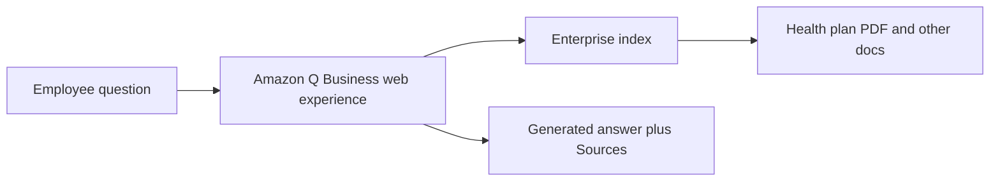
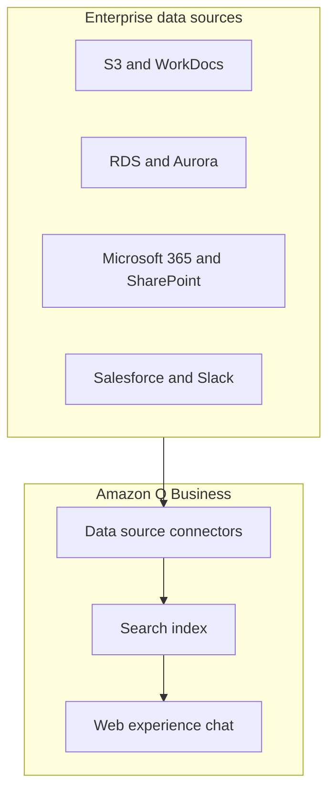
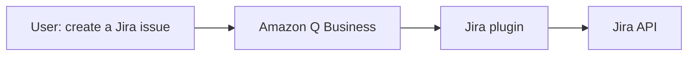
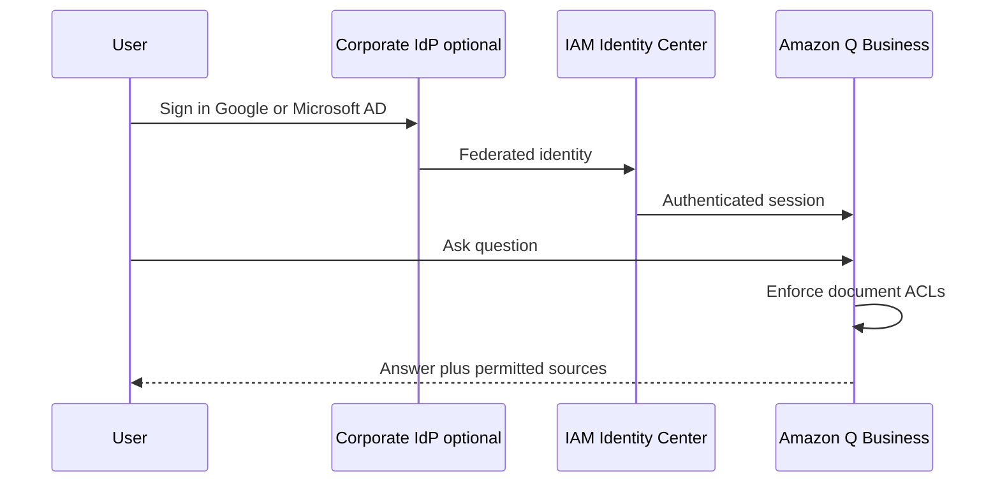

# :material-office-building: Amazon Q Business

!!! info "vs custom Bedrock apps"
    Q Business is **fully managed** employee Q&A over **enterprise connectors**—you do not pick the underlying FM. Custom **Bedrock** apps offer more control (model choice, agents, knowledge bases).

## What this lecture covers

<a href="https://docs.aws.amazon.com/amazonq/latest/qbusiness-ug/what-is.html">Amazon Q Business</a> is a **fully managed generative AI assistant for employees**—grounded in **your organization’s knowledge and data**, not the open web. The lecture walks through what employees can ask, how **data connectors** ingest enterprise content, how **plugins** take action in third-party systems, how **<a href="https://docs.aws.amazon.com/singlesignon/latest/userguide/what-is.html">IAM Identity Center</a>** (and external IdPs) enforce **permissions-aware** access, and how **admin controls** (similar in spirit to <a href="https://docs.aws.amazon.com/bedrock/latest/userguide/guardrails.html">Amazon Bedrock guardrails</a>) shape what the assistant may say.

## Key definitions (from the lecture)

| Term | Definition |
|---|---|
| <a href="https://docs.aws.amazon.com/amazonq/latest/qbusiness-ug/what-is.html">**Amazon Q Business**</a> | Managed Gen AI assistant for the workforce: Q&A, summaries, content generation, and task automation over **internal** company information. |
| <a href="https://docs.aws.amazon.com/amazonq/latest/qbusiness-ug/concepts-terms.html#retrieval-augmented-generation">**Retrieval Augmented Generation (RAG)**</a> | Pattern where the model **retrieves** relevant enterprise documents, then **generates** an answer conditioned on them—how Q Business answers from your data instead of generic model knowledge alone. |
| <a href="https://docs.aws.amazon.com/amazonq/latest/qbusiness-ug/concepts-terms.html#data-source-connector">**Data source connector**</a> | Fully managed integration that **crawls and syncs** content from an enterprise repository into the Q Business index so users can search and query it. |
| <a href="https://docs.aws.amazon.com/amazonq/latest/qbusiness-ug/plugins.html">**Plugins**</a> | Integrations that let Q Business **interact with** third-party apps (create tickets, update records)—not only read indexed documents. |
| <a href="https://docs.aws.amazon.com/singlesignon/latest/userguide/what-is.html">**IAM Identity Center**</a> | AWS service used to **authenticate** employees and tie their sign-in to **what content they may access** in Q Business. |
| <a href="https://docs.aws.amazon.com/amazonq/latest/qbusiness-ug/guardrails.html">**Admin controls**</a> | Organization policies for chat behavior—block topics/phrases, restrict answers to **enterprise data only** vs allowing broader foundation-model knowledge; configurable **globally** or per **topic**. |
| <a href="https://docs.aws.amazon.com/amazonq/latest/qbusiness-ug/source-attribution-citations.html">**Sources / citations**</a> | Attribution in the chat UI showing **which documents** grounded the answer (for example a health-plan PDF the user can open). |

## Key distinctions / comparisons

| Item | Notes |
|---|---|
| **Amazon Q Business vs general chat models** | Public foundation models lack your **HR policies, meeting notes, and benefits PDFs**. Q Business is scoped to **company knowledge** with the right **security and ACLs**. |
| **Q Business vs building on <a href="https://docs.aws.amazon.com/bedrock/latest/userguide/what-is-bedrock.html">Amazon Bedrock</a> directly** | Q Business runs **on Bedrock** but is **higher level**: you do **not** pick the underlying foundation model; AWS uses **multiple** Bedrock models behind the scenes. Direct Bedrock gives more **control** (model choice, custom RAG pipelines, agents). |
| **Data connectors vs plugins** | Connectors **ingest and index** knowledge for search/Q&A. Plugins **call APIs** to **create or change** data in external systems (Jira issue, ServiceNow ticket). |
| **Read vs write** | Connectors emphasize **retrieval**; plugins emphasize **actions** (extendable with **custom plugins** via OpenAPI—see [OpenAPI and Tool Usage](../12-openapi-and-tool-usage/index.md)). |
| **Admin controls vs Bedrock guardrails** | Lecture frames them as **the same idea**: topic blocking, phrase controls, and whether responses may use **only internal** information. Q Business admin controls are the **managed-product** version for the employee assistant. |
| **Global vs topic-level controls** | Same control types; difference is **scope**—apply one policy **everywhere** or tune **specific topics** (for example block “gaming consoles” questions at work). |

## The problem (why you need it)

- Employees need answers tied to **internal** context—job templates, benefits summaries, meeting discussions—not generic internet knowledge.
- A raw foundation model **cannot** reliably answer “what did we discuss in the 4/12 team meeting?” or “what is our plan’s out-of-pocket maximum?” without **your** documents and **your** permissions model.
- Exposing **all** company data to every employee would be a **major security risk**; access must follow **existing identity and document ACLs**.
- Teams want **automation** (time-off requests, meeting invites, ticket creation) **inside** the same assistant experience—not only static Q&A.

## What employees can do (capabilities)

Typical prompts from the lecture illustrate the **internal-data** use case:

- **HR / recruiting**: “Write a job posting for a senior product manager role” (wording relevant to **your** company).
- **Marketing**: “Create a social media post under 50 words to advertise the new role.”
- **Operations / collaboration**: “What was discussed during the team meeting in the week of 4/12?”

Beyond chat answers, Q Business can **summarize**, **generate content**, **automate tasks**, and handle **routine actions** (examples cited: submitting time-off requests, sending meeting invites).

### Grounded answer with sources (lecture example)

An employee in a medical company asks: *“What is the annual total out-of-pocket maximum mentioned in the health plan summary?”* Q Business **looks up** the company PDF, **reads** the relevant section, and returns the answer in chat. A **Sources** area lists the **health plan PDF** so the user can **click through** and verify—aligned with <a href="https://docs.aws.amazon.com/amazonq/latest/qbusiness-ug/source-attribution-citations.html">source attribution with citations</a>.

## Built on Amazon Bedrock (with less operator control)

Behind the scenes, <a href="https://docs.aws.amazon.com/amazonq/latest/qbusiness-ug/what-is.html">Amazon Q Business</a> is **built on Amazon Bedrock** and can leverage **more than one** foundation model. The trade-off for teams:

- **Pros**: No need to operate ML infrastructure, choose models, or wire RAG yourself for a standard **employee assistant** rollout.
- **Cons**: **Less control** than custom Bedrock apps—you **cannot** select which underlying FM powers a given interaction.

For custom agents, tool orchestration, and runtime governance, compare with [LLM Agents in Bedrock](../01-llm-agents-in-bedrock/index.md) and [Amazon AgentCore Introduction](../06-amazon-agentcore-introduction/index.md).

## Data connectors (enterprise knowledge ingestion)

<a href="https://docs.aws.amazon.com/amazonq/latest/qbusiness-ug/data-sources.html">Data sources</a> use **fully managed connectors** (the lecture cites **40+** popular enterprise systems). After you connect a source, Q Business **crawls** resources and prepares them so users can **search and query** indexed content.

| Category | Examples (from the lecture) |
|---|---|
| **AWS-native** | <a href="https://docs.aws.amazon.com/AmazonS3/latest/userguide/Welcome.html">Amazon S3</a>, <a href="https://docs.aws.amazon.com/AmazonRDS/latest/UserGuide/Welcome.html">Amazon RDS</a>, <a href="https://docs.aws.amazon.com/AmazonRDS/latest/AuroraUserGuide/CHAP_AuroraOverview.html">Amazon Aurora</a>, <a href="https://docs.aws.amazon.com/workdocs/latest/userguide/what_is.html">Amazon WorkDocs</a> |
| **SaaS / productivity** | Microsoft 365, SharePoint, Salesforce, Google Drive, Gmail, Slack, and others listed in <a href="https://docs.aws.amazon.com/amazonq/latest/qbusiness-ug/connectors-list.html">supported connectors</a> |

Connectors focus on **understanding and retrieving** organizational knowledge—not on mutating external systems (that is the plugins layer).

## Plugins (actions in third-party apps)

<a href="https://docs.aws.amazon.com/amazonq/latest/qbusiness-ug/built-in-plugin.html">Built-in plugins</a> cover services such as **Jira**, **ServiceNow**, **Zendesk**, and **Salesforce**. Example from the lecture: *“Create a Jira issue to track this problem”*—Q Business invokes the plugin and **creates the ticket** without the user leaving chat.

You can extend reach with <a href="https://docs.aws.amazon.com/amazonq/latest/qbusiness-ug/custom-plugin.html">custom plugins</a> that connect **any** third-party application exposing **APIs** (OpenAPI-based configuration in AWS docs).

## Access, identity, and permissions

Employees reach Q Business through a **web application** after authentication.

1. Users sign in via <a href="https://docs.aws.amazon.com/amazonq/latest/qbusiness-ug/idc-setup.html">IAM Identity Center</a> (username/password or your corporate flow).
2. Identity Center (and Q Business’s integration with document **ACLs**) ensures each user is an **authenticated principal** with **only the permissions** they should have.
3. Questions return answers **only from documents that user may access**—so rolling out “whole company data” does not mean **everyone** sees everything.

### External identity providers

<a href="https://docs.aws.amazon.com/singlesignon/latest/userguide/manage-your-identity-source-idp.html">External identity providers</a> let you avoid a separate AWS-only login experience. Examples from the lecture:

- **Microsoft Active Directory / Microsoft login**
- **Google** workspace login

That aligns Q Business with **existing** enterprise security systems instead of forcing a parallel user directory.

## Admin controls (guardrails for the workforce assistant)

<a href="https://docs.aws.amazon.com/amazonq/latest/qbusiness-ug/guardrails.html">Admin controls and guardrails</a> let administrators tailor responses to organizational policy—conceptually the same role as **guardrails** when you build directly on Bedrock.

| Control theme | Lecture example |
|---|---|
| **Blocked topics / phrases** | Block “gaming consoles”; an employee asking how to configure a **Nintendo Switch** gets a **restricted topic** response. |
| **Enterprise-only vs broader knowledge** | **Internal information only** → answers use **company documents** only. If disabled, the assistant may also draw on **general foundation-model knowledge**. |
| **Scope** | Apply controls **globally** for all subjects, or define **topic-level** rules for finer granularity (same controls, different **level**). |

## Limitations / edge cases (from the lecture framing)

- You **sacrifice model-level control** compared with DIY Bedrock solutions—you trust AWS to operate the FM layer.
- **Connector coverage** is broad but not universal; unsupported systems may need **custom connectors** or alternate ingestion paths documented under <a href="https://docs.aws.amazon.com/amazonq/latest/qbusiness-ug/custom-connector.html">custom connector</a>.
- **Plugins** perform **write** actions—governance, approval flows, and least-privilege API credentials matter (related patterns in [AgentCore Policies](../09-agentcore-policies/index.md)).
- Misconfigured **identity or ACL mapping** could over- or under-expose documents—Identity Center and data-source ACL crawling must be validated in pilot.

## Key takeaways

- Amazon Q Business targets **employees** who need a **secure, internal-knowledge** Gen AI assistant—not a public chatbot.
- **Data connectors** index enterprise content; **plugins** execute **actions** in tools like Jira and ServiceNow; **custom plugins** extend via APIs.
- Answers should cite **sources** so users can verify grounded responses (for example benefits PDFs).
- The service is **Bedrock-powered** but **higher level**—multiple models, **no customer FM picker**.
- **IAM Identity Center** (optionally federated to Google/Microsoft) is the primary access path; **permissions follow the user**.
- **Admin controls** block topics and can force **internal-only** answers, at **global** or **topic** scope.

## Industry scenarios

1. **Healthcare employer** — HR and clinical staff ask benefits and policy questions; Q Business returns cited answers from **internal PDFs** (as in the lecture’s out-of-pocket maximum example) while ACLs hide executive-only compensation documents from general staff.
2. **Software company** — Engineering connects **Confluence**, **Jira**, and **Slack** via connectors for “what did we decide last sprint?” queries; **plugins** let managers say “open a Sev-2 incident in ServiceNow” from the same chat after a production alert.
3. **Professional services firm** — Consultants federate **Microsoft Entra ID** sign-in, sync **SharePoint** and **Salesforce** opportunities, and use **admin controls** to block off-topic consumer gadget support questions while allowing **internal-only** responses on client engagement templates.

## Internal References

- [OpenAPI and Tool Usage](../12-openapi-and-tool-usage/index.md)
- [LLM Agents in Bedrock](../01-llm-agents-in-bedrock/index.md)
- [Amazon AgentCore Introduction](../06-amazon-agentcore-introduction/index.md)
- [Model Context Protocol (MCP)](../11-model-context-protocol-mcp/index.md)
- [Humans in the Loop](../13-humans-in-the-loop/index.md)
- [Amazon Q Apps](../15-amazon-q-apps/index.md)

## External References

- <a href="https://www.udemy.com/course/ultimate-aws-certified-generative-ai-developer-professional/learn/lecture/53642249#overview">Amazon Q Business</a>
- <a href="https://docs.aws.amazon.com/amazonq/latest/qbusiness-ug/what-is.html">What is Amazon Q Business?</a>
- <a href="https://docs.aws.amazon.com/amazonq/latest/qbusiness-ug/how-it-works.html">How Amazon Q Business works</a>
- <a href="https://docs.aws.amazon.com/amazonq/latest/qbusiness-ug/connectors-list.html">Supported connectors</a>
- <a href="https://docs.aws.amazon.com/amazonq/latest/qbusiness-ug/data-sources.html">Connecting Amazon Q Business data sources</a>
- <a href="https://docs.aws.amazon.com/amazonq/latest/qbusiness-ug/plugins.html">Plugins</a>
- <a href="https://docs.aws.amazon.com/amazonq/latest/qbusiness-ug/built-in-plugin.html">Built-in plugins for Amazon Q Business</a>
- <a href="https://docs.aws.amazon.com/amazonq/latest/qbusiness-ug/custom-plugin.html">Custom plugins for Amazon Q Business</a>
- <a href="https://docs.aws.amazon.com/amazonq/latest/qbusiness-ug/source-attribution-citations.html">Source attribution with citations</a>
- <a href="https://docs.aws.amazon.com/amazonq/latest/qbusiness-ug/idc-setup.html">Configuring an IAM Identity Center instance for Amazon Q Business</a>
- <a href="https://docs.aws.amazon.com/singlesignon/latest/userguide/manage-your-identity-source-idp.html">External identity providers (IAM Identity Center)</a>
- <a href="https://docs.aws.amazon.com/amazonq/latest/qbusiness-ug/guardrails.html">Admin controls and guardrails in Amazon Q Business</a>
- <a href="https://docs.aws.amazon.com/bedrock/latest/userguide/what-is-bedrock.html">What is Amazon Bedrock?</a>
- <a href="https://docs.aws.amazon.com/bedrock/latest/userguide/guardrails.html">Amazon Bedrock guardrails</a>
