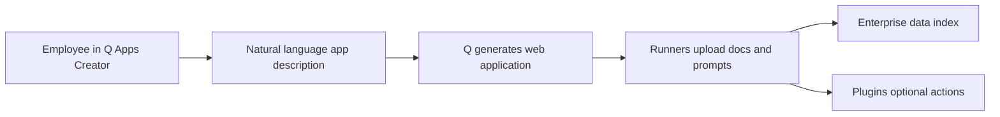
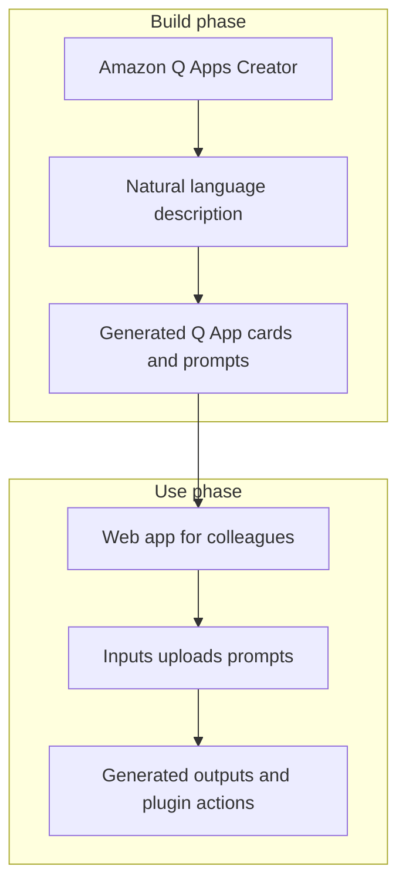

# Amazon Q Apps

## What this lecture covers

<a href="https://docs.aws.amazon.com/amazonq/latest/qbusiness-ug/purpose-built-qapps.html">Amazon Q Apps</a> are a **Q Business** capability for building **generative AI–powered web apps without coding**—using **natural language** in the <a href="https://docs.aws.amazon.com/amazonq/latest/qbusiness-ug/purpose-built-qapps-web-experience.html">Amazon Q Apps Creator</a>. The lecture explains how employees describe the app they want, how Q **auto-generates** a runnable web application grounded in **company data**, and how **plugins** let non-developers ship quick workflow apps.

## Key definitions (from the lecture)

| Term | Definition |
|---|---|
| <a href="https://docs.aws.amazon.com/amazonq/latest/qbusiness-ug/purpose-built-qapps.html">**Amazon Q Apps**</a> | Lightweight, purpose-built Gen AI apps **inside** your Amazon Q Business environment—created by business users, not a separate dev project. |
| **Part of Q Business** | Q Apps inherit the same **enterprise knowledge**, connectors, and security model as the employee assistant; they are not a standalone product silo. |
| <a href="https://docs.aws.amazon.com/amazonq/latest/qbusiness-ug/purpose-built-qapps-web-experience.html">**Amazon Q Apps Creator**</a> | Web UI in the Q Business **web experience** where users **describe** the app they want (natural-language prompt) and refine the generated design. |
| **No-code / natural language only** | Users do **not** write application code; they specify intent in plain language and work with generated UI building blocks. |
| **Company data grounding** | Generated apps operate over **your organization’s internal data** (indexed via Q Business data sources)—not generic public-model knowledge alone. |
| <a href="https://docs.aws.amazon.com/amazonq/latest/qbusiness-ug/qapps-plugins.html">**Plugins**</a> | Integrations (from the Q Business plugin model) that let a Q App **take action** in external systems—not only read and summarize indexed content. |
| **Auto-generated web application** | After you describe the app, Q produces a **web app** end users can run—for example **uploading documents**, filling **prompts**, and consuming **generated outputs**. |

## Key distinctions / comparisons

| Item | Notes |
|---|---|
| **Amazon Q Business chat vs Q Apps** | Chat is **conversational** Q&A and tasks in the moment. Q Apps **package** a repeatable workflow into a **reusable web app** others can run without re-prompting from scratch. |
| **Q Apps vs custom Bedrock / AgentCore builds** | Q Apps target **citizen builders**—fast, no developers. Custom agents (see [LLM Agents in Bedrock](../01-llm-agents-in-bedrock/index.md) and [Amazon AgentCore Introduction](../06-amazon-agentcore-introduction/index.md)) trade speed for **full control** over orchestration, models, and governance. |
| **Company data vs plugins** | **Data sources / index** ground answers in **internal** documents. **Plugins** **create or update** records in tools (tickets, CRM, etc.)—the lecture calls out **both** for practical apps. |
| **Creator prompt vs running the app** | In **Creator**, you **describe** what to build. In the **published app**, colleagues **execute** the workflow (uploads, inputs, outputs)—no app coding required for either role. |

## The problem (why you need it)

- Many useful workflows are **repeatable** (onboarding checklists, branded social posts, document review templates) but today live as **ad hoc chat threads** or **manual copy-paste** between tools.
- Shipping even a simple internal web form historically required **developers**, backlogs, and maintenance—too slow for team-level experiments.
- Employees need apps that respect **the same internal data and permissions** as Q Business, not shadow IT tools pasted into public chatbots.
- Teams want to **compose** retrieval over company knowledge **and** **actions** (plugins) in one experience—without wiring APIs by hand.

## The solution

- **Q Apps** let anyone in the company describe an app in **natural language** via **Amazon Q Apps Creator**.
- Q **generates** a web application automatically—supporting patterns like **document upload**, **prompt inputs**, and **generated responses** for end users.
- Apps are **grounded in company data** already connected to Q Business, and can **leverage plugins** for third-party actions.
- Goal from the lecture: **very quick apps without developers**—democratizing Gen AI workflows on trusted enterprise data.



### How Creator fits the Q Business web experience

Per AWS documentation, users reach Q Apps from the Q Business **web experience** (authenticated via <a href="https://docs.aws.amazon.com/singlesignon/latest/userguide/what-is.html">IAM Identity Center</a>): open the experience URL, choose **Apps**, then use **Amazon Q Apps Creator** to describe requirements—or promote a useful **chat conversation** into an app with **Create Amazon Q App**. That matches the lecture flow: **describe once**, **run many times** as a published app.



## Generated app building blocks (AWS model)

The lecture cites **upload a document**, **prompts**, and user-facing interaction. In the product, generated apps are composed of **cards** (UI steps) such as **input**, **file upload**, **text output**, and **plugin** cards—each card’s **prompt** can reference enterprise data or approved **data sources**. You do not need to implement this layout manually; Creator **pre-fills** prompts when it generates the app.

| Card type (conceptual) | Role |
|---|---|
| **Input** | Collect user parameters (names, dates, product details). |
| **File upload** | Ingest documents the workflow should process (lecture example). |
| **Text output** | Gen AI steps driven by **prompt** instructions over company data. |
| **Plugin** | Call <a href="https://docs.aws.amazon.com/amazonq/latest/qbusiness-ug/built-in-plugin.html">built-in</a> or <a href="https://docs.aws.amazon.com/amazonq/latest/qbusiness-ug/custom-plugin.html">custom</a> Q Business plugins for actions. |

## Plugins in Q Apps

The lecture stresses **leveraging plugins** so apps are not read-only. Examples in AWS docs include **Jira ticket creation** alongside generated emails—same plugin surface as [Amazon Q Business](../14-amazon-q-business/index.md), configured for the app’s **plugin cards**. For OpenAPI-style custom integrations, see [OpenAPI and Tool Usage](../12-openapi-and-tool-usage/index.md).

## How to apply it

Describe the app in Creator the way the lecture suggests—plain language, focused on **workflow** and **data**:

```text
Build an app for HR onboarding: collect the new hire name, department,
and start date; generate a welcome email in our company tone; and create
an IT equipment Jira ticket. Use our internal HR policy data for wording.
```

After generation, teammates **run** the app from the **Apps** library (publish/share per your org’s Q Business settings). Admins may **verify** trusted apps for discoverability—see <a href="https://docs.aws.amazon.com/amazonq/latest/qbusiness-ug/verfied-apps-management.html">Verified Amazon Q Apps</a>.

## Examples

1. **Document + prompt workflow (lecture)** — Creator builds an app where users **upload a document**, supply **prompts**, and receive tailored Gen AI output—no custom frontend code.
2. **Marketing content (AWS doc pattern)** — Input card for product name/features → output cards for **on-brand** post and **social-short** variant, grounded in style guides indexed in Q Business.
3. **HR onboarding (AWS doc pattern)** — Inputs for employee metadata → **plugin** card for IT ticket → generated welcome email → **file upload** for signed forms—combines **data**, **generation**, and **action** in one app.

## Limitations / edge cases

- **Scope of transcript**: This segment is an **introduction**; operational details (IAM, tiers, sharing policies) live in Q Business admin guides.
- **Subscription**: AWS documents Q Apps for <a href="https://docs.aws.amazon.com/amazonq/latest/qbusiness-ug/tiers.html#managing-sub-tiers">Amazon Q Business Pro</a> users—Lite tiers cannot create/run/view Q Apps per current tier policy.
- **Governance**: Published apps may need **admin verification**; updates can reset verified status until re-approved.
- **Not a replacement for full custom development** — Complex multi-system orchestration, bespoke UIs, or fine-grained model control still point to **Bedrock**, **AgentCore**, or traditional engineering.

## Key takeaways

- **Amazon Q Apps** extend **Q Business** so **any employee** can build Gen AI web apps **without coding**.
- Use **Amazon Q Apps Creator** and **natural language** to describe the app; Q **auto-generates** the runnable web experience.
- Apps use **company internal data** plus optional **plugins** for real-world actions.
- The value proposition is **speed and accessibility**: quick, repeatable workflows **without pulling developers** off platform work—while staying inside the enterprise Q Business boundary.

## Industry scenarios

1. **Retail operations** — Store managers describe a “weekly sales summary by region” app in Creator; field leaders upload their CSV notes and run the same prompts every Monday, grounded in the **approved regional data source** instead of the full corporate index.
2. **Financial services compliance** — Analysts publish a Q App that uploads policy PDFs and runs standardized **extraction prompts** for control testing; **plugins** file findings into the ticketing system while **IAM Identity Center** limits who can run the app.
3. **Technology company enablement** — Developer advocates convert a high-value **Q Business chat** about release notes into a **Create Amazon Q App** flow so PMs generate consistent customer-facing bullets from **internal Confluence** data without opening a Jira story for a internal tool team.

## Internal References

- [Amazon Q Business](../14-amazon-q-business/index.md)
- [OpenAPI and Tool Usage](../12-openapi-and-tool-usage/index.md)
- [LLM Agents in Bedrock](../01-llm-agents-in-bedrock/index.md)
- [Amazon AgentCore Introduction](../06-amazon-agentcore-introduction/index.md)
- [Model Context Protocol (MCP)](../11-model-context-protocol-mcp/index.md)

## External References

- <a href="https://docs.aws.amazon.com/amazonq/latest/qbusiness-ug/purpose-built-qapps.html">Creating purpose-built Amazon Q Apps</a>
- <a href="https://docs.aws.amazon.com/amazonq/latest/qbusiness-ug/purpose-built-qapps-web-experience.html">Using the web experience to create and run Amazon Q Apps</a>
- <a href="https://docs.aws.amazon.com/amazonq/latest/qbusiness-ug/qapps-plugins.html">Using plugins in Amazon Q Apps</a>
- <a href="https://docs.aws.amazon.com/amazonq/latest/qbusiness-ug/purpose-built-qapps-prerequisites.html">Prerequisites for Amazon Q Apps</a>
- <a href="https://docs.aws.amazon.com/amazonq/latest/qbusiness-ug/purpose-built-qapps-manage.html">Managing Amazon Q Apps</a>
- <a href="https://docs.aws.amazon.com/amazonq/latest/qbusiness-ug/qapps-private-sharing.html">Sharing Amazon Q Apps</a>
- <a href="https://docs.aws.amazon.com/amazonq/latest/qbusiness-ug/verfied-apps-management.html">Understanding and managing Verified Amazon Q Apps</a>
- <a href="https://docs.aws.amazon.com/amazonq/latest/qbusiness-ug/q-apps-forms.html">Data collection in Amazon Q Apps</a>
- <a href="https://docs.aws.amazon.com/amazonq/latest/qbusiness-ug/deploy-q-apps-iam-permissions.html">IAM permissions for using Amazon Q Apps</a>
- <a href="https://docs.aws.amazon.com/amazonq/latest/qbusiness-ug/what-is.html">What is Amazon Q Business?</a>
- <a href="https://docs.aws.amazon.com/amazonq/latest/qbusiness-ug/plugins.html">Plugins</a>
- <a href="https://docs.aws.amazon.com/amazonq/latest/api-reference/API_Operations_QApps.html">Amazon Q Apps API operations</a>
