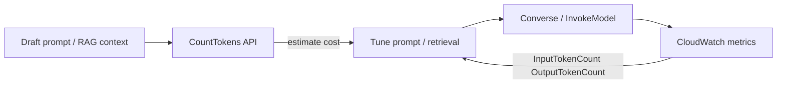
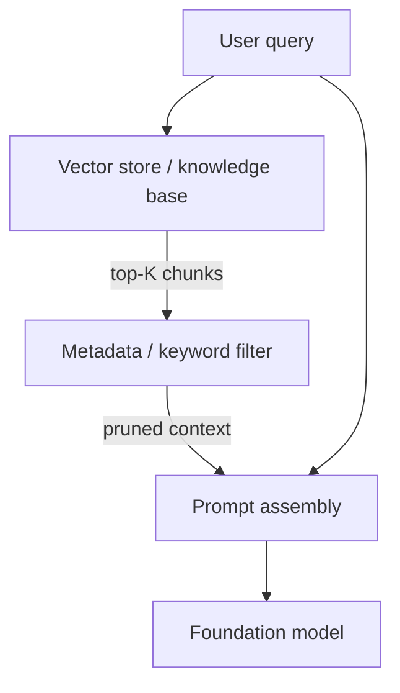
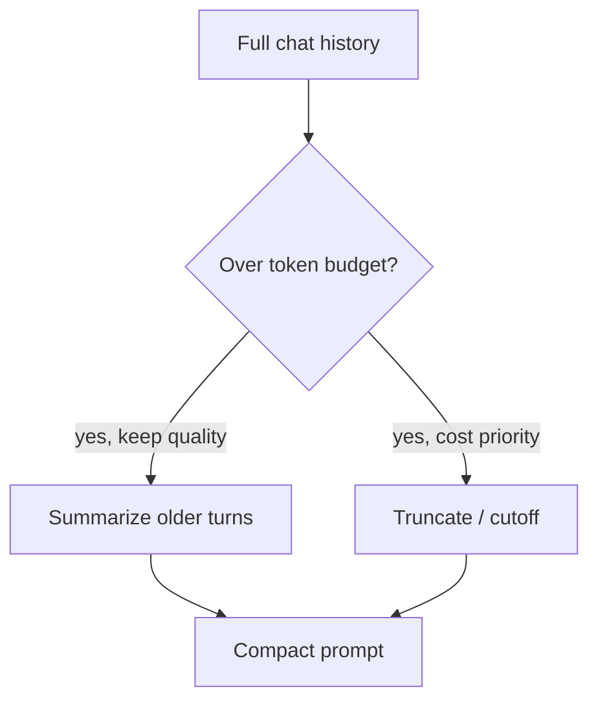
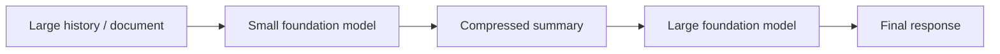

# Token Efficiency

## What this lecture covers

Foundation models bill by the **token**, so controlling how many tokens go **in** and **out** is one of the first levers for cost control. This lecture walks through **measuring** token usage with <a href="https://docs.aws.amazon.com/bedrock/latest/userguide/count-tokens.html">Amazon Bedrock CountTokens</a> and <a href="https://docs.aws.amazon.com/bedrock/latest/userguide/monitoring.html">CloudWatch runtime metrics</a>, then applying **context pruning**, **conversation-history management**, **response limits**, **prompt compression**, and **RAG/knowledge-base** patterns to reduce waste.

## Key definitions (from the lecture)

| Term | Definition |
|---|---|
| **Token efficiency** | Minimizing input and output tokens while preserving the quality your application needs—directly lowers inference cost. |
| <a href="https://docs.aws.amazon.com/bedrock/latest/userguide/count-tokens.html">**CountTokens API**</a> | Bedrock API that returns how many tokens a given prompt/request would consume **without running inference**; the lecture notes it is **free** for experimentation. |
| **Context window optimization / context pruning** | Trimming or limiting the extra context injected into a prompt (RAG chunks, chat history, embedded documents) so tokens are not spent on low-value material. |
| **Response limiting** | Constraining model output length via inference parameters, prompt instructions, examples, or structured formats. |
| **Prompt compression** | Running a **smaller/cheaper** model first to summarize large history or documents before sending a shorter payload to a larger model. |

## Key distinctions / comparisons

| Item | Notes |
|---|---|
| **Measure vs optimize** | You cannot tune what you do not measure—CountTokens and CloudWatch come first; optimization techniques follow. |
| **Input tokens vs output tokens** | Both are billed; RAG and chat history mostly inflate **input**; verbosity controls target **output**. |
| **CountTokens vs actual inference** | CountTokens estimates the same tokenization the model would charge for, but does not execute the request. |
| **Prompt instruction vs `max_tokens`** | “Respond in 50 words” adds input tokens but often saves more on output; `max_tokens` is a hard inference cap. |
| **Full document in prompt vs knowledge base** | Stuffing an entire document into the prompt is token-heavy; <a href="https://docs.aws.amazon.com/bedrock/latest/userguide/kb-how-retrieval.html">knowledge-base retrieval</a> returns only relevant **chunks**. |
| **Prompt compression trade-off** | Saves tokens on the big model but adds **latency** and **cost** from the summarizer—only worthwhile when savings exceed that overhead. |

## The problem (why you need it)

- Models charge **per token** for input and output; unbounded prompts and verbose answers accumulate quickly at scale.
- In RAG apps, the **prompt itself** may be small while **retrieved context** dominates token count.
- Long **multi-turn chats** re-send full conversation history on every turn, growing input size linearly.
- Without measurement, teams guess at prompt size, model choice, and retrieval settings instead of comparing alternatives objectively.

## Measure first: CountTokens and CloudWatch

**Measuring is the first step to optimizing.** Bedrock makes pre-flight measurement straightforward.

### CountTokens API

The <a href="https://docs.aws.amazon.com/bedrock/latest/APIReference/API_runtime_CountTokens.html">CountTokens</a> operation returns the token count for a given request **without invoking** the model. Use it to:

- **Compare models** — different models tokenize differently; test which tokenizes your prompts more efficiently.
- **Fit prompts to limits** — tune prompts to stay within a budget, a smaller model’s context window, or application constraints.
- **Experiment cheaply** — iterate on prompt wording and see token impact before paying for inference.

```python
import boto3
import json

client = boto3.client("bedrock-runtime", region_name="us-east-1")

body = {
    "messages": [{"role": "user", "content": [{"text": "Summarize our Q3 policy updates in 3 bullets."}]}],
    "system": [{"text": "You are a concise compliance assistant."}],
}

response = client.count_tokens(
    modelId="anthropic.claude-3-haiku-20240307-v1:0",
    body=json.dumps(body),
)
print(response["inputTokens"])  # compare variants before Converse/InvokeModel
```

### CloudWatch runtime metrics

<a href="https://docs.aws.amazon.com/AmazonCloudWatch/latest/monitoring/WhatIsCloudWatch.html">Amazon CloudWatch</a> tracks **production** token usage and related performance signals under Bedrock runtime metrics (namespace `AWS/Bedrock`, dimension `ModelId`):

| Metric | What it tells you |
|---|---|
| [**InputTokenCount**](https://docs.aws.amazon.com/bedrock/latest/userguide/monitoring.html#runtime-cloudwatch-metrics) | Tokens sent **into** the model — critical for cost and context sizing. |
| [**CacheWriteInputTokens**](https://docs.aws.amazon.com/bedrock/latest/userguide/monitoring.html#runtime-cloudwatch-metrics) | Tokens written to the **prompt cache** on this request — count toward TPM quota. |
| [**CacheReadInputTokens**](https://docs.aws.amazon.com/bedrock/latest/userguide/monitoring.html#runtime-cloudwatch-metrics) | Tokens read from the **prompt cache** — reduced rate; do not count toward TPM quota. |
| [**OutputTokenCount**](https://docs.aws.amazon.com/bedrock/latest/userguide/monitoring.html#runtime-cloudwatch-metrics) | Tokens generated **out** — tracks verbosity and `max_tokens` effectiveness. |
| [**OutputImageCount**](https://docs.aws.amazon.com/bedrock/latest/userguide/monitoring.html#runtime-cloudwatch-metrics) | Images in the output (image-generation models only) — output volume separate from text tokens. |
| [**EstimatedTPMQuotaUsage**](https://docs.aws.amazon.com/bedrock/latest/userguide/monitoring.html#runtime-cloudwatch-metrics) | Approximate TPM consumption across Converse / Invoke APIs — useful for trends; not the same as reservation-based throttling (input + `max_tokens`). |
| [**Invocations**](https://docs.aws.amazon.com/bedrock/latest/userguide/monitoring.html#runtime-cloudwatch-metrics) | Successful request volume. |
| [**InvocationLatency**](https://docs.aws.amazon.com/bedrock/latest/userguide/monitoring.html#runtime-cloudwatch-metrics) | End-to-end time until the **last** token (streaming or not). |
| [**TimeToFirstToken**](https://docs.aws.amazon.com/bedrock/latest/userguide/monitoring.html#runtime-cloudwatch-metrics) | Delay before the **first** streamed token — key to perceived responsiveness. |
| [**InvocationThrottles**](https://docs.aws.amazon.com/bedrock/latest/userguide/monitoring.html#runtime-cloudwatch-metrics) | Rate-limit events at the model. |
| [**InvocationClientErrors** / **InvocationServerErrors**](https://docs.aws.amazon.com/bedrock/latest/userguide/monitoring.html#runtime-cloudwatch-metrics) | Failed calls to diagnose. |
| [**LegacyModelInvocations**](https://docs.aws.amazon.com/bedrock/latest/userguide/monitoring.html#runtime-cloudwatch-metrics) | Invocations against models in **Legacy** lifecycle — track migration before retirement. |

Use these metrics to compare application designs, prompt strategies, and models in live traffic—not only in pre-flight CountTokens experiments.



## Context window optimization and pruning

Often the **bulk of tokens is not the user prompt** but **injected context**—especially in RAG and knowledge-base workflows.

### RAG and knowledge bases

When using <a href="https://docs.aws.amazon.com/bedrock/latest/userguide/kb-how-retrieval.html">retrieval augmented generation</a>, the vector store returns ancillary chunks that get pasted into the prompt. Levers from the lecture:

| Lever | Effect |
|---|---|
| **Chunk size vs relevancy** | Smaller chunks can be precise but may lack context; larger chunks add tokens—balance size with retrieval quality (see [Managing Chunking Strategies with Bedrock](../../section-1/managing-chunking-strategies-with-bedrock/index.md)). |
| **Limit number of retrieved chunks** | Do you need top **10** results, or will top **2** or **5** suffice? This is a major cost lever. |
| **Metadata filtering** | Drop irrelevant chunks before they reach the prompt. **Hybrid search** (vector distance **plus** keyword relevance) can surface mismatches you filter out, saving tokens. |



Configure retrieval limits and filters via the <a href="https://docs.aws.amazon.com/bedrock/latest/userguide/kb-test-retrieve.html">Retrieve API</a>; attach <a href="https://docs.aws.amazon.com/bedrock/latest/userguide/kb-metadata.html">metadata</a> at ingestion time so filters are meaningful.

### Conversation history and embedded documents

Outside RAG, **past conversation turns** and **documents pasted into the chat** also consume tokens on every request because short-term memory is re-included in the prompt.

| Technique | Behavior |
|---|---|
| **Summarize older turns** | As chats grow, replace detailed older history with a generated summary—“safely forget” fine details while keeping gist. |
| **Hard context cutoff** | Beyond a size or turn threshold, drop everything older—a blunt but effective cost trade-off. |

See [Short and Long-Term Agent Memory](../../section-3/03-short-and-long-term-agent-memory/index.md) for how session history is assembled into prompts.



## Response size controls (output side)

Optimizing **output** tokens complements input-side pruning.

| Approach | Notes |
|---|---|
| **`max_tokens` inference parameter** | Most models honor a cap on generated tokens (see <a href="https://docs.aws.amazon.com/bedrock/latest/userguide/quotas-token-burndown.html">how `max_tokens` affects quota and burndown</a>). |
| **Explicit length in the prompt** | e.g. “Respond in 50 words or fewer”—uses a few **input** tokens but often saves more on **output**. |
| **Few-shot verbosity examples** | Show the desired level of detail when a word/token count alone is insufficient ([Prompt Best Practices](../../section-1/prompt-best-practices/index.md)). |
| **Structured output (JSON)** | <a href="https://docs.aws.amazon.com/bedrock/latest/userguide/structured-output.html">Structured outputs</a> constrain format and length, reducing rambling prose. |

```python
# Converse-style inference config — cap output tokens
inference_config = {"maxTokens": 256, "temperature": 0.2}

# Prompt-level constraint (often paired with maxTokens)
user_message = (
    "List three risks from the attached policy excerpt. "
    "Respond in JSON: {\"risks\": [\"...\"]}. Max 50 words total."
)
```

## Prompt compression

When chat history or embedded documents are **large**, send them through a **smaller model** first to produce a **summary**, then pass the summary to the expensive model.

**Trade-offs the lecture highlights:**

- **Cost** — the small-model call must cost **less** than the tokens you would have spent on the large model.
- **Latency** — you wait for summarization **before** the main call, hurting responsiveness.
- **Quality** — summarization may drop nuance needed for the final answer.

Use when **token savings matter more** than minimum latency or when traffic is batch-oriented.



## Prefer knowledge bases over full-document prompts

It is tempting to paste an **entire document** into the prompt. RAG and <a href="https://docs.aws.amazon.com/bedrock/latest/userguide/knowledge-base-create.html">Amazon Bedrock Knowledge Bases</a> exist so you **chunk** content in an external store and retrieve **only relevant bits** at query time— the core token-efficiency story for document Q&A.

## Examples

**1. Pre-flight prompt A/B test**

Use CountTokens to compare two system prompts for the same user question; pick the shorter variant if quality is equivalent.

**2. Retrieval top-K tuning**

Start with `numberOfResults=10` in Retrieve, measure `InputTokenCount` in CloudWatch, then try `5` and `2` and compare answer quality in your test set.

**3. Streaming responsiveness**

Watch **TimeToFirstToken** while tightening `max_tokens` and prompt verbosity—users feel latency at stream start, not only at full completion.

## Limitations / edge cases

- CountTokens is **model-specific**; counts from one model do not transfer to another.
- Some Anthropic Claude models require token counting via the **`bedrock-mantle`** endpoint instead of `bedrock-runtime` (see AWS docs on your model).
- Aggressive **summarization** or **cutoff** can drop facts the user still needs—validate with real conversations.
- **Prompt compression** adds a serial step; not ideal for sub-second interactive UX unless async or cached.
- **`max_tokens` too low** can truncate answers mid-thought; balance cost with completeness.
- Metadata filters and hybrid search only help when **metadata and keywords** are populated at ingestion time.

## Key takeaways

- **Measure before optimize** — CountTokens for experiments; CloudWatch for production input/output tokens, latency, and errors.
- **RAG context is often the biggest input cost** — tune chunk size, **top-K**, and filters before rewriting the user prompt.
- **Long chats need a memory strategy** — summarize or truncate older turns instead of replaying full history forever.
- **Control output** with `max_tokens`, concise instructions, examples, and **JSON/structured output**.
- **Prompt compression** can work but weigh small-model cost and added latency against savings on the large model.
- **Knowledge bases beat whole-document prompts** for token efficiency at scale.

## Industry scenarios

- **Customer-support chatbot (retail):** The team sees `InputTokenCount` spike after enabling RAG with top-10 chunks. They reduce to top-3, add metadata filters on product line, and use CountTokens in CI to reject prompt templates that exceed 8K tokens—cutting monthly Bedrock spend without changing the foundation model.

- **Legal document review (professional services):** Associates paste full contracts into chat early in the pilot. Engineering moves corpora into a Bedrock Knowledge Base with hierarchical chunking, summarizes prior case discussion after 20 turns, and sets `max_tokens` plus JSON output for clause extractions—keeping answers short and machine-parseable.

- **Internal coding assistant (technology):** CloudWatch shows high **TimeToFirstToken** and output tokens from verbose explanations. They add few-shot “concise answer” examples, enable structured JSON for tool calls, and run a Haiku summarization pass on repository context before Sonnet generates the patch—accepting slightly higher latency on large repos for lower per-request token cost.

## Internal References

- [Retrieval Augmented Generation (RAG)](../../section-1/retrieval-augmented-generation-rag/index.md)
- [Pre-Retrieval and Chunking Strategies](../../section-1/pre-retrieval-and-chunking-strategies/index.md)
- [Managing Chunking Strategies with Bedrock](../../section-1/managing-chunking-strategies-with-bedrock/index.md)
- [Hands-On with Knowledge Bases](../../section-1/hands-on-with-knowledge-bases/index.md)
- [Using and Tuning OpenSearch as a Vector Store](../../section-2/23-using-and-tuning-opensearch-as-a-vector-store/index.md)
- [Prompt Best Practices](../../section-1/prompt-best-practices/index.md)
- [Short and Long-Term Agent Memory](../../section-3/03-short-and-long-term-agent-memory/index.md)
- [Cost-Effective Model Selection](../02-cost-effective-model-selection/index.md)
- [Intelligent Caching Systems for GenAI](../04-intelligent-caching-systems-for-genai/index.md)
- [Building Responsive AI Systems](../05-building-responsive-ai-systems/index.md)

## External References

- <a href="https://docs.aws.amazon.com/bedrock/latest/userguide/count-tokens.html">Monitor your token usage by counting tokens before running inference</a>
- <a href="https://docs.aws.amazon.com/bedrock/latest/APIReference/API_runtime_CountTokens.html">CountTokens API reference</a>
- <a href="https://docs.aws.amazon.com/bedrock/latest/userguide/monitoring.html">Monitoring the performance of Amazon Bedrock</a>
- <a href="https://docs.aws.amazon.com/bedrock/latest/userguide/quotas-token-burndown.html">How tokens are counted in Amazon Bedrock</a>
- <a href="https://docs.aws.amazon.com/bedrock/latest/userguide/inference.html">Making inference requests</a>
- <a href="https://docs.aws.amazon.com/bedrock/latest/userguide/kb-how-retrieval.html">Retrieving information from data sources using Amazon Bedrock Knowledge Bases</a>
- <a href="https://docs.aws.amazon.com/bedrock/latest/userguide/kb-test-retrieve.html">Query a knowledge base and retrieve data</a>
- <a href="https://docs.aws.amazon.com/bedrock/latest/userguide/kb-metadata.html">Include metadata in a data source to improve knowledge base query</a>
- <a href="https://docs.aws.amazon.com/bedrock/latest/userguide/structured-output.html">Get validated JSON results from models</a>
- <a href="https://docs.aws.amazon.com/AmazonCloudWatch/latest/monitoring/WhatIsCloudWatch.html">What is Amazon CloudWatch</a>
