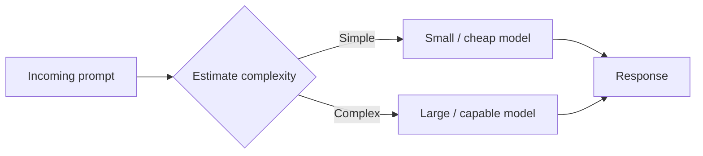
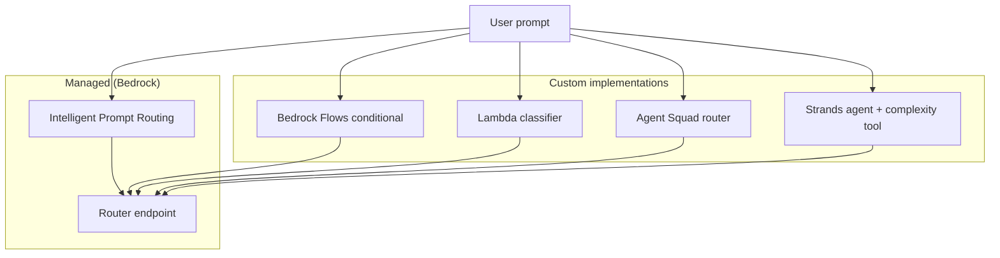
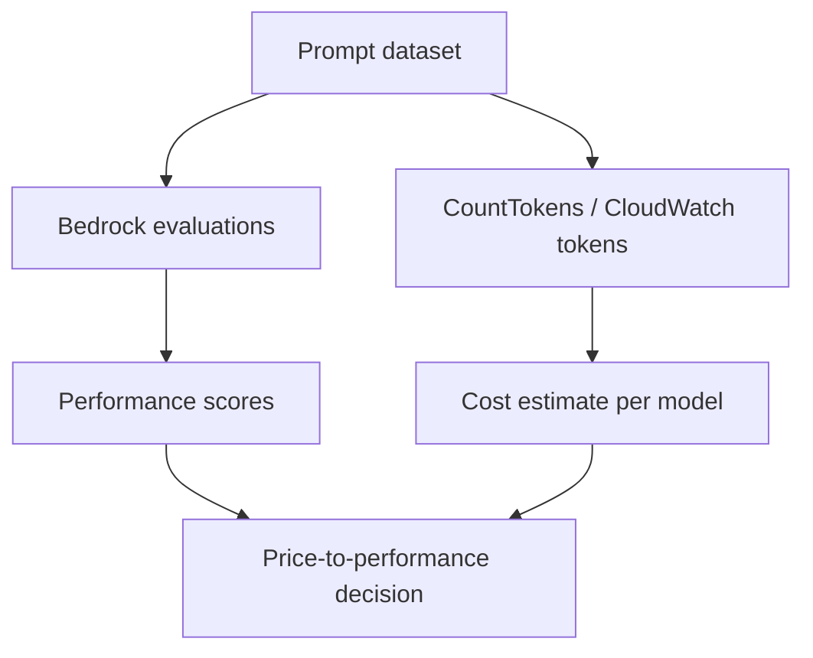

# Cost-Effective Model Selection

## What this lecture covers

Minimizing token counts is one cost lever; **which foundation model you invoke** is the other. This lecture walks through **cost–capability trade-offs**, when a **smaller/cheaper model** is enough, **dynamic routing** (including <a href="https://docs.aws.amazon.com/bedrock/latest/userguide/prompt-routing.html">Intelligent Prompt Routing</a>), and how to measure **price-to-performance** with <a href="https://docs.aws.amazon.com/bedrock/latest/userguide/evaluation.html">Amazon Bedrock evaluations</a> plus token counting.

## Key definitions (from the lecture)

| Term | Definition |
|---|---|
| **Cost-effective model selection** | Choosing a foundation model whose **capability matches the task** so you are not paying premium per-token rates when a smaller model suffices. |
| **Cost–capability trade-off** | Larger, newer models generally cost **more per token** but handle harder reasoning; you decide whether your workload truly needs that level of “smarts.” |
| <a href="https://docs.aws.amazon.com/bedrock/latest/userguide/prompt-routing.html">**Intelligent Prompt Routing**</a> | A managed Bedrock feature that **analyzes prompt complexity** and routes each request to an **appropriate model tier** within a family—optimizing cost without always invoking the most expensive model. |
| **Dynamic routing** | Runtime logic that inspects an incoming prompt (or metadata) and **selects the model** (or agent) with the right complexity/cost profile for that request. |
| **Price-to-performance ratio** | The balance between **estimated cost** (tokens × model price) and **measured quality** (evaluations, human or LLM judges, predefined metrics). |
| <a href="https://docs.aws.amazon.com/bedrock/latest/userguide/evaluation.html">**Amazon Bedrock evaluations**</a> | Bedrock tooling to **measure model and RAG performance**—including human workers, LLM-as-judge scoring, and built-in metrics—with reports you can use to **compare** alternatives. |

## Key distinctions / comparisons

| Item | Notes |
|---|---|
| **Token efficiency vs model selection** | [Token Efficiency](../01-token-efficiency/index.md) shrinks how many tokens you send/receive; model selection changes **how much each token costs**. Use both levers together. |
| **Application “smarts” vs model size** | In many RAG and tool-using apps, intelligence comes from **retrieved data** ([knowledge bases](../../section-1/retrieval-augmented-generation-rag/index.md)) or **tools**, not PhD-level reasoning inside the FM—so a cheaper model may suffice for generation. |
| **User-facing generation vs pre-processing** | **Summarization, compression, classification, and chunking** are tasks FMs have handled well for years; the lecture recommends **cheaper/older models** for these pipeline stages, reserving premium models for hard reasoning. |
| **Managed routing vs DIY routing** | **Intelligent Prompt Routing** is turn-key in Bedrock; **Flows conditionals**, **Lambda**, **Agent Squad**, and **Strands Agents** let you build custom classifiers and routers. |
| **Subjective quality vs measurable quality** | LLM output quality is often subjective; Bedrock evaluations add **human judges**, **LLM judges**, and **predefined metrics** so trade-offs are data-informed—not guesswork. |

## The problem (why you need it)

- Different <a href="https://docs.aws.amazon.com/bedrock/latest/userguide/foundation-models-reference.html">foundation models</a> bill at **different per-token rates**; always picking the latest largest model wastes money at scale.
- Many production apps do not need maximum reasoning—the **knowledge base**, **tools**, or **workflow** carry most of the value.
- Pre-processing steps (summarize, classify, chunk) run **on every document or turn**; over-provisioning model tier there multiplies cost quickly.
- Without **dynamic routing**, simple prompts pay the same unit economics as complex ones.
- Cost tuning can **hurt quality** if you never measure performance—you need a deliberate **price-to-performance** feedback loop.

## Cost–capability trade-offs

**Ask: do I really need this big, expensive model?** Not every application requires the highest reasoning tier. When answers come primarily from:

- **Retrieved context** in a <a href="https://docs.aws.amazon.com/bedrock/latest/userguide/kb-how-retrieval.html">Bedrock Knowledge Base</a>, or
- **Tool outputs** (APIs, databases, calculators),

…the model’s job may be **synthesis and formatting**, not deep novel reasoning. In those cases, a **smaller model** is often sufficient.

For **pre-processing** workloads—summarization, compression, classification, chunking—you typically do **not** need the newest flagship model. These are well-understood FM tasks; routing them to a **lower-cost tier** is a high-impact savings opportunity.

```python
# Illustrative tier split: cheap model for pipeline prep, premium for hard Q&A
PREPROCESS_MODEL = "anthropic.claude-3-haiku-20240307-v1:0"   # classify / summarize / chunk
REASONING_MODEL = "anthropic.claude-3-5-sonnet-20241022-v2:0"  # complex user-facing answers

def handle_query(user_prompt: str, retrieved_chunks: list[str]) -> str:
    # Haiku: classify intent and compress history (cheap, high volume)
    intent = classify_intent(PREPROCESS_MODEL, user_prompt)
    if intent in {"simple_faq", "status_lookup"}:
        return converse(PREPROCESS_MODEL, user_prompt, retrieved_chunks)
    return converse(REASONING_MODEL, user_prompt, retrieved_chunks)
```

## Dynamic routing

Sometimes you **cannot know upfront** which model tier a prompt needs. **Dynamic routing** inspects each request and sends it to a model (or agent) with appropriate capability—similar to how consumer chat products route to the **least expensive model that can do the job**.



### Intelligent Prompt Routing (managed)

<a href="https://docs.aws.amazon.com/bedrock/latest/userguide/prompt-routing.html">Intelligent Prompt Routing</a> is built into Bedrock: enable a **prompt router**, and Bedrock **predicts response quality** per candidate model and routes to the best **quality–cost** match within a model family. AWS documents **default** and **configured** prompt routers, plus fallback behavior when routing criteria are not met.

Benefits called out in AWS docs align with the lecture: **optimized quality and cost**, **no custom orchestration code**, and incorporation of **new models** as they become available. See also the **prompt router** models in the <a href="https://docs.aws.amazon.com/bedrock/latest/userguide/playgrounds.html">Bedrock playground</a>.

### DIY routing patterns

If you are not using Intelligent Prompt Routing, the same idea can be implemented several ways:

| Approach | How routing works |
|---|---|
| <a href="https://docs.aws.amazon.com/bedrock/latest/userguide/flows-how-it-works.html">**Amazon Bedrock Flows**</a> | Use a **conditional** node (e.g., a **prompt classifier** agent) to branch: “if this kind of prompt → model A; otherwise → model B.” |
| <a href="https://docs.aws.amazon.com/lambda/latest/dg/welcome.html">**AWS Lambda**</a> | Intercept the prompt, run arbitrary logic (rules, lightweight classifier, heuristics), then invoke the chosen `modelId` via the runtime API. |
| [Agent Squad](../../section-3/05-agent-squad/index.md) | Built for **prompt-based routing**: classify intent, pick one specialist agent/model, return that agent’s output. |
| [Strands Agents](../../section-3/02-multi-agent-workflows/index.md) | Implement routing in the agent loop—especially when an agent has a **tool to score prompt complexity** and delegates to another agent or model tier. |



Dynamic routing is a **primary cost lever** at scale: you stop paying flagship rates for prompts that a smaller model handles well.

## Measuring price-to-performance

Cost optimization without measurement is blind. The lecture emphasizes a repeatable loop:

1. **Measure performance** of candidate models on **your prompts** (not generic benchmarks alone).
2. **Estimate cost** per prompt with token counting × model pricing.
3. **Compare** price-to-performance and pick informed trade-offs.



### Amazon Bedrock evaluations

<a href="https://docs.aws.amazon.com/bedrock/latest/userguide/evaluation.html">Amazon Bedrock evaluations</a> measures how well models (and knowledge bases) perform on tasks you care about. Quality is often **subjective**, so Bedrock supports multiple evaluation modes:

| Mode | What it does |
|---|---|
| <a href="https://docs.aws.amazon.com/bedrock/latest/userguide/evaluation-human.html">**Human workers**</a> | People rate which responses are better—employees or domain experts via a configured work team. |
| <a href="https://docs.aws.amazon.com/bedrock/latest/userguide/evaluation-judge.html">**LLM as judge**</a> | A second foundation model scores and explains the quality of another model’s (or system’s) responses. |
| <a href="https://docs.aws.amazon.com/bedrock/latest/userguide/evaluation-automatic.html">**Automatic / built-in metrics**</a> | Predefined metrics on programmatic evaluation jobs (e.g., task-specific scores on custom or built-in datasets). |

Use evaluation **reports** in the console or S3 to **visualize and compare** how different models perform on the same prompts—pair those results with [Token Efficiency](../01-token-efficiency/index.md) measurements:

- **Price side:** `input_tokens + output_tokens` × per-model rate (from the <a href="https://aws.amazon.com/bedrock/pricing/">Amazon Bedrock pricing page</a> and your <a href="https://docs.aws.amazon.com/bedrock/latest/userguide/count-tokens.html">CountTokens</a> / <a href="https://docs.aws.amazon.com/bedrock/latest/userguide/monitoring.html">CloudWatch</a> data).
- **Performance side:** evaluation scores from human judges, LLM judges, or automatic metrics.

That pairing is how you optimize **informed trade-offs** between cost and quality.

## Examples

**1. RAG customer FAQ**

Retrieve chunks from a knowledge base with Haiku; only escalate to Sonnet when the classifier detects policy exceptions or multi-step reasoning. Measure answer quality with an **LLM-as-judge** evaluation job on historical tickets before cutting over.

**2. Document ingestion pipeline**

Use a small model for **chunking labels**, **PII classification**, and **section summarization** on every upload; reserve a larger model for analyst-facing Q&A. CountTokens on sample corpora to quantify savings vs using one model for everything.

**3. Prompt router canary**

Enable **Intelligent Prompt Routing** for a Claude or Nova router family in staging; compare latency, cost, and evaluation scores against a fixed Sonnet-only baseline for two weeks before production rollout.

## Limitations / edge cases

- **Cheaper models can fail** on nuanced reasoning, ambiguous instructions, or low-quality retrieval—validate on **your** prompt set, not assumptions.
- **Routing adds latency and complexity**—custom Lambda/Flow/classifier steps run before inference; Intelligent Prompt Routing adds prediction overhead (usually smaller than always using the largest model).
- **Evaluation is not free**—LLM judges and large evaluation jobs consume tokens; sample strategically.
- **Subjective tasks** (tone, creativity) may need **human evaluations**; automatic metrics alone can miss UX requirements.
- **Model pricing and IDs change**—revisit tier choices when AWS adds models or updates <a href="https://docs.aws.amazon.com/bedrock/latest/userguide/model-lifecycle.html">model lifecycle</a> states.
- **Prompt routers** support specific model families and regions—confirm <a href="https://docs.aws.amazon.com/bedrock/latest/userguide/prompt-routing.html">supported models</a> before designing around them.

## Key takeaways

- **Model selection is the second big cost lever** alongside token efficiency—different models cost different amounts per token.
- **Match model tier to task**: RAG/tool-heavy apps and **pre-processing** stages often tolerate **smaller, cheaper** models.
- **Dynamic routing** sends each prompt to an appropriate tier—use **Intelligent Prompt Routing** or custom **Flows / Lambda / Agent Squad / Strands** patterns.
- **Measure price-to-performance**: Bedrock evaluations for quality + token counting for cost.
- **Compare models on your data** with evaluation reports before downgrading tier in production.
- **Informed trade-offs** beat always using—or always avoiding—the flagship model.

## Industry scenarios

- **Enterprise support chatbot (financial services):** Simple balance and hours questions route through a **Haiku + knowledge base** path; fraud and dispute language triggers **Sonnet**. The team runs **LLM-as-judge** evaluations on 500 anonymized chats monthly and tracks **InputTokenCount** in CloudWatch—cutting average cost per session 40% with no measurable drop in resolution quality.

- **Legal discovery platform (professional services):** Ingestion uses a **small model** for chunking, doc-type classification, and privilege tagging on millions of pages; attorneys query with a **larger model** only in the review UI. A **Bedrock Flows** conditional sends “metadata-only” lookups to the cheap tier automatically.

- **Developer documentation assistant (technology):** The API gateway Lambda scores prompt complexity (length, code blocks, multi-file context) and picks **router vs fixed model ID**. They enable **Intelligent Prompt Routing** for Anthropic tiers in production and use **automatic evaluation jobs** with built-in metrics each release to ensure downgraded routes still meet accuracy thresholds.

## Internal References

- [Token Efficiency](../01-token-efficiency/index.md)
- [Retrieval Augmented Generation (RAG)](../../section-1/retrieval-augmented-generation-rag/index.md)
- [Hands-On with the Bedrock Playground](../../section-1/hands-on-with-the-bedrock-playground/index.md)
- [Multi-Agent Workflows](../../section-3/02-multi-agent-workflows/index.md)
- [Agent Squad](../../section-3/05-agent-squad/index.md)
- [Evaluating RAG Performance](../../section-1/evaluating-rag-performance/index.md)
- [Intelligent Caching Systems for GenAI](../04-intelligent-caching-systems-for-genai/index.md)
- [Optimizing for Specific Use Cases](../07-optimizing-for-specific-use-cases/index.md)

## External References

- <a href="https://docs.aws.amazon.com/bedrock/latest/userguide/foundation-models-reference.html">Using models with Amazon Bedrock</a>
- <a href="https://aws.amazon.com/bedrock/pricing/">Amazon Bedrock pricing</a>
- <a href="https://docs.aws.amazon.com/bedrock/latest/userguide/prompt-routing.html">Understanding intelligent prompt routing in Amazon Bedrock</a>
- <a href="https://docs.aws.amazon.com/bedrock/latest/userguide/playgrounds.html">Amazon Bedrock playgrounds</a>
- <a href="https://docs.aws.amazon.com/bedrock/latest/userguide/flows-how-it-works.html">How Amazon Bedrock Flows works</a>
- <a href="https://docs.aws.amazon.com/lambda/latest/dg/welcome.html">What is AWS Lambda?</a>
- <a href="https://docs.aws.amazon.com/prescriptive-guidance/latest/agentic-ai-frameworks/strands-agents.html">Strands Agents</a>
- <a href="https://docs.aws.amazon.com/prescriptive-guidance/latest/agentic-ai-patterns/workflow-for-routing.html">Workflow for routing (AWS Prescriptive Guidance)</a>
- <a href="https://docs.aws.amazon.com/bedrock/latest/userguide/evaluation.html">Evaluate the performance of Amazon Bedrock resources</a>
- <a href="https://docs.aws.amazon.com/bedrock/latest/userguide/evaluation-judge.html">Evaluate model performance using another LLM as a judge</a>
- <a href="https://docs.aws.amazon.com/bedrock/latest/userguide/evaluation-human.html">Creating a model evaluation that uses human workers</a>
- <a href="https://docs.aws.amazon.com/bedrock/latest/userguide/evaluation-automatic.html">Creating an automatic model evaluation job</a>
- <a href="https://docs.aws.amazon.com/bedrock/latest/userguide/model-evaluation-report.html">Review model evaluation job reports and metrics</a>
- <a href="https://docs.aws.amazon.com/bedrock/latest/userguide/count-tokens.html">Count tokens before running inference</a>
- <a href="https://docs.aws.amazon.com/bedrock/latest/userguide/monitoring.html">Monitoring Amazon Bedrock performance</a>
- <a href="https://docs.aws.amazon.com/bedrock/latest/userguide/kb-how-retrieval.html">Retrieving information with Amazon Bedrock Knowledge Bases</a>
