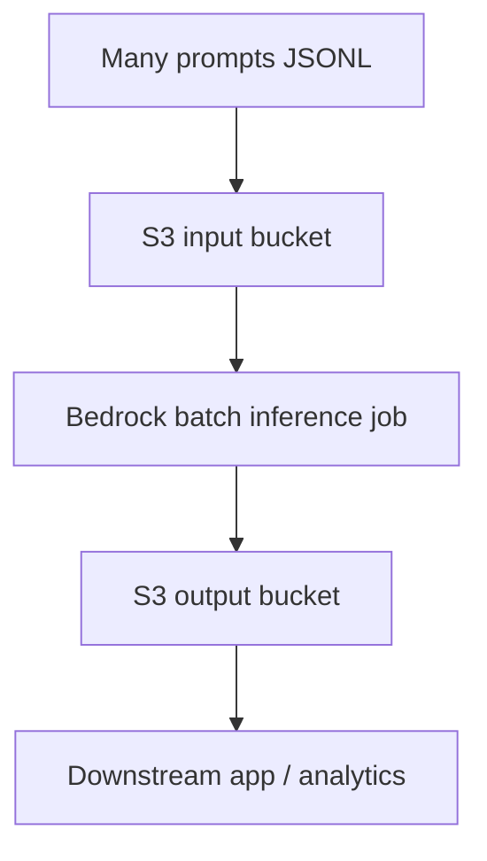
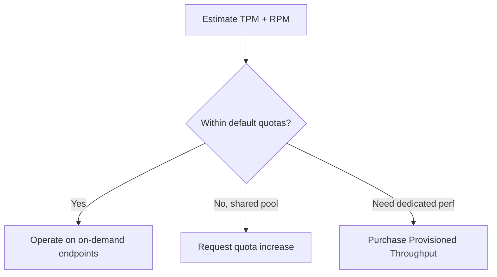

# Maximizing Resource Utilization and Throughput

## What this lecture covers

Beyond [token efficiency](../01-token-efficiency/index.md) and [cost-effective model selection](../02-cost-effective-model-selection/index.md), you can improve GenAI economics by **using paid capacity fully**—batching work, planning <a href="https://docs.aws.amazon.com/bedrock/latest/userguide/quotas.html">Bedrock quotas</a>, buying <a href="https://docs.aws.amazon.com/bedrock/latest/userguide/prov-throughput.html">Provisioned Throughput</a> when needed, and leaning on **serverless auto-scaling** plus observability tools so idle or throttled resources are visible and fixable.

## Key definitions (from the lecture)

| Term | Definition |
|---|---|
| **Resource utilization** | How much of the compute/API capacity you pay for is **actually doing useful work** versus sitting idle or under-served by your traffic pattern. |
| **Batching** | Grouping many units of work (prompts, chunks, embedding requests) into **fewer, larger calls** so infrastructure amortizes overhead and throughput rises. |
| <a href="https://docs.aws.amazon.com/bedrock/latest/userguide/batch-inference.html">**Batch inference**</a> | <a href="https://docs.aws.amazon.com/bedrock/latest/userguide/batch-inference.html">Asynchronous Bedrock processing</a> of many prompts via <a href="https://docs.aws.amazon.com/AmazonS3/latest/userguide/Welcome.html">Amazon S3</a> input/output—suited when **real-time** responses are not required. |
| **Tokens per minute (TPM) / requests per minute (RPM)** | Expected traffic rates you estimate up front to decide whether default <a href="https://docs.aws.amazon.com/bedrock/latest/userguide/quotas.html">service quotas</a> are enough or you need increases / dedicated capacity. |
| <a href="https://docs.aws.amazon.com/bedrock/latest/userguide/prov-throughput.html">**Provisioned Throughput**</a> | Reserved, **model-specific** invocation capacity on Bedrock—purchased by **tokens** or **model units** (roughly token throughput) for predictable performance under load. |
| **Model units** | Opaque Bedrock units for Provisioned Throughput that **correspond roughly** to token throughput; used when provisioning by capacity rather than a raw token count. |
| **Tensor parallelism** | Sharding a large model’s **weights across many GPUs** (usually under the hood) so memory per container is used efficiently; app developers rarely configure it directly. |

## Key distinctions / comparisons

| Item | Notes |
|---|---|
| **Real-time inference vs batch inference** | Interactive chat needs low-latency `InvokeModel` / <a href="https://docs.aws.amazon.com/bedrock/latest/userguide/conversation-inference.html">Converse</a>; offline enrichment, bulk scoring, or nightly jobs fit <a href="https://docs.aws.amazon.com/bedrock/latest/userguide/batch-inference.html">batch inference</a>. |
| **One-at-a-time embeddings vs batched embeddings** | Indexing a large document into many chunks should **batch embedding calls** for vector stores / <a href="https://docs.aws.amazon.com/bedrock/latest/userguide/knowledge-base.html">knowledge bases</a>—serial calls waste time and money. |
| **On-demand quotas vs Provisioned Throughput** | Default quotas are shared and can throttle; Provisioned Throughput buys **dedicated** capacity for a **specific model** when you need deterministic high volume (required for some **customized** models). |
| **Model ID vs provisioned model ARN** | On-demand calls use a foundation **model ID**; Provisioned Throughput invocations must pass the **ARN of the provisioned resource**, not a generic model ID. |
| **CloudWatch vs QuickSight** | <a href="https://docs.aws.amazon.com/bedrock/latest/userguide/monitoring.html">Bedrock runtime metrics</a> and <a href="https://docs.aws.amazon.com/AmazonCloudWatch/latest/monitoring/WhatIsCloudWatch.html">CloudWatch dashboards</a> are enough for utilization monitoring; QuickSight is optional for BI-style views. |
| **Utilization tuning vs serverless defaults** | You can batch and provision capacity—but **Lambda**, managed Bedrock, <a href="https://docs.aws.amazon.com/opensearch-service/latest/developerguide/serverless-overview.html">OpenSearch Serverless</a>, and <a href="https://docs.aws.amazon.com/bedrock-agentcore/latest/devguide/what-is-bedrock-agentcore.html">AgentCore</a> auto-scale so you worry less about manual capacity sizing. |

## The problem (why you need it)

- Paying for **idle** GPU/API capacity means you are not getting value from what Bedrock and surrounding services bill for.
- Sending **one prompt or one embedding at a time** under-utilizes throughput and increases per-request overhead—especially painful for large corpora (many chunks → many vectors).
- Hitting **quota limits** (throttling, HTTP 429) means your architecture cannot use the capacity you thought you had—even if spend is low.
- High-volume, **latency-sensitive** workloads on on-demand endpoints may **not keep up** without Provisioned Throughput or quota increases.
- Without **monitoring and cost attribution**, you cannot tell which team or application is saturating Bedrock or driving spend.

## Batching strategies

### Batch embedding for vector stores and knowledge bases

When building or refreshing a <a href="https://docs.aws.amazon.com/bedrock/latest/userguide/knowledge-base.html">Bedrock Knowledge Base</a> (or any vector store backed by embeddings), a huge document becomes **many chunks**. Embedding **one chunk per API call** is slow and expensive; **batch** those requests so Bedrock processes many inputs per round trip.

<a href="https://docs.aws.amazon.com/bedrock/latest/userguide/kb-data-source-sync-ingest.html">Knowledge base ingestion</a> converts source files to vectors during sync; your own pipelines should mirror the same discipline—group chunks (respecting model input limits) before calling <a href="https://docs.aws.amazon.com/bedrock/latest/userguide/bedrock-runtime_example_bedrock-runtime_InvokeModel_TitanTextEmbeddings_section.html">embedding models</a>.


```python
# Illustrative: batch many chunk texts per InvokeModel call (size limits apply per model)
CHUNK_BATCH_SIZE = 64

def embed_chunks_in_batches(bedrock_runtime, model_id: str, chunks: list[str]) -> list[list[float]]:
    vectors = []
    for i in range(0, len(chunks), CHUNK_BATCH_SIZE):
        batch = chunks[i : i + CHUNK_BATCH_SIZE]
        # Pack batch into one request body per your model's documented input shape
        response = bedrock_runtime.invoke_model(modelId=model_id, body=build_embedding_body(batch))
        vectors.extend(parse_embeddings(response))
    return vectors
```

### Bedrock batch inference (non-real-time prompts)



When you **do not need immediate** responses, <a href="https://docs.aws.amazon.com/bedrock/latest/userguide/batch-inference.html">batch inference</a> lets you submit **many prompts together**: place inputs in S3 (JSONL per <a href="https://docs.aws.amazon.com/bedrock/latest/userguide/batch-inference-data.html">format requirements</a>), start a job with <a href="https://docs.aws.amazon.com/bedrock/latest/APIReference/API_CreateModelInvocationJob.html">CreateModelInvocationJob</a>, and collect outputs from S3 when complete. This is more efficient for large offline workloads than synchronous per-prompt calls.

Programmatically, use the **`bedrock`** control-plane client (not `bedrock-runtime`): build JSONL locally, upload to S3, create the job, poll until completion, then read results from the output prefix. See the <a href="https://docs.aws.amazon.com/bedrock/latest/userguide/batch-inference-example.html">batch inference code example</a> for the full `InvokeModel`-format record shape.

```python
import json
import time
from pathlib import Path

import boto3

MODEL_ID = "anthropic.claude-3-haiku-20240307-v1:0"
ROLE_ARN = "arn:aws:iam::123456789012:role/MyBatchInferenceRole"
INPUT_URI = "s3://my-batch-input-bucket/jobs/run-001/prompts.jsonl"
OUTPUT_URI = "s3://my-batch-output-bucket/jobs/run-001/"

# 1) Build JSONL locally (one record per line; recordId must be unique per job)
records = [
    {
        "recordId": f"REC{i:07d}",
        "modelInput": {
            "anthropic_version": "bedrock-2023-05-31",
            "max_tokens": 1024,
            "messages": [{"role": "user", "content": [{"type": "text", "text": prompt}]}],
        },
    }
    for i, prompt in enumerate(["Summarize ticket A...", "Summarize ticket B..."])
]
jsonl_path = Path("prompts.jsonl")
jsonl_path.write_text("\n".join(json.dumps(r) for r in records) + "\n")

# 2) Upload input JSONL to S3 (use your own bucket/key layout)
s3 = boto3.client("s3")
s3.upload_file(str(jsonl_path), "my-batch-input-bucket", "jobs/run-001/prompts.jsonl")

# 3) Submit batch job via Bedrock control plane
bedrock = boto3.client("bedrock")
create_resp = bedrock.create_model_invocation_job(
    jobName="summarize-tickets-run-001",
    roleArn=ROLE_ARN,
    modelId=MODEL_ID,
    inputDataConfig={"s3InputDataConfig": {"s3Uri": INPUT_URI}},
    outputDataConfig={"s3OutputDataConfig": {"s3Uri": OUTPUT_URI}},
)
job_arn = create_resp["jobArn"]

# 4) Poll until terminal state
terminal = {"Completed", "Failed", "Stopped", "Expired"}
while True:
    job = bedrock.get_model_invocation_job(jobIdentifier=job_arn)
    status = job["status"]
    if status in terminal:
        break
    time.sleep(30)

if status != "Completed":
    raise RuntimeError(f"Batch job ended with status={status}")

# 5) Download output JSONL from S3 (Bedrock writes under the output prefix you configured)
#    Parse each line for modelOutput / errors per record — see batch-inference-results guide.
```

## Capacity planning on Bedrock

### Estimate TPM and RPM first

Start from **expected tokens per minute** and **requests per minute** your system must sustain (peak and sustained). That drives whether default quotas suffice or you need action.

| Planning input | Why it matters |
|---|---|
| **TPM** | Governs how much text (prompt + completion) Bedrock will process per minute for a model/Region. |
| **RPM** | Limits how many discrete API calls you can make—important for chatty micro-request designs. |
| **max_tokens** | Larger completion budgets burn TPM faster; see <a href="https://docs.aws.amazon.com/bedrock/latest/userguide/quotas-token-burndown.html">how tokens are counted</a>. |

### Service Quotas and increases

Use <a href="https://docs.aws.amazon.com/servicequotas/latest/userguide/intro.html">Service Quotas</a> (including Bedrock-specific views in the console) to **estimate required capacity** and see current limits. If you exceed built-in approvals, submit a <a href="https://docs.aws.amazon.com/bedrock/latest/userguide/quotas-increase.html">quota increase request</a>. For ramp-up behavior and throttling, also review <a href="https://docs.aws.amazon.com/bedrock/latest/userguide/scaling-throughput-best-practices.html">scaling and throughput best practices</a>.



### CloudFormation for repeatable capacity

<a href="https://docs.aws.amazon.com/bedrock/latest/userguide/creating-resources-with-cloudformation.html">CloudFormation templates</a> help provision Bedrock resources (agents, knowledge bases, guardrails, flows) consistently across accounts—useful when capacity planning is tied to **infrastructure-as-code** rollouts, not one-off console clicks.

### Tensor parallelism (awareness only)

**Tensor parallelism** shards a large model’s weights across **multiple GPUs** because a single device cannot hold them. The result is better **memory utilization per container**. Application teams typically **do not configure** this—it is an implementation detail of how large models run—but the term appears in architecture discussions.

## Provisioned Throughput

<a href="https://docs.aws.amazon.com/bedrock/latest/userguide/prov-throughput.html">Provisioned Throughput</a> reserves capacity for **deterministic performance** under high volume. Purchase by **tokens** or **model units** via <a href="https://docs.aws.amazon.com/bedrock/latest/userguide/prov-thru-purchase.html">CreateProvisionedModelThroughput</a>.

| Situation | Guidance from the lecture |
|---|---|
| **Customized / custom models** | Provisioned capacity is a **requirement**—you need the equipment for that model. |
| **Strict latency or throughput SLOs** | When on-demand Bedrock “is not keeping up,” Provisioned Throughput may be the answer. |
| **Scope** | You provision **per model**, not Bedrock globally. |
| **Invocation** | Pass the **provisioned model ARN** in inference calls—see <a href="https://docs.aws.amazon.com/bedrock/latest/userguide/prov-thru-use.html">using Provisioned Throughput</a>—not only a generic foundation model ID. |


```python
# On-demand vs provisioned: modelId must be the provisioned throughput ARN when using PT
ON_DEMAND_MODEL_ID = "anthropic.claude-3-5-sonnet-20241022-v2:0"
PROVISIONED_MODEL_ARN = "arn:aws:bedrock:us-east-1:123456789012:provisioned-model/abc123"

def invoke(bedrock_runtime, use_provisioned: bool, body: dict):
    model_id = PROVISIONED_MODEL_ARN if use_provisioned else ON_DEMAND_MODEL_ID
    return bedrock_runtime.invoke_model(modelId=model_id, body=body)
```

## Monitoring utilization and cost

### CloudWatch

<a href="https://docs.aws.amazon.com/bedrock/latest/userguide/monitoring.html">Monitoring Bedrock</a> surfaces invocation latency, token counts, and related runtime metrics in <a href="https://docs.aws.amazon.com/AmazonCloudWatch/latest/monitoring/WhatIsCloudWatch.html">Amazon CloudWatch</a>. Build **dashboards** to track whether you are saturating quotas or under-using purchased Provisioned Throughput—you do not have to use QuickSight for operational utilization views.

### AWS Cost Explorer

<a href="https://docs.aws.amazon.com/cost-management/latest/userguide/ce-what-is.html">AWS Cost Explorer</a> helps **attribute spend** to applications, business functions, or departments—especially when combined with <a href="https://docs.aws.amazon.com/awsaccountbilling/latest/aboutv2/cost-alloc-tags.html">cost allocation tags</a> on Bedrock-related resources and workloads.

## Auto-scaling and serverless services

**Auto-scaling** reduces manual capacity tuning. Prefer managed, serverless building blocks that scale with demand:

| Service | Role in GenAI stacks |
|---|---|
| <a href="https://docs.aws.amazon.com/lambda/latest/dg/welcome.html">AWS Lambda</a> | Event-driven orchestration; <a href="https://docs.aws.amazon.com/lambda/latest/dg/scaling-behavior.html">automatic concurrency scaling</a> for bursty API glue code. |
| <a href="https://docs.aws.amazon.com/bedrock/latest/userguide/what-is-bedrock.html">Amazon Bedrock</a> | Managed FM inference—scales on-demand capacity within quota bounds. |
| <a href="https://docs.aws.amazon.com/opensearch-service/latest/developerguide/serverless-overview.html">OpenSearch Serverless</a> | Vector/search collections that scale **OCUs** for indexing and query (see <a href="https://docs.aws.amazon.com/opensearch-service/latest/developerguide/serverless-vector-search.html">vector search collections</a>). |
| <a href="https://docs.aws.amazon.com/bedrock-agentcore/latest/devguide/what-is-bedrock-agentcore.html">Amazon Bedrock AgentCore</a> | Managed agent runtime/platform so agent fleets scale without you sizing GPU clusters. |

Batching and Provisioned Throughput still matter for **cost and predictability**, but serverless defaults mean you spend less time “babysitting” raw machine counts.

## Examples

**Nightly document enrichment:** A data team exports 500k support tickets to S3, runs a <a href="https://docs.aws.amazon.com/bedrock/latest/userguide/batch-inference.html">batch inference job</a> to classify and summarize them, and loads results into a warehouse—avoiding 500k synchronous daytime API calls.

**RAG index rebuild:** Before launch, engineering batches 2M chunk embeddings into groups of 50–100 texts per <a href="https://docs.aws.amazon.com/bedrock/latest/userguide/service_code_examples_bedrock-runtime_amazon_titan_text_embeddings.html">Titan Text Embeddings</a> call, then triggers <a href="https://docs.aws.amazon.com/bedrock/latest/userguide/kb-data-source-sync-ingest.html">knowledge base sync</a>—cutting index time from days to hours.

**Peak chat traffic:** A customer-facing bot hits TPM limits during a product launch. The team requests a <a href="https://docs.aws.amazon.com/bedrock/latest/userguide/quotas-increase.html">quota increase</a>, purchases <a href="https://docs.aws.amazon.com/bedrock/latest/userguide/prov-thru-purchase.html">Provisioned Throughput</a> for the production model, and updates the Lambda proxy to pass the **provisioned ARN** for routed traffic.

## Limitations / edge cases

- **Batch inference** is wrong for interactive UX—users waiting on a chat cannot poll S3 for minutes.
- Embedding batches must respect **per-model input size and record limits**; oversize batches fail or truncate.
- **Provisioned Throughput** is **per model**; multi-model apps need multiple purchases or careful routing.
- Forgetting the **provisioned ARN** causes calls to hit on-demand pools—throttling or unpredictable latency returns.
- **Tensor parallelism** is not a knob most application teams turn; do not confuse it with request batching.
- Serverless auto-scaling does not remove **quota ceilings**—you can still need increases or Provisioned Throughput at extreme scale.

## Key takeaways

- Treat **idle capacity** as waste—batch embeddings and offline prompts when latency allows.
- Use <a href="https://docs.aws.amazon.com/bedrock/latest/userguide/batch-inference.html">batch inference</a> + S3 for large, non-real-time inference workloads.
- Plan from **TPM/RPM**, validate against <a href="https://docs.aws.amazon.com/bedrock/latest/userguide/quotas.html">Bedrock quotas</a>, and request increases before launch spikes.
- Buy <a href="https://docs.aws.amazon.com/bedrock/latest/userguide/prov-throughput.html">Provisioned Throughput</a> for dedicated, consistent throughput—mandatory for some custom models—and invoke with the **provisioned ARN**.
- Monitor with <a href="https://docs.aws.amazon.com/bedrock/latest/userguide/monitoring.html">CloudWatch</a>; attribute spend with <a href="https://docs.aws.amazon.com/cost-management/latest/userguide/ce-what-is.html">Cost Explorer</a> and tags.
- Combine these tactics with **serverless** services so scaling is largely automatic.

## Industry scenarios

- **E-commerce catalog enrichment (retail):** Millions of product descriptions need sentiment and attribute tags overnight. The platform team writes JSONL to S3, runs Bedrock batch jobs, and loads results into search indexes—achieving higher **$/1k prompts** efficiency than real-time `InvokeModel` during business hours.

- **Regulated insurance claims (financial services):** A customized Bedrock model requires **Provisioned Throughput**; claims microservices pass the **provisioned model ARN** at inference so audit-sensitive workloads never compete with dev sandboxes on shared on-demand pools. CloudWatch dashboards alert when **provisioned utilization** drops—signaling overspend.

- **Internal IT knowledge base (enterprise):** HR policies are chunked and embedded in **large batches** into an OpenSearch Serverless vector collection behind a knowledge base. Service Quotas reviews precede go-live; Lambda + Bedrock scale for Q&A while Cost Explorer tags show **which department’s bot** drives token spend.

## Internal References

- [Token Efficiency](../01-token-efficiency/index.md)
- [Cost-Effective Model Selection](../02-cost-effective-model-selection/index.md)
- [Intelligent Caching Systems for GenAI](../04-intelligent-caching-systems-for-genai/index.md)
- [Exponential Backoff and Connection Pooling](../09-exponential-backoff-and-connection-pooling/index.md)
- [Amazon Bedrock Cross-Region Inference](../10-amazon-bedrock-cross-region-inference/index.md)
- [Retrieval Augmented Generation (RAG)](../../section-1/retrieval-augmented-generation-rag/index.md)
- [Evaluating RAG Performance](../../section-1/evaluating-rag-performance/index.md)

## External References

- <a href="https://docs.aws.amazon.com/bedrock/latest/userguide/batch-inference.html">Process multiple prompts asynchronously with batch inference</a>
- <a href="https://docs.aws.amazon.com/bedrock/latest/userguide/batch-inference-data.html">Format and upload your batch inference data</a>
- <a href="https://docs.aws.amazon.com/bedrock/latest/userguide/batch-inference-create.html">Create a batch inference job</a>
- <a href="https://docs.aws.amazon.com/bedrock/latest/userguide/batch-inference-monitor.html">Monitor batch inference jobs</a>
- <a href="https://docs.aws.amazon.com/bedrock/latest/userguide/batch-inference-results.html">View the results of a batch inference job</a>
- <a href="https://docs.aws.amazon.com/bedrock/latest/userguide/kb-data-source-sync-ingest.html">Sync your data with your Amazon Bedrock knowledge base</a>
- <a href="https://docs.aws.amazon.com/bedrock/latest/userguide/quotas.html">Quotas for Amazon Bedrock</a>
- <a href="https://docs.aws.amazon.com/bedrock/latest/userguide/quotas-increase.html">Request an increase for Amazon Bedrock quotas</a>
- <a href="https://docs.aws.amazon.com/bedrock/latest/userguide/quotas-token-burndown.html">How tokens are counted in Amazon Bedrock</a>
- <a href="https://docs.aws.amazon.com/bedrock/latest/userguide/scaling-throughput-best-practices.html">Scaling and throughput best practices</a>
- <a href="https://docs.aws.amazon.com/servicequotas/latest/userguide/intro.html">What is Service Quotas?</a>
- <a href="https://docs.aws.amazon.com/bedrock/latest/userguide/prov-throughput.html">Increase model invocation capacity with Provisioned Throughput</a>
- <a href="https://docs.aws.amazon.com/bedrock/latest/userguide/prov-thru-purchase.html">Purchase a Provisioned Throughput for an Amazon Bedrock model</a>
- <a href="https://docs.aws.amazon.com/bedrock/latest/userguide/prov-thru-use.html">Use a Provisioned Throughput with an Amazon Bedrock resource</a>
- <a href="https://docs.aws.amazon.com/bedrock/latest/userguide/creating-resources-with-cloudformation.html">Create Amazon Bedrock resources with AWS CloudFormation</a>
- <a href="https://docs.aws.amazon.com/bedrock/latest/userguide/monitoring.html">Monitoring the performance of Amazon Bedrock</a>
- <a href="https://docs.aws.amazon.com/cost-management/latest/userguide/ce-what-is.html">Analyzing your costs and usage with AWS Cost Explorer</a>
- <a href="https://docs.aws.amazon.com/awsaccountbilling/latest/aboutv2/cost-alloc-tags.html">Organizing and tracking costs using AWS cost allocation tags</a>
- <a href="https://docs.aws.amazon.com/lambda/latest/dg/scaling-behavior.html">Lambda scaling behavior</a>
- <a href="https://docs.aws.amazon.com/opensearch-service/latest/developerguide/serverless-overview.html">What is Amazon OpenSearch Serverless?</a>
- <a href="https://docs.aws.amazon.com/bedrock-agentcore/latest/devguide/what-is-bedrock-agentcore.html">Amazon Bedrock AgentCore overview</a>
- <a href="https://docs.aws.amazon.com/AmazonS3/latest/userguide/Welcome.html">What is Amazon S3?</a>
