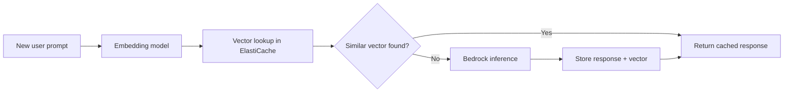
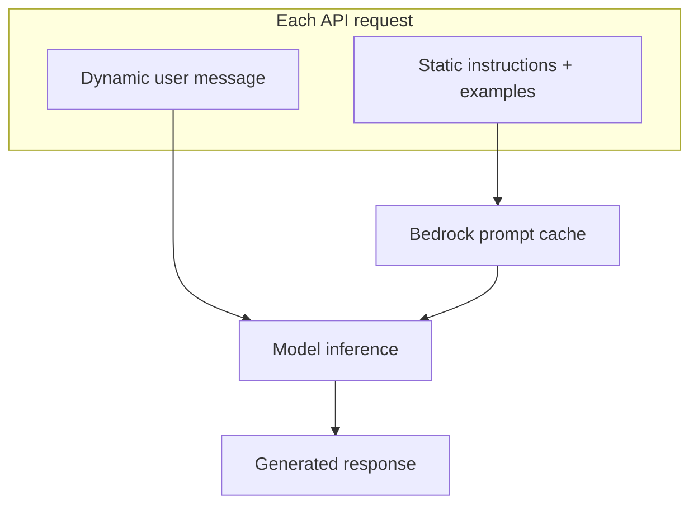
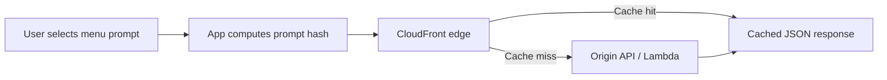

# Intelligent Caching Systems for GenAI

## What this lecture covers

Caching avoids repeating expensive work when the same result is needed again—but GenAI prompts are rarely byte-for-byte identical. This lecture contrasts **exact-match**, **semantic**, **Bedrock prompt prefix**, **RAG/document**, **edge (CDN)**, and **application-level** caching patterns, plus how to measure whether cache overhead pays for itself.

## Key definitions (from the lecture)

| Term | Definition |
|---|---|
| **Caching (general)** | Storing a prior result so repeated requests return it **faster and cheaper** instead of recomputing from scratch. |
| **Semantic caching** | Caching by **meaning**, not exact prompt text—typically by comparing **embedding vectors** of incoming prompts to cached vectors and reusing the stored response when similarity is high enough. |
| **Embedding vector** | A numeric representation of text meaning produced by an <a href="https://docs.aws.amazon.com/bedrock/latest/userguide/model-parameters-titan-embed-text.html">embedding model</a>; similar prompts produce vectors that are **close** in vector space. |
| <a href="https://docs.aws.amazon.com/bedrock/latest/userguide/prompt-caching.html">**Prompt caching (Bedrock)**</a> | Managed caching of **repeated prompt prefixes** (system instructions, examples, static context) so Bedrock reuses cached tokens at **lower cost** and reduced latency on subsequent calls. |
| **Static vs dynamic prompt content** | **Static** parts (instructions, few-shot examples, fixed policy text) repeat across users; **dynamic** parts (the user’s question, session-specific data) change every request. |
| **Edge caching** | Serving responses from a nearby <a href="https://docs.aws.amazon.com/AmazonCloudFront/latest/DeveloperGuide/Introduction.html">CloudFront</a> edge location—often in front of an <a href="https://docs.aws.amazon.com/AmazonS3/latest/userguide/Welcome.html">Amazon S3</a> or API origin—to cut latency and shield backends. |
| **Prompt fingerprint / hash** | A deterministic identifier (hash) for a prompt or request variant so **identical** inputs map to the same cache key—useful when your app chooses from a fixed menu of prompts. |
| **Time to live (TTL)** | How long a cached entry remains valid before refresh; critical when upstream **data or model output changes** frequently. |
| <a href="https://docs.aws.amazon.com/AmazonElastiCache/latest/dg/WhatIs.html">**Amazon ElastiCache**</a> | Managed in-memory cache (<a href="https://docs.aws.amazon.com/AmazonElastiCache/latest/dg/WhatIs.html">Valkey</a>, Redis OSS, Memcached) for application-level keys—embedding indexes, semantic-cache entries, session state. |

## Key distinctions / comparisons

| Item | Notes |
|---|---|
| **Exact text cache vs semantic cache** | Exact match fails when users rephrase the same question; semantic cache matches **paraphrases** via embeddings but is **approximate** and needs similarity thresholds. |
| **Semantic cache vs Bedrock prompt caching** | Semantic cache stores **full model responses** keyed by meaning; Bedrock prompt caching reuses **input tokens** of a **static prefix**—you still pay for dynamic user tokens and generation. |
| **Prompt prefix cache vs RAG document cache** | Prefix caching targets repeated **instructions**; RAG workloads can separately cache **retrieved documents/chunks** so embedding and retrieval are not repeated for the same corpus slice. |
| **Edge cache vs application cache** | CloudFront caches **HTTP responses** at the edge; ElastiCache caches **arbitrary app data** (vectors, JSON answers, session blobs) inside your VPC. |
| **Hash fingerprint vs embedding fingerprint** | Hash works when prompts are **literally identical** (menu-driven apps); embeddings handle **similar wording** but add compute and storage cost. |
| **Cache hit savings vs cache infrastructure cost** | Embedding calls, ElastiCache clusters, and CloudFront egress still cost money—**low hit rates** can make caching **more expensive** than plain inference. |

## Caching patterns at a glance

Use the tabs below to compare **what** each layer caches, **where** it lives, and **when** it fits. Sections later in this page expand each pattern.

=== "Semantic cache"

    | | |
    |---|---|
    | **Caches** | Full **model responses** keyed by prompt **meaning** (embedding vectors) |
    | **Store** | <a href="https://docs.aws.amazon.com/AmazonElastiCache/latest/dg/WhatIs.html">ElastiCache</a> / Valkey (vector lookup) |
    | **Match type** | **Similar** wording (paraphrases) — threshold tuning required |
    | **Bedrock on hit?** | **No** — return stored answer |
    | **Good fit** | FAQ bots, policy Q&A, repeated questions asked different ways |
    | **Related** | [Vector Stores and Semantic Search](../../section-1/vector-stores-and-semantic-search/index.md) |

=== "Bedrock prompt cache"

    | | |
    |---|---|
    | **Caches** | **Static prompt prefix** tokens (system prompt, examples, tool schemas) |
    | **Store** | Managed inside <a href="https://docs.aws.amazon.com/bedrock/latest/userguide/prompt-caching.html">Bedrock</a> |
    | **Match type** | **Exact** repeated prefix at start of prompt |
    | **Bedrock on hit?** | **Yes** — still runs inference; prefix tokens billed at reduced rate (`CacheReadInputTokens`) |
    | **Good fit** | Large shared instructions appended to every user turn |
    | **Related** | [Token Efficiency](../01-token-efficiency/index.md) |

=== "RAG / document cache"

    | | |
    |---|---|
    | **Caches** | **Retrieved chunks**, embeddings, or vector-search results |
    | **Store** | ElastiCache, in-process cache, or vector store metadata |
    | **Match type** | Same document slice / query hash |
    | **Bedrock on hit?** | Skips **re-retrieval and re-embedding**; model may still run on assembled prompt |
    | **Good fit** | Repeat citations of the same PDF sections or policy pages |
    | **Related** | [Retrieval Augmented Generation (RAG)](../../section-1/retrieval-augmented-generation-rag/index.md) |

=== "CloudFront edge"

    | | |
    |---|---|
    | **Caches** | **HTTP JSON responses** (full answers after origin generates them) |
    | **Store** | <a href="https://docs.aws.amazon.com/AmazonCloudFront/latest/DeveloperGuide/Introduction.html">CloudFront</a> edge POPs |
    | **Match type** | **Identical** request (e.g. `GET /analyze?fp=<hash>`) within TTL |
    | **Bedrock on hit?** | **No** — edge serves cached JSON; origin (and Bedrock) not called |
    | **Good fit** | Fixed **menu** of prompts with generated answers; global low-latency delivery |
    | **Related** | [Amazon DynamoDB DAX](../../section-2/38-amazon-dynamodb-dax/index.md) (app vs service-native cache distinction) |

=== "Application-level"

    | | |
    |---|---|
    | **Caches** | Static assets, session blobs, precomputed summaries |
    | **Store** | ElastiCache, in-process memory, CDN for static files |
    | **Match type** | App-defined keys |
    | **Bedrock on hit?** | Depends what you cached — often avoids upstream work entirely |
    | **Good fit** | Any web app; often the **largest** easy win alongside GenAI-specific caches |
    | **Related** | [Short and Long-Term Agent Memory](../../section-3/03-short-and-long-term-agent-memory/index.md) |

## The problem (why you need it)

- Traditional caches assume **identical keys**; GenAI users express the same intent in **many phrasings**, so string equality misses most repeats.
- Every missed cache entry triggers **full inference**—latency, token charges, and backend load add up at scale.
- Production prompts often append **large static instructions** and examples to every user message; re-sending that prefix wastes tokens unless cached.
- RAG pipelines may re-fetch and re-embed the **same documents** for similar queries unless retrieval results are cached.
- Serving global users from a single region adds **network latency**; edge delivery helps static assets but GenAI responses are often **dynamic and personalized**.

## Semantic caching

Instead of caching the raw prompt string, cache **meaning**:

1. On a new prompt, call an embedding model to produce a **vector**.
2. Store the model **response** keyed by that vector (or a normalized form) in a fast store such as <a href="https://docs.aws.amazon.com/AmazonElastiCache/latest/dg/WhatIs.html">ElastiCache</a> or <a href="https://docs.aws.amazon.com/AmazonElastiCache/latest/dg/agentic-memory.html">ElastiCache for Valkey</a>.
3. For subsequent prompts, embed the new text and search for a **nearby** cached vector (cosine similarity or approximate nearest-neighbor index).
4. If similarity exceeds your threshold, return the **cached response** and skip Bedrock inference.



Semantic caching is **not perfect**—near-duplicate prompts can map to different intents, and threshold tuning is operational work. The lecture stresses measuring **hit rate** and total cost: embedding every request plus running cache infrastructure can **exceed** the savings if traffic is mostly unique.

```python
# Illustrative semantic-cache check (similarity threshold is workload-specific)
def semantic_cache_lookup(cache, embed_fn, prompt: str, threshold: float = 0.92):
    vector = embed_fn(prompt)
    match = cache.find_nearest(vector, min_score=threshold)
    if match:
        return match["response"]  # cache hit — skip Bedrock
    return None
```

Typical deployment: **API Gateway → Lambda (in a VPC) → ElastiCache for Valkey** for vector storage, plus **Bedrock** for embeddings (every request) and chat (cache miss only). Unlike [fingerprinted GET](#fingerprinted-get-requests), there is no CloudFront layer—the cache lives in ElastiCache and the lookup runs in application code.

```python
import json

import boto3

EMBED_MODEL_ID = "amazon.titan-embed-text-v2:0"
CHAT_MODEL_ID = "anthropic.claude-3-haiku-20240307-v1:0"
SIMILARITY_THRESHOLD = 0.92

bedrock_runtime = boto3.client("bedrock-runtime", region_name="us-east-1")


class SemanticCache:
    """Illustrative wrapper — production code uses ElastiCache for Valkey + vector index."""

    def find_nearest(self, vector: list[float], min_score: float):
        ...  # cosine similarity search against stored vectors

    def store(self, vector: list[float], response: str) -> None:
        ...  # persist vector + answer for future lookups


semantic_cache = SemanticCache()

# Function to get the embedding vector for a given text using Bedrock's embedding model
def embed_text(text: str) -> list[float]:
    response = bedrock_runtime.invoke_model(
        modelId=EMBED_MODEL_ID,
        body=json.dumps({"inputText": text}),
    )
    # Extract the embedding vector from the response
    return json.loads(response["body"].read())["embedding"]

# Function to call the Bedrock chat model with the user prompt and get the response text
def invoke_bedrock_chat(prompt: str) -> str:
    response = bedrock_runtime.converse(
        modelId=CHAT_MODEL_ID,
        messages=[{"role": "user", "content": [{"text": prompt}]}],
        inferenceConfig={"maxTokens": 512, "temperature": 0.3},
    )
    # Return the generated answer text from the model output
    return response["output"]["message"]["content"][0]["text"]

# Lambda handler function for API Gateway integration
def lambda_handler(event, context):
    """
    Handles POST requests with JSON body: {"question": "..."}
    Uses semantic cache lookup to return cached answer for paraphrases,
    or calls Bedrock chat model and stores the result if no cache hit.
    """
    body = json.loads(event.get("body") or "{}")
    prompt = (body.get("question") or "").strip()
    if not prompt:
        # Return HTTP 400 if the 'question' field is missing or empty
        return {"statusCode": 400, "body": json.dumps({"error": "missing question"})}

    # Compute embedding vector for the prompt
    vector = embed_text(prompt)
    # Look up the most similar cached vector (above similarity threshold)
    match = semantic_cache.find_nearest(vector, min_score=SIMILARITY_THRESHOLD)

    if match:
        # Cache hit: return the stored response, mark as 'hit'
        return {
            "statusCode": 200,
            "headers": {"Content-Type": "application/json"},
            "body": json.dumps({"answer": match["response"], "cache": "hit"}),
        }

    # Cache miss: call Bedrock chat model to get the answer
    answer = invoke_bedrock_chat(prompt)
    # Store new vector+answer pair in the semantic cache for reuse
    semantic_cache.store(vector=vector, response=answer)

    # Return the answer, mark as 'miss'
    return {
        "statusCode": 200,
        "headers": {"Content-Type": "application/json"},
        "body": json.dumps({"answer": answer, "cache": "miss"}),
    }
```

On a **hit**, Lambda returns the stored answer and **never calls** Bedrock Converse. On a **miss**, it calls Bedrock, writes `vector + answer` to Valkey, then returns. Every request still pays for an **embedding** call unless you optimize further (e.g. cache embeddings separately).

### Cache growth and limits

Each cache **miss** runs `semantic_cache.store(vector=vector, response=answer)` and adds a new entry to ElastiCache/Valkey. The cache **grows** over time unless you cap or expire entries.

| Stored per entry | Typical contents |
|---|---|
| **Embedding vector** | Fixed size for your embedding model (e.g. Titan Text Embeddings) |
| **Answer text** | Full Bedrock response — can be large if answers are verbose |
| **Optional metadata** | Original prompt, timestamp, TTL — if your implementation stores them |

Growth is **not** one entry per user message. Paraphrases that score above your similarity threshold **hit** an existing entry and do **not** call `store`. New entries appear only for **semantically distinct** misses — but many unique intents over weeks still means a **larger** cache and **more** ElastiCache memory.

| Pattern | How bounded? |
|---|---|
| **Semantic cache (Valkey)** | Grows with unique misses — needs **TTL**, **max size**, or **LRU eviction** |
| **CloudFront fingerprint GET** | Bounded by menu size × TTL at each edge |
| **Bedrock prompt cache** | Managed by Bedrock for static prefixes — not a growing Q&A list |

Production mitigations:

- **TTL** on cache entries when answers or policy text can change
- **LRU / max-entry limits** so memory does not grow without bound
- **Scope** caching to FAQ-style topics, not every arbitrary chat turn
- **Right-size** ElastiCache as the vector index grows; monitor hit rate vs memory cost (see [Cost and overhead](#cost-and-overhead-when-caching-pays-off))

!!! tip "Measure before you scale the cluster"
    A semantic cache that keeps growing but rarely gets hits on new entries is **paying for storage and embeddings** without saving Bedrock calls. Track entry count, hit ratio, and ElastiCache memory together.

**Good fit:** FAQ bots, internal policy Q&A, or support portals where users ask the **same underlying question** repeatedly in different words.

!!! tip "Not the same as fingerprinted GET"
    Semantic caching handles **paraphrases** via embeddings. [Fingerprinted GET](#fingerprinted-get-requests) only matches **byte-identical** menu prompts hashed into `fp`—use tabs above to pick the right pattern.

## Bedrock prompt caching (static prefix)

<a href="https://docs.aws.amazon.com/bedrock/latest/userguide/prompt-caching.html">Amazon Bedrock prompt caching</a> is **built into Bedrock** for workloads where a large **static prefix** precedes variable user input—system instructions, tool definitions, few-shot examples, or long reference text appended before what the user typed.

| Part of prompt | Typical content | Caching |
|---|---|---|
| **Static prefix** | System prompt, examples, policy, tool schemas | Cached by Bedrock after first use |
| **Dynamic suffix** | User question, session IDs, live data | Sent every request; not part of the cached prefix |

Cached prefix tokens are billed at a **reduced rate** on cache reads (`CacheReadInputTokens` in <a href="https://docs.aws.amazon.com/bedrock/latest/userguide/monitoring.html">CloudWatch runtime metrics</a>); writing the cache (`CacheWriteInputTokens`) still consumes quota. The lecture notes that **reading** cached prefix tokens is essentially a **discount** compared with re-processing the full prompt every time—making this attractive when the static block is large and repeated.



Structure prompts so **static content comes first** and **variable content last**, matching Bedrock’s prefix-cache model. See also [Token Efficiency](../01-token-efficiency/index.md) for `CacheReadInputTokens` / `CacheWriteInputTokens` monitoring.

### Enabling prompt caching programmatically

Unlike [semantic caching](#semantic-caching), you do **not** write cache entries to ElastiCache. You **opt in in the Bedrock API** by placing **`cachePoint` checkpoints** on static parts of the prompt. Bedrock stores and reuses prefix tokens server-side (default **5-minute TTL**; some models support **1-hour** TTL).

| | **Semantic cache (Lambda + Valkey)** | **Bedrock prompt cache** |
|---|---|---|
| **Your code** | Embed, search Valkey, `store` Q&A pairs | Add `cachePoint` in Converse / InvokeModel request |
| **Cache store** | ElastiCache (you operate) | **Managed inside Bedrock** |
| **What's cached** | Full **model answers** | **Input prefix tokens** only |
| **On cache hit** | Skip Bedrock chat entirely | Bedrock **still generates** output; prefix billed at reduced rate |

Supported APIs: <a href="https://docs.aws.amazon.com/bedrock/latest/userguide/conversation-inference.html">Converse</a>, InvokeModel, and <a href="https://docs.aws.amazon.com/bedrock/latest/userguide/prompt-management-create.html">Prompt management</a> (console toggle in the <a href="https://docs.aws.amazon.com/bedrock/latest/userguide/playgrounds.html">playground</a> for experiments). Prompt caching is **not** available for batch inference.

Place checkpoints after content that meets the model’s **minimum token count** for caching (varies by model—e.g. 1,024 or 4,096 tokens). Altering the prefix between requests causes **cache misses**. Response fields `cacheReadInputTokens` and `cacheWriteInputTokens` report what was read from or written to the cache.

```python
import boto3

bedrock_runtime = boto3.client("bedrock-runtime", region_name="us-east-1")

STATIC_SYSTEM = (
    "You are an HR assistant. Answer from company policy only. "
    # ... long static instructions, examples, tool schemas — must meet min token count ...
)

def chat_with_prompt_cache(user_question: str) -> dict:
    response = bedrock_runtime.converse(
        modelId="anthropic.claude-3-5-sonnet-20241022-v2:0",
        system=[
            {"text": STATIC_SYSTEM},
            {"cachePoint": {"type": "default", "ttl": "5m"}},  # cache everything above
        ],
        messages=[
            {
                "role": "user",
                "content": [{"text": user_question}],  # dynamic — after checkpoint
            }
        ],
        inferenceConfig={"maxTokens": 512, "temperature": 0.3},
    )
    usage = response.get("usage", {})
    return {
        "answer": response["output"]["message"]["content"][0]["text"],
        "cache_read_tokens": usage.get("cacheReadInputTokens", 0),
        "cache_write_tokens": usage.get("cacheWriteInputTokens", 0),
    }
```

First call with a new prefix → `cacheWriteInputTokens` (write). Repeat calls within TTL with the **same prefix** → `cacheReadInputTokens` (discounted read). You still pay for the user’s dynamic tokens and all **output** tokens every time.

## Caching RAG documents and retrieval

When a <a href="https://docs.aws.amazon.com/bedrock/latest/userguide/kb-how-retrieval.html">knowledge base</a> or custom RAG pipeline retrieves the same PDF sections, spreadsheets, or policy pages repeatedly, cache **retrieval results** or **precomputed chunk embeddings** so you do not re-embed or re-query the vector store on every turn. That is separate from prompt prefix caching but follows the same principle: **identify stable content** and avoid redundant work.

## Cost and overhead: when caching pays off

| Cost to watch | Why it matters |
|---|---|
| **Embedding API calls** | Every semantic-cache lookup may embed the incoming prompt first. |
| **Cache cluster (ElastiCache)** | You pay for nodes/serverless capacity even on misses; **entry count grows** on each semantic miss unless you TTL or evict. |
| **False-positive semantic hits** | Wrong cached answers can be costlier than a fresh inference. |
| **CloudFront + origin load** | Edge hits save origin calls; misses still pay full round trip. |

**Measure** cache hit ratio, latency, and **total spend** (inference + embeddings + cache + CDN). If hits are rare, simplify or remove the cache layer. If users truly repeat the same questions—help desks, product FAQs, compliance bots—semantic or prefix caching often wins.

## Edge caching with CloudFront

<a href="https://docs.aws.amazon.com/AmazonCloudFront/latest/DeveloperGuide/Introduction.html">Amazon CloudFront</a> sits in front of origins such as <a href="https://docs.aws.amazon.com/AmazonS3/latest/userguide/Welcome.html">S3</a> or custom APIs, serving content from **edge locations worldwide** (e.g., users in India hit a nearby edge rather than a distant origin). That pattern reduces latency and **backend request volume** for cacheable HTTP responses.

GenAI adds complexity because many responses are **dynamic**. Two lecture patterns still apply:

### Fingerprinted GET requests

When your application exposes a **fixed menu** of prompts (or deterministic variants), compute a **hash fingerprint** of the prompt and include it in the **GET** path or query string. CloudFront’s <a href="https://docs.aws.amazon.com/AmazonCloudFront/latest/DeveloperGuide/cache-key-understand-cache-policy.html">cache key</a> can then treat each fingerprint as a distinct cacheable object, returning the same JSON answer without hitting your origin.



Illustrative client + origin pattern: the **client** hashes a menu prompt ID; **CloudFront** caches `GET /analyze?fp=…` responses; the **origin** runs Bedrock only on cache miss.

### Why Bedrock if the menu is already known?

The menu and Bedrock solve **different** problems. `PROMPT_MENU` holds **allowed questions** (inputs)—not the model’s answers (outputs).

| Known upfront (menu) | Generated at runtime (Bedrock) |
|---|---|
| “Summarize our remote-work policy in three bullet points.” | The actual bullet-point summary text |
| “Compare the Basic and Premium support plans.” | The comparison the model writes |

The fingerprint (`fp`) identifies **which canned question** was chosen so CloudFront can cache by a stable key. It does **not** contain the GenAI response. On a cache miss, Bedrock still runs because someone must **produce** that natural-language answer the first time (and again after TTL expiry).

| Layer | Role |
|---|---|
| **Menu** | Constrains scope to safe, repeatable questions and supplies a deterministic cache key |
| **Bedrock** | Generates the answer text from the menu prompt |
| **CloudFront** | Stores the JSON response so the **same question** is not sent to Bedrock on every user click |

Without edge caching, every user who picks “Summarize policy” would trigger `Client → CloudFront → Origin → Bedrock`. With caching, you typically pay for Bedrock **once per menu item per TTL window** at each edge; subsequent requests get the cached JSON (`X-Cache: Hit from cloudfront`).

**Resolving `fp` on the origin:** SHA-256 is one-way—you cannot decode a hash back into prompt text. The origin **re-hashes each menu entry** and compares until one matches. An `fp` that does not match any menu item returns **404**; there is no inference for “unknown” prompts. This pattern only fits **closed, predetermined** question sets—not open-ended chat.

**When you could skip Bedrock entirely:** If both questions **and** answers are fixed forever, pre-write the JSON (e.g. in <a href="https://docs.aws.amazon.com/AmazonS3/latest/userguide/Welcome.html">S3</a>) and serve it statically—no runtime inference. Teams still use Bedrock in menu-driven apps when answers are **generated** (not hand-maintained), the model or prompt may change, underlying source material updates (TTL → miss → fresh generation), or the server appends context (e.g. latest policy text) before calling the model.

??? info "When fingerprinted GET does *not* apply"
    Use a **different** caching pattern (see [Caching patterns at a glance](#caching-patterns-at-a-glance)) when:

    - **Open-ended chat** — users type arbitrary text; unknown `fp` → **404**, no inference. Use [semantic caching](#semantic-caching) or POST to origin without edge cache.
    - **Paraphrased questions** — same intent, different wording; hashes differ. Semantic cache matches by embedding similarity, not SHA-256.
    - **Personalized answers** — per-user names, entitlements, or live account data must not share one edge cache key unless every varying dimension is in the key (usually impractical).
    - **Frequently changing source data** — stale JSON at the edge until [TTL expires](#ttl-and-personalization-caveats); shorten TTL or skip edge cache for real-time data.
    - **Static Q&A forever** — if answers never change, skip Bedrock entirely and serve pre-written JSON from S3.

    **Menu + hash + CloudFront** fits when questions are **closed and predetermined**, answers are **GenAI-generated but identical for all users**, and traffic **repeats** the same menu choices.

```python
import hashlib
import json
import urllib.parse
import urllib.request

import boto3

# Fixed menu — same text every time for a given prompt_id
PROMPT_MENU = {
    "summarize_policy": "Summarize our remote-work policy in three bullet points.",
    "compare_plans": "Compare the Basic and Premium support plans.",
}

CLOUDFRONT_BASE = "https://d111111abcdef8.cloudfront.net"
MODEL_ID = "anthropic.claude-3-haiku-20240307-v1:0"
bedrock_runtime = boto3.client("bedrock-runtime", region_name="us-east-1")


def prompt_fingerprint(prompt_id: str) -> str:
    """Stable hash CloudFront uses as part of the cache key (via query string)."""
    text = PROMPT_MENU[prompt_id]
    return hashlib.sha256(text.encode("utf-8")).hexdigest()


def invoke_bedrock(prompt: str) -> str:
    """Runs only when CloudFront forwards a cache miss to the origin."""
    response = bedrock_runtime.converse(
        modelId=MODEL_ID,
        messages=[{"role": "user", "content": [{"text": prompt}]}],
        inferenceConfig={"maxTokens": 512, "temperature": 0.3},
    )
    return response["output"]["message"]["content"][0]["text"]


def fetch_analysis(prompt_id: str) -> dict:
    fp = prompt_fingerprint(prompt_id)
    # Build the URL for the GET request by including the prompt hash ('fp') as a query parameter.
    # This URL structure allows CloudFront to treat each unique 'fp' value as a separate cache key,
    # so identical prompts share cached responses and repeats are served quickly from the edge.
    url = f"{CLOUDFRONT_BASE}/analyze?{urllib.parse.urlencode({'fp': fp})}" # https://d111111abcdef8.cloudfront.net/analyze?fp=sha256(prompt_id)
    with urllib.request.urlopen(url, timeout=30) as resp:
        # Miss: X-Cache: Miss from cloudfront — origin invoked Bedrock
        # Hit:  X-Cache: Hit from cloudfront — JSON served from edge
        return json.loads(resp.read())


# --- Origin handler (e.g. Lambda behind API Gateway + CloudFront) ---
# Configure CloudFront cache policy to include query string "fp" in the cache key.

def origin_handler(event, context):
    params = event.get("queryStringParameters") or {}
    fp = params.get("fp")
    if not fp:
        return {"statusCode": 400, "body": json.dumps({"error": "missing fp"})}

    # Why use `next()` here?
    #
    # The goal is to look up which prompt_id, from PROMPT_MENU, maps to the hash value ("fp") passed by the client.
    # This is needed because the client only sends the hash, not the original prompt_id.
    #
    # The generator expression iterates through all prompt_id/text pairs and computes the hash
    # for each prompt string. If it matches the given fp, we found the right prompt_id.
    # `next(..., None)` returns the first such matching prompt_id, or None if no match is found.
    #
    # This avoids building a full list in memory and immediately returns
    # on the first match, which is efficient if PROMPT_MENU is large.

    prompt_id = next(
        (pid for pid, text in PROMPT_MENU.items()
         if hashlib.sha256(text.encode("utf-8")).hexdigest() == fp),
        None,
    )
    if prompt_id is None:
        return {"statusCode": 404, "body": json.dumps({"error": "unknown fp"})}

    # We pass in prompt_id because, after matching the incoming fingerprint (fp) to a known prompt,
    # we need to retrieve the original prompt text from PROMPT_MENU.
    # CloudFront and the client only exchange hashes for cache keys, not prompt content.
    prompt = PROMPT_MENU[prompt_id]

    # Cache miss path: CloudFront had no cached JSON for this fp, so the origin runs and
    # calls Bedrock once. Equivalent HTTP request shape:
    #   POST https://bedrock-runtime.us-east-1.amazonaws.com/model/{MODEL_ID}/converse
    #   { "messages": [{"role": "user", "content": [{"text": "<menu prompt>"}]}], ... }
    answer = invoke_bedrock(prompt)

    return {
        "statusCode": 200,
        "headers": {
            "Content-Type": "application/json",
            # Short TTL when catalog copy can change; CloudFront honors Cache-Control
            "Cache-Control": "public, max-age=300",
        },
        "body": json.dumps({"prompt_id": prompt_id, "answer": answer}),
    }
```

### TTL and personalization caveats

- **Personalized output** (user-specific names, entitlements, live account data) usually **must not** be edge-cached—or cache keys must include all varying dimensions, which often defeats the purpose.
- When underlying **data changes**, set an appropriate <a href="https://docs.aws.amazon.com/AmazonCloudFront/latest/DeveloperGuide/Expiration.html">TTL</a> (or invalidation strategy) so stale answers expire.
- You can also **fingerprint result sets** and embed those identifiers into integration parameters when deciding whether a cached payload is still valid for a given request context.

Edge caching complements—not replaces—semantic and Bedrock prefix caching: CloudFront shields **HTTP delivery**; Bedrock and ElastiCache optimize **inference and meaning-level reuse**.

## Application-level caching

Beyond CDN and Bedrock features, treat GenAI apps like any web system: cache **static assets** (images, JS, CSS), session metadata, and precomputed summaries in ElastiCache or in-process stores. The lecture positions this as often the **largest practical win** alongside specialized GenAI caches.

## Examples

**1. Semantic FAQ cache**

A benefits portal embeds each employee question, searches Valkey for vectors within 0.93 cosine similarity, and returns stored HR answers—cutting Bedrock calls for “PTO policy” asked ten different ways.

**2. Prefix caching for a coding assistant**

A 4k-token system prompt plus tool schema is identical every session; only the user’s code snippet changes. Bedrock prompt caching stores the prefix; subsequent turns bill mostly dynamic tokens.

**3. Menu-driven CloudFront cache**

A demo app offers ten canned analysis prompts. Each selection maps to `GET /analyze?fp=sha256(prompt_id)`; CloudFront caches the JSON response for five minutes, absorbing traffic spikes without re-invoking Lambda.

## Limitations / edge cases

- Semantic caching is **approximate**—thresholds that are too loose serve wrong answers; too strict yield few hits.
- Embedding + vector search **latency** can erase latency gains on small, cheap models if hit rates are low.
- Bedrock prompt caching requires **supported models/regions** and correct **prefix ordering**; dynamic content in the middle of a prompt breaks prefix reuse.
- CloudFront caching of GenAI **POST** bodies is not the default pattern—the lecture focuses on **fingerprinted GET** or cacheable API designs.
- Highly **personalized** or **real-time** data (stock prices, live inventory) needs short TTLs or no cache.
- Monitor <a href="https://docs.aws.amazon.com/bedrock/latest/userguide/monitoring.html">Bedrock metrics</a> and CloudFront cache statistics together—do not optimize one layer while ignoring total cost.

## Key takeaways

- GenAI caching must handle **paraphrases**—semantic embeddings—or **structured repetition**—Bedrock prefix caching and hash fingerprints.
- Store semantic-cache entries in **ElastiCache/Valkey**; store HTTP responses at the **CloudFront edge** when keys are deterministic.
- Separate **static** prompt/RAG content from **dynamic** user input to maximize prefix and document reuse.
- **Measure hit rate and dollars saved**; cache infrastructure and embedding overhead can cost more than they save.
- Use **TTLs** and invalidation when source data or model behavior changes.
- Combine layers: Bedrock prefix cache for instructions, semantic cache for Q&A paraphrases, CloudFront for menu-driven APIs, app cache for static assets.

## Industry scenarios

- **Employee self-service HR (enterprise):** Thousands of workers ask “how many vacation days do I have?” with different wording. A semantic cache backed by ElastiCache stores approved answers keyed by embedding similarity, slashing Bedrock invocations during open-enrollment spikes while CloudWatch tracks hit ratio versus embedding cost.

- **Legal research assistant (professional services):** A firm appends a 6k-token style guide and citation rules to every query. Bedrock **prompt caching** reuses that static prefix; only the case-specific question is dynamic. Retrieved statute chunks from a knowledge base are cached by document ID so repeat citations skip re-embedding.

- **Global product recommendation API (retail):** A catalog chatbot exposes ten guided prompts from a mobile menu. Each maps to a hash in the GET URL; **CloudFront** serves cached JSON from edge locations in APAC and EMEA, reducing Lambda + Bedrock calls. Personalized “your cart” flows bypass the edge cache and call the origin directly.

## Internal References

- [Token Efficiency](../01-token-efficiency/index.md)
- [Cost-Effective Model Selection](../02-cost-effective-model-selection/index.md)
- [Maximizing Resource Utilization and Throughput](../03-maximizing-resource-utilization-and-throughput/index.md)
- [Retrieval Augmented Generation (RAG)](../../section-1/retrieval-augmented-generation-rag/index.md)
- [Hands-On with the Bedrock Playground](../../section-1/hands-on-with-the-bedrock-playground/index.md)
- [Amazon DynamoDB DAX](../../section-2/38-amazon-dynamodb-dax/index.md)
- [Short and Long-Term Agent Memory](../../section-3/03-short-and-long-term-agent-memory/index.md)

## External References

- <a href="https://docs.aws.amazon.com/bedrock/latest/userguide/prompt-caching.html">Prompt caching for faster model inference</a>
- <a href="https://docs.aws.amazon.com/bedrock/latest/userguide/monitoring.html">Monitoring the performance of Amazon Bedrock</a>
- <a href="https://docs.aws.amazon.com/bedrock/latest/userguide/model-parameters-titan-embed-text.html">Amazon Titan Embeddings G1 - Text</a>
- <a href="https://docs.aws.amazon.com/bedrock/latest/userguide/kb-how-retrieval.html">Retrieve data from your knowledge base</a>
- <a href="https://docs.aws.amazon.com/AmazonElastiCache/latest/dg/WhatIs.html">What is Amazon ElastiCache?</a>
- <a href="https://docs.aws.amazon.com/AmazonElastiCache/latest/dg/agentic-memory.html">Using Amazon ElastiCache for Valkey for agentic memory</a>
- <a href="https://docs.aws.amazon.com/AmazonCloudFront/latest/DeveloperGuide/Introduction.html">What is Amazon CloudFront?</a>
- <a href="https://docs.aws.amazon.com/AmazonCloudFront/latest/DeveloperGuide/cache-key-understand-cache-policy.html">Understand cache policies</a>
- <a href="https://docs.aws.amazon.com/AmazonCloudFront/latest/DeveloperGuide/Expiration.html">Manage how long content stays in the cache (expiration)</a>
- <a href="https://docs.aws.amazon.com/AmazonS3/latest/userguide/Welcome.html">What is Amazon S3?</a>
