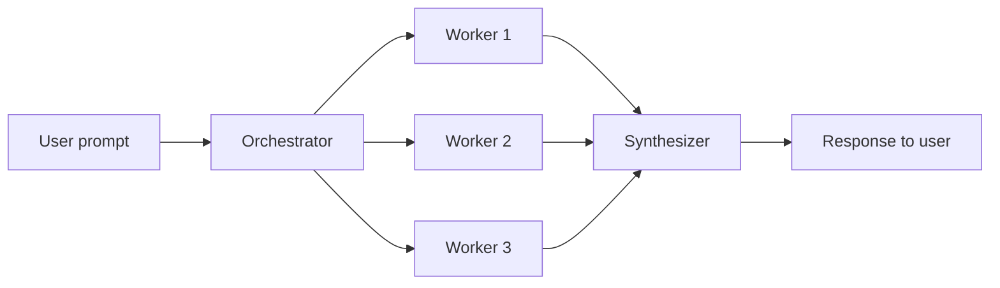
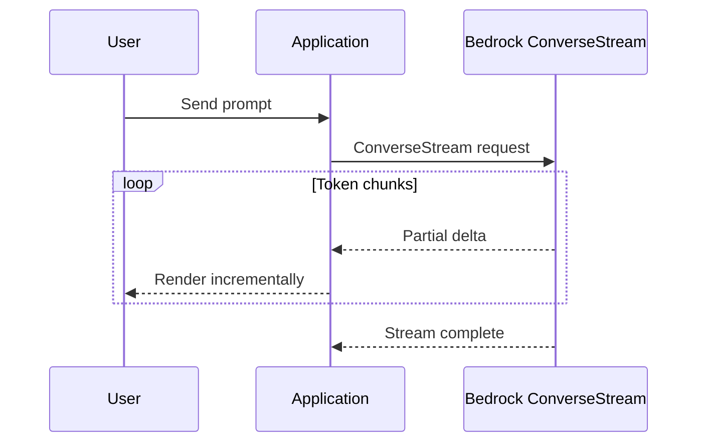
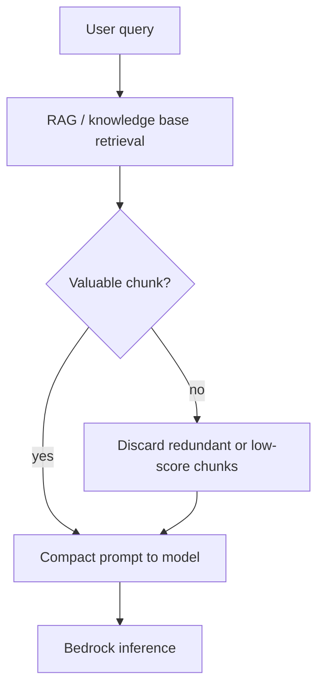
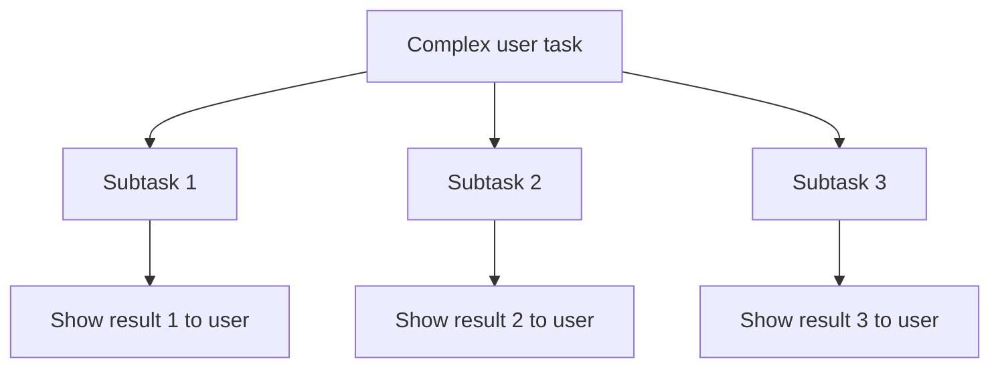

# Building Responsive AI Systems

## What this lecture covers

Responsiveness is how **fast and fluid** your GenAI application feels to end users—not just raw model latency, but whether people wait in silence or see progress immediately. This lecture ties together **parallel workflows**, **caching**, **streaming**, <a href="https://docs.aws.amazon.com/bedrock/latest/userguide/latency-optimized-inference.html">Bedrock latency-optimized inference</a>, **intelligent routing**, **prompt/context trimming**, **output limits**, and **progressive task breakdown** as levers for a snappier user experience.

## Key definitions (from the lecture)

| Term | Definition |
|---|---|
| **Responsiveness (UX)** | How quickly users perceive useful output—time-to-first-token, streaming progress, and end-to-end latency from the user’s perspective. |
| **Parallel agent execution** | Running independent heavy subtasks **at the same time** (e.g., orchestrator farms work to specialist workers) instead of sequentially. |
| **Orchestrator–synthesizer pattern** | An orchestrator analyzes a prompt, **decomposes** parallelizable work, dispatches **worker agents**, then a **synthesizer collates** results into one answer. |
| **Streaming inference** | Returning model output **incrementally** (token/word chunks) via <a href="https://docs.aws.amazon.com/bedrock/latest/APIReference/API_runtime_ConverseStream.html">ConverseStream</a> or equivalent—users read while generation continues. |
| <a href="https://docs.aws.amazon.com/bedrock/latest/userguide/latency-optimized-inference.html">**Latency-optimized inference**</a> | Bedrock **performance configuration** that routes eligible requests through optimized model paths for lower time-to-token and end-to-end latency. |
| <a href="https://docs.aws.amazon.com/bedrock/latest/userguide/prompt-routing.html">**Intelligent Prompt Routing**</a> | Managed routing that sends **simpler prompts** to **smaller, faster models** instead of always invoking a heavy reasoning tier. |
| **Context pruning** | Dropping low-value retrieved chunks, redundant RAG results, or unnecessary history so the model processes **less input** before responding. |
| **Progressive task presentation** | Breaking a complex job into **subtasks** and surfacing each result to the user **as it completes** rather than waiting for the entire pipeline. |

## Key distinctions / comparisons

| Item | Notes |
|---|---|
| **Responsiveness vs cost optimization** | Many techniques overlap ([Token Efficiency](../01-token-efficiency/index.md), [Cost-Effective Model Selection](../02-cost-effective-model-selection/index.md))—shorter prompts and smaller models save money **and** feel faster. |
| **Parallel vs sequential workflows** | Parallel execution cuts wall-clock time when subtasks are independent; sequential is required when later steps depend on earlier outputs. |
| **Agent SDK vs Step Functions** | Modern **agentic SDKs** handle parallel multi-agent flows naturally; <a href="https://docs.aws.amazon.com/step-functions/latest/dg/state-parallel.html">Step Functions Parallel state</a> can orchestrate the same pattern with more wiring (“the harder way”). |
| **Semantic/prompt cache vs live inference** | Cache hits return stored answers **immediately** with **no model call**—see [Intelligent Caching Systems for GenAI](../04-intelligent-caching-systems-for-genai/index.md). |
| **Streaming vs batch response** | Batch waits for the full completion; streaming improves **perceived** latency even when total generation time is similar. |
| **Latency-optimized vs standard inference** | Standard is the default; optimized trades slightly different pricing/quotas for faster paths on supported models and regions. |
| **Input trimming vs output limiting** | Pruning context and concise prompts speed **time-to-first-token**; `maxTokens` and structured output cap **generation duration**. |

## The problem (why responsiveness matters)

- Users expect **instant gratification**—long silent waits erode trust in the application regardless of eventual answer quality.
- Complex agentic pipelines (RAG retrieval, tool calls, multi-step reasoning) stack **serial latency** unless you design for parallelism and progressive feedback.
- A model that is “fast enough” on benchmarks can still feel slow if you **buffer the entire response**, send **bloated prompts**, or always route to the **largest model**.

## Parallel execution for complex workflows

When heavy work can run **independently**, execute it **in parallel** rather than one step after another.

The **orchestrator–synthesizer** pattern (from [Multi-Agent Workflows](../../section-3/02-multi-agent-workflows/index.md)) fits this well:

1. **Orchestrator** reads the user prompt and identifies subtasks that do not depend on each other.
2. **Worker agents** perform time-intensive work **concurrently** (research, code review, translation per language, etc.).
3. **Synthesizer** merges worker outputs into a single coherent response.



Most agentic SDKs support this pattern today. For infrastructure-first orchestration, a <a href="https://docs.aws.amazon.com/step-functions/latest/dg/state-parallel.html">Parallel state</a> in <a href="https://docs.aws.amazon.com/step-functions/latest/dg/welcome.html">AWS Step Functions</a> can fan out branches and join results—more operational overhead, but viable when you already standardize on Step Functions for enterprise workflows.

## Caching for faster repeat answers

As covered in the prior lecture, **caching** improves responsiveness when queries are hard or **repeated**:

- **Semantic caching** — match paraphrased questions via embeddings and return a stored answer instantly.
- **Prompt caching** — Bedrock reuses static prefix tokens on subsequent calls, reducing latency on the managed path.

On a cache hit, the system can skip inference entirely (semantic/app cache) or skip re-processing large static prefixes (Bedrock prompt cache)—both feel **immediate** compared to a cold model call. See [Intelligent Caching Systems for GenAI](../04-intelligent-caching-systems-for-genai/index.md).

## Stream responses whenever possible

Instead of blocking until the full completion returns, **stream tokens** to the client as they are generated—familiar from ChatGPT-style UIs where text appears word by word.



Use the <a href="https://docs.aws.amazon.com/bedrock/latest/userguide/conversation-inference.html">Converse API</a> with <a href="https://docs.aws.amazon.com/bedrock/latest/APIReference/API_runtime_ConverseStream.html">ConverseStream</a> (or model-specific streaming invoke APIs) so users **start reading before generation finishes**. Streaming does not always reduce total generation time, but it dramatically improves **perceived** responsiveness for long answers.

## Bedrock latency-optimized inference

Bedrock offers **latency-optimized inference** for supported foundation models. Set performance configuration on your runtime call—for example via the <a href="https://docs.aws.amazon.com/bedrock/latest/userguide/conversation-inference.html">Converse API</a>—to request the optimized path:

```python
import boto3

client = boto3.client("bedrock-runtime", region_name="us-east-1")

response = client.converse(
    modelId="anthropic.claude-3-5-haiku-20241022-v1:0",
    messages=[{"role": "user", "content": [{"text": "Summarize this incident report."}]}],
    performanceConfig={"latency": "optimized"},  # default is "standard"
)
```

This optimizes **time per token**, **output tokens per second**, and **end-to-end latency**—what the user actually experiences, not just isolated model internals. Supported models and regions are documented on the <a href="https://docs.aws.amazon.com/bedrock/latest/userguide/latency-optimized-inference.html">latency optimization page</a> (preview feature; quotas may fall back to standard mode). Monitor behavior via <a href="https://docs.aws.amazon.com/bedrock/latest/userguide/monitoring.html">CloudWatch Bedrock metrics</a> and API/CloudTrail fields that show which latency mode served the request.

## Route simple prompts to faster models

<a href="https://docs.aws.amazon.com/bedrock/latest/userguide/prompt-routing.html">Intelligent Prompt Routing</a> is not only a **cost** lever—it is a **responsiveness** lever. Many prompts do not need a large, slow **reasoning model**; detecting simpler requests and routing them to a **smaller, faster model** returns answers sooner.

Custom routing (Bedrock Flows conditionals, Lambda classifiers, Agent Squad, Strands Agents) achieves the same goal: **match model complexity to prompt complexity**. See [Cost-Effective Model Selection](../02-cost-effective-model-selection/index.md).

## Keep prompts lean and ordered

**Concise, precise instructions** help models respond faster—less text to process on the way in, similar to giving a colleague a short actionable email instead of pages of “word salad.” Concision also tends to improve **quality**, not just speed.

Additional input-side practices:

| Practice | Why it helps responsiveness |
|---|---|
| **Concise system and user prompts** | Fewer input tokens → faster prefill and lower latency. |
| **Important content first** | If you force tight input limits and truncation is possible, critical instructions and context should appear **at the start** so they survive cutoff. |
| **Context pruning** | Drop irrelevant or redundant RAG chunks (e.g., after hybrid search scoring)—see [Token Efficiency](../01-token-efficiency/index.md). Less context → faster inference. |



When pruning RAG results from a <a href="https://docs.aws.amazon.com/bedrock/latest/userguide/kb-how-retrieval.html">Bedrock Knowledge Base</a> or vector store, remove chunks that hybrid search marks as low value or that duplicate each other—**the less you send, the faster the response**.

## Limit response size

Generating **300 tokens** completes sooner than **3,000 tokens**. When brevity is acceptable, explicitly cap output:

| Method | Notes |
|---|---|
| **`maxTokens` in `inferenceConfig`** | Hard cap on generated tokens for <a href="https://docs.aws.amazon.com/bedrock/latest/userguide/conversation-inference.html">Converse</a> calls. |
| **Prompt instruction** | e.g., “Respond in 100 words or fewer.” |
| **Structured JSON output** | <a href="https://docs.aws.amazon.com/bedrock/latest/userguide/structured-output.html">Structured outputs</a> constrain format and length, reducing rambling prose. |

These techniques were covered in depth under [Token Efficiency](../01-token-efficiency/index.md); here the emphasis is **wall-clock time to completion**, not billing alone.

## Break complex tasks into progressive steps

For multi-step jobs, **do not make users wait** for the entire pipeline to finish before showing anything useful. Decompose the work into **simpler subtasks** and **stream or display each sub-result as it arrives**.



Example: a “analyze this contract” flow might first show **key dates**, then **risk clauses**, then **recommended actions**—each panel renders when its worker completes. Combined with **streaming** within each step, users see continuous progress instead of a single long pause.

## Examples

**Parallel research assistant.** An orchestrator splits “compare three vendor proposals” into three worker agents that each extract pricing, SLA terms, and security posture **in parallel**; a synthesizer merges findings. Wall-clock time approaches the **slowest worker**, not the sum of all three.

**Streaming support bot.** The UI calls `ConverseStream` and renders tokens as they arrive. Even a 90-second legal summary **feels** responsive because the user reads the opening paragraphs within seconds.

**Fast path via routing + short output.** A status-check intent routes to Haiku via Intelligent Prompt Routing; `maxTokens: 128` and a JSON schema for `{ "status", "eta" }` keep answers sub-second after retrieval.

## Limitations / edge cases

- **Parallelism requires independence** — steps with strict dependencies must stay sequential; forcing parallelization breaks correctness.
- **Streaming adds client complexity** — you need UI/server logic to handle partial chunks, errors mid-stream, and cancellation.
- **Latency-optimized inference** is **preview**, **model/region-specific**, and may **fall back** to standard mode when quotas are exhausted.
- **Aggressive context pruning** can drop needed evidence; **over-tight `maxTokens`** truncates answers mid-thought.
- **Cache freshness** — instant cached answers are wrong if upstream policy or data changed; tune TTL and invalidation (see caching lecture).
- **Progressive UI** — showing partial subtask results can confuse users if later steps contradict earlier ones unless you label interim vs final state.

## Key takeaways

- Responsiveness is a **product requirement**—optimize what the **user feels**, not only benchmark latency.
- Run **independent heavy work in parallel** (orchestrator–worker–synthesizer or Step Functions Parallel).
- Use **caching** for repeated or expensive queries; use **streaming** for long generations.
- Enable **latency-optimized inference** on supported Bedrock models when you need faster paths without custom tuning.
- **Route simple prompts to faster models**; keep **inputs concise and pruned** and **outputs bounded**.
- For complex pipelines, **surface sub-results early** instead of one blocking final response.

## Industry scenarios

- **Customer support copilot** — Simple “where is my order?” queries route to a small fast model with a 256-token cap; complex disputes escalate to a reasoning model. All responses stream into the agent desktop so reps see text immediately while tools fetch tracking data in parallel.
- **Legal document review platform** — An orchestrator fans out clause extraction, jurisdiction checks, and risk scoring across parallel workers; attorneys see each section’s highlights appear in the UI as workers finish instead of waiting for a monolithic report.
- **Developer platform assistant** — Semantic cache serves repeated “how do I configure X?” questions instantly; uncached code explanations use ConverseStream plus latency-optimized Haiku so IDE plugins feel as snappy as consumer chat products.

## Internal References

- [Token Efficiency](../01-token-efficiency/index.md)
- [Cost-Effective Model Selection](../02-cost-effective-model-selection/index.md)
- [Maximizing Resource Utilization and Throughput](../03-maximizing-resource-utilization-and-throughput/index.md)
- [Intelligent Caching Systems for GenAI](../04-intelligent-caching-systems-for-genai/index.md)
- [Multi-Agent Workflows](../../section-3/02-multi-agent-workflows/index.md)
- [Retrieval Augmented Generation (RAG)](../../section-1/retrieval-augmented-generation-rag/index.md)

## External References

- <a href="https://docs.aws.amazon.com/bedrock/latest/userguide/latency-optimized-inference.html">Optimize model inference for latency (Amazon Bedrock)</a>
- <a href="https://docs.aws.amazon.com/bedrock/latest/userguide/conversation-inference.html">Inference using Converse API (Amazon Bedrock)</a>
- <a href="https://docs.aws.amazon.com/bedrock/latest/APIReference/API_runtime_ConverseStream.html">ConverseStream API reference</a>
- <a href="https://docs.aws.amazon.com/bedrock/latest/userguide/prompt-routing.html">Understanding intelligent prompt routing in Amazon Bedrock</a>
- <a href="https://docs.aws.amazon.com/bedrock/latest/userguide/prompt-caching.html">Prompt caching for faster model inference (Amazon Bedrock)</a>
- <a href="https://docs.aws.amazon.com/bedrock/latest/userguide/kb-how-retrieval.html">Retrieve data from a knowledge base (Amazon Bedrock)</a>
- <a href="https://docs.aws.amazon.com/bedrock/latest/userguide/structured-output.html">Structured outputs (Amazon Bedrock)</a>
- <a href="https://docs.aws.amazon.com/bedrock/latest/userguide/monitoring.html">Monitor Amazon Bedrock runtime metrics (CloudWatch)</a>
- <a href="https://docs.aws.amazon.com/step-functions/latest/dg/state-parallel.html">Parallel workflow state (AWS Step Functions)</a>
