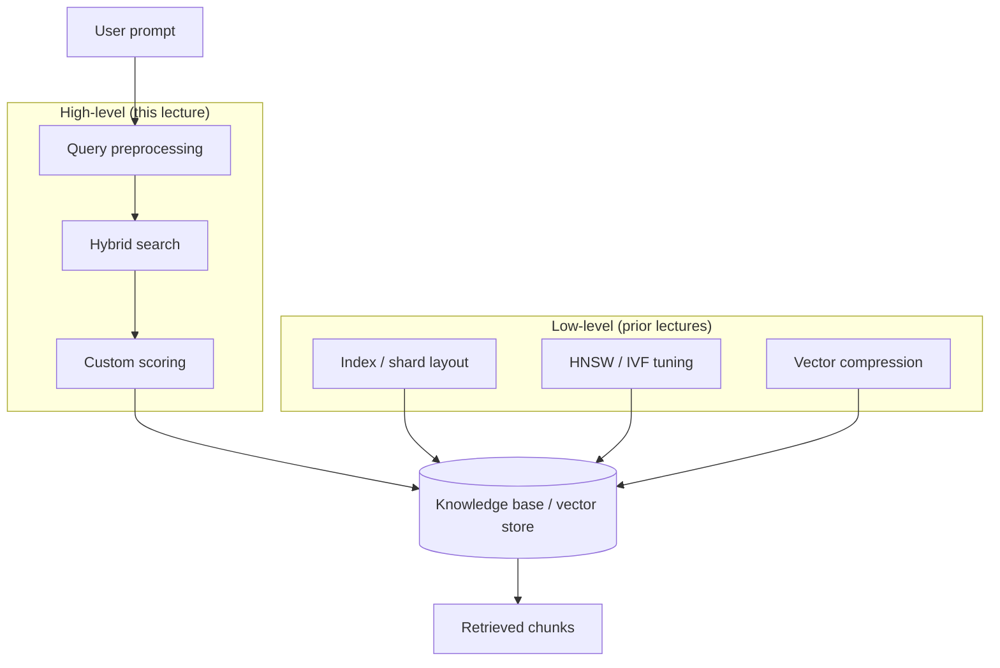
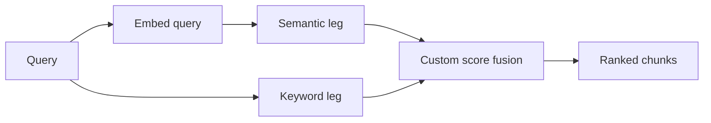
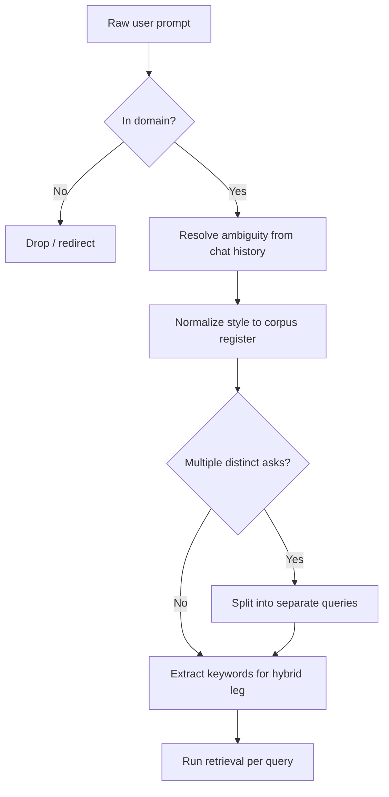

# Optimizing Retrieval Performance

## What this lecture covers

Retrieval performance here means **RAG retrieval quality and relevancy**—how well you pull the right chunks from a <a href="https://docs.aws.amazon.com/bedrock/latest/userguide/knowledge-base.html">Bedrock Knowledge Base</a>, vector store, or similar index before generation. The lecture splits optimization into **low-level index tuning** (covered in depth elsewhere) and **higher-level techniques**: <a href="https://docs.aws.amazon.com/opensearch-service/latest/developerguide/serverless-configure-neural-search.html">hybrid search</a>, **custom hybrid scoring**, and **query preprocessing** so the search query matches what is actually indexed.

## Key definitions (from the lecture)

| Term | Definition |
|---|---|
| **Retrieval performance (RAG)** | How relevant and complete the chunks returned from your knowledge base or vector store are for a user prompt—not just raw index latency. |
| **Low-level optimization** | Tuning the underlying data store: index layout, sharding, ANN parameters, compression—organizing data so the store itself returns better/faster results. |
| <a href="https://docs.aws.amazon.com/opensearch-service/latest/developerguide/serverless-configure-neural-search.html">**Hybrid search**</a> | Search that combines **semantic** (embedding vector distance) and **keyword** (lexical) relevance in one query. |
| **Custom hybrid scoring function** | Your own logic for **combining** the semantic score and the keyword-based relevance score—weighting or normalizing them to improve overall retrieval quality. |
| **Query preprocessing** | Transforming or enriching the user prompt **before** it hits retrieval—style normalization, splitting, filtering, disambiguation, keyword extraction. |
| **Query style normalization** | Rewriting an informal user question into the **same register and vocabulary** as indexed content (e.g., scientific-paper tone). |
| **Query splitting (multi-intent)** | Breaking a prompt that asks for **two or more unrelated topics** into separate retrieval queries so each can match its own chunks. |
| **Out-of-domain filtering** | Detecting and dropping requests that cannot exist in your corpus (e.g., “yesterday’s news” against a scientific-paper index). |
| **Ambiguity resolution** | Expanding vague references (“this thing I talked about earlier”) into explicit terms **before** vector or keyword search. |
| **Keyword extraction** | Pulling indexable terms from a prompt up front to feed the **keyword leg** of hybrid search directly. |

## Key distinctions / comparisons

| Item | Notes |
|---|---|
| **Low-level vs high-level optimization** | Index knobs (HNSW, sharding, compression) fix the **store**; hybrid search and query preprocessing fix **what you send** and **how scores combine**. Start low-level, then layer high-level techniques. |
| **Semantic-only vs hybrid search** | Pure vector search can miss exact terms; keyword search can miss paraphrases. Hybrid improves relevancy when both signals matter—see [Using and Tuning OpenSearch as a Vector Store](../../section-2/23-using-and-tuning-opensearch-as-a-vector-store/index.md). |
| **Default hybrid scoring vs custom scoring** | Managed pipelines often use fixed normalization; a **custom function** lets you tune how much semantic vs keyword score drives the final rank for your domain. |
| **Single query vs split queries** | One prompt covering “A **and** B” rarely returns one chunk that covers both; two targeted queries retrieve better coverage per subtopic. |
| **Retrieval-only vs RetrieveAndGenerate** | <a href="https://docs.aws.amazon.com/bedrock/latest/userguide/kb-test-retrieve.html">Retrieve</a> returns ranked chunks for your own pipeline; preprocessing applies to both paths before or inside your orchestration layer. |

## The problem (why retrieval fails)

- Default RAG sends the **raw user prompt** straight to the knowledge base; that often **does not** match how content was chunked or written.
- A single embedding query for **multiple intents** (“tell me about X **and** Y”) usually misses documents that cover only one topic well.
- **Informal questions** against a **formal corpus** (papers, policies, specs) produce weak vector matches even when the answer exists.
- **Vague or conversational references** (“what we discussed earlier”) carry no signal for a stateless vector index.
- **Out-of-domain** asks waste retrieval budget and pollute context with irrelevant chunks.
- Without keyword extraction, hybrid search may under-use the lexical index you built at ingestion time.

## Two layers of optimization



**Low-level** work—how you organize and tune the index—is the foundation; review [Using and Tuning OpenSearch as a Vector Store](../../section-2/23-using-and-tuning-opensearch-as-a-vector-store/index.md) for semantic vs hybrid modes, HNSW parameters, sharding for hybrid workloads, and related knobs.

**High-level** work improves **relevancy** without re-indexing: hybrid retrieval, custom score fusion, and smarter queries upstream.

## Hybrid search and custom scoring

<a href="https://docs.aws.amazon.com/opensearch-service/latest/developerguide/semantic-search.html">Semantic search</a> compares query and document **embeddings**. Hybrid search runs **both** that vector distance and **keyword matching** (plus metadata when indexed), then merges ranked lists.

The lecture adds a technique not emphasized earlier: you can define a **custom hybrid scoring function**—your own recipe for blending:

- the **semantic** (embedding distance / similarity) score, and  
- the **keyword-based** relevance score.

How you weight, normalize, or cap each signal can materially improve end-to-end RAG quality for domains where pure vectors or pure keywords alone underperform. OpenSearch Serverless documents **normalization processors** in its neural/hybrid pipeline; Bedrock Knowledge Bases backed by OpenSearch inherit that stack when hybrid mode is enabled.



Pair hybrid retrieval with <a href="https://docs.aws.amazon.com/bedrock/latest/userguide/rerank.html">Bedrock reranking</a> when you want a second pass that re-orders candidates by query–passage relevance after initial hybrid retrieval.

## Query preprocessing pipeline

Before calling <a href="https://docs.aws.amazon.com/bedrock/latest/userguide/kb-how-retrieval.html">Retrieve</a> or your vector store API, preprocess the incoming prompt:



### Style normalization

If the knowledge base holds **scientific papers**, a question phrased in the same **formal, domain language** as those papers retrieves better than a casual paraphrase. Use a small model or template step to rewrite the query into the **style and terminology** of indexed content before embedding and search.

### Split multi-intent prompts

When someone asks for **two things at once** (“I want to learn about **this and this**”), a single hit rarely covers both. **Split** the prompt into separate retrieval queries—one per subtopic—and merge the result sets (deduplicating chunks). You may need a **separate model** to detect and decompose compound questions.

### Filter out-of-domain requests

If the system only searches **scientific papers**, discard or short-circuit prompts about **yesterday’s news** or other topics that cannot appear in the corpus. That saves retrieval slots and keeps irrelevant chunks out of the generation context.

### Resolve ambiguity first

Phrases like “**this thing I talked about earlier**” are invisible to a knowledge base with no session memory. **Spell out** the referent—using chat history, a memory store, or a clarifying model call—**before** retrieval. See [Short and Long-Term Agent Memory](../../section-3/03-short-and-long-term-agent-memory/index.md) for keeping conversational context that preprocessing can consume.

### Extract keywords for hybrid search

When hybrid search is enabled, **pull keywords from the prompt up front** and query the keyword index directly for terms you know are indexed (product codes, gene names, SKU IDs, regulatory phrases). That strengthens the lexical leg alongside the embedding query.

## How to apply it

Example orchestration (pseudocode)—preprocess, optionally split, then retrieve with hybrid + custom fusion:

```python
def retrieve_for_rag(user_prompt: str, session_context: str, kb_id: str) -> list:
    if not is_in_domain(user_prompt, kb_id):
        return []

    explicit = resolve_references(user_prompt, session_context)  # "this thing" -> named entity
    normalized = normalize_style(explicit, target_register="scientific_paper")
    sub_queries = split_compound_intents(normalized) or [normalized]

    all_chunks = []
    for q in sub_queries:
        keywords = extract_keywords(q)
        chunks = bedrock_retrieve(
            knowledgeBaseId=kb_id,
            retrievalQuery={"text": q},
            retrievalConfiguration={
                "vectorSearchConfiguration": {
                    "numberOfResults": 5,
                    # hybrid + metadata when configured at ingestion
                }
            },
            # application layer: pass keywords to OpenSearch hybrid query
            # and apply custom_semantic_keyword_score(sem, kw)
        )
        all_chunks.extend(chunks)
    return dedupe_by_chunk_id(all_chunks)
```

At ingestion time, ensure **keywords and metadata** are populated so hybrid search and filters have material to work with—see [Optimizing your Vector Store and Embeddings](../../section-1/optimizing-your-vector-store-and-embeddings/index.md) and <a href="https://docs.aws.amazon.com/bedrock/latest/userguide/kb-metadata.html">metadata in Bedrock Knowledge Bases</a>.

## Examples

**1. Scientific corpus, informal question**

User: “What’s the deal with CRISPR off-target stuff?”  
Preprocessing rewrites to formal query language aligned with paper abstracts, extracts `CRISPR`, `off-target`, hybrid search boosts passages with exact terminology, semantic leg catches paraphrased “unintended edits.”

**2. Compound ask**

User: “Explain HNSW tuning **and** how to shard for hybrid search.”  
Split into two Retrieve calls; merge top chunks from each sub-query instead of hoping one chunk covers both topics from [OpenSearch vector tuning](../../section-2/23-using-and-tuning-opensearch-as-a-vector-store/index.md).

**3. Hybrid scoring tweak**

Legal KB: keyword match on ** statute numbers** must outweigh pure semantic similarity. Custom fusion weights keyword score 70% / semantic 30% for docket-style queries; product FAQ KB might invert that ratio.

## Limitations / edge cases

- Query preprocessing adds **latency and cost** (extra model calls for split, normalize, disambiguate)—weigh against gains; see [Building Responsive AI Systems](../05-building-responsive-ai-systems/index.md).
- Over-aggressive **out-of-domain filtering** can block valid paraphrases at the edge of your corpus.
- **Style normalization** that drifts from the user’s intent can retrieve on-topic but wrong-aspect chunks.
- **Splitting** too finely multiplies retrieval calls and can overflow context if you merge naively—cap per-sub-query `numberOfResults` and dedupe.
- Custom hybrid scoring requires access to **both score streams**; not every managed wrapper exposes fusion hooks equally.
- Preprocessing cannot fix **bad chunking or stale indexes**—low-level ingestion quality still matters.

## Key takeaways

- Optimize retrieval at **two levels**: tune the **index/store** first, then improve **query formulation and scoring**.
- **Hybrid search** (semantic + keyword) improves relevancy when either signal alone misses; tune with a **custom scoring function** when defaults are weak for your domain.
- **Preprocess queries** before retrieval: normalize style, **split multi-intent** prompts, filter out-of-domain asks, **resolve ambiguity**, and **extract keywords** for the hybrid lexical leg.
- A knowledge base does not know conversational shorthand—**explicit terms** beat vague references every time.
- Strong retrieval reduces downstream tokens and latency—aligned with [Token Efficiency](../01-token-efficiency/index.md) and responsive UX patterns.

## Industry scenarios

- **Pharmaceutical research assistant:** Scientists ask casual questions against a corpus of formal PubMed-style papers. A preprocessing step rewrites queries into abstract-like language and extracts gene and compound keywords for hybrid search on an OpenSearch-backed Bedrock Knowledge Base; compound questions about “efficacy **and** side effects” are split so each mechanism retrieves its own evidence passages.

- **Insurance policy chatbot:** Employees paraphrase coverage questions while policies use precise legal terms and clause numbers. The team enables hybrid search, weights keyword matches on **policy section IDs** heavily in a custom scorer, and drops prompts about general news or sports before retrieval—cutting irrelevant chunk noise and support escalations.

- **Enterprise IT runbook search:** Engineers ask multi-part Slack-style messages (“how do I reset VPN **and** update MFA?”). An orchestrator model splits intents, resolves “that outage we saw last week” using ticket IDs from session memory, and runs parallel Retrieve calls against a Confluence-backed knowledge base; results are deduped before a single model generates the combined answer.

## Internal References

- [Retrieval Augmented Generation (RAG)](../../section-1/retrieval-augmented-generation-rag/index.md)
- [Bedrock Knowledge Bases](../../section-1/bedrock-knowledge-bases/index.md)
- [Optimizing your Vector Store and Embeddings](../../section-1/optimizing-your-vector-store-and-embeddings/index.md)
- [Using and Tuning OpenSearch as a Vector Store](../../section-2/23-using-and-tuning-opensearch-as-a-vector-store/index.md)
- [Pre-Retrieval and Chunking Strategies](../../section-1/pre-retrieval-and-chunking-strategies/index.md)
- [Token Efficiency](../01-token-efficiency/index.md)
- [Building Responsive AI Systems](../05-building-responsive-ai-systems/index.md)
- [Short and Long-Term Agent Memory](../../section-3/03-short-and-long-term-agent-memory/index.md)

## External References

- <a href="https://docs.aws.amazon.com/bedrock/latest/userguide/knowledge-base.html">Retrieve data and generate AI responses with Amazon Bedrock Knowledge Bases</a>
- <a href="https://docs.aws.amazon.com/bedrock/latest/userguide/kb-how-retrieval.html">Retrieving information from data sources using Amazon Bedrock Knowledge Bases</a>
- <a href="https://docs.aws.amazon.com/bedrock/latest/userguide/kb-test-retrieve.html">Query a knowledge base and retrieve data</a>
- <a href="https://docs.aws.amazon.com/bedrock/latest/userguide/kb-metadata.html">Include metadata in a data source to improve knowledge base query</a>
- <a href="https://docs.aws.amazon.com/bedrock/latest/userguide/rerank.html">Improve the relevance of query responses with a reranker model in Amazon Bedrock</a>
- <a href="https://docs.aws.amazon.com/opensearch-service/latest/developerguide/semantic-search.html">Semantic search in Amazon OpenSearch Service</a>
- <a href="https://docs.aws.amazon.com/opensearch-service/latest/developerguide/serverless-configure-neural-search.html">Configure Neural Search and Hybrid Search on OpenSearch Serverless</a>
- <a href="https://docs.aws.amazon.com/opensearch-service/latest/developerguide/vector-search.html">Vector search - Amazon OpenSearch Service</a>
