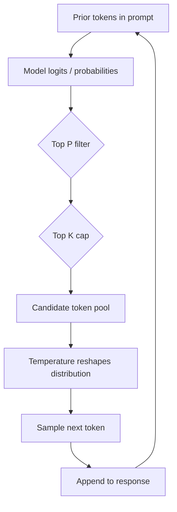

# Optimizing for Specific Use Cases

## What this lecture covers

Tailoring a <a href="https://docs.aws.amazon.com/bedrock/latest/userguide/foundation-models-reference.html">foundation model</a> to a workload means tuning **inference parameters**—not retraining the model—and **measuring** how those settings change quality, consistency, and verbosity. The lecture walks through common knobs (`maxTokens`, temperature, top P, top K), how they interact during token sampling, and managed ways to compare configurations: **A/B testing** with <a href="https://docs.aws.amazon.com/AmazonCloudWatch/latest/monitoring/CloudWatch-Evidently-newexperiment.html">CloudWatch Evidently</a>, <a href="https://docs.aws.amazon.com/bedrock/latest/userguide/evaluation-automatic.html">Amazon Bedrock automatic model evaluation</a>, and <a href="https://docs.aws.amazon.com/sagemaker/latest/dg/clarify-foundation-model-evaluate-whatis.html">SageMaker foundation model evaluations</a>.

## Key definitions (from the lecture)

| Term | Definition |
|---|---|
| **Use-case optimization (inference tuning)** | Adjusting generation settings so model behavior matches the task—factual Q&A, creative copy, concise summaries—without changing model weights. |
| **`maxTokens` / response length** | Caps how many tokens the model may generate; primary lever for **verbosity** and output cost. See <a href="https://docs.aws.amazon.com/bedrock/latest/userguide/inference-parameters.html#inference-length">length parameters</a>. |
| **Temperature** | Controls **randomness** when the model picks the next token from its candidate pool. **Lower** → more deterministic, repeatable answers; **higher** → more varied, “creative” wording. A value near **0** usually yields consistent responses (unless the underlying model version changes). |
| **Top P (nucleus sampling)** | A **probability threshold**: only tokens whose cumulative probability mass falls within the top **P** fraction are eligible **candidates** for the next token. Controls **how “good”** a token must be before it enters the pool. |
| **Top K** | A **fixed count** of the highest-probability token candidates considered at each step—e.g., “only the best 50 options.” |
| **Token candidate pool** | At each generation step the model scores likely next tokens; temperature, top P, and top K shape **which** candidates exist and **how** one is chosen. Randomness is **not** arbitrary gibberish—the candidates are already reasonable continuations. |

## Key distinctions / comparisons

| Item | Notes |
|---|---|
| **Temperature vs Top P** | Both influence diversity, but differently: temperature **reshapes** the probability distribution; top P **filters** which tokens may enter the pool. The lecture recommends tuning **one or the other**, not both aggressively at once—easier to reason about and compare in A/B tests. |
| **Top K vs Top P** | **Top K** = fixed number of best candidates. **Top P** = dynamic pool sized by cumulative probability. They can overlap in effect; top K may **cap** how large a top-P pool can grow. |
| **Playground vs production SDK** | <a href="https://docs.aws.amazon.com/bedrock/latest/userguide/playgrounds.html">Bedrock playgrounds</a> are fine for manual exploration; production tuning should set the same parameters programmatically via <a href="https://docs.aws.amazon.com/bedrock/latest/userguide/conversation-inference.html">Converse</a> or evaluation jobs so results are reproducible. |
| **A/B test vs offline evaluation** | **Evidently** splits live traffic and tracks business metrics. **Bedrock / SageMaker evaluation jobs** run curated prompt datasets offline with task metrics—better for regression gates before rollout. |
| **Bedrock evaluation vs SageMaker FMEval** | <a href="https://docs.aws.amazon.com/bedrock/latest/userguide/evaluation.html">Bedrock model evaluation</a> is native to Bedrock models and knowledge-base workflows. <a href="https://docs.aws.amazon.com/sagemaker/latest/dg/clarify-foundation-model-evaluate-auto.html">SageMaker automatic model evaluation</a> adds Studio UI, JumpStart models, and the open-source `fmeval` library for custom pipelines. |

## The problem (why default settings fail)

- A single default configuration rarely fits **creative marketing**, **strict compliance Q&A**, and **short chat replies** equally well.
- **Too much randomness** hurts factual, repeatable tasks (support macros, policy lookup, code generation you want to diff in CI).
- **Too little randomness** makes marketing copy, brainstorming, and variant generation feel stale.
- **Unbounded verbosity** wastes tokens and latency when users only need a sentence—see [Token Efficiency](../01-token-efficiency/index.md).
- Without measurement, teams guess at settings; **A/B tests** and **evaluation jobs** turn tuning into evidence-based decisions instead of opinion.

## How token sampling fits together

At each step the model proposes next-token probabilities. Inference parameters filter and sample from that list:



**Lecture mnemonic:**

- **Temperature** → how much randomness when **choosing among** candidates.
- **Top P** → how good a token must be to **become** a candidate (nucleus sampling).
- **Top K** → **how many** candidates you keep at the top of the list.

AWS illustrates the interaction with the prompt `I hear the hoof beats of "` and candidates `horses` (0.7), `zebras` (0.2), `unicorns` (0.1) in the <a href="https://docs.aws.amazon.com/bedrock/latest/userguide/inference-parameters.html">inference parameters guide</a>—high temperature flattens probabilities; top K = 2 drops `unicorns`; top P = 0.7 keeps only `horses`.

## Measuring parameter effects

You do **not** have to build evaluation infrastructure from scratch.

| Approach | Best for |
|---|---|
| **A/B testing (<a href="https://docs.aws.amazon.com/AmazonCloudWatch/latest/monitoring/CloudWatch-Evidently-newexperiment.html">CloudWatch Evidently</a>)** | Live traffic experiments—e.g., 50% users get `temperature=0`, 50% get `temperature=0.7`—with statistical comparison on conversion, thumbs-up, or task success metrics. |
| **<a href="https://docs.aws.amazon.com/bedrock/latest/userguide/evaluation-automatic.html">Bedrock automatic model evaluation</a>** | Offline runs on built-in or custom S3 prompt datasets; task types include Q&A, summarization, classification, and general text generation. |
| **<a href="https://docs.aws.amazon.com/sagemaker/latest/dg/clarify-foundation-model-evaluate-whatis.html">SageMaker foundation model evaluations</a>** | Studio-managed jobs, human-in-the-loop options, and `fmeval` for custom metrics—useful when evaluation spans JumpStart endpoints or non-Bedrock hosting. |

Pair offline evaluation (catch regressions) with Evidently launches (validate in production). Review scores in the <a href="https://docs.aws.amazon.com/bedrock/latest/userguide/model-evaluation-report.html">Bedrock evaluation report</a> or SageMaker Studio results views.

## How to apply it — Bedrock runtime (Converse)

Use <a href="https://docs.aws.amazon.com/bedrock/latest/userguide/conversation-inference.html">Converse</a> so the same code works across models. Common parameters live in `inferenceConfig`; model-specific knobs such as **`top_k`** go in `additionalModelRequestFields` (Anthropic Claude and others).

### Deterministic Q&A (low temperature, capped length)

```python
import boto3

bedrock_runtime = boto3.client("bedrock-runtime", region_name="us-east-1")

response = bedrock_runtime.converse(
    modelId="anthropic.claude-3-haiku-20240307-v1:0",
    system=[{"text": "Answer from provided context only. Be concise."}],
    messages=[
        {
            "role": "user",
            "content": [{"text": "What is the return window for unopened electronics?"}],
        }
    ],
    inferenceConfig={
        "maxTokens": 256,
        "temperature": 0.0,  # repeatable answers for support macros
        "stopSequences": ["\n\n"],
    },
)
print(response["output"]["message"]["content"][0]["text"])
```

### Creative variant (higher temperature **or** top P—not both tuned blindly)

The lecture prefers **either** temperature **or** top P as your main diversity knob:

```python
# Option A: temperature-led (creative marketing copy)
creative = bedrock_runtime.converse(
    modelId="anthropic.claude-3-haiku-20240307-v1:0",
    messages=[
        {
            "role": "user",
            "content": [{"text": "Write three taglines for a reusable water bottle."}],
        }
    ],
    inferenceConfig={"maxTokens": 300, "temperature": 0.9},
)

# Option B: top-P-led (nucleus sampling; keep temperature at default / moderate)
nucleus = bedrock_runtime.converse(
    modelId="anthropic.claude-3-haiku-20240307-v1:0",
    messages=[
        {
            "role": "user",
            "content": [{"text": "Write three taglines for a reusable water bottle."}],
        }
    ],
    inferenceConfig={"maxTokens": 300, "topP": 0.95, "temperature": 0.7},
)
```

### Top K (Anthropic) via additionalModelRequestFields

When the model supports top K but it is not in the base `inferenceConfig` block:

```python
import json

response = bedrock_runtime.converse(
    modelId="anthropic.claude-3-haiku-20240307-v1:0",
    messages=[
        {"role": "user", "content": [{"text": "Suggest five blog post titles."}]}
    ],
    inferenceConfig={"maxTokens": 200, "temperature": 0.8},
    additionalModelRequestFields={"top_k": 50},  # limit pool to 50 best candidates
)
```

### Quick parameter sweep before you ship

Compare settings on the same prompt in a script or notebook—mirrors playground experimentation but stays version-controlled:

```python
import json

MODEL_ID = "anthropic.claude-3-haiku-20240307-v1:0"
PROMPT = "Summarize our refund policy in two sentences."

configs = [
    {"label": "strict", "inferenceConfig": {"maxTokens": 120, "temperature": 0.0}},
    {"label": "balanced", "inferenceConfig": {"maxTokens": 120, "temperature": 0.5}},
    {"label": "top_p", "inferenceConfig": {"maxTokens": 120, "topP": 0.9, "temperature": 0.5}},
]

for cfg in configs:
    out = bedrock_runtime.converse(
        modelId=MODEL_ID,
        messages=[{"role": "user", "content": [{"text": PROMPT}]}],
        **{k: v for k, v in cfg.items() if k != "label"},
    )
    text = out["output"]["message"]["content"][0]["text"]
    print(f"\n=== {cfg['label']} ===\n{text}")
```

## How to apply it — offline evaluation (Bedrock SDK)

Encode the inference profile **inside** the evaluation job so metrics reflect the parameters you will use in production:

```python
import json
import boto3

bedrock = boto3.client("bedrock", region_name="us-west-2")

job = bedrock.create_evaluation_job(
    jobName="faq-temperature-compare",
    jobDescription="BoolQ accuracy at temperature 0.7",
    roleArn="arn:aws:iam::111122223333:role/BedrockEvaluationRole",
    modelIdentifierArn="arn:aws:bedrock:us-west-2::foundation-model/amazon.titan-text-lite-v1",
    inferenceConfig={
        "models": [
            {
                "bedrockModel": {
                    "modelIdentifier": modelIdentifierArn,
                    "inferenceParams": json.dumps(
                        {
                            "inferenceConfig": {
                                "maxTokens": 512,
                                "temperature": 0.7,
                                "topP": 0.9,
                            }
                        }
                    ),
                }
            }
        ]
    },
    outputDataConfig={"s3Uri": "s3://my-eval-bucket/outputs/"},
    evaluationConfig={
        "automated": {
            "datasetMetricConfigs": [
                {
                    "taskType": "QuestionAndAnswer",
                    "dataset": {"name": "Builtin.BoolQ"},
                    "metricNames": ["Builtin.Accuracy", "Builtin.Robustness"],
                }
            ]
        }
    },
)
print(job["jobArn"])
```

Run a second job with `"temperature": 0.0` and compare <a href="https://docs.aws.amazon.com/bedrock/latest/userguide/model-evaluation-report.html">report cards</a>. Task types and metrics are listed under <a href="https://docs.aws.amazon.com/bedrock/latest/userguide/model-evaluation-tasks.html">model evaluation task types</a>.

## How to apply it — A/B test inference profiles (Evidently)

Define an Evidently **feature** whose variants are JSON inference presets (`strict`, `creative`). At request time, resolve the variant and pass it to Converse:

```python
import json
import boto3

evidently = boto3.client("evidently", region_name="us-east-1")
bedrock_runtime = boto3.client("bedrock-runtime", region_name="us-east-1")

INFERENCE_VARIANTS = {
    "strict": {"maxTokens": 256, "temperature": 0.0},
    "creative": {"maxTokens": 512, "temperature": 0.8, "topP": 0.95},
}

def converse_with_ab_test(user_id: str, prompt: str) -> str:
    assignment = evidently.evaluate_feature(
        project="genai-inference-tuning",
        feature="support-reply-config",
        entityId=user_id,
    )
    variant_name = assignment["value"]["stringValue"]  # e.g. "strict" or "creative"
    inference_config = INFERENCE_VARIANTS[variant_name]

    response = bedrock_runtime.converse(
        modelId="anthropic.claude-3-haiku-20240307-v1:0",
        messages=[{"role": "user", "content": [{"text": prompt}]}],
        inferenceConfig=inference_config,
    )
    return response["output"]["message"]["content"][0]["text"]
```

Create and start the experiment in the console or with `create_experiment` / `start_experiment`; Evidently collects session metrics so you can pick a winning variant before a full launch. See <a href="https://docs.aws.amazon.com/AmazonCloudWatch/latest/monitoring/CloudWatch-Evidently-newexperiment.html">Create an experiment</a>.

## SageMaker evaluation (when Bedrock alone is not enough)

<a href="https://docs.aws.amazon.com/sagemaker/latest/dg/clarify-foundation-model-evaluate-whatis.html">SageMaker foundation model evaluations</a> let you set **Temperature**, **Top P**, and **Max new tokens** inside Studio automatic jobs—mirroring the same knobs—and run toxicity, accuracy, or custom dimensions against built-in or custom prompt datasets. Use the **`fmeval`** library when you need fully custom evaluation code while still standardizing on the same inference-parameter vocabulary.

## Examples

**1. Support bot — consistency over creativity**

Set `temperature=0`, moderate `maxTokens`, and optional `stopSequences` so macros match the knowledge base wording run after run.

**2. Marketing copy generator — controlled diversity**

Use `temperature≈0.8–1.0` **or** `topP≈0.9` with a higher `maxTokens` cap; avoid cranking both without measuring, per the lecture.

**3. Title suggestions with top K**

For Claude, add `"top_k": 40` in `additionalModelRequestFields` to keep sampling among the strongest candidates while temperature adds light variation.

## Limitations / edge cases

- **Temperature 0 is not a permanent guarantee**—model version updates or provider-side changes can shift outputs even at zero temperature.
- **Parameter ranges and names differ by model**—always check <a href="https://docs.aws.amazon.com/bedrock/latest/userguide/model-parameters.html">model-specific inference parameters</a> before copying configs across families.
- **Top P and top K together** can over-constrain or interact unexpectedly; tune one primary diversity control first.
- **Evidently** requires instrumenting your app to call `evaluate_feature` and emit the metrics you care about; it does not automatically wrap Bedrock.
- **Evaluation jobs** measure dataset metrics, not every live edge case—combine with production A/B tests.
- The lecture transcript ends mid-thought; deeper use-case patterns (routing, RAG tuning, fine-tuning) live in sibling lectures—see Internal References.

## Key takeaways

- Optimize for a **use case** by tuning **inference parameters**, especially `maxTokens`, **temperature**, **top P**, and **top K**—each model exposes slightly different options.
- **Temperature** controls randomness among candidates; **top P** controls candidate quality threshold; **top K** caps how many candidates exist.
- Prefer adjusting **temperature or top P** as your main diversity lever, not both without measurement.
- **`maxTokens`** is the primary verbosity and cost control—pair with prompt instructions when needed.
- **Measure** with **A/B tests** (Evidently), **Bedrock evaluation jobs**, and/or **SageMaker FMEval**—you do not need a bespoke eval platform on day one.
- Encode winning settings in **Converse `inferenceConfig`** (and `additionalModelRequestFields` where required) so production matches what you validated.

## Industry scenarios

- **Retail customer support:** The team A/B tests `temperature=0` vs `0.3` with Evidently, tracking escalation rate and CSAT. Offline Bedrock Q&A evaluation on historical tickets confirms accuracy before promoting the strict variant to 100% traffic.

- **Financial services research assistant:** Compliance requires deterministic excerpts from approved policy PDFs. Engineers set `temperature=0`, low `maxTokens`, and run weekly automatic evaluation jobs on a custom S3 prompt set; any accuracy drop blocks release.

- **Media marketing platform:** Copywriters want fresh taglines. Product ships `temperature=0.9` with `top_k=50` for one cohort and top-P-led sampling for another, comparing click-through in Evidently while SageMaker FMEval screens toxicity on the same prompts.

## Internal References

- [Token Efficiency](../01-token-efficiency/index.md)
- [Cost-Effective Model Selection](../02-cost-effective-model-selection/index.md)
- [Building Responsive AI Systems](../05-building-responsive-ai-systems/index.md)
- [Hands-On with the Bedrock Playground](../../section-1/hands-on-with-the-bedrock-playground/index.md)
- [Prompt Best Practices](../../section-1/prompt-best-practices/index.md)
- [Evaluating RAG Performance](../../section-1/evaluating-rag-performance/index.md)
- [Optimizing Retrieval Performance](../06-optimizing-retrieval-performance/index.md)

## External References

- <a href="https://docs.aws.amazon.com/bedrock/latest/userguide/inference-parameters.html">Influence response generation with inference parameters</a>
- <a href="https://docs.aws.amazon.com/bedrock/latest/userguide/model-parameters.html">Inference request parameters and response fields for foundation models</a>
- <a href="https://docs.aws.amazon.com/bedrock/latest/userguide/conversation-inference.html">Inference using Converse API</a>
- <a href="https://docs.aws.amazon.com/bedrock/latest/APIReference/API_runtime_InferenceConfiguration.html">InferenceConfiguration API reference</a>
- <a href="https://docs.aws.amazon.com/bedrock/latest/userguide/playgrounds.html">Amazon Bedrock playgrounds</a>
- <a href="https://docs.aws.amazon.com/bedrock/latest/userguide/evaluation.html">Evaluate the performance of Amazon Bedrock resources</a>
- <a href="https://docs.aws.amazon.com/bedrock/latest/userguide/evaluation-automatic.html">Creating an automatic model evaluation job in Amazon Bedrock</a>
- <a href="https://docs.aws.amazon.com/bedrock/latest/userguide/model-evaluation-jobs-management-create.html">Starting an automatic model evaluation job in Amazon Bedrock</a>
- <a href="https://docs.aws.amazon.com/bedrock/latest/userguide/model-evaluation-tasks.html">Model evaluation task types in Amazon Bedrock</a>
- <a href="https://docs.aws.amazon.com/bedrock/latest/userguide/model-evaluation-report.html">Review model evaluation job reports and metrics</a>
- <a href="https://docs.aws.amazon.com/AmazonCloudWatch/latest/monitoring/CloudWatch-Evidently-newexperiment.html">Create an experiment (CloudWatch Evidently)</a>
- <a href="https://docs.aws.amazon.com/sagemaker/latest/dg/clarify-foundation-model-evaluate-whatis.html">What are foundation model evaluations? (SageMaker)</a>
- <a href="https://docs.aws.amazon.com/sagemaker/latest/dg/clarify-foundation-model-evaluate-auto.html">Automatic model evaluation (SageMaker)</a>
