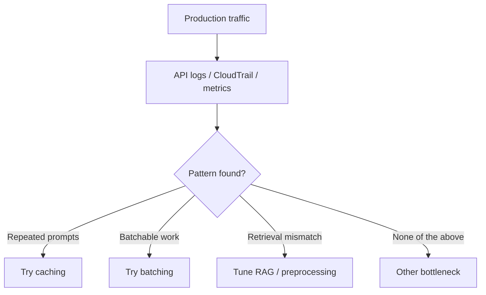
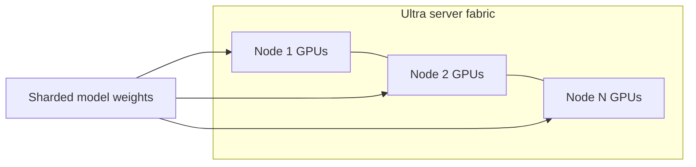

# [Optimizing Foundation Model System Performance](https://www.udemy.com/course/ultimate-aws-certified-generative-ai-developer-professional/learn/lecture/53684455#overview)

## What this lecture covers

A catch-all of **additional performance levers** for foundation model systems—not one unified architecture, but practical “quick hits” that complement earlier topics on [caching](../04-intelligent-caching-systems-for-genai/index.md), [batching](../03-maximizing-resource-utilization-and-throughput/index.md), and [RAG retrieval](../06-optimizing-retrieval-performance/index.md). The lecture emphasizes **measuring real API usage** before optimizing, then covers **structured I/O**, **reasoning/routing**, **user feedback loops**, and **SageMaker AI** deployment concerns for very large self-hosted models.

## Key definitions (from the lecture)

| Term | Definition |
|---|---|
| **API call profiling** | Analyzing how your system is actually invoked—request patterns, repetition, batchability, and alignment with retrieval context—so you know whether caching, batching, or RAG tuning will help. |
| **Structured input and output** | Requiring predictable formats (e.g., JSON or XML templates) on the request and/or response side to improve **efficiency** and **accuracy** of model output. |
| **Chain-of-thought (CoT) instruction patterns** | Prompting or model features that force **step-by-step reasoning** for complex queries; many modern models reason internally, so routing complex work to capable models matters. |
| **Feedback loop** | Capturing whether users like model results, then using that signal to fix failures or promote prompts that work well. |
| <a href="https://docs.aws.amazon.com/sagemaker/latest/dg/large-model-inference.html">**Model parallelization**</a> | Splitting a very large model across **many GPUs** when you self-host (not needed for managed <a href="https://docs.aws.amazon.com/bedrock/latest/userguide/what-is-bedrock.html">Amazon Bedrock</a> inference). |
| <a href="https://docs.aws.amazon.com/sagemaker/latest/dg/sagemaker-hyperpod-ultraserver.html">**Ultra server**</a> | EC2/SageMaker hardware topology with **low-latency, high-bandwidth interconnects** between instances—critical when a model is distributed across many nodes. |
| **Endpoint lifecycle management (lecture)** | Managing **on-demand download** of model artifacts (e.g., from <a href="https://docs.aws.amazon.com/AmazonS3/latest/userguide/Welcome.html">Amazon S3</a>) when inference is triggered, instead of loading everything up front. |

## Key distinctions / comparisons

| Item | Notes |
|---|---|
| **Bedrock vs self-hosted SageMaker** | Bedrock hides shard/parallelism; **SageMaker AI** endpoints are where you tune download timeouts, instance types, Triton/LMI containers, and multi-GPU layouts. |
| **Measure vs optimize** | Caching, batching, and RAG improvements only pay off if traffic patterns match—profile **first**. |
| **Structured output vs free-form prose** | JSON/XML-style constraints reduce rambling tokens and parsing errors—overlaps with [Token Efficiency](../01-token-efficiency/index.md) and [Building Responsive AI Systems](../05-building-responsive-ai-systems/index.md). |
| **Explicit CoT prompts vs native reasoning** | Older pattern: step-by-step instructions in the prompt; newer pattern: **extended/adaptive thinking** models plus **routing** complex prompts to the right tier ([Cost-Effective Model Selection](../02-cost-effective-model-selection/index.md)). |
| **GPU vs CPU inference** | Large generative models usually need GPUs; small classical NLP (e.g., NER) may run on CPU when **cost** dominates and latency requirements are modest. |
| **Single-model endpoint vs multi-model endpoint** | One model per endpoint is simpler; <a href="https://docs.aws.amazon.com/sagemaker/latest/dg/multi-model-endpoints.html">multi-model endpoints</a> **dynamically load** `*.tar.gz` models from S3 per request—better utilization when many models share hardware. |

## Measure before you optimize (API call profiling)

Techniques like caching, batching, and better RAG only help when they match **how clients call you**. Profiling API traffic answers questions such as:

- Are users asking for the **same thing repeatedly** → semantic or exact cache may help ([Intelligent Caching Systems for GenAI](../04-intelligent-caching-systems-for-genai/index.md)).
- Can requests be **batched** together → async/batch inference paths ([Maximizing Resource Utilization and Throughput](../03-maximizing-resource-utilization-and-throughput/index.md)).
- Do queries **match indexed context** (tone, vocabulary, intent) → preprocessing and hybrid retrieval ([Optimizing Retrieval Performance](../06-optimizing-retrieval-performance/index.md)).

Use <a href="https://docs.aws.amazon.com/bedrock/latest/userguide/logging-using-cloudtrail.html">CloudTrail for Bedrock API calls</a>, <a href="https://docs.aws.amazon.com/bedrock/latest/userguide/monitoring.html">Bedrock CloudWatch metrics</a>, and <a href="https://docs.aws.amazon.com/AmazonCloudWatch/latest/monitoring/GenAI-observability.html">CloudWatch GenAI observability</a> to capture model IDs, latency, token usage, and error rates. Application logs should retain **prompt hashes or categories** (not always raw PII) so you can group patterns.



```python
import boto3
from datetime import datetime, timedelta, timezone

cloudwatch = boto3.client("cloudwatch", region_name="us-east-1")

# Example: compare average latency across models you route to
end = datetime.now(timezone.utc)
start = end - timedelta(hours=24)

for model_id in ["anthropic.claude-3-haiku-20240307-v1:0", "anthropic.claude-3-5-sonnet-20241022-v2:0"]:
    stats = cloudwatch.get_metric_statistics(
        Namespace="AWS/Bedrock",
        MetricName="InvocationLatency",
        Dimensions=[{"Name": "ModelId", "Value": model_id}],
        StartTime=start,
        EndTime=end,
        Period=3600,
        Statistics=["Average"],
    )
    print(model_id, stats["Datapoints"])
```

## Structured input and output

Whenever possible, require **structured templates** on input and/or output (JSON, XML, or schema-bound tool calls). That tightens format, shortens generations, and makes downstream automation reliable. On Bedrock, use <a href="https://docs.aws.amazon.com/bedrock/latest/userguide/structured-output.html">structured outputs</a> via `outputConfig.textFormat` on <a href="https://docs.aws.amazon.com/bedrock/latest/userguide/conversation-inference.html">Converse</a> (or strict tool definitions with `strict: true`).

```python
import boto3

client = boto3.client("bedrock-runtime", region_name="us-east-1")

response = client.converse(
    modelId="anthropic.claude-3-5-haiku-20241022-v1:0",
    messages=[
        {
            "role": "user",
            "content": [{"text": "Extract vendor, amount, and date from the invoice text."}],
        }
    ],
    outputConfig={
        "textFormat": {
            "type": "json_schema",
            "structure": {
                "jsonSchema": {
                    "name": "invoice_fields",
                    "schema": (
                        '{"type":"object","properties":{"vendor":{"type":"string"},'
                        '"amount":{"type":"number"},"date":{"type":"string"}},'
                        '"required":["vendor","amount","date"],"additionalProperties":false}'
                    ),
                }
            },
        }
    },
)
```

The same idea appeared earlier in the course for **token control** and **responsiveness**—structured responses cap verbosity and speed parsing.

## Chain-of-thought and routing complex reasoning

For **complicated** tasks, use a reasoning framework so the model works **step-by-step**. Many foundation models already reason internally; the operational shift is often **dynamic routing**: send hard prompts to models that support deeper reasoning (e.g., <a href="https://docs.aws.amazon.com/bedrock/latest/userguide/claude-messages-extended-thinking.html">extended thinking</a> on Claude, or a larger model tier via <a href="https://docs.aws.amazon.com/bedrock/latest/userguide/prompt-routing.html">Intelligent Prompt Routing</a>).

```mermaid
flowchart TD
    P[Incoming prompt]
    C{Complex reasoning?}
    F[Fast / economical model]
    R[Reasoning-capable model\n(extended thinking or larger tier)]
    P --> C
    C -->|no| F
    C -->|yes| R
```

```python
import boto3

client = boto3.client("bedrock-runtime", region_name="us-east-1")

# Route complex work to a model that supports adaptive/extended thinking (Converse API)
response = client.converse(
    modelId="us.anthropic.claude-opus-4-6-v1",
    messages=[{"role": "user", "content": [{"text": "Design a multi-region failover plan with trade-offs."}]}],
    additionalModelRequestFields={"thinking": {"type": "adaptive"}},
    inferenceConfig={"maxTokens": 2048},
)
```

Pair routing with profiling: if “complex” traffic is rare, you avoid paying flagship rates on every request.

## User feedback loops

AWS emphasizes **continuous feedback**: capture whether users are satisfied with answers, then **fix** what fails and **amplify** prompts or flows that work. Aligns with <a href="https://docs.aws.amazon.com/wellarchitected/latest/generative-ai-lens/genops01-bp02.html">GENOPS01-BP02 Collect and monitor user feedback</a> in the Generative AI Lens and with observability dashboards that tie traces to outcomes.

| Signal | How teams use it |
|---|---|
| Thumbs up/down, stars, or CSAT | Detect quality regressions after model or prompt changes |
| “Report incorrect” with category | Prioritize retrieval gaps vs model hallucination vs policy blocks |
| Successful conversation exports | Mine high-performing prompt templates for few-shot libraries |

Instrument the application tier (API Gateway + Lambda, web app, chat widget) to write feedback events to a datastore or stream, then correlate with <a href="https://docs.aws.amazon.com/AmazonCloudWatch/latest/monitoring/GenAI-observability.html">GenAI observability</a> traces for the same `sessionId` or request ID.

## SageMaker AI: very large models and startup time

When you **deploy your own** models on <a href="https://docs.aws.amazon.com/sagemaker/latest/dg/whatis.html">Amazon SageMaker AI</a>, artifacts can be enormous—the lecture notes deployments up to on the order of **hundreds of gigabytes**. Downloading weights, loading containers, and passing health checks can take long enough that the endpoint looks like it **never starts**. Often the fix is increasing quotas documented for <a href="https://docs.aws.amazon.com/sagemaker/latest/dg/large-model-inference-hosting.html">large model inference hosting</a>:

| Parameter | When to raise it |
|---|---|
| `VolumeSizeInGB` | Model artifacts exceed default EBS on instances without local disk |
| `ModelDataDownloadTimeoutInSeconds` | Large S3 downloads (AWS docs suggest tuning when models exceed ~40 GB) |
| `ContainerStartupHealthCheckTimeoutInSeconds` | Container is healthy but health check times out during load |

```python
import boto3

sm = boto3.client("sagemaker", region_name="us-east-1")

sm.create_endpoint_config(
    EndpointConfigName="large-llm-config",
    ProductionVariants=[
        {
            "VariantName": "AllTraffic",
            "ModelName": "my-large-model",
            "InstanceType": "ml.p4d.24xlarge",
            "InitialInstanceCount": 1,
            "VolumeSizeInGB": 512,
            "ModelDataDownloadTimeoutInSeconds": 3600,
            "ContainerStartupHealthCheckTimeoutInSeconds": 3600,
        }
    ],
)
```

Use <a href="https://docs.aws.amazon.com/sagemaker/latest/dg/large-model-inference-container-docs.html">LMI containers</a> and the <a href="https://github.com/aws-samples/sagemaker-genai-hosting-examples">SageMaker GenAI hosting examples</a> for low-latency large-model patterns.

## Model parallelization (self-hosted only)

If a single GPU cannot hold the model, **shard across many GPUs**. You do not configure this for Bedrock; it applies when you host on SageMaker or your own <a href="https://docs.aws.amazon.com/AWSEC2/latest/UserGuide/concepts.html">Amazon EC2</a> fleet. The lecture names third-party parallelization stacks commonly used in the ecosystem:

| Framework | Role |
|---|---|
| <a href="https://docs.aws.amazon.com/sagemaker/latest/dg/deploy-models-frameworks-triton.html">NVIDIA Triton Inference Server</a> | Multi-framework serving; SageMaker Triton containers support single- and multi-model endpoints |
| **FasterTransformer** | NVIDIA-optimized transformer inference (often paired with Triton stacks) |
| **DeepSpeed** | Microsoft library for training and inference optimizations, including ZeRO-style sharding |

SageMaker documents <a href="https://docs.aws.amazon.com/sagemaker/latest/dg/model-parallel.html">model parallelism libraries</a> and <a href="https://docs.aws.amazon.com/sagemaker/latest/dg/large-model-inference.html">LMI model parallelism</a> for hosting models that do not fit on one device.

## Instance type guidance (SageMaker AI)

| Workload | Instance guidance (from lecture + AWS docs) |
|---|---|
| **Very large generative model** | GPU-heavy types such as **`ml.p4d.24xlarge`** (8× A100-class GPUs, high memory bandwidth) |
| **Small classical NLP (e.g., NER)** | May use **CPU** instances when cost matters—lecture example **`ml.c5.9xlarge`**; still a deep learning model, but not every task needs a GPU |
| **Distributed model across many EC2 nodes** | Prefer **Ultra server** topologies for fast inter-node links |

Fundamentally these are still deep learning workloads—GPUs help whenever latency and throughput matter; CPU is a **cost** play for lighter models.

## Ultra servers and interconnect (Trainium 2, GB200)

When a model is **partitioned across many instances**, communication speed between nodes becomes a bottleneck. **Ultra servers** provide **low-latency, high-bandwidth** fabrics so GPUs act more like one pool of memory and compute.

The lecture cites example ultra-server families such as **Trainium 2 (T2)** and **P6e-GB200** (`P6DGB200` in the transcript). AWS documents UltraServers under <a href="https://docs.aws.amazon.com/sagemaker/latest/dg/sagemaker-hyperpod-ultraserver.html">SageMaker HyperPod UltraServers</a> (NVLink/IMEX across GB200 racks) and <a href="https://docs.aws.amazon.com/eks/latest/userguide/ml-eks-nvidia-ultraserver.html">EKS with P6e-GB200 UltraServers</a>.



Choose ultra-server-capable instance groups when **cross-node all-reduce** or tensor-parallel steps dominate wall-clock time.

## On-demand artifacts and endpoint lifecycle (lecture)

The lecture highlights **endpoint lifecycle management** so inference endpoints **pull model artifacts from S3 when processing is triggered**, rather than provisioning everything statically at build time.

AWS’s closest managed patterns:

- <a href="https://docs.aws.amazon.com/sagemaker/latest/dg/multi-model-endpoints.html">Multi-model endpoints</a> — no model loaded at startup; `InvokeEndpoint` specifies `TargetModel` to load the correct `*.tar.gz` from S3 on demand (with cache eviction under memory pressure).
- <a href="https://docs.aws.amazon.com/sagemaker/latest/dg/large-model-inference-uncompressed.html">Deploying uncompressed models</a> — avoid repackaging delays for huge artifacts in LMI flows.

```python
import boto3
import json

runtime = boto3.client("sagemaker-runtime", region_name="us-east-1")

response = runtime.invoke_endpoint(
    EndpointName="my-multi-model-endpoint",
    ContentType="application/json",
    TargetModel="ner-model.tar.gz",  # loaded on demand from S3
    Body=json.dumps({"inputs": "Acme Corp signed in Seattle on 3 May."}),
)
```

If the lecture’s “**Lambda** endpoint lifecycle” wording refers to a specific exam term, map it operationally to **lazy/dynamic model loading** and **download-timeout tuning** above; managed Bedrock endpoints do not expose this lifecycle to customers.

## Key takeaways

- **Profile API usage** before investing in cache, batch, or RAG changes—patterns determine which lever matters.
- **Structured I/O** improves speed, cost, and downstream reliability on Bedrock and self-hosted stacks alike.
- **Complex reasoning** needs the right **model tier** (extended thinking, prompt routing, or larger FMs)—not just a longer free-form prompt.
- **User feedback loops** turn production traffic into a continuous improvement signal—an AWS Well-Architected theme for GenAI.
- **Self-hosted SageMaker** paths require **timeout**, **EBS**, **instance**, **parallelism**, and **interconnect** tuning that Bedrock abstracts away.
- **Multi-model endpoints** and LMI hosting patterns support **on-demand** artifact loading for many models behind one endpoint.

## Industry scenarios

- **Enterprise support copilot (technology):** CloudTrail and custom request logs show 40% of tickets repeat the same “password reset” intent. The team adds semantic caching and routes only escalation prompts to Sonnet; CSAT feedback flags regressions within a day of prompt changes.
- **Healthcare document extraction (regulated):** Invoices are parsed with Bedrock **structured JSON** outputs into an EHR pipeline, cutting manual cleanup. SageMaker is not used for generation; profiling proved Bedrock latency meets SLA without self-hosting a 200 GB model.
- **Quant research firm (finance):** A proprietary factor model (500 GB+) runs on SageMaker `ml.p4d.24xlarge` with extended **ModelDataDownloadTimeoutInSeconds**; multi-GPU sharding via LMI/Triton replaces failed single-GPU deployments. Ultra-server clusters are reserved for experimental multi-node training, not daily scoring.

## Internal References

- [Token Efficiency](../01-token-efficiency/index.md)
- [Cost-Effective Model Selection](../02-cost-effective-model-selection/index.md)
- [Maximizing Resource Utilization and Throughput](../03-maximizing-resource-utilization-and-throughput/index.md)
- [Intelligent Caching Systems for GenAI](../04-intelligent-caching-systems-for-genai/index.md)
- [Building Responsive AI Systems](../05-building-responsive-ai-systems/index.md)
- [Optimizing Retrieval Performance](../06-optimizing-retrieval-performance/index.md)
- [Optimizing for Specific Use Cases](../07-optimizing-for-specific-use-cases/index.md)
- [Retrieval Augmented Generation (RAG)](../../section-1/retrieval-augmented-generation-rag/index.md)
- [Prompt Best Practices](../../section-1/prompt-best-practices/index.md)

## External References

- <a href="https://docs.aws.amazon.com/bedrock/latest/userguide/structured-output.html">Get validated JSON results from models (Amazon Bedrock)</a>
- <a href="https://docs.aws.amazon.com/bedrock/latest/userguide/conversation-inference.html">Carry out a conversation with the Converse API</a>
- <a href="https://docs.aws.amazon.com/bedrock/latest/userguide/claude-messages-extended-thinking.html">Extended thinking (Amazon Bedrock)</a>
- <a href="https://docs.aws.amazon.com/bedrock/latest/userguide/prompt-routing.html">Intelligent Prompt Routing</a>
- <a href="https://docs.aws.amazon.com/bedrock/latest/userguide/logging-using-cloudtrail.html">Monitor Amazon Bedrock API calls using CloudTrail</a>
- <a href="https://docs.aws.amazon.com/bedrock/latest/userguide/monitoring.html">Monitor Amazon Bedrock using Amazon CloudWatch</a>
- <a href="https://docs.aws.amazon.com/AmazonCloudWatch/latest/monitoring/GenAI-observability.html">Generative AI observability (Amazon CloudWatch)</a>
- <a href="https://docs.aws.amazon.com/wellarchitected/latest/generative-ai-lens/genops01-bp02.html">GENOPS01-BP02 Collect and monitor user feedback</a>
- <a href="https://docs.aws.amazon.com/sagemaker/latest/dg/large-model-inference-hosting.html">SageMaker AI endpoint parameters for large model inference</a>
- <a href="https://docs.aws.amazon.com/sagemaker/latest/dg/large-model-inference.html">Model parallelism and large model inference</a>
- <a href="https://docs.aws.amazon.com/sagemaker/latest/dg/deploy-models-frameworks-triton.html">Model deployment with Triton Inference Server</a>
- <a href="https://docs.aws.amazon.com/sagemaker/latest/dg/multi-model-endpoints.html">Multi-model endpoints</a>
- <a href="https://docs.aws.amazon.com/sagemaker/latest/dg/sagemaker-hyperpod-ultraserver.html">Using UltraServers in Amazon SageMaker HyperPod</a>
- <a href="https://docs.aws.amazon.com/eks/latest/userguide/ml-eks-nvidia-ultraserver.html">Use P6e-GB200 UltraServers with Amazon EKS</a>
