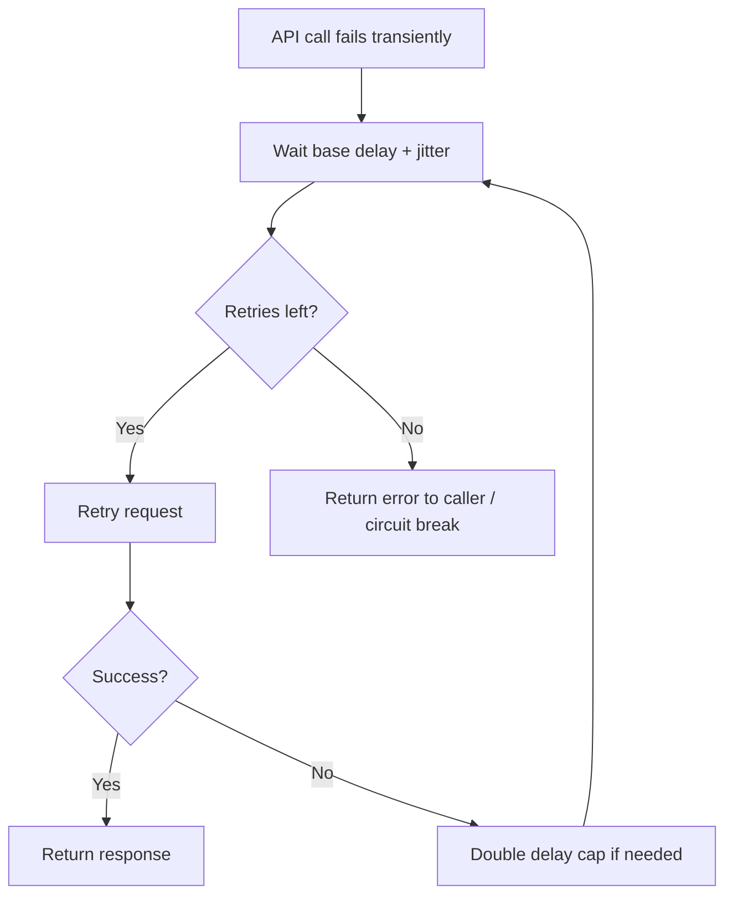
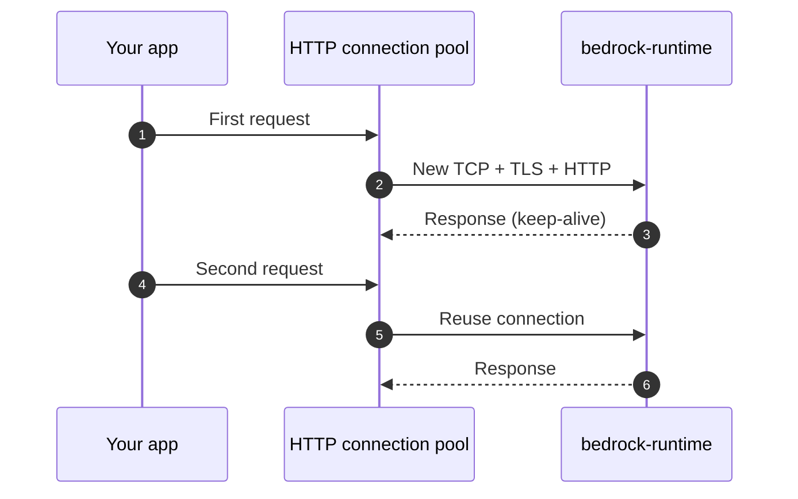

# Exponential Backoff and Connection Pooling

## What you'll learn

You will understand two **general distributed-systems patterns** that show up on the GenAI Professional exam and in production Bedrock apps: **exponential backoff** for controlled retries when APIs fail or throttle, and **HTTP connection pooling** for reusing warm connections to remote services. Neither pattern is Bedrock-specific—they apply to any backend your app calls over HTTP—but they matter sharply when many clients hammer <a href="https://docs.aws.amazon.com/bedrock/latest/userguide/what-is-bedrock.html">Amazon Bedrock</a> or other rate-limited endpoints.

## Key definitions

| Term | Definition |
|---|---|
| **Exponential backoff** | A retry strategy where wait time **grows multiplicatively** after each failed attempt so a struggling service gets breathing room instead of a retry storm. |
| **Jitter** | Random variation added to retry delays so many clients do not retry **in lockstep** (the “thundering herd” problem). |
| **Thundering herd** | Many clients retrying at the same instant after a failure, which can **worsen** an outage or throttle event. |
| **Connection pooling** | Keeping a set of **already-established HTTP connections** open and reusing them for subsequent requests instead of paying TLS/TCP handshake cost on every call. |
| <a href="https://docs.aws.amazon.com/sdkref/latest/guide/feature-retry-behavior.html">**SDK retry mode**</a> | How the AWS SDK decides **which errors** to retry, how many times, and how backoff is calculated (`legacy`, `standard`, or `adaptive` in Boto3). |
| <a href="https://docs.aws.amazon.com/botocore/latest/reference/config.html">**`max_pool_connections`**</a> | Botocore setting that caps how many HTTP connections a single SDK client keeps in its pool (default **10**). |

## Key distinctions / comparisons

| Item | Notes |
|---|---|
| **Retry vs give up** | Backoff helps **transient** errors (503, timeouts, occasional throttling). Persistent overload needs **lower send rate**, queuing, or quota increases—not infinite retries. |
| **Application backoff vs SDK retries** | Boto3 can retry automatically; you may still add **app-level** backoff for business logic or when wrapping non-AWS HTTP clients. |
| **Exam Skill Builder numbers vs AWS Bedrock guide** | Skill Builder cites **100 ms** initial delay, factor **2**, **3–5** max retries, **±100 ms** jitter. The <a href="https://docs.aws.amazon.com/bedrock/latest/userguide/scaling-throughput-best-practices.html">Bedrock scaling guide</a> recommends starting around **1 second**, doubling, up to **6** attempts. Know both contexts: exam trivia vs current AWS operations guidance. |
| **New HTTP connection per request vs pooled** | Per-request handshakes add latency and CPU; pooling trades a small amount of **idle connection memory** for much faster steady-state throughput. |
| **Pool size vs instance concurrency** | Too few connections → threads wait; too many → wasted sockets and possible pressure on the service. Tune per **compute instance** (container, Lambda with care, EC2 worker). |

## Why this matters

- When a dependency fails, naive **immediate tight retries** can keep the service down longer—you become part of the problem.
- <a href="https://docs.aws.amazon.com/bedrock/latest/userguide/scaling-throughput-best-practices.html">Bedrock</a> returns **429** when you exceed RPM limits and **503** when regional demand spikes; your client must **slow down** and retry intelligently.
- GenAI workloads often run **high parallel fan-out** (RAG + orchestration + multiple model calls). Without pooling, each call pays full connection setup overhead to `bedrock-runtime`.
- These patterns pair with [Maximizing Resource Utilization and Throughput](../03-maximizing-resource-utilization-and-throughput/index.md) and [Building Responsive AI Systems](../05-building-responsive-ai-systems/index.md)—throughput and latency tuning assume resilient clients underneath.

## Exponential backoff: how it works

When an API call fails for a **transient** reason, your code should not hammer the endpoint at full speed. Exponential backoff means:

1. Wait a **base delay** after the first failure.
2. **Multiply** the delay by a backoff factor (commonly **2**) after each subsequent failure.
3. Stop after a **maximum retry count** (or when the error is clearly not retryable).
4. Add **jitter** so retries spread over time.

The goal is simple: **give the broken or throttled service room to recover** instead of flooding it while it is already stressed.



Keep in mind: backoff is for **recovery**, not a substitute for fixing **sustained overload**. If every retry still gets 503 or 429, reduce your **request submission rate**, queue work, or request higher quotas—not just sleep and retry forever.

## Configure retries with Boto3

<a href="https://docs.aws.amazon.com/boto3/latest/guide/retries.html">Boto3</a> retries through **botocore**. You can set retry behavior globally in `~/.aws/config` or per client with <a href="https://docs.aws.amazon.com/botocore/latest/reference/config.html">`botocore.config.Config`</a>.

| Retry mode | When to use it |
|---|---|
| **`standard`** | Default recommendation: exponential backoff (base factor **2**), jitter, retry quota, retries on throttling and many 5xx codes. |
| **`adaptive`** | Experimental client-side rate limiting when one resource is heavily throttled; can delay even the **first** request. |
| **`legacy`** | Older handler (still default if you do nothing); **5** total attempts by default, backoff factor **2**. Prefer `standard` for new code. |

For <a href="https://docs.aws.amazon.com/bedrock/latest/userguide/scaling-throughput-best-practices.html">Bedrock runtime</a> transient 503s, AWS documents enabling **standard** mode with up to **6** total attempts:

```python
import boto3
from botocore.config import Config

# Aligns with Bedrock "Recommended error handling" (503 / transient errors)
config = Config(
    retries={"mode": "standard", "total_max_attempts": 6},
    max_pool_connections=15,  # lecture ballpark: 10–20 per instance
)

client = boto3.client("bedrock-runtime", region_name="us-east-1", config=config)

response = client.converse(
    modelId="anthropic.claude-3-5-haiku-20241022-v1:0",
    messages=[{"role": "user", "content": [{"text": "Summarize this ticket."}]}],
)
```

**Important:** In a `Config` object, `total_max_attempts` counts the **initial request plus retries**. The older `max_attempts` key counts **retries only**—easy to misconfigure.

### Jitter and the thundering herd

Without jitter, every client that failed at the same moment might retry at **1 s, then 2 s, then 4 s** in perfect sync—another spike right when the service is weakest. Jitter spreads retry times so load arrives more smoothly.

The AWS SDK **standard** retry handler applies backoff with jitter internally (see <a href="https://docs.aws.amazon.com/sdkref/latest/guide/feature-retry-behavior.html">SDK retry behavior</a>). If you implement custom backoff in application code (for non-AWS HTTP clients or orchestration loops), add randomness explicitly:

```python
import random
import time

def sleep_with_jitter(attempt: int, base_ms: int = 100, factor: int = 2, jitter_ms: int = 100):
    """Skill Builder-style custom backoff (exam-oriented parameters)."""
    delay_ms = base_ms * (factor ** attempt)
    delay_ms += random.randint(-jitter_ms, jitter_ms)
    time.sleep(max(delay_ms, 0) / 1000.0)
```

### Exam-oriented Skill Builder parameters

AWS Skill Builder material for this certification calls out oddly specific numbers—worth recognizing on an exam even if you would not hard-code them in every production service:

| Parameter | Skill Builder guidance | Notes |
|---|---|---|
| Initial retry delay | **100 ms** | Bedrock operations guide often starts around **1 s** for 503 scenarios—know which doc context applies. |
| Backoff factor | **2** | Matches Boto3 legacy/standard exponential base factor. |
| Max retries | **3–5** | Overlaps `total_max_attempts` style thinking; Bedrock example uses **6**. |
| Jitter | **±100 ms** | Prevents synchronized retries; SDK jitter may use different formulas. |

You do not need to memorize these for day-to-day engineering if you use **SDK standard retries** and monitor throttling—but they can appear on the exam.

## Connection pooling: how it works

Each new HTTPS request to a remote API normally pays for:

- DNS lookup (sometimes cached)
- TCP handshake
- TLS negotiation
- HTTP request/response

**Connection pooling** keeps connections **warm** in a pool bound to your SDK client (urllib3 under botocore). Subsequent `converse`, `invoke_model`, or `retrieve` calls reuse an existing socket when the server supports keep-alive.



### Tune pool size and connection lifetime

Skill Builder suggests practical starting points when an **instance** (container, worker VM, etc.) talks to a foundation-model endpoint:

| Setting | Skill Builder range | Purpose |
|---|---|---|
| Connections per instance | **10–20** | Balance parallelism against socket/memory overhead; botocore default pool size is **10**. |
| Connection TTL (idle lifetime) | **60–300 seconds** | Keep connections long enough to **reuse** across bursts, but not forever—stale NAT/firewall state and load-balancer rotations eventually favor refresh. |

Map pool size to **concurrent requests per process**, not cluster-wide totals. Ten containers each opening 20 connections means up to **200** concurrent sockets to Bedrock from that deployment.

```python
import boto3
from botocore.config import Config

# One shared client per worker process — reuse it across requests
config = Config(
    max_pool_connections=20,  # Skill Builder upper range
    connect_timeout=5,
    read_timeout=60,  # raise for long streaming responses if needed
)

bedrock = boto3.client("bedrock-runtime", region_name="us-east-1", config=config)
agent_runtime = boto3.client("bedrock-agent-runtime", region_name="us-east-1", config=config)
```

**Lambda caveat:** A new execution environment creates a **new** client and pool. Reuse the client at **module scope** inside the function so warm invocations benefit from pooling; cold starts still pay setup once.

## Bedrock-specific error handling

| HTTP code | Meaning | Your action |
|---|---|---|
| **429** | RPM/quota exceeded for the account | **Reduce submission rate**; request quota increase via <a href="https://docs.aws.amazon.com/bedrock/latest/userguide/quotas-increase.html">Service Quotas</a>; combine with backoff. |
| **503** | Regional demand spike / transient capacity | **Backoff with jitter**; consider <a href="https://docs.aws.amazon.com/bedrock/latest/userguide/cross-region-inference.html">cross-Region inference</a> or spreading load ([Cross-Region Inference](../10-amazon-bedrock-cross-region-inference/index.md)). |

If 503s are **sustained**, retries alone will not fix the problem—implement **client-side rate limiting**, queues, or shed lower-priority traffic per the <a href="https://docs.aws.amazon.com/bedrock/latest/userguide/scaling-throughput-best-practices.html">scaling guide</a>.

```python
import boto3
from botocore.config import Config
from botocore.exceptions import ClientError

config = Config(retries={"mode": "standard", "total_max_attempts": 6})
client = boto3.client("bedrock-runtime", region_name="us-east-1", config=config)

try:
    client.converse(
        modelId="anthropic.claude-3-5-haiku-20241022-v1:0",
        messages=[{"role": "user", "content": [{"text": "Draft a release note."}]}],
    )
except ClientError as exc:
    code = exc.response["Error"]["Code"]
    status = exc.response["ResponseMetadata"]["HTTPStatusCode"]
    # After SDK retries exhaust: app-level queue, shed load, or alert
    if status == 429 or code in {"ThrottlingException", "TooManyRequestsException"}:
        raise  # hook into rate limiter / dead-letter queue
```

Watch <a href="https://docs.aws.amazon.com/bedrock/latest/userguide/monitoring.html">CloudWatch Bedrock metrics</a> (`InvocationLatency`, throttles, errors) to confirm backoff and pool tuning actually reduce errors.

## Limitations / edge cases

- **Retries can amplify cost**: A retried `converse` call that reached the model may still bill tokens—treat idempotency and duplicate side effects carefully for non-read-only operations.
- **Adaptive retry mode** can throttle **first** requests on a client—avoid sharing one adaptive client across unrelated tenants or resources.
- **Connection pools are per client instance**: Creating a new `boto3.client()` per request defeats pooling; use a **singleton client** per worker.
- **`max_pool_connections` is not cluster-wide capacity planning**—multiply by replica count and concurrent workers.
- **Very long streaming responses** may need higher `read_timeout` than default 60 seconds.
- **Exam numbers ≠ only valid configuration**—production should follow current AWS service guides and measured load tests.

## Key takeaways

- Exponential backoff retries **transient** failures while **reducing load** on a struggling dependency; combine with a **max attempt** cap.
- **Jitter** prevents synchronized retry spikes—the thundering herd that keeps an outage hot.
- Configure Boto3 with **`standard`** retry mode and explicit **`total_max_attempts`** for Bedrock; understand legacy vs standard defaults.
- **Connection pooling** reuses HTTP connections—set **`max_pool_connections`** around **10–20** per instance as a starting point.
- Balance **reuse** (60–300 s effective connection lifetime) against **freshness** and infrastructure timeouts.
- For Bedrock, **429** means slow down or raise quotas; **sustained 503** means reduce traffic, not only retry harder.
- Reuse one SDK client per process; monitor throttles and latency in CloudWatch.

## Industry scenarios

- **Peak-hour customer-support bot (retail):** During a sale, Bedrock returns intermittent **503** responses. The platform team enables Boto3 **standard** retries with six total attempts, adds **jittered app-level spacing** for orchestration steps, and temporarily routes a fraction of traffic through **cross-Region inference** so retries do not concentrate on one Region.

- **High-throughput document summarization (legal tech):** Fifty ECS tasks each run eight worker threads calling `bedrock-runtime`. Engineers raise **`max_pool_connections` to 16** per task and reuse a module-level client so TLS handshakes do not dominate latency; CloudWatch shows P95 invocation time drop after removing per-request client construction.

- **Batch enrichment pipeline hitting DynamoDB and Bedrock (media):** `BatchWriteItem` returns **unprocessed items** under load. Workers retry only unprocessed keys with **exponential backoff** (as in [DynamoDB basic APIs](../../section-2/36-amazon-dynamodb-basic-apis/index.md)), while a separate Bedrock client uses pooled connections and SDK retries for **429** throttling—preventing one throttled service from stalling the entire nightly job.

## Internal References

- [Maximizing Resource Utilization and Throughput](../03-maximizing-resource-utilization-and-throughput/index.md)
- [Building Responsive AI Systems](../05-building-responsive-ai-systems/index.md)
- [Optimizing Foundation Model System Performance](../08-optimizing-foundation-model-system-performance/index.md)
- [Amazon Bedrock Cross-Region Inference](../10-amazon-bedrock-cross-region-inference/index.md)
- [Amazon DynamoDB Basic APIs](../../section-2/36-amazon-dynamodb-basic-apis/index.md)
- [Amazon S3 Vectors](../../section-2/24-amazon-s3-vectors/index.md)

## External References

- <a href="https://docs.aws.amazon.com/bedrock/latest/userguide/scaling-throughput-best-practices.html">Scaling and throughput best practices</a>
- <a href="https://docs.aws.amazon.com/bedrock/latest/userguide/quotas.html">Quotas for Amazon Bedrock</a>
- <a href="https://docs.aws.amazon.com/bedrock/latest/userguide/quotas-increase.html">Request an increase for Amazon Bedrock quotas</a>
- <a href="https://docs.aws.amazon.com/bedrock/latest/userguide/monitoring.html">Monitoring the performance of Amazon Bedrock</a>
- <a href="https://docs.aws.amazon.com/bedrock/latest/userguide/conversation-inference.html">Carry out a conversation with the Converse API</a>
- <a href="https://docs.aws.amazon.com/boto3/latest/guide/retries.html">Retries — Boto3 documentation</a>
- <a href="https://docs.aws.amazon.com/sdkref/latest/guide/feature-retry-behavior.html">Retry behavior — AWS SDKs and Tools</a>
- <a href="https://docs.aws.amazon.com/botocore/latest/reference/config.html">Config Reference — botocore</a>
- <a href="https://docs.aws.amazon.com/prescriptive-guidance/latest/cloud-design-patterns/retry-backoff.html">Retry with backoff pattern</a>
- <a href="https://docs.aws.amazon.com/amazondynamodb/latest/developerguide/Programming.Errors.html">Error handling with DynamoDB</a>
- <a href="https://docs.aws.amazon.com/servicequotas/latest/userguide/intro.html">What is Service Quotas?</a>
