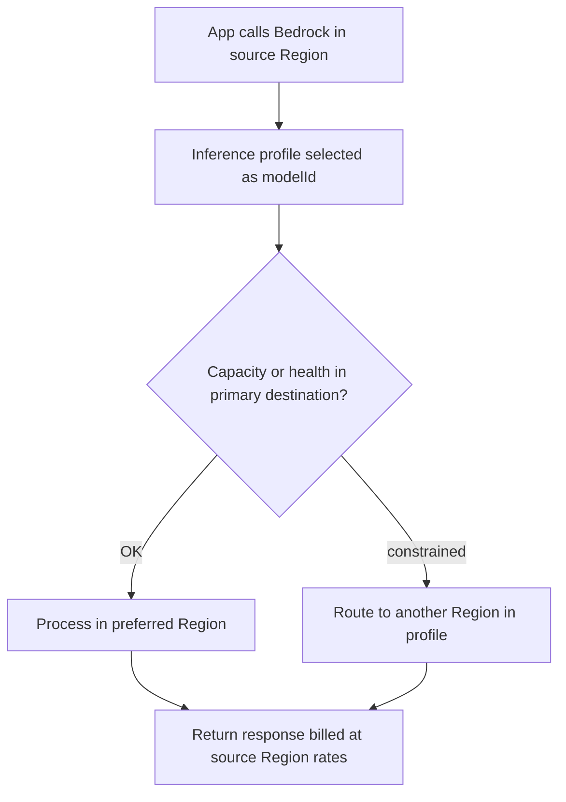
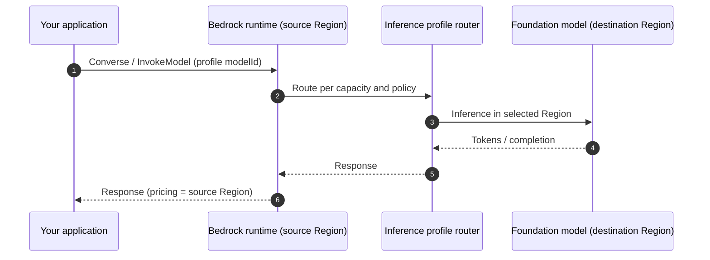
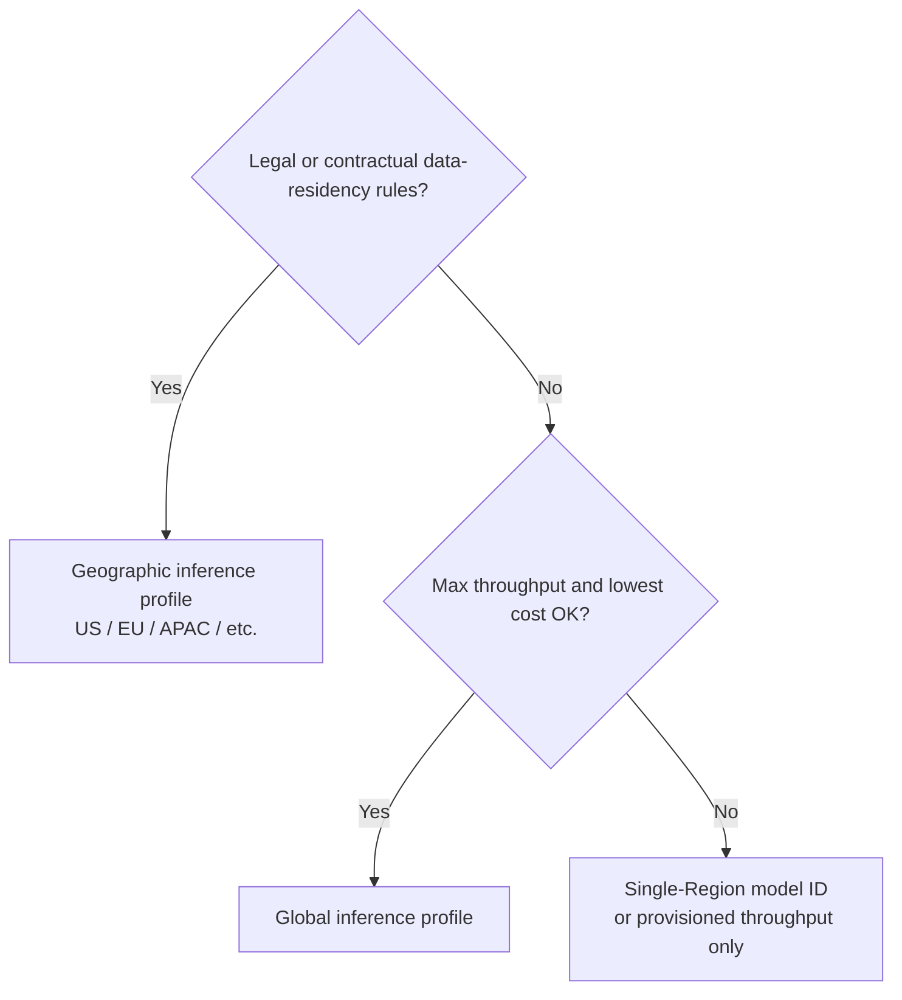

# Amazon Bedrock Cross-Region Inference

## What you'll learn

You will understand how <a href="https://docs.aws.amazon.com/bedrock/latest/userguide/cross-region-inference.html">Amazon Bedrock cross-Region inference</a> spreads model invocation across AWS Regions for **higher throughput**, **resilience during outages or quota pressure**, and (with global profiles) **lower cost**—and how to choose between **geographic** and **global** <a href="https://docs.aws.amazon.com/bedrock/latest/userguide/inference-profiles.html">inference profiles</a> without breaking **Organizations SCPs**, **data residency**, or **provisioned throughput** plans.

## Key definitions

| Term | Definition |
|---|---|
| <a href="https://docs.aws.amazon.com/bedrock/latest/userguide/cross-region-inference.html">**Cross-Region inference**</a> | Bedrock routes your on-demand inference requests across multiple Regions defined in an inference profile—automatically shifting load when a Region is impaired or capacity-constrained. |
| <a href="https://docs.aws.amazon.com/bedrock/latest/userguide/inference-profiles.html">**Inference profile**</a> | A Bedrock resource that names a model plus one or more destination Regions; you pass its ID or ARN as `modelId` (or related fields) instead of a single-Region foundation model ID. |
| <a href="https://docs.aws.amazon.com/bedrock/latest/userguide/geographic-cross-region-inference.html">**Geographic cross-Region inference**</a> | Routing stays within a **geography** (for example US, EU, or APAC)—suited to data-residency rules while still gaining multi-Region throughput inside that boundary. |
| <a href="https://docs.aws.amazon.com/bedrock/latest/userguide/global-cross-region-inference.html">**Global cross-Region inference**</a> | Routing can use **any supported commercial AWS Region** worldwide; Bedrock picks an optimal Region with available capacity (not necessarily the farthest Region unless needed). |
| **Source Region** | The Region where **your application** calls Bedrock (for example `us-east-1` on the boto3 client). **Pricing and CloudWatch/CloudTrail logs** are anchored here. |
| <a href="https://docs.aws.amazon.com/organizations/latest/userguide/orgs_manage_policies_scps.html">**Service control policy (SCP)**</a> | An Organizations policy that can **deny** API calls in Regions you have not approved—can block cross-Region routing if destination Regions (or `unspecified` for global) are not allowed. |

## Key distinctions / comparisons

| Item | Notes |
|---|---|
| **Geographic vs global profile** | Geographic keeps prompts/outputs inside a geography (EU-only, US-only, etc.). Global maximizes throughput and offers ~**10%** token savings vs geographic for supported models—but data may leave your geography. |
| **Cross-Region inference vs single-Region model ID** | A plain Region-specific model ID uses capacity in **one** Region. An inference profile ID (often prefixed `us.`, `eu.`, `apac.`, or `global.`) unlocks **pooled** cross-Region quotas and routing. |
| **Cross-Region inference vs <a href="https://docs.aws.amazon.com/bedrock/latest/userguide/prov-throughput.html">provisioned throughput</a>** | Provisioned throughput reserves capacity in a **specific** Region; it does **not** combine with cross-Region inference profiles—you are fixed to that Regional capacity model. |
| **On-demand routing vs enabling Regions in the account** | Cross-Region inference can target Regions you never manually enabled in the account console; **SCPs** (not console Region opt-in) are what typically block routing. |
| **Required vs strongly recommended** | Many Bedrock features (Guardrails standard tier, Knowledge Bases structured flows, Data Automation, etc.) **require** or assume cross-Region inference—plan for it early in platform design. |

## Why this matters

- Bedrock capacity is **Regional**. Peak demand, throttling, or a Regional impairment can stall apps that pin every call to one Region.
- Cross-Region inference is a **first-class throughput tool**: AWS documentation positions geographic profiles above single-Region inference, and global profiles above geographic for peak throughput.
- You will see cross-Region inference throughout the Bedrock console and newer features—treating it as optional “nice to have” often conflicts with what those features expect.
- Misconfigured **SCPs** are a common production surprise: your app still calls `us-east-1`, but Bedrock may need `us-west-2` or an `unspecified` Region condition under the hood.

## How cross-Region inference works

When you invoke a model through a **system-defined cross-Region inference profile**, Bedrock evaluates traffic, demand, and capacity, then routes the request to a **destination Region** in the profile. You do not implement client-side Region failover loops for that path—Bedrock handles it.

Typical triggers for rerouting:

- **Service interruption** or degraded capacity in one Region within the profile.
- **Quota / throughput pressure** (RPM or TPM limits) in a hot Region during peak usage.



For **global** profiles, the destination set is worldwide (commercial Regions). For **geographic** profiles, routing never leaves the geography (for example EU Regions only), even though your **source** Region can be any Region where you invoke the profile.



Data stays on the **AWS network** (not the public internet), **encrypted in transit** between Regions. To audit where processing occurred, use <a href="https://docs.aws.amazon.com/awscloudtrail/latest/userguide/cloudtrail-user-guide.html">CloudTrail</a> in the **source Region** and inspect `additionalEventData.inferenceRegion` on Bedrock events.

## Choosing geographic vs global

Use this decision flow when you design a platform default:



| Profile type | Data residency | Throughput | Cost (typical) | SCP pattern |
|---|---|---|---|---|
| **Geographic** | Stays in geography | Higher than single-Region | Standard geographic pricing | Allow **all destination Regions** listed in that geographic profile |
| **Global** | May process outside your geography | Highest | ~**10%** savings vs geographic on supported models | Allow `"aws:RequestedRegion": "unspecified"` for global routing |

**Geographic** fits regulated workloads—for example EU citizen data that must not leave EU AWS Regions for inference. You might not care whether inference runs in `eu-west-1` or `eu-central-1`, but you **do** care that it stays in the EU geography.

**Global** fits workloads without geographic restrictions where you want Bedrock to use the **broadest** capacity pool and lower token pricing. Routing is **smart**: AWS does not needlessly send you to a distant Region if nearby capacity is available—but global gives you the option when the fleet needs it.

## Service control policies and Organizations

Normally you think in fixed Regions: “everything lives in `us-east-1`.” Cross-Region inference breaks that mental model—the **destination** Region can differ from your client Region.

If SCPs **deny** unused Regions, cross-Region inference fails when Bedrock tries a blocked destination.

| Profile type | What to allow in SCPs |
|---|---|
| **Geographic** | Every **destination Region** in the geographic profile for your source Region (for example US profile from `us-east-1` may use `us-east-1`, `us-east-2`, `us-west-2`—blocking any one breaks routing). |
| **Global** | Add `"unspecified"` to permitted `aws:RequestedRegion` values so global routing is not denied. AWS documents this as specific to <a href="https://docs.aws.amazon.com/bedrock/latest/userguide/global-cross-region-inference.html">Global cross-Region inference</a>. |

Example pattern (conceptual): a Region-deny SCP that still permits global Bedrock routing includes `"unspecified"` alongside approved Region codes in `StringNotEquals` / allow-list conditions—see the SCP examples in the global cross-Region guide.

**Disable global** explicitly when compliance forbids worldwide processing: Organizations can deny Bedrock calls where `aws:RequestedRegion` is `unspecified` and the inference profile ARN matches `global.*` profiles.

Pair SCP design with IAM using `bedrock:InferenceProfileArn` to limit **which** profiles principals may use.

## Pricing, quotas, and account behavior

Keep these billing and operations facts straight—they show up on exams and in FinOps reviews:

- **No extra routing surcharge** for cross-Region inference itself; **on-demand price is based on the source Region** where you call the profile—not the obscure Region that happened to serve the request.
- **Global** profiles add roughly **10%** token savings versus geographic profiles for supported models (input and output), on top of throughput benefits.
- **Quotas**: geographic and global profiles have separate **cross-Region** quota names in the <a href="https://docs.aws.amazon.com/general/latest/gr/bedrock.html">Bedrock service quotas</a> table; request increases from your **source** Region in the Service Quotas console.
- **Manual Region enablement** in the account is **not** required for destination Regions used by cross-Region inference—**SCPs** still are.
- Monitoring stays centralized: <a href="https://docs.aws.amazon.com/AmazonCloudWatch/latest/monitoring/WhatIsCloudWatch.html">CloudWatch</a> and CloudTrail entries for the request remain tied to how you invoked Bedrock from the **source** Region.

## Invoke with inference profiles (boto3)

Cross-Region inference is enabled by passing an **inference profile ID** (or ARN) as `modelId` on <a href="https://docs.aws.amazon.com/bedrock/latest/APIReference/API_runtime_Converse.html">Converse</a>, <a href="https://docs.aws.amazon.com/bedrock/latest/APIReference/API_runtime_InvokeModel.html">InvokeModel</a>, and related APIs—see <a href="https://docs.aws.amazon.com/bedrock/latest/userguide/inference-profiles-use.html">Use an inference profile in model invocation</a>.

**Global** profile example (from AWS guidance—model availability varies by account):

```python
import boto3

client = boto3.client("bedrock-runtime", region_name="us-east-1")  # source Region sets pricing/logs

response = client.converse(
    modelId="global.anthropic.claude-sonnet-4-5-20250929-v1:0",  # global cross-Region profile
    messages=[
        {"role": "user", "content": [{"text": "Summarize cross-Region inference in one paragraph."}]}
    ],
)
print(response["output"]["message"]["content"][0]["text"])
```

**Geographic** profile example (US geography—prefix `us.` routes within US Regions):

```python
import boto3

client = boto3.client("bedrock-runtime", region_name="us-east-1")

response = client.converse(
    modelId="us.anthropic.claude-opus-4-6-v1",  # geographic US profile ID (see support table for your model)
    messages=[{"role": "user", "content": [{"text": "Draft a compliance-safe EU data handling checklist."}]}],
)
```

List available profiles for your Region with the control-plane API when automating deployments:

```python
import boto3

bedrock = boto3.client("bedrock", region_name="us-east-1")

for profile in bedrock.list_inference_profiles()["inferenceProfileSummaries"]:
    # Filter for system-defined cross-Region profiles you are allowed to use
    print(profile.get("inferenceProfileId"), profile.get("inferenceProfileArn"))
```

Confirm exact profile IDs in <a href="https://docs.aws.amazon.com/bedrock/latest/userguide/inference-profiles-support.html">Supported Regions and models for inference profiles</a> before hard-coding `modelId` values in production.

## Where cross-Region inference shows up

Beyond raw `Converse` / `InvokeModel`, Bedrock features accept inference profiles in place of single-Region models—for example:

- <a href="https://docs.aws.amazon.com/bedrock/latest/userguide/agents.html">Agents</a> (`foundationModel` on create)
- Knowledge base **RetrieveAndGenerate** (`modelArn`)
- Batch inference jobs (`modelId` on <a href="https://docs.aws.amazon.com/bedrock/latest/APIReference/API_CreateModelInvocationJob.html">CreateModelInvocationJob</a>)
- Prompt management, flows, and model evaluation jobs

Guardrails and newer content-filter tiers may **require** cross-Region inference—mirror the console requirement when you standardize on classic vs standard tiers (see [Hands-On with Bedrock Guardrails](../../section-1/hands-on-with-bedrock-guardrails/index.md)).

## Limitations / edge cases

- **Provisioned throughput** and cross-Region inference **do not** mix: reserved Regional capacity is explicit; profiles dynamically route on-demand traffic elsewhere.
- **SCP Region denies** silently break routing—test in a sandbox OU before rolling out global profiles org-wide.
- **Geographic** does not mean “data never moves”—stored data may remain in the source Region while **prompts and outputs** can cross Regions **inside** the geography during inference; read the geographic considerations in AWS docs for your compliance interpretation.
- **Global** may be unacceptable for GDPR-style residency even with encryption—default to geographic or single-Region in those accounts.
- Not every foundation model has every profile type; always check support tables before refactoring `modelId` strings.

## Key takeaways

- Cross-Region inference **distributes load** across Regions for resilience and throughput when quotas or outages bite a single Region.
- Choose **geographic** profiles for **data residency**; choose **global** for **maximum throughput** and ~**10%** cost savings when compliance allows.
- **Bill from the source Region**; destination Region does not change your token price table.
- **SCPs** must allow destination Regions (geographic) or `"unspecified"` (global)—console Region enablement alone is not the gate.
- **Encrypt in transit**, log with **CloudTrail** (`inferenceRegion`), and treat cross-Region inference as the default for modern Bedrock features unless provisioned throughput or policy blocks it.

## Industry scenarios

**1. Global customer-support chatbot (retail)**  
A retailer runs Claude via Bedrock from `us-east-1` with a **global** profile. Black Friday spikes exhaust Regional TPM; cross-Region routing absorbs burst traffic without custom multi-Region client code, while finance still reconciles cost from the US source Region. SCPs are updated once to permit `unspecified` for global routing.

**2. EU healthcare documentation assistant (regulated)**  
A hospital SaaS vendor must keep inference inside the **EU geography**. They standardize on an **EU geographic** profile, deny global `global.*` ARNs via SCP, and allow `eu-west-1`, `eu-central-1`, and other EU destinations in the profile. CloudTrail in the invoking Region proves which EU Region processed each request.

**3. Enterprise AI platform with Organizations guardrails (financial services)**  
A central platform team enables Bedrock for hundreds of accounts. Initial **Region deny** SCPs block cross-Region inference until platform engineering maps each approved geographic profile’s destination list into SCP allow-lists. Application teams switch `modelId` from single-Region IDs to `us.` profiles; throughput rises without every team operating its own failover Lambdas.

## Internal References

- [Exponential Backoff and Connection Pooling](../09-exponential-backoff-and-connection-pooling/index.md)
- [Maximizing Resource Utilization and Throughput](../03-maximizing-resource-utilization-and-throughput/index.md)
- [Building Responsive AI Systems](../05-building-responsive-ai-systems/index.md)
- [Optimizing Foundation Model System Performance](../08-optimizing-foundation-model-system-performance/index.md)
- [Hands-On with Bedrock Guardrails](../../section-1/hands-on-with-bedrock-guardrails/index.md)
- [AgentCore Evaluators](../../section-3/10-agentcore-evaluators/index.md) (evaluations and mandatory cross-Region routing)

## External References

- <a href="https://docs.aws.amazon.com/bedrock/latest/userguide/cross-region-inference.html">Increase throughput with cross-Region inference</a>
- <a href="https://docs.aws.amazon.com/bedrock/latest/userguide/geographic-cross-region-inference.html">Geographic cross-Region inference</a>
- <a href="https://docs.aws.amazon.com/bedrock/latest/userguide/global-cross-region-inference.html">Global cross-Region inference</a>
- <a href="https://docs.aws.amazon.com/bedrock/latest/userguide/inference-profiles.html">Inference profiles</a>
- <a href="https://docs.aws.amazon.com/bedrock/latest/userguide/inference-profiles-use.html">Use an inference profile in model invocation</a>
- <a href="https://docs.aws.amazon.com/bedrock/latest/userguide/inference-profiles-support.html">Supported Regions and models for inference profiles</a>
- <a href="https://docs.aws.amazon.com/bedrock/latest/userguide/prov-throughput.html">Increase model throughput with Provisioned Throughput</a>
- <a href="https://docs.aws.amazon.com/organizations/latest/userguide/orgs_manage_policies_scps.html">Service control policies</a>
- <a href="https://aws.amazon.com/bedrock/pricing/">Amazon Bedrock pricing</a>
