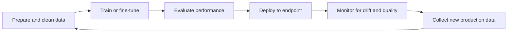
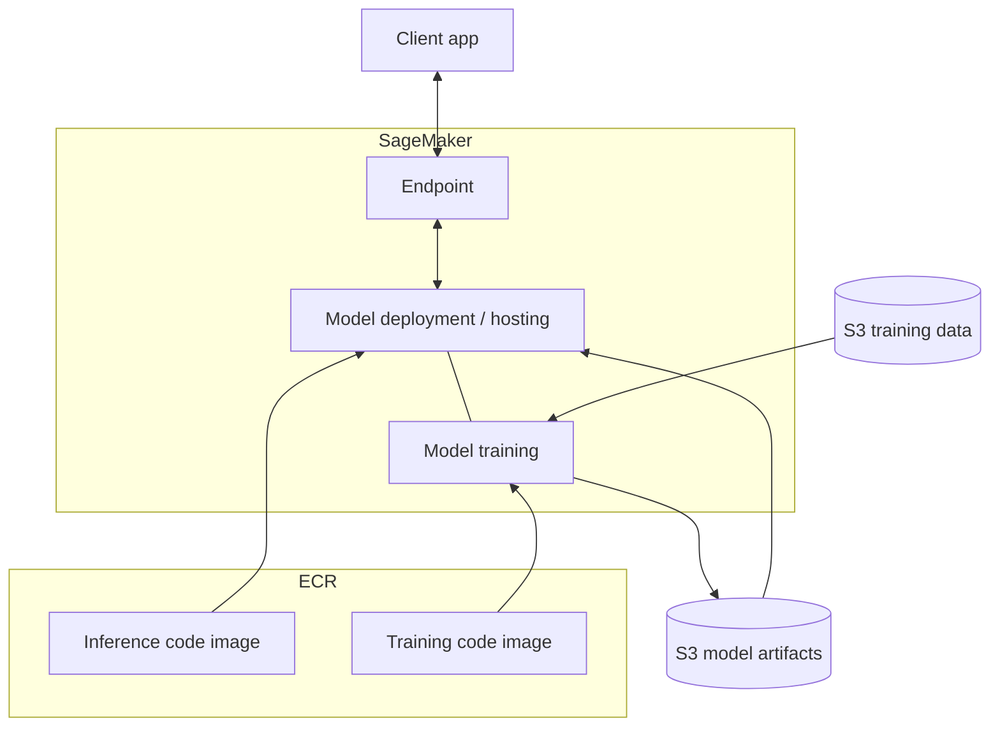

# Intro to Amazon SageMaker AI

## :material-school: What you'll learn

!!! abstract "Learning objectives"
    You will understand how <a href="https://docs.aws.amazon.com/sagemaker/latest/dg/whatis.html">Amazon SageMaker AI</a> supports the **full machine learning lifecycle**—not just generative AI—and how training data, container images, model artifacts, and managed endpoints fit together so you can choose SageMaker AI when you need lower-level control than <a href="https://docs.aws.amazon.com/bedrock/latest/userguide/what-is-bedrock.html">Amazon Bedrock</a>.

## :material-book-open-variant: Key definitions

| Term | Definition |
|---|---|
| <a href="https://docs.aws.amazon.com/sagemaker/latest/dg/whatis.html">**Amazon SageMaker AI**</a> | AWS's fully managed service for building, training, and deploying **machine learning models** across classical ML and generative AI workloads. The service was rebranded from "Amazon SageMaker" to **SageMaker AI** in December 2024. |
| **ML lifecycle** | The repeating loop of prepare data → train → evaluate → deploy → monitor → collect new data → retrain. SageMaker AI provides tools for **every stage**, not only inference. |
| <a href="https://docs.aws.amazon.com/sagemaker/latest/dg/how-it-works-training.html">**Model training**</a> | The phase where SageMaker AI spins up compute, runs your training code against data, and produces **model artifacts** (weights, checkpoints, or other serialized outputs). |
| **Model artifacts** | Files produced after training—often weights or checkpoints—stored in <a href="https://docs.aws.amazon.com/AmazonS3/latest/userguide/Welcome.html">Amazon S3</a> and consumed during deployment. |
| <a href="https://docs.aws.amazon.com/sagemaker/latest/dg/adapt-training-container.html">**Training code image**</a> | A Docker container in <a href="https://docs.aws.amazon.com/AmazonECR/latest/userguide/what-is-ecr.html">Amazon ECR</a> that packages the scripts and dependencies SageMaker AI runs during a training job. |
| **Inference code image** | A separate ECR container that implements how requests are **preprocessed, sent to the model, and postprocessed** at prediction time. |
| <a href="https://docs.aws.amazon.com/sagemaker/latest/dg/realtime-endpoints-deploy-models.html">**SageMaker endpoint**</a> | A managed HTTPS inference front door SageMaker AI hosts for you. Your client application sends prediction requests here—not directly to raw EC2 instances. |
| <a href="https://docs.aws.amazon.com/sagemaker/latest/dg/nbi.html">**SageMaker notebook instance**</a> | A managed <a href="https://docs.aws.amazon.com/sagemaker/latest/dg/studio-updated-jl-user-guide.html">JupyterLab</a> environment on EC2 where you explore data, call the SageMaker Python SDK, and orchestrate training and deployment from code. |

## :material-scale-balance: Key distinctions / comparisons

| Item | Notes |
|---|---|
| **SageMaker AI vs <a href="https://docs.aws.amazon.com/bedrock/latest/userguide/what-is-bedrock.html">Amazon Bedrock</a>** | Bedrock is optimized for **managed foundation-model APIs** (invoke, RAG, agents). SageMaker AI gives you **broader ML workflows**—custom training, fine-tuning, classical ML, and self-hosted inference—with more infrastructure knobs. |
| **Generative AI vs general ML on SageMaker AI** | SageMaker AI is **not GenAI-only**. You can train tabular models, computer-vision pipelines, and custom architectures. For GenAI, you might start from a **pre-trained foundation model** and fine-tune rather than train from scratch. |
| **Training container vs inference container** | Training and deployment use **different ECR images** with different entry points. Training produces artifacts; inference loads those artifacts and serves predictions. |
| **Console vs code** | SageMaker AI exposes consoles for most tasks, but notebooks and the <a href="https://docs.aws.amazon.com/sagemaker/latest/dg/how-it-works-prog-model.html">SageMaker Python SDK</a> let you drive the same lifecycle programmatically—ideal for reproducible pipelines. |
| **Pre-trained model vs train-from-scratch** | In GenAI you often **fine-tune** an existing model. In classical ML you may train from scratch. Either way, SageMaker AI expects a trained artifact in S3 before deployment. |

## Why this matters

- 💡 **Bedrock is not your only option** for model management and deployment. When you need custom training logic, proprietary data pipelines, or full control over hosting, SageMaker AI is the platform built for that breadth.
- 🔄 Production ML is a **cycle**, not a one-shot deploy. SageMaker AI covers data preparation, training, evaluation, deployment, monitoring, and the feedback loop when production traffic generates new training data.
- ⚡ For generative AI specifically, you may **skip full pre-training** and fine-tune a foundation model—but you still follow the same artifact → deploy → endpoint pattern.
- 🔧 SageMaker AI trades some convenience for **flexibility**: you choose instance types, container images, and deployment patterns that Bedrock abstracts away.

## The ML lifecycle SageMaker AI supports

Every stage of the machine learning lifecycle has companion SageMaker AI capabilities:



| Stage | What SageMaker AI helps with |
|---|---|
| **Prepare data** | <a href="https://docs.aws.amazon.com/sagemaker/latest/dg/processing-job.html">Processing jobs</a>, notebooks with Python data libraries, and S3-backed datasets |
| **Train** | Managed training jobs, distributed GPU clusters, JumpStart foundation models |
| **Evaluate** | Offline metrics, validation sets, and integration with Clarify |
| **Deploy** | Real-time, serverless, batch, and multi-model <a href="https://docs.aws.amazon.com/sagemaker/latest/dg/how-it-works-deployment.html">deployment options</a> |
| **Monitor** | <a href="https://docs.aws.amazon.com/sagemaker/latest/dg/model-monitor-mlops.html">SageMaker Model Monitor</a> for data quality and drift detection |
| **Feedback loop** | Production inference data flows back into S3 to trigger retraining |

!!! info "GenAI nuance"
    For foundation models you often **start from a pre-trained checkpoint** and fine-tune on domain data rather than training billions of parameters from scratch. SageMaker AI supports that path—the deployment stack below is the same whether you trained from zero or fine-tuned.

## How training and deployment stack together

Let's break down the SageMaker AI **training and deployment topology**: where data lives, where code runs, and what your application ultimately calls.

**SageMaker Training & Deployment**



**Training path**

1. 📦 Upload **training data** to S3 (from a notebook, CLI, or pipeline).
2. 🐳 Push a **training code image** to ECR—or use an AWS Deep Learning Container with your script.
3. ⚙️ SageMaker AI launches **training instances**, runs your code against the data, and writes **model artifacts** back to S3.

**Deployment path**

1. 📂 Point hosting at the **model artifacts** in S3.
2. 🐳 Supply an **inference code image** from ECR that knows how to load the artifacts and serve predictions.
3. 🌐 SageMaker AI creates a managed **endpoint** your **client application** invokes for real-time inference.

!!! warning "Exam trap: one container for everything"
    Training and inference are **separate concerns** with **separate container images**. Mixing them up is a common exam and architecture mistake—the training image produces artifacts; the inference image loads artifacts and serves requests.

## SageMaker notebooks: your control plane

You can orchestrate the entire lifecycle from a familiar **JupyterLab** environment:

- Spin up a **notebook instance** on EC2 from the SageMaker console.
- Access data in S3 and use standard Python data-processing libraries.
- Start from **built-in algorithms and JumpStart models** or bring your own scripts.
- Call training, deployment, and endpoint management from notebook cells—or use the console for the same operations visually.

!!! success "Two valid workflows"
    **Code-first:** notebook or CI pipeline using the SageMaker Python SDK or boto3. **Console-first:** click-through training and deployment when you are exploring or running a simple built-in algorithm job. Both paths create the same underlying SageMaker AI resources.

## :material-code-braces: How to apply it

### Launch training from a notebook (SageMaker Python SDK)

The high-level SDK wraps authentication, S3 uploads, and job creation—ideal for the notebook workflow described above. See <a href="https://docs.aws.amazon.com/sagemaker/latest/dg/how-it-works-prog-model.html">Programming Model for SageMaker AI</a>.

```python
import sagemaker
from sagemaker.estimator import Estimator

session = sagemaker.Session()
role = sagemaker.get_execution_role()

estimator = Estimator(
    image_uri="<account>.dkr.ecr.<region>.amazonaws.com/training:latest",  # ECR training image
    role=role,
    instance_count=1,
    instance_type="ml.m5.xlarge",
    output_path=f"s3://{session.default_bucket()}/model-artifacts/",  # artifacts land in S3
)

estimator.fit({"training": "s3://my-bucket/training-data/"})
```

### Deploy artifacts to a managed endpoint

After training completes, deploy the resulting model artifact with a single SDK call—SageMaker AI creates the model, endpoint configuration, and endpoint for you:

```python
predictor = estimator.deploy(
    initial_instance_count=1,
    instance_type="ml.m5.large",
    # inference image can differ from training image when using Model objects directly
)
```

### Invoke the endpoint from your client app (boto3)

Your production application talks to the **endpoint**, not to training instances. Use the SageMaker Runtime client:

```python
import boto3
import json

runtime = boto3.client("sagemaker-runtime", region_name="us-east-1")

response = runtime.invoke_endpoint(
    EndpointName="my-model-endpoint",
    ContentType="application/json",
    Body=json.dumps({"inputs": "Summarize this incident report for Casey."}),
)
prediction = json.loads(response["Body"].read())
```

!!! success "Expected outcome"
    Training writes compressed artifacts under your S3 `output_path`. Deployment exposes an HTTPS endpoint name you pass to `invoke_endpoint`. Generative workloads return text or embeddings depending on your inference script—SageMaker AI manages scaling and health checks on the hosting instances.

## Examples

!!! success "Fine-tune a foundation model for internal support"
    You download a pre-trained LLM, fine-tune on historical support tickets stored in S3 using a custom training container, and deploy with an inference container that formats replies for your chat UI. The endpoint replaces a third-party API for data-sovereignty requirements.

!!! success "Classical ML: fraud scoring"
    You use a SageMaker built-in algorithm (for example XGBoost) on tabular transaction features in S3—no GenAI involved. Processing jobs clean the data, a training job produces `model.tar.gz`, and a real-time endpoint scores transactions in milliseconds.

!!! success "Notebook-driven experimentation"
    A data scientist spins up a notebook instance, prototypes feature engineering in pandas, calls `estimator.fit()` from a cell, evaluates hold-out accuracy, and redeploys when metrics improve—all without touching the SageMaker console UI.

## :material-alert: Limitations / edge cases

!!! warning "More moving parts than Bedrock"
    SageMaker AI gives you **instance types, ECR images, IAM roles, VPC configuration, and endpoint autoscaling** to manage. That flexibility is powerful but operationally heavier than calling a Bedrock foundation model API directly.

- 💰 **Idle endpoints cost money**—unlike per-token Bedrock pricing, a provisioned real-time endpoint bills for instance uptime even with zero traffic (consider <a href="https://docs.aws.amazon.com/sagemaker/latest/dg/serverless-endpoints.html">serverless inference</a> for spiky workloads).
- 🔒 You own **container security patching** when you bring custom images to ECR.
- 📊 Monitoring and retraining are **your workflow design**—SageMaker AI supplies Model Monitor and pipelines, but you wire alerts and retrain triggers.

## :material-lightbulb: Key takeaways

- 🔑 SageMaker AI covers the **entire ML lifecycle**, from data prep through monitoring—not just model hosting.
- 🐳 Training uses **S3 data + ECR training image → artifacts in S3**; deployment uses **artifacts + ECR inference image → managed endpoint**.
- 📓 **Notebooks and the Python SDK** are first-class ways to drive training and deployment; the console is equally available for visual workflows.
- ⚖️ Choose SageMaker AI when you need **lower-level control and broader ML scope**; choose Bedrock when managed foundation-model APIs are sufficient.
- 🔄 Production monitoring can detect **drift** and feed new data back into the training loop—closing the lifecycle circle.

## Industry scenarios

- 🏥 **Healthcare analytics:** A hospital fine-tunes a clinical language model on de-identified notes in a private S3 bucket, deploys to a VPC-only SageMaker endpoint, and uses Model Monitor to catch vocabulary drift as new specialties come online.
- 🏦 **Banking fraud detection:** A risk team trains gradient-boosted models on transaction features with SageMaker Processing for ETL, deploys a low-latency real-time endpoint integrated with core banking APIs, and retrains monthly when monitor baselines shift.
- 🛒 **Retail personalization:** An e-commerce platform fine-tunes a product-description model on catalog data, serves recommendations through a SageMaker endpoint embedded in the storefront, and uses notebook-driven A/B tests before promoting new artifact versions.

## :material-link-variant: Internal References

- [Section 5: Managing Models with SageMaker AI](../index.md)
- [Data Processing, Training, and Deployment with SageMaker](../02-data-processing-training-and-deployment-with-sagemaker/index.md)
- [Optimizing Foundation Model Deployments](../04-optimizing-foundation-model-deployments/index.md)
- [SageMaker Model Monitor and Clarify](../06-sagemaker-model-monitor-and-clarify/index.md)
- [Optimizing Foundation Model System Performance](../../section-4/08-optimizing-foundation-model-system-performance/index.md)

## External References

- :fontawesome-solid-link: <a href="https://docs.aws.amazon.com/sagemaker/latest/dg/whatis.html">What is Amazon SageMaker AI?</a>
- :fontawesome-solid-link: <a href="https://docs.aws.amazon.com/sagemaker/latest/dg/whatis-features.html">Amazon SageMaker AI features</a>
- :fontawesome-solid-link: <a href="https://docs.aws.amazon.com/sagemaker/latest/dg/how-it-works-training.html">Train a model with Amazon SageMaker AI</a>
- :fontawesome-solid-link: <a href="https://docs.aws.amazon.com/sagemaker/latest/dg/how-it-works-deployment.html">Model deployment options in SageMaker AI</a>
- :fontawesome-solid-link: <a href="https://docs.aws.amazon.com/sagemaker/latest/dg/realtime-endpoints-deploy-models.html">Deploy models for real-time inference</a>
- :fontawesome-solid-link: <a href="https://docs.aws.amazon.com/sagemaker/latest/dg/adapt-training-container.html">Adapting your own training container</a>
- :fontawesome-solid-link: <a href="https://docs.aws.amazon.com/sagemaker/latest/dg/nbi.html">Amazon SageMaker notebook instances</a>
- :fontawesome-solid-link: <a href="https://docs.aws.amazon.com/sagemaker/latest/dg/how-it-works-prog-model.html">Programming model for SageMaker AI</a>
- :fontawesome-solid-link: <a href="https://docs.aws.amazon.com/sagemaker/latest/dg/model-monitor-mlops.html">SageMaker Model Monitor</a>
- :fontawesome-solid-link: <a href="https://docs.aws.amazon.com/bedrock/latest/userguide/what-is-bedrock.html">What is Amazon Bedrock?</a>
