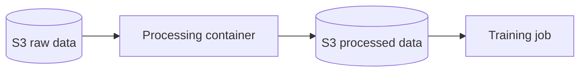
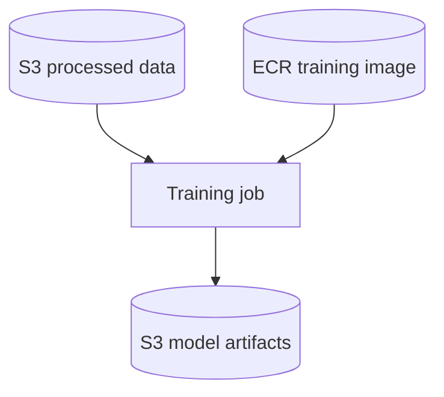
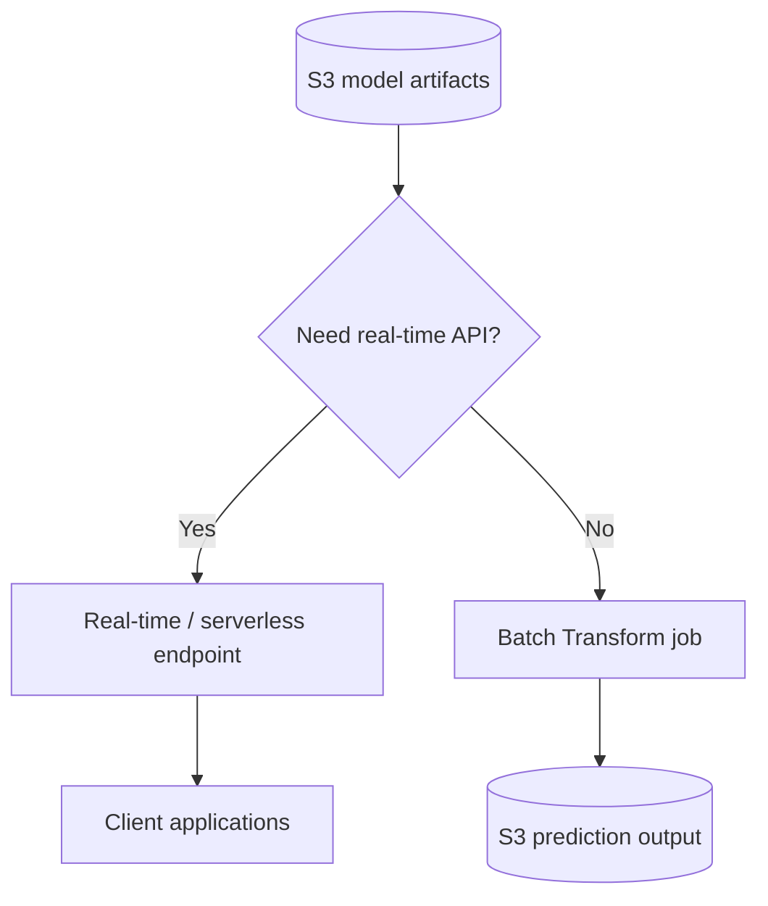
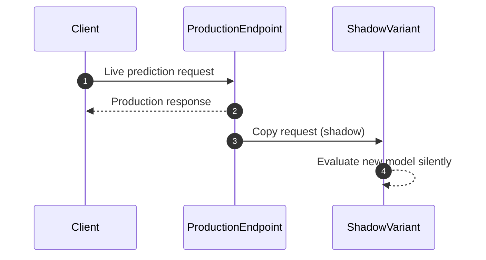
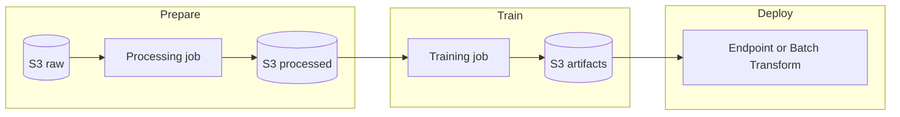

# Data Processing, Training, and Deployment with SageMaker

## :material-school: What you'll learn

!!! abstract "Learning objectives"
    You will walk through the full :simple-amazonaws: SageMaker AI pipeline—**prepare data**, **run a training job**, and **deploy predictions**—and know which storage backends, container types, algorithms, and deployment patterns fit each stage.

## :material-book-open-variant: Key definitions

| Term | Definition |
|---|---|
| <a href="https://docs.aws.amazon.com/sagemaker/latest/dg/processing-job.html">**SageMaker Processing job**</a> | A managed job that spins up a **processing container** to transform raw data (ETL, feature engineering, evaluation) and write output to S3 for downstream training. |
| <a href="https://docs.aws.amazon.com/sagemaker/latest/dg/how-it-works-training.html">**Training job**</a> | A SageMaker AI job that reads processed data from S3, runs your **training container** from ECR on chosen compute, and writes **model artifacts** to an output S3 bucket. |
| <a href="https://docs.aws.amazon.com/sagemaker/latest/dg/adapt-training-container.html">**Training code image**</a> | A <a href="https://docs.docker.com/">Docker</a> image in <a href="https://docs.aws.amazon.com/AmazonECR/latest/userguide/what-is-ecr.html">Amazon ECR</a> containing the scripts and dependencies SageMaker AI executes during training. |
| **Model artifacts** | Serialized outputs of training (weights, checkpoints, `model.tar.gz`) stored in <a href="https://docs.aws.amazon.com/AmazonS3/latest/userguide/Welcome.html">Amazon S3</a> and referenced at deployment time. |
| <a href="https://docs.aws.amazon.com/sagemaker/latest/dg/realtime-endpoints.html">**Real-time endpoint**</a> | A persistent, HTTPS-hosted inference front door that serves on-demand predictions and can autoscale with traffic. |
| <a href="https://docs.aws.amazon.com/sagemaker/latest/dg/batch-transform.html">**Batch Transform**</a> | Offline inference over an entire dataset—no persistent endpoint required. |
| <a href="https://docs.aws.amazon.com/sagemaker/latest/dg/inference-pipelines.html">**Inference pipeline**</a> | A SageMaker AI model composed of **2–15 chained containers** that run preprocessing, prediction, and post-processing in sequence on the same instance. |

## :material-scale-balance: Key distinctions / comparisons

| Item | Notes |
|---|---|
| **Real-time endpoint vs <a href="https://docs.aws.amazon.com/sagemaker/latest/dg/batch-transform.html">Batch Transform</a>** | Use a **real-time endpoint** when you need low-latency, on-demand predictions. Use **Batch Transform** when you have a large dataset upfront and can run predictions offline without keeping an endpoint warm. |
| **Built-in processing container vs custom container** | SageMaker AI ships **built-in processing containers** (<a href="https://scikit-learn.org/stable/">scikit-learn</a>, <a href="https://spark.apache.org/">Spark</a>, and others) so you can skip writing your own <a href="https://docs.docker.com/">Docker</a> image. Bring a **custom processing container** when you need proprietary logic or dependencies. |
| **Built-in algorithm vs BYOC training** | Choose a <a href="https://docs.aws.amazon.com/sagemaker/latest/dg/algos.html">built-in algorithm</a> (<a href="https://xgboost.readthedocs.io/en/stable/">XGBoost</a>, Linear Learner, etc.) for faster starts, or push your own training image to ECR for <a href="https://www.tensorflow.org/">TensorFlow</a>, <a href="https://pytorch.org/">PyTorch</a>, <a href="https://huggingface.co/">Hugging Face</a>, or anything else. |
| **S3 vs <a href="https://docs.aws.amazon.com/sagemaker/latest/dg/model-access-training-data-fsx.html">FSx for Lustre</a>** | **S3** is the default and works at any scale. **FSx for Lustre** (synced with S3) gives higher-throughput reads when training on very large datasets. |
| **Processing container vs training container** | Both live in ECR, but they serve **different stages**: processing transforms data; training consumes processed data and produces model artifacts. |

## Why this matters

- 📦 Every SageMaker AI workflow is **container-based**—processing, training, and inference each run in <a href="https://docs.docker.com/">Docker</a> images you choose or build.
- 💰 **Training is often the cost hotspot**—GPU and multi-instance jobs can get expensive, so you pick instance types and scale deliberately.
- 🔄 Data prep is not optional glue—it determines whether your algorithm can ingest inputs efficiently (<a href="https://mxnet.apache.org/versions/1.7.0/api/python/docs/api/mxnet/recordio/index.html">RecordIO</a>, <a href="https://protobuf.dev/">Protobuf</a>, columnar formats, and algorithm-specific recommendations all matter).
- 🚀 Deployment is not one-size-fits-all: real-time endpoints, batch jobs, edge compilation with Neo, and shadow testing each solve different production requirements.

## Data sources and formats for preparation

Your training data typically lands in **S3**, but SageMaker AI also supports high-throughput file systems when scale demands it:

| Source | When you use it |
|---|---|
| <a href="https://docs.aws.amazon.com/AmazonS3/latest/userguide/Welcome.html">**Amazon S3**</a> | Default object store for raw, processed, and artifact data. |
| <a href="https://docs.aws.amazon.com/sagemaker/latest/dg/model-access-training-data-fsx.html">**Amazon FSx for Lustre**</a> | Large-scale training where you need faster parallel reads than S3 alone. |
| <a href="https://docs.aws.amazon.com/athena/latest/ug/what-is.html">**Amazon Athena**</a> | Query data in S3 with SQL before exporting features for SageMaker. |
| <a href="https://docs.aws.amazon.com/emr/latest/ManagementGuide/emr-what-is-emr.html">**Amazon EMR**</a> | Distributed <a href="https://spark.apache.org/">Spark</a>/<a href="https://hadoop.apache.org/">Hadoop</a> processing that feeds cleaned data into S3. |
| <a href="https://docs.aws.amazon.com/redshift/latest/mgmt/welcome.html">**Amazon Redshift**</a> | Warehouse queries whose results you unload to S3 for training. |
| <a href="https://docs.aws.amazon.com/keyspaces/latest/devguide/what-is-keyspaces.html">**Amazon Keyspaces**</a> | Cassandra-compatible source you can export or ETL into S3. |

!!! info "Ideal data format depends on the algorithm"
    Each <a href="https://docs.aws.amazon.com/sagemaker/latest/dg/algos.html">built-in algorithm</a> documents its preferred input format—commonly **<a href="https://mxnet.apache.org/versions/1.7.0/api/python/docs/api/mxnet/recordio/index.html">RecordIO</a>**, **<a href="https://protobuf.dev/">Protobuf</a>**, or **columnar** layouts that stream efficiently during training. Match the format to the algorithm before you launch a job.

You can also prepare data with:

- <a href="https://docs.aws.amazon.com/sagemaker/latest/dg/apache-spark.html">**Apache Spark**</a> integrated with SageMaker AI (including <a href="https://spark.apache.org/mllib/">Spark MLlib</a> for distributed feature engineering).
- Standard Python libraries in a <a href="https://docs.aws.amazon.com/sagemaker/latest/dg/nbi.html">SageMaker notebook</a>—**<a href="https://scikit-learn.org/stable/">scikit-learn</a>**, **<a href="https://numpy.org/doc/stable/">NumPy</a>**, and **<a href="https://pandas.pydata.org/docs/">pandas</a>** are available out of the box.

## How data processing works

Conceptually, processing is straightforward: copy prepared data from S3, spin up a **processing container**, run your transformation, and write output to another S3 bucket that training consumes next.



- 📥 **Input**: Data already in S3 (or accessible from the processing instance).
- 🐳 **Container**: Your custom image **or** a SageMaker built-in processing container (<a href="https://scikit-learn.org/stable/">scikit-learn</a>, <a href="https://spark.apache.org/">Spark</a>, <a href="https://huggingface.co/">Hugging Face</a>, and others).
- 📤 **Output**: Processed files written to an S3 prefix you specify—this becomes the training channel URI.

!!! success "Built-in processing when you don't want BYOC"
    If you do not want to build and maintain a <a href="https://docs.docker.com/">Docker</a> image, pick a <a href="https://docs.aws.amazon.com/sagemaker/latest/dg/processing-job-frameworks.html">framework processor</a> or built-in processing container. SageMaker AI handles the infrastructure; you supply a script or use a prebuilt transformation.

### :simple-python: Launch a processing job (boto3)

Use `create_processing_job` to run ETL before training. See <a href="https://docs.aws.amazon.com/sagemaker/latest/dg/processing-job.html">SageMaker Processing</a>.

```python
import boto3

sm = boto3.client("sagemaker", region_name="us-east-1")

sm.create_processing_job(
    ProcessingJobName="genai-feature-prep",
    RoleArn="arn:aws:iam::123456789012:role/SageMakerExecutionRole",
    ProcessingResources={
        "ClusterConfig": {
            "InstanceCount": 1,
            "InstanceType": "ml.m5.xlarge",
            "VolumeSizeInGB": 30,
        }
    },
    AppSpecification={
        # built-in scikit-learn processing image — or your ECR URI
        "ImageUri": "763104351884.dkr.ecr.us-east-1.amazonaws.com/sklearn-cpu:1.2-1-cpu-py3",
        "ContainerEntrypoint": ["python3", "/opt/ml/processing/input/code/preprocess.py"],
    },
    ProcessingInputs=[
        {
            "InputName": "raw-data",
            "S3Input": {
                "S3Uri": "s3://my-bucket/raw/",
                "LocalPath": "/opt/ml/processing/input/data",
                "S3DataType": "S3Prefix",
                "S3InputMode": "File",
                "S3DataDistributionType": "FullyReplicated",
            },
        }
    ],
    ProcessingOutputConfig={
        "Outputs": [
            {
                "OutputName": "processed",
                "S3Output": {
                    "S3Uri": "s3://my-bucket/processed/",  # training reads from here
                    "LocalPath": "/opt/ml/processing/output",
                    "S3UploadMode": "EndOfJob",
                },
            }
        ]
    },
)
```

For distributed Spark transforms, use a <a href="https://docs.aws.amazon.com/sagemaker/latest/dg/use-spark-processing-container.html">Spark processing container</a> instead of a single-node scikit-learn job.

## How training works

After processing finishes, you create a **training job**. You provide:

1. The **S3 URI** of processed training data.
2. **Compute resources**—instance type(s) and count (this is where costs spike for GPU workloads).
3. An **output S3 path** for model artifacts.
4. An **ECR image URI** for your training code.



!!! warning "💰 Training cost trap"
    Training bills for **every instance-hour** while the job runs. GPU instance types (`ml.p3`, `ml.g5`, etc.) and multi-node distributed training multiply cost quickly. Right-size instances and use algorithm-specific scaling guidance—some algorithms prefer a **single node**, others scale across **multiple instances**.

### Algorithm and framework choices

You are not locked into one approach:

| Option | Examples |
|---|---|
| <a href="https://docs.aws.amazon.com/sagemaker/latest/dg/algos.html">**Built-in algorithms**</a> | <a href="https://xgboost.readthedocs.io/en/stable/">XGBoost</a>, Linear Learner, K-Means, Object Detection, and more |
| **Deep learning frameworks** | <a href="https://www.tensorflow.org/">TensorFlow</a>, <a href="https://pytorch.org/">PyTorch</a>, <a href="https://mxnet.apache.org/">MXNet</a> via <a href="https://docs.aws.amazon.com/sagemaker/latest/dg/pre-built-containers-frameworks-deep-learning.html">prebuilt Deep Learning Containers</a> |
| <a href="https://docs.aws.amazon.com/sagemaker/latest/dg/hugging-face.html">**Hugging Face**</a> | Fine-tune open-source LLMs and SLMs from the <a href="https://huggingface.co/docs/hub">Hugging Face Hub</a> |
| **Classical ML** | <a href="https://scikit-learn.org/stable/">scikit-learn</a> estimators in script mode |
| **Reinforcement learning** | SageMaker RL estimators |
| **Spark MLlib** | Distributed ML inside <a href="https://spark.apache.org/">Spark</a> pipelines |
| **Custom Docker image** | Any training logic you package in a <a href="https://docs.docker.com/">Docker</a> image and push to ECR |
| <a href="https://docs.aws.amazon.com/marketplace/latest/userguide/machine-learning-pricing.html">**AWS Marketplace algorithms**</a> | Third-party algorithms available for purchase |

Different algorithms expose different **scalability profiles**—check each algorithm's documentation for recommended instance types and distributed training support before you commit budget.

### :simple-python: Create a training job (boto3)

See <a href="https://docs.aws.amazon.com/sagemaker/latest/dg/how-it-works-training.html">Train a model with SageMaker AI</a>.

```python
import boto3

sm = boto3.client("sagemaker", region_name="us-east-1")

sm.create_training_job(
    TrainingJobName="xgboost-fraud-model",
    RoleArn="arn:aws:iam::123456789012:role/SageMakerExecutionRole",
    AlgorithmSpecification={
        "TrainingImage": "763104351884.dkr.ecr.us-east-1.amazonaws.com/xgboost:1.7-1",  # or your ECR URI
        "TrainingInputMode": "File",
    },
    InputDataConfig=[
        {
            "ChannelName": "train",
            "DataSource": {
                "S3DataSource": {
                    "S3DataType": "S3Prefix",
                    "S3Uri": "s3://my-bucket/processed/",  # output from processing job
                    "S3DataDistributionType": "FullyReplicated",
                }
            },
            "ContentType": "text/csv",
        }
    ],
    OutputDataConfig={"S3OutputPath": "s3://my-bucket/model-artifacts/"},
    ResourceConfig={
        "InstanceType": "ml.m5.4xlarge",  # pick GPU types for deep learning
        "InstanceCount": 1,
        "VolumeSizeInGB": 50,
    },
    StoppingCondition={"MaxRuntimeInSeconds": 86400},
    HyperParameters={"max_depth": "5", "eta": "0.2", "objective": "binary:logistic"},
)
```

## Deployment options after training

Trained artifacts live in S3. How you serve predictions depends on latency, payload size, and traffic patterns:

| Pattern | Best for |
|---|---|
| <a href="https://docs.aws.amazon.com/sagemaker/latest/dg/realtime-endpoints.html">**Real-time endpoint**</a> | Persistent HTTPS API, low-latency on-demand inference, autoscaling with traffic |
| <a href="https://docs.aws.amazon.com/sagemaker/latest/dg/batch-transform.html">**Batch Transform**</a> | Large offline datasets—run predictions once without a running endpoint |
| <a href="https://docs.aws.amazon.com/sagemaker/latest/dg/serverless-endpoints.html">**Serverless Inference**</a> | Intermittent traffic where you do not want to manage instance capacity |
| <a href="https://docs.aws.amazon.com/sagemaker/latest/dg/async-inference.html">**Asynchronous Inference**</a> | Large payloads (up to 1 GB) and longer processing times with queueing |



### :simple-python: Run batch predictions (boto3)

When you do not need a persistent endpoint, `create_transform_job` scores an entire dataset. See <a href="https://docs.aws.amazon.com/sagemaker/latest/dg/batch-transform.html">Batch transform</a>.

```python
import boto3

sm = boto3.client("sagemaker", region_name="us-east-1")

sm.create_transform_job(
    TransformJobName="nightly-churn-scoring",
    ModelName="churn-xgboost-model",
    TransformInput={
        "DataSource": {
            "S3DataSource": {
                "S3DataType": "S3Prefix",
                "S3Uri": "s3://my-bucket/scoring-input/",
            }
        },
        "ContentType": "text/csv",
    },
    TransformOutput={"S3OutputPath": "s3://my-bucket/predictions/"},
    TransformResources={"InstanceType": "ml.m5.xlarge", "InstanceCount": 1},
)
```

### Real-time invocation (boto3)

For on-demand serving, deploy artifacts to an endpoint and call `invoke_endpoint` from your application:

```python
import boto3
import json

runtime = boto3.client("sagemaker-runtime", region_name="us-east-1")

response = runtime.invoke_endpoint(
    EndpointName="fraud-scoring-endpoint",
    ContentType="application/json",
    Body=json.dumps({"features": [0.12, 3.4, 1.0, 0.0]}),
)
prediction = json.loads(response["Body"].read())
```

## Advanced deployment capabilities

Beyond basic endpoints and batch jobs, SageMaker AI gives you tools for complex production workflows:

| Capability | What it does |
|---|---|
| <a href="https://docs.aws.amazon.com/sagemaker/latest/dg/inference-pipelines.html">**Inference pipelines**</a> | Chain 2–15 containers (preprocess → predict → postprocess) on the same instance for low-latency multi-step inference. |
| <a href="https://docs.aws.amazon.com/sagemaker/latest/dg/neo.html">**SageMaker Neo**</a> | Compile and optimize models for **edge devices** or specific hardware when cloud round-trip latency or offline operation matters. |
| <a href="https://docs.aws.amazon.com/sagemaker/latest/dg/manage-endpoints-studio-autoscaling.html">**Endpoint auto scaling**</a> | Automatically add endpoint capacity when traffic increases via Application Auto Scaling policies. |
| <a href="https://docs.aws.amazon.com/sagemaker/latest/dg/shadow-tests.html">**Shadow testing**</a> | Route a copy of live traffic to a **shadow variant** so you can compare a new model against production without impacting users. |



!!! info "Elastic Inference (legacy concept)"
    Older SageMaker deployments sometimes attached **Elastic Inference** accelerators to CPU instances for cheaper GPU-like inference. AWS **retired Elastic Inference**—for new designs, prefer GPU instance types, <a href="https://docs.aws.amazon.com/sagemaker/latest/dg/serverless-endpoints.html">serverless inference</a>, or hardware-specific compilation with <a href="https://docs.aws.amazon.com/sagemaker/latest/dg/neo.html">Neo</a> instead.

!!! warning "Exam trap: Batch Transform vs real-time endpoint"
    **Batch Transform** does **not** keep an endpoint running—you pay for the transform job duration, not 24/7 hosting. Choose it when latency is not critical and you have bulk data to score. A **real-time endpoint** bills for instance uptime even at zero traffic (unless you use serverless or scale-to-zero async patterns).

Controlled rollout and rollback are first-class operational concerns: shadow testing, blue/green deployments, and model registry workflows (covered in later lectures) let you validate new artifacts before promoting them and revert quickly when metrics degrade.

## End-to-end pipeline at a glance



## Examples

!!! success "Spark ETL → XGBoost → real-time fraud scoring"
    You run a <a href="https://docs.aws.amazon.com/sagemaker/latest/dg/use-spark-processing-container.html">Spark processing job</a> to aggregate transaction features into columnar files in S3, train with the built-in <a href="https://xgboost.readthedocs.io/en/stable/">XGBoost</a> container, and deploy a real-time endpoint integrated with your payment API.

!!! success "Hugging Face fine-tune → batch summarization"
    You fine-tune a small language model from <a href="https://docs.aws.amazon.com/sagemaker/latest/dg/hugging-face.html">Hugging Face</a> on internal documents, store artifacts in S3, and run **Batch Transform** nightly over new ticket exports—no always-on GPU endpoint required.

!!! success "Inference pipeline with sklearn preprocessing"
    You chain a <a href="https://scikit-learn.org/stable/">scikit-learn</a> featurizer container and a Linear Learner container in an <a href="https://docs.aws.amazon.com/sagemaker/latest/dg/inference-pipelines.html">inference pipeline</a> so raw JSON requests are normalized before prediction without a separate preprocessing microservice.

## :material-alert: Limitations / edge cases

- 📏 **Algorithm-specific data formats**—feeding CSV when the algorithm expects <a href="https://mxnet.apache.org/versions/1.7.0/api/python/docs/api/mxnet/recordio/index.html">RecordIO</a> hurts performance or fails outright; always read the algorithm's input spec.
- 🌐 **Regional data**—training data must reside in the **same AWS Region** as the training job.
- 💸 **Idle real-time endpoints** cost money; batch and serverless patterns reduce waste for non-interactive workloads.
- 🔧 **Container sprawl**—processing, training, and inference typically need **separate ECR images** with different entry points.
- 📉 **Shadow testing adds compute**—you pay for the shadow variant instances even though users only see production responses.

## :material-lightbulb: Key takeaways

- 🔑 SageMaker AI workflows are **S3 in → processing container → S3 out → training container → artifacts in S3 → deploy**.
- 🐳 Every stage runs in **ECR containers**—use built-in images when possible, BYOC when you need full control.
- ⚡ Match **deployment mode to traffic**: real-time endpoints for on-demand latency, Batch Transform for bulk offline scoring.
- 🧪 Use **shadow testing** and controlled deployments to validate new models before full promotion—and plan rollback paths.
- 🌍 **Neo** targets edge and latency-sensitive deployments where cloud inference is impractical.

## Industry scenarios

- 🏥 **Healthcare analytics:** A hospital exports de-identified cohort features from Redshift to S3, runs SageMaker Processing for normalization, trains a tabular risk model on GPU instances, and deploys a VPC-only real-time endpoint for care-team dashboards while nightly Batch Transform rescoring runs over the full patient panel.
- 🏦 **Fraud detection at scale:** A bank uses EMR <a href="https://spark.apache.org/">Spark</a> to join transaction streams, lands features in S3 synced to FSx for Lustre, trains <a href="https://xgboost.readthedocs.io/en/stable/">XGBoost</a> with multi-instance distribution, and serves millisecond scores through an autoscaling endpoint—with shadow testing on a candidate model before cutover.
- 🛒 **Retail GenAI catalog:** A merchandising team fine-tunes a <a href="https://huggingface.co/">Hugging Face</a> model on product descriptions via SageMaker training, serves real-time copy suggestions through an endpoint, and uses Batch Transform to regenerate SEO text for the entire catalog during off-peak hours.

## :material-link-variant: Internal References

- [Section 5: Managing Models with SageMaker AI](../index.md)
- [Intro to Amazon SageMaker AI](../01-intro-to-amazon-sagemaker-ai/index.md)
- [SageMaker Deployment Safeguards](../03-sagemaker-deployment-safeguards/index.md)
- [SageMaker on the Edge (Neo)](../10-sagemaker-on-the-edge-neo/index.md)
- [SageMaker Pipelines](../12-sagemaker-pipelines/index.md)

## External References

- :fontawesome-solid-link: <a href="https://docs.aws.amazon.com/sagemaker/latest/dg/processing-job.html">Data transformation with SageMaker Processing</a>
- :fontawesome-solid-link: <a href="https://docs.aws.amazon.com/sagemaker/latest/dg/use-spark-processing-container.html">Run a processing job with Apache Spark</a>
- :fontawesome-solid-link: <a href="https://docs.aws.amazon.com/sagemaker/latest/dg/apache-spark.html">Apache Spark with SageMaker AI</a>
- :fontawesome-solid-link: <a href="https://docs.aws.amazon.com/sagemaker/latest/dg/model-access-training-data.html">Setting up training jobs to access datasets</a>
- :fontawesome-solid-link: <a href="https://docs.aws.amazon.com/sagemaker/latest/dg/model-access-training-data-fsx.html">Configure FSx for Lustre as a training data channel</a>
- :fontawesome-solid-link: <a href="https://docs.aws.amazon.com/sagemaker/latest/dg/how-it-works-training.html">Train a model with SageMaker AI</a>
- :fontawesome-solid-link: <a href="https://docs.aws.amazon.com/sagemaker/latest/dg/algos.html">Built-in algorithms and pretrained models</a>
- :fontawesome-solid-link: <a href="https://docs.aws.amazon.com/sagemaker/latest/dg/hugging-face.html">Hugging Face with SageMaker AI</a>
- :fontawesome-solid-link: <a href="https://docs.aws.amazon.com/sagemaker/latest/dg/how-it-works-deployment.html">Model deployment options</a>
- :fontawesome-solid-link: <a href="https://docs.aws.amazon.com/sagemaker/latest/dg/batch-transform.html">Batch transform for inference</a>
- :fontawesome-solid-link: <a href="https://docs.aws.amazon.com/sagemaker/latest/dg/inference-pipelines.html">Inference pipelines</a>
- :fontawesome-solid-link: <a href="https://docs.aws.amazon.com/sagemaker/latest/dg/neo.html">SageMaker Neo</a>
- :fontawesome-solid-link: <a href="https://docs.aws.amazon.com/sagemaker/latest/dg/manage-endpoints-studio-autoscaling.html">Endpoint auto scaling</a>
- :fontawesome-solid-link: <a href="https://docs.aws.amazon.com/sagemaker/latest/dg/shadow-tests.html">Shadow tests</a>
- :fontawesome-solid-link: <a href="https://mxnet.apache.org/versions/1.7.0/api/python/docs/api/mxnet/recordio/index.html">MXNet RecordIO format</a>
- :fontawesome-solid-link: <a href="https://protobuf.dev/">Protocol Buffers documentation</a>
- :fontawesome-solid-link: <a href="https://spark.apache.org/">Apache Spark</a>
- :fontawesome-solid-link: <a href="https://spark.apache.org/mllib/">Spark MLlib</a>
- :fontawesome-solid-link: <a href="https://hadoop.apache.org/">Apache Hadoop</a>
- :fontawesome-solid-link: <a href="https://scikit-learn.org/stable/">scikit-learn documentation</a>
- :fontawesome-solid-link: <a href="https://numpy.org/doc/stable/">NumPy documentation</a>
- :fontawesome-solid-link: <a href="https://pandas.pydata.org/docs/">pandas documentation</a>
- :fontawesome-solid-link: <a href="https://www.tensorflow.org/">TensorFlow</a>
- :fontawesome-solid-link: <a href="https://pytorch.org/">PyTorch</a>
- :fontawesome-solid-link: <a href="https://mxnet.apache.org/">Apache MXNet</a>
- :fontawesome-solid-link: <a href="https://huggingface.co/">Hugging Face</a>
- :fontawesome-solid-link: <a href="https://huggingface.co/docs/hub">Hugging Face Hub</a>
- :fontawesome-solid-link: <a href="https://xgboost.readthedocs.io/en/stable/">XGBoost documentation</a>
- :fontawesome-solid-link: <a href="https://docs.docker.com/">Docker documentation</a>
