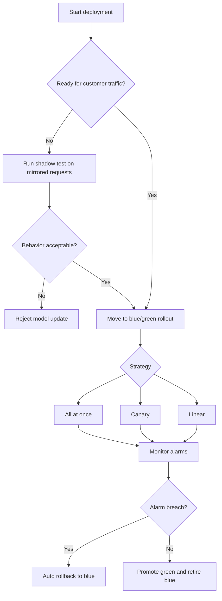
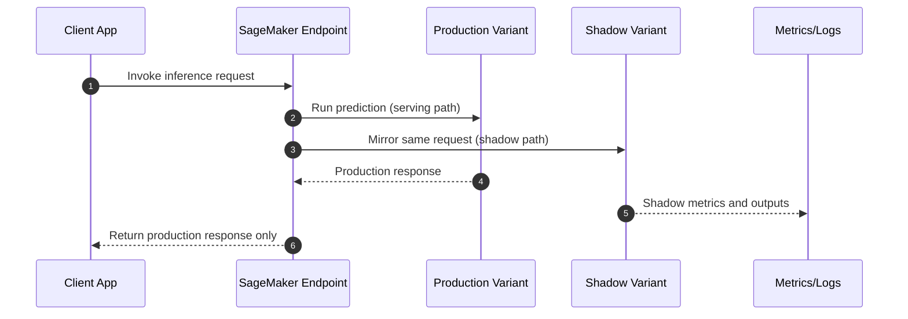

# SageMaker Deployment Safeguards

## :material-school: What you'll learn

!!! abstract "Learning objectives"
    You will use :simple-amazonaws: <a href="https://docs.aws.amazon.com/sagemaker/latest/dg/deployment-guardrails.html">SageMaker deployment guardrails</a> to release new models safely, compare blue/green and shadow testing strategies, and connect deployment controls with <a href="https://docs.aws.amazon.com/sagemaker/latest/dg/studio-updated.html">SageMaker Studio</a> capabilities like Autopilot, Model Monitor, JumpStart, Data Wrangler, and Feature Store.

## :material-book-open-variant: Key definitions

| Term | Definition |
|---|---|
| <a href="https://docs.aws.amazon.com/sagemaker/latest/dg/deployment-guardrails.html">**Deployment guardrails**</a> | Safety controls for updating model endpoints in production with controlled traffic shifting and rollback protections. |
| <a href="https://docs.aws.amazon.com/sagemaker/latest/dg/deployment-guardrails-blue-green.html">**Blue/green deployment**</a> | A rollout pattern where your current endpoint fleet (blue) and new fleet (green) run side by side while traffic moves progressively. |
| <a href="https://docs.aws.amazon.com/sagemaker/latest/dg/deployment-guardrails-blue-green-all-at-once.html">**All-at-once rollout**</a> | Shifts all traffic to the new fleet immediately, then retires the old fleet after verification. |
| <a href="https://docs.aws.amazon.com/sagemaker/latest/dg/deployment-guardrails-blue-green-canary.html">**Canary rollout**</a> | Sends a small percentage of traffic to the new model first, then increases only if metrics stay healthy. |
| <a href="https://docs.aws.amazon.com/sagemaker/latest/dg/deployment-guardrails-blue-green-linear.html">**Linear rollout**</a> | Moves traffic in fixed increments (for example 10% every interval) until the new fleet reaches 100%. |
| <a href="https://docs.aws.amazon.com/sagemaker/latest/dg/deployment-guardrails-configuration.html">**Auto-rollback**</a> | Automatically restores traffic to the prior model when CloudWatch alarms signal poor deployment health. |
| <a href="https://docs.aws.amazon.com/sagemaker/latest/dg/model-deploy-mlops.html">**Shadow test**</a> | Mirrors production requests to a new model variant in parallel so you can compare behavior before promotion. |
| <a href="https://docs.aws.amazon.com/sagemaker/latest/dg/async-inference.html">**Asynchronous inference endpoint**</a> | Queues requests and returns predictions later, which is useful when your model latency is high or payloads are large. |

## :material-scale-balance: Key distinctions / comparisons

| Item | Notes |
|---|---|
| **Deployment guardrails vs GenAI guardrails** | Deployment guardrails protect rollout safety and endpoint stability. GenAI guardrails are content policy and response filtering controls. |
| **Blue/green vs shadow testing** | Blue/green controls **live customer traffic movement**. Shadow testing evaluates a new model on mirrored traffic without returning its output to production users. |
| **Canary vs linear rollout** | Canary starts tiny and expands after checks; linear follows predefined increments on a schedule. |
| **Real-time vs asynchronous inference** | Real-time endpoints prioritize immediate response. Asynchronous endpoints trade response immediacy for better handling of long-running inference jobs. |
| **Autopilot-managed workflow vs manual components** | <a href="https://docs.aws.amazon.com/sagemaker/latest/dg/autopilot-automate-model-development.html">Autopilot</a> orchestrates parts of model building automatically, while notebooks/experiments/debugger/tuning can also be used independently. |

## Why this matters

- 🔑 You reduce blast radius during model upgrades by shifting traffic in controlled stages instead of big-bang releases.
- ⚡ You can catch model regressions early with shadow validation before the new model serves production results.
- 💰 Safe rollouts prevent expensive outages, emergency reversions, and hidden quality drift that can impact downstream teams.
- 🔒 Auto-rollback gives you a fast safety net when latency or error alarms exceed acceptable thresholds.

## How deployment safeguards work

You should think in two lanes: **promotion lane** (blue/green traffic shifts) and **validation lane** (shadow testing). Use the right lane based on whether you are ready to expose customer traffic.



!!! info "How to choose quickly"
    If your team is highly confident in the new model and has strong automated tests, all-at-once can be acceptable. If uncertainty is high, start with canary. If you want predictable, policy-driven progression, choose linear.

## :material-code-braces: Apply deployment guardrails with boto3

Use <a href="https://docs.aws.amazon.com/boto3/latest/reference/services/sagemaker/client/update_endpoint.html">`update_endpoint`</a> to promote a new endpoint config and attach deployment guardrail behavior.

```python
import boto3

sagemaker = boto3.client("sagemaker", region_name="us-east-1")

sagemaker.update_endpoint(
    EndpointName="fraud-score-endpoint",
    EndpointConfigName="fraud-score-v2-config",  # points to new model package or model data
    RetainAllVariantProperties=True,
    DeploymentConfig={
        "BlueGreenUpdatePolicy": {
            "TrafficRoutingConfiguration": {
                "Type": "CANARY",
                "CanarySize": {"Type": "CAPACITY_PERCENT", "Value": 10},
                "WaitIntervalInSeconds": 300
            },
            "TerminationWaitInSeconds": 600,  # keep blue fleet warm before final cleanup
            "MaximumExecutionTimeoutInSeconds": 3600
        },
        "AutoRollbackConfiguration": {
            "Alarms": [{"AlarmName": "sagemaker-endpoint-5xx-alarm"}]
        }
    },
)
```

!!! warning "Exam trap: deployment guardrails are endpoint-scoped"
    These controls apply to online endpoint deployment workflows. They are not the same mechanism used for batch transform jobs.

## Shadow testing request path

During shadow testing, a single production request is evaluated by both versions, but only the primary variant result is returned to users.



!!! success "What a good shadow test result looks like"
    You see stable latency and error metrics, and shadow predictions remain within acceptable divergence thresholds compared to the production model across representative traffic windows.

## Studio features that support safer deployment

| Capability | How it supports deployment confidence |
|---|---|
| <a href="https://docs.aws.amazon.com/sagemaker/latest/dg/studio-updated.html">**SageMaker Studio**</a> | Central workspace to orchestrate preparation, training, monitoring, and endpoint lifecycle decisions. |
| <a href="https://docs.aws.amazon.com/sagemaker/latest/dg/autopilot-automate-model-development.html">**SageMaker Autopilot**</a> | Automates candidate model creation and tuning so you can validate better baselines before rollout. |
| <a href="https://docs.aws.amazon.com/sagemaker/latest/dg/how-it-works-model-monitor.html">**SageMaker Model Monitor**</a> | Detects production data quality and model drift issues that should block promotion or trigger rollback plans. |
| <a href="https://docs.aws.amazon.com/sagemaker/latest/dg/studio-jumpstart.html">**SageMaker JumpStart**</a> | Accelerates experimentation with prebuilt models and starter notebooks for quicker validation cycles. |
| <a href="https://docs.aws.amazon.com/sagemaker/latest/dg/data-wrangler.html">**SageMaker Data Wrangler**</a> | Improves training-data quality through repeatable transformation flows before retraining candidates. |
| <a href="https://docs.aws.amazon.com/sagemaker/latest/dg/feature-store.html">**SageMaker Feature Store**</a> | Keeps online and offline features consistent, reducing training/serving skew that can derail new releases. |
| <a href="https://docs.aws.amazon.com/sagemaker/latest/dg/edge.html">**SageMaker Edge Manager**</a> | Captures edge telemetry for monitoring and retraining loops in distributed model deployments. |
| <a href="https://docs.aws.amazon.com/sagemaker/latest/dg/neo-deployment-hosting-services-sdk.html">**SageMaker Neo**</a> | Supports model compilation and deployment workflows for edge targets where performance constraints are strict. |

## :material-code-braces: Asynchronous inference example

If your endpoint should accept requests without blocking client threads, use asynchronous invocation with <a href="https://docs.aws.amazon.com/sagemaker/latest/dg/async-inference.html">SageMaker Asynchronous Inference</a>.

```python
import boto3

runtime = boto3.client("sagemaker-runtime", region_name="us-east-1")

response = runtime.invoke_endpoint_async(
    EndpointName="claims-review-async-endpoint",
    InputLocation="s3://my-ml-input-bucket/claims/payload.json",
    InferenceId="claims-job-2026-05-28-001"
)

print("Request accepted:", response["InferenceId"])
print("Output location:", response["OutputLocation"])
```

## :material-alert: Limitations and edge cases

!!! warning "Common rollout mistake"
    Do not rely only on a short canary window for low-frequency failure modes. If your problematic events occur rarely, extend observation time and include targeted test payloads.

- 📉 Shadow tests can reveal prediction divergence but will not automatically tell you which business KPI is at risk.
- ⏱️ Linear rollouts reduce risk, but they also slow release velocity; choose step sizes based on traffic and recovery goals.
- 🧪 Auto-rollback works only when alarms are meaningful; poor threshold design can cause both missed incidents and noisy reversions.
- 🧰 Studio ecosystem features are powerful, but each still needs governance on IAM, lineage, and model approval policy.

## :material-lightbulb: Key takeaways

- 🔑 Deployment guardrails give you structured release control for real-time and asynchronous endpoint updates.
- ⚡ Blue/green strategies (all-at-once, canary, linear) let you tune speed versus safety explicitly.
- 🔄 Shadow testing is your safest pre-promotion signal because it evaluates real traffic patterns without serving risky outputs.
- 💰 Auto-rollback plus quality monitoring materially reduces the operational cost of bad model releases.

## Industry scenarios

- 🏥 A healthcare triage API uses canary rollout at 5% traffic, then linear increases only after latency and false-negative alarms remain stable.
- 🏦 A fraud platform runs shadow tests for seven days to compare drift-sensitive transaction predictions before approving a production promotion.
- 🛒 An e-commerce recommender uses asynchronous endpoints for expensive reranking jobs while keeping customer-facing retrieval endpoints in real-time mode.

## :material-link-variant: Internal References

- [Section 5 Overview](../index.md)
- [Intro to Amazon SageMaker AI](../01-intro-to-amazon-sagemaker-ai/index.md)
- [Data Processing, Training, and Deployment with SageMaker](../02-data-processing-training-and-deployment-with-sagemaker/index.md)
- [Optimizing Foundation Model Deployments](../04-optimizing-foundation-model-deployments/index.md)
- [SageMaker Model Monitor and Clarify](../06-sagemaker-model-monitor-and-clarify/index.md)

## External References

- :fontawesome-solid-link: <a href="https://docs.aws.amazon.com/sagemaker/latest/dg/deployment-guardrails.html">Deployment guardrails for updating models in production</a>
- :fontawesome-solid-link: <a href="https://docs.aws.amazon.com/sagemaker/latest/dg/deployment-guardrails-configuration.html">Auto-rollback configuration and monitoring</a>
- :fontawesome-solid-link: <a href="https://docs.aws.amazon.com/sagemaker/latest/dg/model-deploy-mlops.html">Model deployment in SageMaker AI (shadow testing)</a>
- :fontawesome-solid-link: <a href="https://docs.aws.amazon.com/sagemaker/latest/dg/async-inference.html">Asynchronous inference</a>
- :fontawesome-solid-link: <a href="https://docs.aws.amazon.com/sagemaker/latest/dg/studio-updated.html">Amazon SageMaker Studio</a>
- :fontawesome-solid-link: <a href="https://docs.aws.amazon.com/sagemaker/latest/dg/autopilot-automate-model-development.html">SageMaker Autopilot</a>
- :fontawesome-solid-link: <a href="https://docs.aws.amazon.com/sagemaker/latest/dg/how-it-works-model-monitor.html">Monitoring a model in production</a>
- :fontawesome-solid-link: <a href="https://docs.aws.amazon.com/sagemaker/latest/dg/studio-jumpstart.html">SageMaker JumpStart pretrained models</a>
- :fontawesome-solid-link: <a href="https://docs.aws.amazon.com/sagemaker/latest/dg/data-wrangler.html">Prepare ML data with SageMaker Data Wrangler</a>
- :fontawesome-solid-link: <a href="https://docs.aws.amazon.com/sagemaker/latest/dg/feature-store.html">Create, store, and share features with Feature Store</a>
- :fontawesome-solid-link: <a href="https://docs.aws.amazon.com/sagemaker/latest/dg/edge.html">Model deployment at the edge with SageMaker Edge Manager</a>
- :fontawesome-solid-link: <a href="https://docs.aws.amazon.com/sagemaker/latest/dg/neo-deployment-hosting-services-sdk.html">Deploy a compiled model using SageMaker SDK (Neo)</a>