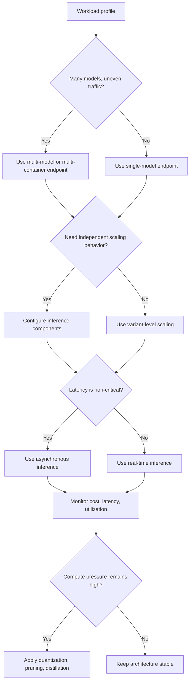

# Optimizing Foundation Model Deployments

## :material-school: What you'll learn

!!! abstract "Learning objectives"
    You will optimize :simple-amazonaws: <a href="https://docs.aws.amazon.com/sagemaker/latest/dg/multi-model-endpoints.html">Amazon SageMaker AI endpoint deployments</a> for foundation models by choosing the right endpoint pattern, scaling model-serving capacity safely, and reducing cost with async inference plus model-compression strategies. You will also connect SageMaker-trained models to <a href="https://docs.aws.amazon.com/bedrock/latest/userguide/import-pre-trained-model.html">Amazon Bedrock custom model import</a> when serverless inference is a better fit.

## :material-book-open-variant: Key definitions

| Term | Definition |
|---|---|
| <a href="https://docs.aws.amazon.com/sagemaker/latest/dg/multi-model-endpoints.html">**Multi-model endpoint**</a> | One endpoint serves multiple models, improving infrastructure utilization when traffic is spread across models. |
| <a href="https://docs.aws.amazon.com/sagemaker/latest/dg/deploy-model-advanced.html">**Multi-container endpoint**</a> | A single endpoint hosts multiple containers so you can compose inference workflows or serve heterogeneous workloads. |
| <a href="https://docs.aws.amazon.com/sagemaker/latest/dg/realtime-endpoints-adapt.html">**Inference component**</a> | Deployment unit that lets you isolate scaling and resource controls for model-serving workloads. |
| <a href="https://docs.aws.amazon.com/bedrock/latest/userguide/import-pre-trained-model.html">**Bedrock custom model import**</a> | Imports a trained or tuned model (including SageMaker-origin flows) into Bedrock for managed inference hosting. |
| <a href="https://docs.aws.amazon.com/sagemaker/latest/dg/async-inference.html">**Asynchronous inference**</a> | Queues requests and returns outputs later, useful when immediate response time is not required. |
| [Quantization](https://pytorch.org/docs/stable/quantization.html) | Reduces weight precision (for example FP32 to INT8) to shrink model size and often improve throughput. |
| [Pruning](https://pytorch.org/tutorials/intermediate/pruning_tutorial.html) | Removes less-useful weights or structures to reduce compute and memory footprint. |
| [Knowledge distillation](https://research.google/pubs/distilling-the-knowledge-in-a-neural-network/) | Trains a smaller student model to mimic a larger teacher model while preserving useful behavior. |

## :material-scale-balance: Key distinctions / comparisons

| Item | Notes |
|---|---|
| **Single-model vs multi-model endpoints** | Single-model gives simple isolation; multi-model improves fleet utilization when model traffic is bursty or uneven. |
| **SageMaker hosting vs Bedrock custom import** | SageMaker gives deep deployment control; Bedrock custom import reduces ops burden with managed model hosting patterns. |
| **Real-time vs asynchronous inference** | Real-time prioritizes low latency; async prioritizes throughput and cost-efficiency for long or queueable jobs. |
| **Model-level optimization vs infrastructure-level optimization** | Compression (quantization/pruning/distillation) shrinks compute demand; endpoint design and scaling policies control runtime capacity. |

## Why this matters

- 💰 You cut idle spend when one endpoint fleet serves multiple models instead of overprovisioning isolated fleets.
- ⚡ You improve resiliency by combining per-model scaling with region-aware inference routing patterns.
- 🔒 You reduce rollout risk by keeping deployment guardrails and network isolation settings scoped to each endpoint strategy.
- 📊 You make better decisions when optimization starts from observed CloudWatch metrics rather than assumptions.

## How deployment optimization decisions flow

Use this sequence: select endpoint topology, apply scaling and routing controls, then optimize model size only where monitoring shows bottlenecks.



!!! info "Cross-region throughput strategy"
    When you route inference through Bedrock profiles, you can use geography-scoped or global cross-region options so overload in one region does not immediately become an outage for your application path.

## :material-code-braces: Create a multi-model endpoint (boto3)

You can configure a model for multi-model serving by setting `Mode` to `MultiModel` on the container and then deploying the endpoint.

```python
import boto3

sagemaker = boto3.client("sagemaker", region_name="us-east-1")

sagemaker.create_model(
    ModelName="fm-mme-model",
    ExecutionRoleArn="arn:aws:iam::123456789012:role/SageMakerExecutionRole",
    PrimaryContainer={
        "Image": "763104351884.dkr.ecr.us-east-1.amazonaws.com/pytorch-inference:2.1.0-gpu-py310-cu121-ubuntu20.04-sagemaker",
        "ModelDataUrl": "s3://my-bucket/mme-models/",  # prefix containing multiple model artifacts
        "Mode": "MultiModel",
    },
)
```

!!! warning "Exam trap: multi-model does not remove all isolation concerns"
    Shared endpoint fleets improve cost efficiency, but noisy-neighbor effects and model-loading behavior can still impact tail latency. Validate with production-like traffic before broad rollout.

## :material-code-braces: Use async inference for non-interactive jobs

If your use case can tolerate delayed responses, invoke async endpoints and retrieve results from S3.

```python
import boto3

runtime = boto3.client("sagemaker-runtime", region_name="us-east-1")

response = runtime.invoke_endpoint_async(
    EndpointName="fm-summarization-async",
    InputLocation="s3://my-input-bucket/jobs/doc-001.json",
    InferenceId="job-doc-001",
)

print(response["InferenceId"])
print(response["OutputLocation"])
```

!!! success "Expected operational outcome"
    You smooth burst traffic, reduce client timeout pressure, and keep expensive model containers from scaling aggressively for short spikes.

## Model server options you should recognize

| Server | When you would use it |
|---|---|
| [TorchServe](https://docs.pytorch.org/serve/) | PyTorch-native model serving workflows where handler-based customization is needed. |
| [DJL Serving](https://docs.djl.ai/master/docs/serving/index.html) | Java-first serving stack tied to Deep Java Library for multi-framework model hosting. |
| [NVIDIA Triton Inference Server](https://docs.nvidia.com/deeplearning/triton-inference-server/user-guide/docs/) | High-throughput, multi-framework serving with advanced batching and scheduling behavior. |

## :material-alert: Limitations and edge cases

!!! warning "Do not optimize blindly"
    You should not compress models or redesign endpoint topology before validating real bottlenecks in throughput, latency, and utilization metrics.

- 📉 Quantization can degrade quality on some tasks, so evaluate task metrics after precision changes.
- 🔁 Distillation quality depends on teacher coverage; weak teacher outputs create brittle student behavior.
- 🧰 Queue-based async designs (for example with [Amazon SQS](https://docs.aws.amazon.com/AWSSimpleQueueService/latest/SQSDeveloperGuide/welcome.html) and [Amazon SNS](https://docs.aws.amazon.com/sns/latest/dg/welcome.html)) require operational handling for retries and dead-letter paths.
- 🌍 Cross-region routing improves availability but can change latency and data-governance constraints across geographies.

## :material-lightbulb: Key takeaways

- 🔑 Start with endpoint architecture choices (single, multi-model, multi-container) before micro-optimizing model internals.
- ⚡ Use inference components and async patterns to align scaling behavior with workload shape.
- 💰 Compression techniques can materially reduce hosting cost, but only after measurement confirms the need.
- 📊 CloudWatch-driven tuning prevents premature optimization and keeps changes tied to real production evidence.

## Industry scenarios

- 🏥 A healthcare NLP team hosts several specialty summarization models on one multi-model endpoint and scales by observed clinic-hour demand.
- 🏦 A fraud analytics platform uses async SageMaker inference for heavy nightly risk scoring while preserving low-latency real-time checks separately.
- 🛒 An e-commerce personalization team distills a large recommendation model into a smaller student model to reduce endpoint GPU cost during peak season.

## :material-link-variant: Internal References

- [Section 5 Overview](../index.md)
- [Intro to Amazon SageMaker AI](../01-intro-to-amazon-sagemaker-ai/index.md)
- [Data Processing, Training, and Deployment with SageMaker](../02-data-processing-training-and-deployment-with-sagemaker/index.md)
- [SageMaker Deployment Safeguards](../03-sagemaker-deployment-safeguards/index.md)
- [SageMaker Model Monitor and Clarify](../06-sagemaker-model-monitor-and-clarify/index.md)

## External References

- :fontawesome-solid-link: <a href="https://docs.aws.amazon.com/sagemaker/latest/dg/multi-model-endpoints.html">SageMaker AI multi-model endpoints</a>
- :fontawesome-solid-link: <a href="https://docs.aws.amazon.com/sagemaker/latest/dg/create-multi-model-endpoint.html">Create a multi-model endpoint</a>
- :fontawesome-solid-link: <a href="https://docs.aws.amazon.com/sagemaker/latest/dg/deploy-model-advanced.html">Advanced endpoint options (multi-container and pipelines)</a>
- :fontawesome-solid-link: <a href="https://docs.aws.amazon.com/sagemaker/latest/dg/realtime-endpoints-adapt.html">Inference components for real-time inference</a>
- :fontawesome-solid-link: <a href="https://docs.aws.amazon.com/sagemaker/latest/dg/async-inference.html">Asynchronous inference in SageMaker AI</a>
- :fontawesome-solid-link: <a href="https://docs.aws.amazon.com/bedrock/latest/userguide/import-pre-trained-model.html">Import a pre-trained model into Amazon Bedrock</a>
- :fontawesome-solid-link: <a href="https://docs.aws.amazon.com/bedrock/latest/userguide/import-with-create-custom-model.html">Import a SageMaker AI-trained Amazon Nova model</a>
- :fontawesome-solid-link: [TorchServe documentation](https://docs.pytorch.org/serve/)
- :fontawesome-solid-link: [DJL Serving documentation](https://docs.djl.ai/master/docs/serving/index.html)
- :fontawesome-solid-link: [NVIDIA Triton Inference Server documentation](https://docs.nvidia.com/deeplearning/triton-inference-server/user-guide/docs/)