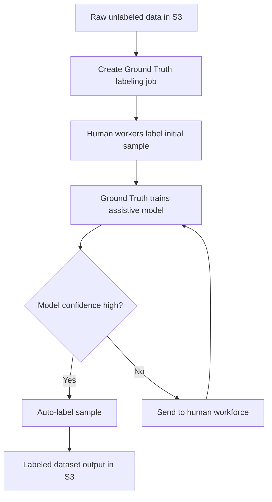

# SageMaker Ground Truth

## :material-school: What you'll learn

!!! abstract "Learning objectives"
    You will use :simple-amazonaws: <a href="https://docs.aws.amazon.com/sagemaker/latest/dg/sms.html">Amazon SageMaker Ground Truth</a> to build high-quality labeled datasets faster by combining human labeling with automation. You will also learn when to use <a href="https://docs.aws.amazon.com/sagemaker/latest/dg/gtp-getting-started-core-components.html">SageMaker Ground Truth Plus</a> and how services like <a href="https://docs.aws.amazon.com/rekognition/latest/dg/what-is.html">Amazon Rekognition</a> and <a href="https://docs.aws.amazon.com/comprehend/latest/dg/what-is.html">Amazon Comprehend</a> can generate labels or features before labeling workloads reach humans.

## :material-book-open-variant: Key definitions

| Term | Definition |
|---|---|
| <a href="https://docs.aws.amazon.com/sagemaker/latest/dg/sms.html">**SageMaker Ground Truth**</a> | Managed data-labeling service that coordinates human workers and automation to build training datasets. |
| <a href="https://docs.aws.amazon.com/sagemaker/latest/dg/sms-automated-labeling.html">**Automated data labeling (active learning)**</a> | Ground Truth trains an internal model from human labels, then routes only uncertain samples to workers. |
| <a href="https://docs.aws.amazon.com/sagemaker/latest/dg/sms-workforce-management-public.html">**Public workforce (Mechanical Turk)**</a> | On-demand crowd workforce for labeling tasks where broad external annotators are acceptable. |
| <a href="https://docs.aws.amazon.com/sagemaker/latest/dg/sms-workforce-management-private-console.html">**Private workforce**</a> | Your own internal annotators, typically used for sensitive or regulated data. |
| <a href="https://docs.aws.amazon.com/sagemaker/latest/dg/sms-workforce-management-vendors.html">**Vendor workforce**</a> | Third-party specialized labeling providers managed through Ground Truth. |
| <a href="https://docs.aws.amazon.com/sagemaker/latest/dg/gtp-getting-started-core-components.html">**Ground Truth Plus**</a> | Managed, turnkey labeling engagement where AWS coordinates project setup and operations. |

## :material-scale-balance: Key distinctions / comparisons

| Item | Notes |
|---|---|
| **Ground Truth vs Ground Truth Plus** | Ground Truth gives you direct control over jobs and workforce setup; Ground Truth Plus is a managed service model with AWS-led delivery. |
| **Human-only labeling vs active learning loop** | Human-only scales linearly with data size; active learning reduces cost by escalating only low-confidence items to humans. |
| **Mechanical Turk vs private workforce** | Mechanical Turk scales quickly for generic tasks; private teams better fit confidential datasets and domain-specific labeling standards. |
| **Label generation vs feature generation** | Label generation adds target outputs for supervised learning; feature generation adds new model inputs (for example sentiment/topic fields). |

## Why this matters

- 💰 You can lower annotation costs significantly when Ground Truth automates confident predictions and sends only ambiguous items to people.
- ⚡ You accelerate dataset creation for computer vision, NLP, and multimodal pipelines where unlabeled data blocks model iteration.
- 🔒 You keep governance options flexible by choosing public, private, or vendor workforces based on data sensitivity.
- 📊 You improve model quality by turning unlabeled raw data into structured labels and richer engineered features.

## How Ground Truth labeling works

You should treat Ground Truth as an iterative human-in-the-loop system: seed with human labels, train an assistive model, and keep humans focused on edge cases.



!!! info "Cost-efficiency mechanism"
    Ground Truth's active-learning approach reduces repetitive manual labeling because the service learns from accepted labels and narrows human effort to uncertain examples.

## :material-code-braces: Create a labeling job (boto3)

Use the SageMaker API to create labeling jobs when you need reproducible setup in CI/CD or scripted MLOps pipelines.

```python
import boto3

sagemaker = boto3.client("sagemaker", region_name="us-east-1")

RoleArn = "arn:aws:iam::123456789012:role/SageMakerExecutionRole"
WorkteamArn = "arn:aws:sagemaker:us-east-1:123456789012:workteam/private-crowd/my-team"
PreHumanTaskLambdaArn = "arn:aws:lambda:us-east-1:432418664414:function:PRE-BoundingBox"
UiTemplateS3Uri = "s3://my-bucket/ui-template.liquid.html"

response = sagemaker.create_labeling_job(
    LabelingJobName="birds-bounding-box-job",
    LabelAttributeName="label",
    InputConfig={
        "DataSource": {
            "S3DataSource": {
                "ManifestS3Uri": "s3://my-bucket/input.manifest"
            }
        },
        "DataAttributes": {
            "ContentClassifiers": [
                "FreeOfPersonallyIdentifiableInformation"
            ]
        },
   
    },
    OutputConfig={"S3OutputPath": "s3://my-bucket/ground-truth-output/"},
    RoleArn=RoleArn,
    HumanTaskConfig={
        "WorkteamArn": WorkteamArn,
        "UiConfig": {"UiTemplateS3Uri": UiTemplateS3Uri},
        "PreHumanTaskLambdaArn": PreHumanTaskLambdaArn,
        "TaskTitle": "Draw bird bounding boxes",
        "TaskDescription": "Annotate each visible bird in the image.",
        "NumberOfHumanWorkersPerDataObject": 3,
        "TaskTimeLimitInSeconds": 600,
    },
)

print(response["LabelingJobArn"])
```

!!! warning "Exam trap: automation is not zero-human"
    Automated labeling does not eliminate human review. You still need high-quality seed labels and quality control to prevent systematic labeling errors.

## Bootstrap labels and features with other AWS AI services

Before human labeling begins, you can pre-populate candidate metadata using managed AI services and then let humans verify or correct the results.

```python
import boto3

rekognition = boto3.client("rekognition", region_name="us-east-1")

labels = rekognition.detect_labels(
    Image={"S3Object": {"Bucket": "my-bucket", "Name": "images/game.jpg"}},
    MaxLabels=10,
    MinConfidence=80,
)

for item in labels["Labels"]:
    print(item["Name"], item["Confidence"])
```

```python
import boto3

comprehend = boto3.client("comprehend", region_name="us-east-1")

sentiment = comprehend.detect_sentiment(
    Text="The delivery was late, but support fixed it quickly.",
    LanguageCode="en",
)

print(sentiment["Sentiment"], sentiment["SentimentScore"])
```

!!! success "Practical outcome"
    When you pre-tag obvious cases (for example, clear object classes or easy sentiment), your human team can spend time on difficult edge cases where quality matters most.

## :material-alert: Limitations / edge cases

!!! warning "Sensitive data handling"
    If your data contains confidential content, do not default to public workers. Use private workforces or stricter vendor governance and review access controls carefully.

- 🧪 Label drift can occur when annotation guidance is vague, so maintain clear instructions and periodic audits.
- 🧱 Active learning quality depends on early labels; weak seed labels propagate mistakes into the assistive model.
- 💸 Ground Truth Plus is convenient but can be more expensive than self-managed jobs when your team already has strong labeling operations.
- 🗂️ Large-scale labeling still requires careful S3 manifest management and schema consistency for downstream training pipelines.

## :material-lightbulb: Key takeaways

- 🔑 Ground Truth combines humans and automation to create scalable, quality-focused labeling workflows.
- ⚡ Active learning improves throughput by routing uncertain samples to people and auto-labeling confident cases.
- 💰 Workforce choice (public, private, vendor, or Plus) directly affects cost, speed, and compliance posture.
- 📈 Rekognition and Comprehend can enrich data before labeling, helping you engineer better training inputs.

## Industry scenarios

- 🏥 A medical imaging startup uses a private workforce to annotate rare pathology regions while Ground Truth automation handles obvious normal scans.
- 🏦 A financial services team uses Comprehend-generated sentiment as a preliminary feature, then applies human review for high-risk complaint tickets.
- 🛒 An e-commerce company bootstraps product image tags with Rekognition and sends low-confidence predictions to a vendor workforce for correction.

## :material-link-variant: Internal References

- [Section 5 Overview](../index.md)
- [Intro to Amazon SageMaker AI](../01-intro-to-amazon-sagemaker-ai/index.md)
- [Data Processing, Training, and Deployment with SageMaker](../02-data-processing-training-and-deployment-with-sagemaker/index.md)
- [SageMaker Deployment Safeguards](../03-sagemaker-deployment-safeguards/index.md)
- [Optimizing Foundation Model Deployments](../04-optimizing-foundation-model-deployments/index.md)

## External References

- :fontawesome-solid-link: <a href="https://docs.aws.amazon.com/sagemaker/latest/dg/sms.html">SageMaker Ground Truth overview</a>
- :fontawesome-solid-link: <a href="https://docs.aws.amazon.com/sagemaker/latest/dg/sms-automated-labeling.html">Automated data labeling in Ground Truth</a>
- :fontawesome-solid-link: <a href="https://docs.aws.amazon.com/sagemaker/latest/dg/sms-workforce-management-public.html">Use the Mechanical Turk workforce</a>
- :fontawesome-solid-link: <a href="https://docs.aws.amazon.com/sagemaker/latest/dg/sms-workforce-management-private-console.html">Create and manage a private workforce</a>
- :fontawesome-solid-link: <a href="https://docs.aws.amazon.com/sagemaker/latest/dg/sms-workforce-management-vendors.html">Use third-party vendor workforces</a>
- :fontawesome-solid-link: <a href="https://docs.aws.amazon.com/sagemaker/latest/dg/gtp-getting-started-core-components.html">Ground Truth Plus core components</a>
- :fontawesome-solid-link: <a href="https://docs.aws.amazon.com/rekognition/latest/dg/labels-detect-labels-image.html">Detect labels in images with Rekognition</a>
- :fontawesome-solid-link: <a href="https://docs.aws.amazon.com/comprehend/latest/dg/topic-modeling.html">Topic modeling with Comprehend</a>
- :fontawesome-solid-link: <a href="https://docs.aws.amazon.com/comprehend/latest/dg/how-targeted-sentiment.html">Targeted sentiment in Comprehend</a>