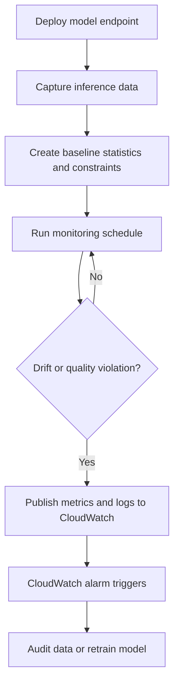
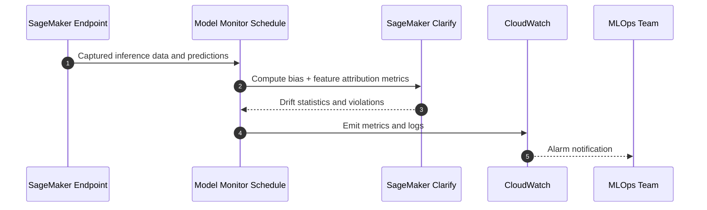

# [SageMaker Model Monitor and Clarify](https://www.udemy.com/course/ultimate-aws-certified-generative-ai-developer-professional/learn/lecture/53684557#overview)

## :material-school: What you'll learn

!!! abstract "Learning objectives"
    You will use :simple-amazonaws: <a href="https://docs.aws.amazon.com/sagemaker/latest/dg/model-monitor.html">Amazon SageMaker Model Monitor</a> to detect production drift and quality regressions early, then combine it with <a href="https://docs.aws.amazon.com/sagemaker/latest/dg/clarify-configure-processing-jobs.html">SageMaker Clarify</a> to monitor bias and feature-attribution changes over time. You will also learn how to schedule monitoring jobs, route metrics into <a href="https://docs.aws.amazon.com/sagemaker/latest/dg/monitoring-cloudwatch.html">Amazon CloudWatch</a>, and trigger corrective actions like retraining.

## :material-book-open-variant: Key definitions

| Term | Definition |
|---|---|
| <a href="https://docs.aws.amazon.com/sagemaker/latest/dg/model-monitor.html">**SageMaker Model Monitor**</a> | Managed monitoring capability that checks data quality, model quality, bias drift, and feature attribution drift for deployed models. |
| <a href="https://docs.aws.amazon.com/sagemaker/latest/dg/model-monitor-create-baseline.html">**Baseline**</a> | A reference snapshot (statistics + constraints) that defines expected behavior for production inputs or model outputs. |
| <a href="https://docs.aws.amazon.com/sagemaker/latest/dg/model-monitor-data-quality.html">**Data quality drift**</a> | Change in input distributions or feature behavior versus baseline, including missing values, outliers, or new value patterns. |
| <a href="https://docs.aws.amazon.com/sagemaker/latest/dg/model-monitor-model-quality.html">**Model quality drift**</a> | Degradation in prediction performance against known labels, often measured with a ground-truth feedback loop. |
| <a href="https://docs.aws.amazon.com/sagemaker/latest/dg/clarify-measure-data-bias.html">**Bias metrics (Clarify)**</a> | Statistical measures used to detect unfairness across groups (for example by age or income segments). |
| <a href="https://docs.aws.amazon.com/sagemaker/latest/dg/clarify-model-monitor-feature-attribution-drift.html">**Feature attribution drift**</a> | Change over time in which features drive model predictions, even if aggregate accuracy looks stable. |

## :material-scale-balance: Key distinctions / comparisons

| Item | Notes |
|---|---|
| **Data quality drift vs model quality drift** | Data quality drift focuses on changing inputs; model quality drift focuses on prediction correctness against outcomes. |
| **Model Monitor vs Clarify** | Model Monitor orchestrates scheduled checks and alerts; Clarify contributes fairness and explainability metrics used by those checks. |
| **Monitoring metrics vs alarms** | Monitoring jobs emit metrics/logs; alarms are separate CloudWatch rules that you configure to trigger actions. |
| **Static model validation vs continuous monitoring** | One-time validation can miss future shifts; continuous monitoring catches evolving production behavior. |

## Why this matters

- 🔑 You avoid silent failures where models continue serving predictions while input data shifts away from training conditions.
- 📊 You can detect missing features, outliers, or distribution changes before they create business-impacting errors.
- 🔒 You gain a governance trail for fairness and explainability, especially important in regulated domains.
- 💰 You reduce incident cost by catching drift early and retraining only when objective thresholds are exceeded.

## How the monitoring loop works

Use this lifecycle every time you push a model to production: establish a baseline, schedule checks, emit metrics, and decide remediation quickly.



!!! info "What 'quality' means in practice"
    Quality is domain-specific. In credit scoring, you might track missing-income ratio and score calibration drift. In fraud detection, you might prioritize false-negative shifts and delayed ground-truth mismatch trends.

## :material-code-braces: Build a baseline with boto3

When you start monitoring, generate baseline artifacts and store them in <a href="https://docs.aws.amazon.com/sagemaker/latest/dg/model-monitor-create-baseline.html">S3</a> so every future run compares against a stable reference.

```python
import boto3

sagemaker = boto3.client("sagemaker", region_name="us-east-1")

response = sagemaker.create_processing_job(
    ProcessingJobName="credit-model-baseline-job",
    AppSpecification={
        "ImageUri": "159807026194.dkr.ecr.us-east-1.amazonaws.com/sagemaker-model-monitor-analyzer"
    },
    ProcessingResources={
        "ClusterConfig": {
            "InstanceCount": 1,
            "InstanceType": "ml.m5.xlarge",
            "VolumeSizeInGB": 30
        }
    },
    RoleArn="arn:aws:iam::123456789012:role/SageMakerExecutionRole",
    ProcessingOutputConfig={
        "Outputs": [
            {
                "OutputName": "baseline",
                "S3Output": {
                    "S3Uri": "s3://my-ml-monitoring/baselines/credit-v1/",
                    "LocalPath": "/opt/ml/processing/output",
                    "S3UploadMode": "EndOfJob"
                }
            }
        ]
    }
)

print(response["ProcessingJobArn"])
```

!!! warning "Exam trap: baseline quality determines monitor quality"
    If your baseline is built from unrepresentative or low-quality data, your drift alerts can be noisy or misleading. Always validate baseline windows before production rollout.

## :material-code-braces: Schedule Model Monitor checks

After your baseline is in place, create scheduled monitoring so checks happen continuously instead of only during manual reviews.

```python
import boto3

sagemaker = boto3.client("sagemaker", region_name="us-east-1")

sagemaker.create_monitoring_schedule(
    MonitoringScheduleName="credit-data-quality-hourly",
    MonitoringScheduleConfig={
        "ScheduleConfig": {"ScheduleExpression": "cron(0 * ? * * *)"},
        "MonitoringJobDefinition": {
            "MonitoringInputs": [
                {
                    "EndpointInput": {
                        "EndpointName": "credit-score-endpoint",
                        "LocalPath": "/opt/ml/processing/input/endpoint",
                        "S3InputMode": "File"
                    }
                }
            ],
            "MonitoringOutputConfig": {
                "MonitoringOutputs": [
                    {
                        "S3Output": {
                            "S3Uri": "s3://my-ml-monitoring/reports/",
                            "LocalPath": "/opt/ml/processing/output",
                            "S3UploadMode": "EndOfJob"
                        }
                    }
                ]
            },
            "BaselineConfig": {
                "ConstraintsResource": {
                    "S3Uri": "s3://my-ml-monitoring/baselines/credit-v1/constraints.json"
                },
                "StatisticsResource": {
                    "S3Uri": "s3://my-ml-monitoring/baselines/credit-v1/statistics.json"
                }
            },
            "RoleArn": "arn:aws:iam::123456789012:role/SageMakerExecutionRole"
        }
    }
)
```

## Bias and feature-attribution monitoring path

When fairness and explainability matter, combine Clarify metrics with Model Monitor so drift is visible in the same operational pipeline.



!!! success "What successful operations look like"
    You should see stable feature-attribution rankings and group-level fairness metrics that remain inside agreed thresholds while business KPIs stay healthy.

## :material-alert: Limitations / edge cases

!!! warning "Ground truth latency can hide model-quality drift"
    If true labels arrive days later, model-quality alerts lag behind real-world degradation. Mitigate with proxy metrics and faster feedback pipelines where possible.

- 🧪 New features appearing in production input can break assumptions even when no schema change was announced.
- ⏱️ Short monitoring intervals increase sensitivity but also raise cost and potential alert noise.
- 🧰 Third-party dashboards (for example [Amazon QuickSight](https://aws.amazon.com/quicksight/) or [Tableau](https://www.tableau.com/)) help visualization but still depend on well-defined baseline and alarm policies.

## :material-lightbulb: Key takeaways

- 🔑 Treat monitoring as a continuous MLOps control loop, not a one-time deployment checkbox.
- ⚡ Pair Model Monitor with Clarify to track both performance drift and fairness/explainability drift.
- 💰 Good baseline design and meaningful alarm thresholds reduce false positives and unnecessary retraining.
- 🔒 CloudWatch alerts should map to explicit runbooks so your team can respond quickly and consistently.

## Industry scenarios

- 🏥 A hospital readmission model monitors missing clinical features and bias by age cohort, triggering review when fairness metrics move beyond threshold.
- 🏦 A lending platform compares predictions against delayed human-reviewed outcomes to detect underwriting drift before default rates spike.
- 🛒 An e-commerce recommender tracks feature-attribution drift to catch when seasonal behavior changes model dependence on stale features.

## :material-link-variant: Internal References

- [Section 5 Overview](../index.md)
- [Intro to Amazon SageMaker AI](../01-intro-to-amazon-sagemaker-ai/index.md)
- [Data Processing, Training, and Deployment with SageMaker](../02-data-processing-training-and-deployment-with-sagemaker/index.md)
- [SageMaker Deployment Safeguards](../03-sagemaker-deployment-safeguards/index.md)
- [SageMaker Ground Truth](../05-sagemaker-ground-truth/index.md)

## External References

- :fontawesome-solid-link: <a href="https://docs.aws.amazon.com/sagemaker/latest/dg/model-monitor.html">Data and model quality monitoring with SageMaker Model Monitor</a>
- :fontawesome-solid-link: <a href="https://docs.aws.amazon.com/sagemaker/latest/dg/model-monitor-mlops.html">SageMaker Model Monitor in MLOps workflows</a>
- :fontawesome-solid-link: <a href="https://docs.aws.amazon.com/sagemaker/latest/dg/model-monitor-create-baseline.html">Create a monitoring baseline</a>
- :fontawesome-solid-link: <a href="https://docs.aws.amazon.com/sagemaker/latest/dg/model-monitor-data-quality.html">Monitor data quality drift</a>
- :fontawesome-solid-link: <a href="https://docs.aws.amazon.com/sagemaker/latest/dg/model-monitor-model-quality.html">Monitor model quality drift</a>
- :fontawesome-solid-link: <a href="https://docs.aws.amazon.com/sagemaker/latest/dg/clarify-configure-processing-jobs.html">SageMaker Clarify fairness and explainability</a>
- :fontawesome-solid-link: <a href="https://docs.aws.amazon.com/sagemaker/latest/dg/clarify-measure-data-bias.html">Clarify pre-training bias metrics</a>
- :fontawesome-solid-link: <a href="https://docs.aws.amazon.com/sagemaker/latest/dg/clarify-model-monitor-feature-attribution-drift.html">Feature attribution drift in production</a>
- :fontawesome-solid-link: <a href="https://docs.aws.amazon.com/sagemaker/latest/dg/monitoring-cloudwatch.html">SageMaker metrics in Amazon CloudWatch</a>
- :fontawesome-solid-link: <a href="https://aws.amazon.com/quicksight/">Amazon QuickSight</a>
- :fontawesome-solid-link: <a href="https://www.tableau.com/">Tableau</a>