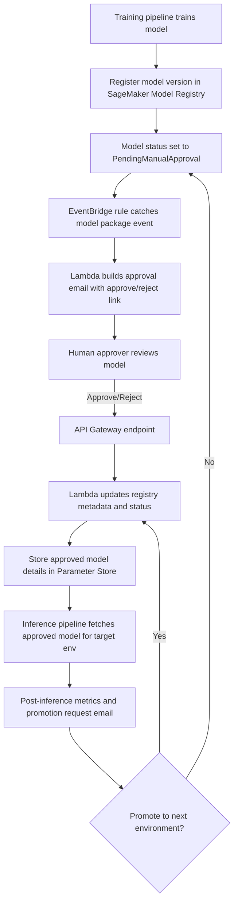

# SageMaker Model Registry

## :material-school: What you'll learn

!!! abstract "Learning objectives"
    You will use :simple-amazonaws: <a href="https://docs.aws.amazon.com/sagemaker/latest/dg/model-registry.html">Amazon SageMaker Model Registry</a> to version, govern, and promote models across environments with controlled approvals. You will also learn how to combine <a href="https://docs.aws.amazon.com/sagemaker/latest/dg/automating-sagemaker-with-eventbridge.html">Amazon EventBridge</a>, <a href="https://docs.aws.amazon.com/lambda/latest/dg/welcome.html">AWS Lambda</a>, <a href="https://docs.aws.amazon.com/apigateway/latest/developerguide/welcome.html">Amazon API Gateway</a>, and <a href="https://docs.aws.amazon.com/systems-manager/latest/userguide/systems-manager-parameter-store.html">AWS Systems Manager Parameter Store</a> to implement human-in-the-loop approval and promotion.

## :material-book-open-variant: Key definitions

| Term | Definition |
|---|---|
| <a href="https://docs.aws.amazon.com/sagemaker/latest/dg/model-registry.html">**SageMaker Model Registry**</a> | Central catalog for model packages, versions, and metadata used in MLOps pipelines. |
| <a href="https://docs.aws.amazon.com/sagemaker/latest/dg/model-registry-models.html">**Model package group**</a> | Logical container for versions of the same model family (v1, v2, v3...). |
| <a href="https://docs.aws.amazon.com/sagemaker/latest/dg/model-registry-approve.html">**Approval status**</a> | Governance flag (for example `PendingManualApproval`, `Approved`, `Rejected`) that gates promotion/deployment actions. |
| <a href="https://docs.aws.amazon.com/sagemaker/latest/dg/model-cards.html">**Model Card**</a> | Structured documentation of model behavior, limitations, evaluation context, and intended use. |
| <a href="https://docs.aws.amazon.com/sagemaker/latest/dg/model-registry-staging-construct-event-bridge.html">**Model lifecycle event**</a> | EventBridge-notifiable model package state/stage change used to automate follow-up actions. |

## :material-scale-balance: Key distinctions / comparisons

| Item | Notes |
|---|---|
| **Model artifact vs model registry record** | Artifact is the binary/model data itself; registry record is governance metadata + lifecycle status around that artifact. |
| **Manual approval vs automatic promotion** | Manual approval adds risk control and auditability; automatic promotion improves speed once guardrails are trusted. |
| **Single-environment release vs multi-environment progression** | One-step release is faster but riskier; dev -> test -> UAT -> prod progression reduces blast radius. |
| **Model Monitor vs Model Registry** | <a href="https://docs.aws.amazon.com/sagemaker/latest/dg/model-monitor.html">Model Monitor</a> detects drift/quality issues; Model Registry manages what version is approved for each stage. |

## Why this matters

- 🔑 You get one authoritative source of truth for what model version is approved, where, and why.
- 🔒 You can enforce explicit human approval before production deployment in regulated or high-risk use cases.
- ⚡ You decouple training from deployment, so your pipelines stay modular and easier to maintain.
- 💰 You reduce rollback and incident cost by promoting models through controlled environment gates.

## How the approval and promotion workflow works

The following diagram is adapted from the AWS blog architecture and maps the same intuition from the lecture: registry events trigger approval workflows, and approved versions are promoted environment by environment.



!!! info "How to read this architecture"
    Your control plane is event-driven: registration emits an event, EventBridge routes it, Lambda handles business logic, and Model Registry + Parameter Store become your release source of truth.

## :material-code-braces: Update model approval status (boto3)

Use <a href="https://docs.aws.amazon.com/sagemaker/latest/dg/model-registry-approve.html">model approval status updates</a> to programmatically gate downstream deployment steps.

```python
import boto3

sagemaker = boto3.client("sagemaker", region_name="us-east-1")

model_package_arn = (
    "arn:aws:sagemaker:us-east-1:123456789012:model-package/"
    "fraud-detector-group/3"
)

response = sagemaker.update_model_package(
    ModelPackageArn=model_package_arn,
    ModelApprovalStatus="Approved",  # or PendingManualApproval / Rejected
    ApprovalDescription="Approved after validation checks and human review",
)

print(response["ModelPackageArn"])
```

## :material-code-braces: Persist approved version metadata for deployment

After approval, store environment-specific release pointers in <a href="https://docs.aws.amazon.com/systems-manager/latest/userguide/systems-manager-parameter-store.html">Parameter Store</a> so inference pipelines can resolve the right version at runtime.

```python
import boto3
import json

ssm = boto3.client("ssm", region_name="us-east-1")

payload = {
    "model_package_arn": "arn:aws:sagemaker:us-east-1:123456789012:model-package/fraud-detector-group/3",
    "model_version": 3,
    "target_environment": "test",
}

ssm.put_parameter(
    Name="/ml/models/fraud-detector/approved/test",
    Value=json.dumps(payload),
    Type="String",
    Overwrite=True,  # bump pointer when a newer approved model is promoted
)
```

!!! warning "Exam trap: registration is not deployment"
    Registering a model does not mean it is production-ready. You still need explicit approval logic and promotion controls before routing live traffic.

!!! success "Expected outcome"
    You can trace every promoted model version, prove who approved it, and automate safe handoffs from training to inference across dev/test/UAT/prod.

## Industry scenarios

- 🏥 A healthcare risk model is promoted only after a clinical validator approves it in each environment, preserving compliance evidence.
- 🏦 A banking fraud model uses EventBridge + manual approval gates so only validated versions can replace production endpoints.
- 🛒 An e-commerce recommender stores approved model pointers in Parameter Store, letting each environment deploy the right version automatically.

## :material-lightbulb: Key takeaways

- 🔑 Treat Model Registry as your governance hub, not just a storage list of model artifacts.
- ⚡ Event-driven approval workflows let you scale oversight without blocking all automation.
- 🔒 Human-in-the-loop promotion is a practical control for high-impact ML systems.
- 💰 Promotion gates reduce costly regressions by catching bad releases before production rollout.

## :material-link-variant: Internal References

- [Section 5 Overview](../index.md)
- [Data Processing, Training, and Deployment with SageMaker](../02-data-processing-training-and-deployment-with-sagemaker/index.md)
- [SageMaker Deployment Safeguards](../03-sagemaker-deployment-safeguards/index.md)
- [Optimizing Foundation Model Deployments](../04-optimizing-foundation-model-deployments/index.md)
- [SageMaker Ground Truth](../05-sagemaker-ground-truth/index.md)
- [SageMaker Model Monitor and Clarify](../06-sagemaker-model-monitor-and-clarify/index.md)

## External References

- :fontawesome-solid-link: <a href="https://aws.amazon.com/blogs/machine-learning/build-an-amazon-sagemaker-model-registry-approval-and-promotion-workflow-with-human-intervention/">Build an Amazon SageMaker Model Registry approval and promotion workflow with human intervention (AWS Blog)</a>
- :fontawesome-solid-link: <a href="https://docs.aws.amazon.com/sagemaker/latest/dg/model-registry.html">Model Registration Deployment with Model Registry - Amazon SageMaker AI</a>
- :fontawesome-solid-link: <a href="https://docs.aws.amazon.com/sagemaker/latest/dg/model-registry-models.html">Model Registry models, model versions, and model package groups</a>
- :fontawesome-solid-link: <a href="https://docs.aws.amazon.com/sagemaker/latest/dg/model-registry-approve.html">Update the approval status of a model</a>
- :fontawesome-solid-link: <a href="https://docs.aws.amazon.com/sagemaker/latest/dg/model-registry-staging-construct-event-bridge.html">Get event notifications for model lifecycle updates</a>
- :fontawesome-solid-link: <a href="https://docs.aws.amazon.com/sagemaker/latest/dg/automating-sagemaker-with-eventbridge.html">Events that SageMaker AI sends to EventBridge</a>
- :fontawesome-solid-link: <a href="https://docs.aws.amazon.com/systems-manager/latest/userguide/systems-manager-parameter-store.html">AWS Systems Manager Parameter Store</a>

