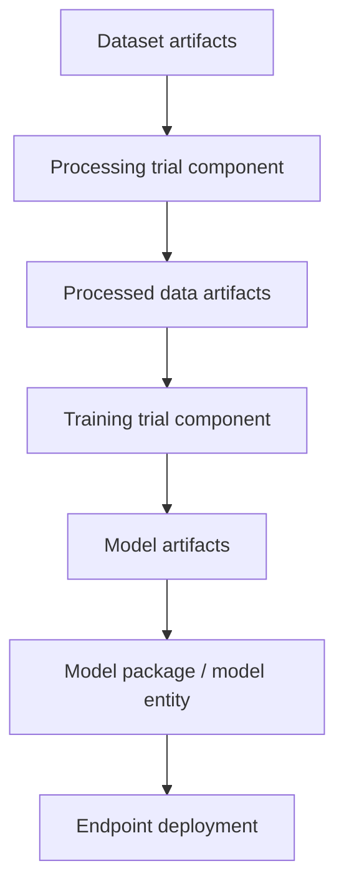

# SageMaker Lineage Tracking

## :material-school: What you'll learn

!!! abstract "Learning objectives"
    You will use <a href="https://docs.aws.amazon.com/sagemaker/latest/dg/lineage-tracking.html">Amazon SageMaker ML lineage tracking</a> to trace how datasets, processing jobs, training jobs, model artifacts, and endpoints connect over time. You will also learn how to query lineage from <a href="https://www.python.org/">Python</a> to support governance, impact analysis, and audits.

## :material-book-open-variant: Key definitions

| Term | Definition |
|---|---|
| <a href="https://docs.aws.amazon.com/sagemaker/latest/dg/lineage-tracking-entities.html">**Trial component**</a> | A single tracked unit of work, such as a processing job, training job, or transform job. |
| <a href="https://docs.aws.amazon.com/sagemaker/latest/dg/experiments.html">**Trial**</a> | A collection of trial components that belong to one run or experiment cycle. |
| <a href="https://docs.aws.amazon.com/sagemaker/latest/dg/experiments.html">**Experiment**</a> | A higher-level grouping of trials for a use case, team objective, or model development track. |
| <a href="https://docs.aws.amazon.com/sagemaker/latest/dg/lineage-tracking-entities.html">**Context**</a> | A logical grouping boundary (for example project, team, or release train) used to organize lineage entities. |
| <a href="https://docs.aws.amazon.com/sagemaker/latest/dg/lineage-tracking-entities.html">**Action**</a> | A tracked workflow activity, such as training, evaluation, or deployment. |
| <a href="https://docs.aws.amazon.com/sagemaker/latest/dg/lineage-tracking-entities.html">**Artifact**</a> | A tracked data or model object, such as a file in <a href="https://docs.aws.amazon.com/AmazonS3/latest/userguide/Welcome.html">Amazon S3</a> or a container image in <a href="https://docs.aws.amazon.com/AmazonECR/latest/userguide/what-is-ecr.html">Amazon ECR</a>. |
| <a href="https://docs.aws.amazon.com/sagemaker/latest/dg/lineage-tracking-entities.html">**Association**</a> | A typed relationship that links entities (for example artifact produced by action, or model deployed to endpoint). |

## Why this matters

- 🔑 You need end-to-end traceability when model behavior changes and stakeholders ask what data or process changed.
- 💰 You reduce operational risk by identifying all downstream consumers before modifying a shared artifact.
- 🔒 You strengthen audit readiness by retaining a historical graph of model build and deployment steps.

!!! info "Governance perspective"
    Lineage gives you a time-aware snapshot of how data and models moved through your ML pipeline, which is crucial for compliance, incident response, and reproducibility.

## :material-sitemap: How lineage flows in a typical ML pipeline

You can think of lineage as a graph that records what entered each step, what each step produced, and where those outputs were deployed.



!!! success "What you gain from this graph"
    You can answer practical questions quickly: which endpoint is using this model, which training run produced it, and which dataset versions influenced that run.

## :material-code-braces: Query lineage with boto3

When you need impact analysis, use the lineage query API to traverse upstream (ascendants) or downstream (descendants) relationships from a starting entity.

```python
import boto3

sagemaker = boto3.client("sagemaker", region_name="us-east-1")

response = sagemaker.query_lineage(
    StartArns=[
        "arn:aws:sagemaker:us-east-1:123456789012:artifact/my-processed-dataset"
    ],
    Direction="Descendants",  # Trace what was produced/used after this artifact
    IncludeEdges=True,
    MaxDepth=3,
)

for vertex in response.get("Vertices", []):
    print(vertex.get("Arn"), vertex.get("LineageType"))
```

Use this to find all models or endpoints affected by a specific artifact before making a schema, data, or retention change.

## :material-link-lock: Record entities and relationships

Lineage is most useful when your jobs consistently create entities and associations as part of normal workflow automation.

```python
import boto3

sagemaker = boto3.client("sagemaker", region_name="us-east-1")

artifact_arn = sagemaker.create_artifact(
    ArtifactName="training-dataset-v12",
    ArtifactType="DataSet",
    Source={"SourceUri": "s3://my-ml-bucket/datasets/train/v12/"},
)["ArtifactArn"]

action_arn = sagemaker.create_action(
    ActionName="train-xgboost-2026-05-28",
    ActionType="Training",
    Source={"SourceUri": "arn:aws:sagemaker:us-east-1:123456789012:training-job/xgb-job"},
)["ActionArn"]

sagemaker.add_association(
    SourceArn=artifact_arn,
    DestinationArn=action_arn,
    AssociationType="ContributedTo",
)
```

## :material-alert: Limitations and edge cases

!!! warning "Exam trap"
    Do not memorize every entity subtype for exam prep. Focus on the conceptual model: entities represent workflow parts, and associations encode how those parts connect.

!!! warning "Operational pitfall"
    If you track entities inconsistently across projects, your lineage graph becomes incomplete and impact analysis can return misleading results.

- ⚠️ Cross-account lineage collaboration requires deliberate sharing design, often with <a href="https://docs.aws.amazon.com/ram/latest/userguide/what-is.html">AWS Resource Access Manager (AWS RAM)</a>.
- ⚠️ Visual lineage is excellent for exploration, but production governance usually also needs API-driven checks and automation.

## :material-lightbulb: Key takeaways

- 🔑 Lineage tracking gives you a historical relationship graph from data input to deployed endpoint.
- ⚡ Query APIs help you answer "who depends on this artifact?" before changes are made.
- 💰 Governance value comes from consistent entity/association capture, not from one-off manual tracking.

## Industry scenarios

- 🏥 A healthcare ML team traces a prediction model to the exact preprocessed dataset version used during a regulatory review.
- 🏦 A fraud platform team identifies every endpoint impacted by a shared feature artifact before rolling out feature engineering changes.
- 🛒 An e-commerce recommendation team audits training and deployment lineage across accounts to coordinate model rollback safely.

## :material-link-variant: Internal References

- [Optimizing Foundation Model Deployments](../04-optimizing-foundation-model-deployments/index.md)
- [SageMaker Ground Truth](../05-sagemaker-ground-truth/index.md)
- [SageMaker Model Monitor and Clarify](../06-sagemaker-model-monitor-and-clarify/index.md)
- [SageMaker Model Registry](../07-sagemaker-model-registry/index.md)

## External References

- :fontawesome-solid-link: <a href="https://docs.aws.amazon.com/sagemaker/latest/dg/lineage-tracking.html">Amazon SageMaker ML Lineage Tracking</a>
- :fontawesome-solid-link: <a href="https://docs.aws.amazon.com/sagemaker/latest/dg/lineage-tracking-entities.html">Lineage Tracking Entities</a>
- :fontawesome-solid-link: <a href="https://docs.aws.amazon.com/sagemaker/latest/dg/querying-lineage-entities.html">Querying Lineage Entities</a>
- :fontawesome-solid-link: <a href="https://docs.aws.amazon.com/sagemaker/latest/dg/experiments.html">Amazon SageMaker Experiments</a>
- :fontawesome-solid-link: <a href="https://docs.aws.amazon.com/ram/latest/userguide/what-is.html">What is AWS Resource Access Manager?</a>
- :fontawesome-solid-link: <a href="https://docs.aws.amazon.com/AmazonS3/latest/userguide/Welcome.html">What is Amazon S3?</a>
- :fontawesome-solid-link: <a href="https://docs.aws.amazon.com/AmazonECR/latest/userguide/what-is-ecr.html">What is Amazon ECR?</a>
- :fontawesome-solid-link: [SageMaker Python SDK](https://sagemaker.readthedocs.io/en/stable/)