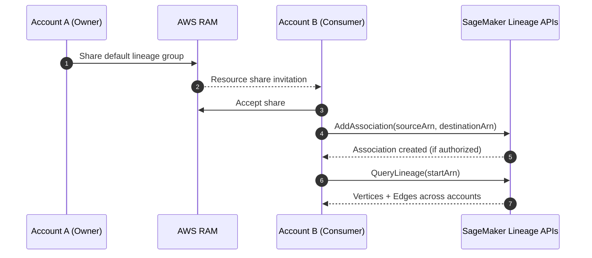

# Cross-Account Lineage Tracking

## :material-school: What you'll learn

!!! abstract "Learning objectives"
    You will learn how to track lineage across AWS accounts in <a href="https://docs.aws.amazon.com/sagemaker/latest/dg/xaccount-lineage-tracking.html">Amazon SageMaker AI cross-account lineage tracking</a>. You will also see how to connect entities with <a href="https://docs.aws.amazon.com/sagemaker/latest/APIReference/API_AddAssociation.html">AddAssociation</a> and traverse relationships with <a href="https://docs.aws.amazon.com/sagemaker/latest/APIReference/API_QueryLineage.html">QueryLineage</a>.

## :material-book-open-variant: Key definitions

| Term | Definition |
|---|---|
| <a href="https://docs.aws.amazon.com/sagemaker/latest/dg/xaccount-lineage-tracking.html">**Cross-account lineage tracking**</a> | A SageMaker capability that lets you trace lineage entities (artifacts, actions, contexts, trial components) across AWS account boundaries. |
| <a href="https://docs.aws.amazon.com/sagemaker/latest/APIReference/API_AddAssociation.html">**AddAssociation**</a> | API action you use to create an edge between a source ARN and a destination ARN in the lineage graph, including cross-account relationships when permissions allow it. |
| <a href="https://docs.aws.amazon.com/sagemaker/latest/APIReference/API_QueryLineage.html">**QueryLineage**</a> | API action used to traverse lineage vertices and edges from a starting ARN to inspect ascendants, descendants, or both. |
| <a href="https://docs.aws.amazon.com/ram/latest/userguide/what-is.html">**AWS Resource Access Manager (AWS RAM)**</a> | Service used to share SageMaker lineage group resources across accounts securely. |

## Why this matters

- 🔑 You can prove where data and model artifacts came from, even when pipelines span multiple AWS accounts.
- 🔒 You can enforce least-privilege access while still enabling investigation and governance workflows.
- 📊 You can run incident analysis and compliance audits faster because lineage remains connected across account boundaries.

!!! warning ":material-alert: Access precondition"
    Cross-account lineage does not work by API call alone. You need resource sharing (typically with AWS RAM) plus the required SageMaker permissions (`AddAssociation`, `QueryLineage`, and describe actions).

## :material-cogs: How cross-account lineage works

You establish sharing first, then create associations between entities in different accounts, and finally query the graph from allowed starting ARNs.



!!! info "Association behavior you should remember"
    If you have permission on both entities, SageMaker can create and return cross-account lineage links. SageMaker can also establish `SameAs` associations for artifacts that reference the same shared data object.

## :material-code-braces: Boto3 demonstrations

Use the SageMaker client to connect cross-account entities with `add_association`:

```python
import boto3

sagemaker = boto3.client("sagemaker", region_name="us-west-2")

response = sagemaker.add_association(
    SourceArn="arn:aws:sagemaker:us-west-2:111111111111:artifact/source-artifact",
    DestinationArn="arn:aws:sagemaker:us-west-2:222222222222:artifact/destination-artifact",
    AssociationType="ContributedTo",  # Also supports AssociatedWith, DerivedFrom, Produced, SameAs
)

print(response["SourceArn"], "->", response["DestinationArn"])
```

Query downstream or upstream relationships with `query_lineage`:

```python
import boto3

sagemaker = boto3.client("sagemaker", region_name="us-west-2")

result = sagemaker.query_lineage(
    StartArns=["arn:aws:sagemaker:us-west-2:222222222222:artifact/destination-artifact"],
    Direction="Both",      # Ascendants, Descendants, or Both
    IncludeEdges=True,     # Return edges plus vertices for graph traversal
    MaxDepth=4,            # Keep bounded for faster, focused queries
    MaxResults=25,
)

for vertex in result.get("Vertices", []):
    print(vertex["Arn"], vertex["Type"])
```

!!! success "Expected outcome"
    Once sharing and permissions are configured correctly, your lineage graph includes related entities from both accounts, and `query_lineage` can traverse those links from your authorized start ARN.

## :material-alert: Limitations and edge cases

!!! warning "Common pitfall"
    If `add_association` fails for cross-account entities, first check resource share acceptance and resource policy scope before debugging SDK code.

- ⚠️ Cross-account lineage depends on explicit authorization on shared lineage resources; missing policy actions block traversal.
- ⚠️ `QueryLineage` result size is bounded (`MaxDepth`, `MaxResults`), so large graphs may require pagination with `NextToken`.
- ⚠️ Without a valid `StartArns` entity you can access, lineage traversal returns incomplete or empty results.

## :material-lightbulb: Key takeaways

- 🔑 Cross-account lineage in SageMaker is supported and practical for multi-account ML governance.
- 🔒 `AddAssociation` plus correct cross-account permissions is the core setup pattern.
- ⚡ `QueryLineage` gives you graph traversal for audit, debugging, and impact analysis workflows.

## Industry scenarios

- 🏥 A healthcare ML platform keeps training data lineage in a protected data account and model training in a separate ML account; cross-account lineage supports audit readiness.
- 🏦 A banking MLOps team separates feature engineering and model deployment by account; shared lineage lets risk teams trace production model provenance quickly.
- 🛒 An e-commerce organization runs regional accounts but central governance; cross-account lineage provides end-to-end artifact traceability during incident response.

## :material-link-variant: Internal References

- [SageMaker Lineage Tracking](../08-sagemaker-lineage-tracking/index.md)
- [SageMaker Model Registry](../07-sagemaker-model-registry/index.md)
- [SageMaker Model Monitor and Clarify](../06-sagemaker-model-monitor-and-clarify/index.md)

## External References

- :fontawesome-solid-link: <a href="https://docs.aws.amazon.com/sagemaker/latest/dg/xaccount-lineage-tracking.html">Tracking Cross-Account Lineage (Amazon SageMaker AI Developer Guide)</a>
- :fontawesome-solid-link: <a href="https://docs.aws.amazon.com/sagemaker/latest/APIReference/API_AddAssociation.html">AddAssociation (Amazon SageMaker AI API Reference)</a>
- :fontawesome-solid-link: <a href="https://docs.aws.amazon.com/sagemaker/latest/APIReference/API_QueryLineage.html">QueryLineage (Amazon SageMaker AI API Reference)</a>
- :fontawesome-solid-link: <a href="https://docs.aws.amazon.com/ram/latest/userguide/what-is.html">What is AWS Resource Access Manager?</a>