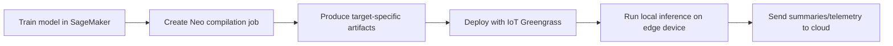
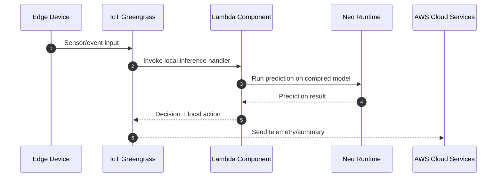

# SageMaker on the Edge (Neo)

## :material-school: What you'll learn

!!! abstract "Learning objectives"
    You will use :simple-amazonaws: <a href="https://docs.aws.amazon.com/sagemaker/latest/dg/neo.html">Amazon SageMaker Neo</a> to compile trained models for edge hardware and deliver low-latency inference closer to devices. You will also connect Neo with <a href="https://docs.aws.amazon.com/greengrass/v2/developerguide/perform-machine-learning-inference.html">AWS IoT Greengrass</a> so your cloud-trained model runs locally on real edge systems.

## :material-book-open-variant: Key definitions

| Term | Definition |
|---|---|
| <a href="https://docs.aws.amazon.com/sagemaker/latest/dg/neo.html">**SageMaker Neo**</a> | A model compiler + runtime approach that optimizes trained models for specific target hardware so inference is faster and smaller on-device. |
| <a href="https://docs.aws.amazon.com/sagemaker/latest/dg/neo-compilation-preparing-model.html">**Compilation job**</a> | The SageMaker operation that converts your trained framework artifact into target-specific binaries for deployment. |
| <a href="https://docs.aws.amazon.com/sagemaker/latest/dg/neo-edge-devices.html">**Edge target**</a> | The processor architecture and device class (for example ARM-based hardware) you compile for. |
| <a href="https://docs.aws.amazon.com/greengrass/v2/developerguide/what-is-iot-greengrass.html">**AWS IoT Greengrass**</a> | The edge runtime/deployment platform used to ship and run software components (including ML inference) on devices. |
| <a href="https://docs.aws.amazon.com/lambda/latest/dg/welcome.html">**AWS Lambda component**</a> | A function-based compute unit Greengrass can run on-device to orchestrate model invocation and local logic. |

## :material-scale-balance: Key distinctions / comparisons

| Item | Notes |
|---|---|
| **Cloud endpoint inference** | Centralized, easy to manage, but adds network round-trip latency and connectivity dependency. |
| **Edge inference with Neo** | Compiled for device architecture, low latency, works with intermittent connectivity, but requires device-specific packaging and deployment. |
| **Compile for EC2 type only** | Useful if you need endpoint optimization, but less aligned with true edge goals. |
| **Compile + deploy to edge device** | Best fit when response time is safety-critical or bandwidth-limited (vehicle, camera, industrial gateway). |

## Why this matters

- ⚡ You reduce reaction time because inference happens locally instead of waiting on internet round trips.
- 🔒 You keep sensitive raw data closer to the source device, which can simplify privacy and compliance controls.
- 💰 You can lower recurring cloud inference traffic costs when high-frequency decisions happen on-device.

!!! info ":material-lightbulb: Train once, run in many places"
    Neo's practical value is portability: train in SageMaker once, then optimize artifacts for different hardware families instead of maintaining separate model implementations.

## How it works

- You train your model in SageMaker using supported frameworks such as [TensorFlow](https://www.tensorflow.org/), [PyTorch](https://pytorch.org/), [MXNet](https://mxnet.apache.org/), [ONNX](https://onnx.ai/), or [XGBoost](https://xgboost.readthedocs.io/).
- You start a Neo compilation job targeting architecture families such as [Arm](https://www.arm.com/), [Intel](https://www.intel.com/), or [NVIDIA](https://www.nvidia.com/).
- You package and deploy the compiled artifacts through Greengrass components so inference runs on the device.
- You invoke inference locally (often through a Lambda component), then publish decisions/metrics back to cloud systems as needed.



## :material-code-braces: How to apply it

You can compile a trained model artifact with the SageMaker API (`CreateCompilationJob`) before edge deployment:

```python
import boto3

sagemaker = boto3.client("sagemaker", region_name="us-east-1")

response = sagemaker.create_compilation_job(
    CompilationJobName="neo-edge-vehicle-detector-v1",
    RoleArn="arn:aws:iam::123456789012:role/SageMakerExecutionRole",
    InputConfig={
        "S3Uri": "s3://my-ml-artifacts/models/vehicle-detector/model.tar.gz",
        "DataInputConfig": '{"input":[1,3,224,224]}',  # model input shape
        "Framework": "PYTORCH",
    },
    OutputConfig={
        "S3OutputLocation": "s3://my-ml-artifacts/neo-output/",
        "TargetDevice": "ml_c5",  # choose a target compatible with deployment hardware
    },
    StoppingCondition={"MaxRuntimeInSeconds": 3600},
)

print(response["CompilationJobArn"])
```

You can then package the generated output into your edge deployment workflow documented in <a href="https://docs.aws.amazon.com/greengrass/v2/developerguide/perform-machine-learning-inference.html">Greengrass ML inference</a>.

!!! success "Expected outcome"
    Your compiled model starts faster and runs with lower inference latency on the target device than a non-optimized artifact, while preserving model behavior.

## Example request path (edge + cloud coordination)



## :material-alert: Limitations / edge cases

!!! warning ":material-alert: Exam trap: target mismatch"
    If you compile for one target type and deploy on incompatible hardware, your runtime behavior can fail or degrade. Align the compilation target with the actual deployment environment.

!!! warning "Connectivity misconception"
    Edge inference reduces cloud dependency for prediction, but your fleet still needs a lifecycle plan for model updates, observability, and security patching.

- 🔍 Validate numerical parity after compilation; optimized binaries can slightly shift performance characteristics.
- 🧪 Benchmark on the actual edge device, not just in cloud test instances.

## :material-lightbulb: Key takeaways

- 🔑 Use Neo when low-latency local inference matters more than centralized cloud-only serving.
- ⚡ Pair Neo with Greengrass to operationalize edge deployment and component lifecycle management.
- 💰 Edge optimization is not only about speed; it also reduces bandwidth and recurring inference transport overhead.

## Industry scenarios

- 🚗 Autonomous driving: run object detection in-car so braking decisions do not depend on WAN latency.
- 🏭 Industrial IoT: score anomaly models on factory gateways to trigger immediate shutoff logic.
- 🛒 Smart retail cameras: perform local people/product detection, and upload only aggregated events.

## :material-link-variant: Internal References

- [SageMaker Model Monitor and Clarify](../06-sagemaker-model-monitor-and-clarify/index.md)
- [SageMaker Model Registry](../07-sagemaker-model-registry/index.md)
- [SageMaker Lineage Tracking](../08-sagemaker-lineage-tracking/index.md)
- [Cross-Account Lineage Tracking](../09-cross-account-lineage-tracking/index.md)

## External References

- :fontawesome-solid-link: <a href="https://docs.aws.amazon.com/sagemaker/latest/dg/neo.html">Model performance optimization with SageMaker Neo</a>
- :fontawesome-solid-link: <a href="https://docs.aws.amazon.com/sagemaker/latest/dg/neo-compilation-preparing-model.html">Prepare model for Neo compilation</a>
- :fontawesome-solid-link: <a href="https://docs.aws.amazon.com/sagemaker/latest/dg/neo-deployment-hosting-services-sdk.html">Deploy a compiled model using SageMaker SDK</a>
- :fontawesome-solid-link: <a href="https://docs.aws.amazon.com/sagemaker/latest/dg/neo-edge-devices.html">SageMaker Neo edge devices</a>
- :fontawesome-solid-link: <a href="https://docs.aws.amazon.com/greengrass/v2/developerguide/perform-machine-learning-inference.html">Perform machine learning inference with IoT Greengrass</a>
- :fontawesome-solid-link: <a href="https://docs.aws.amazon.com/greengrass/v2/developerguide/what-is-iot-greengrass.html">What is AWS IoT Greengrass?</a>
- :fontawesome-solid-link: <a href="https://docs.aws.amazon.com/lambda/latest/dg/welcome.html">AWS Lambda Developer Guide</a>
- :fontawesome-solid-link: [TensorFlow](https://www.tensorflow.org/)
- :fontawesome-solid-link: [PyTorch](https://pytorch.org/)
- :fontawesome-solid-link: [ONNX](https://onnx.ai/)