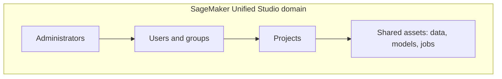
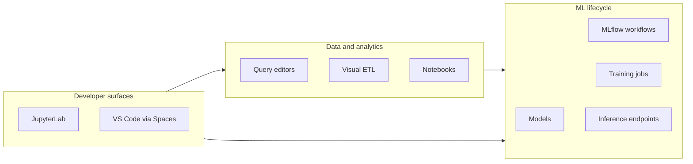
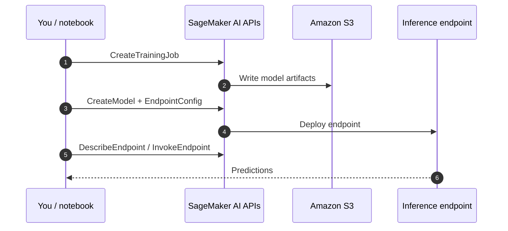

# SageMaker Unified Studio

## :material-school: What you'll learn

!!! abstract "Learning objectives"
    You will understand :simple-amazonaws: <a href="https://docs.aws.amazon.com/sagemaker-unified-studio/latest/userguide/what-is-sagemaker-unified-studio.html">Amazon SageMaker Unified Studio</a> as the single workspace for the full data, analytics, AI, and ML lifecycle—and how **domains**, **projects**, and team administration replace the older fragmented SageMaker UIs.

## :material-book-open-variant: Key definitions

| Term | Definition |
|---|---|
| <a href="https://docs.aws.amazon.com/sagemaker-unified-studio/latest/userguide/what-is-sagemaker-unified-studio.html">**SageMaker Unified Studio**</a> | A unified web experience for building, deploying, executing, and monitoring machine learning and analytics work across the lifecycle—not a separate product silo from SageMaker AI. |
| <a href="https://docs.aws.amazon.com/sagemaker-unified-studio/latest/userguide/domain.html">**Domain**</a> | The top-level organizational boundary where administrators connect **users**, **groups**, **projects**, and **assets** (data, models, jobs) under shared governance. |
| <a href="https://docs.aws.amazon.com/sagemaker-unified-studio/latest/userguide/projects.html">**Project**</a> | A collaboration container inside a domain for a team’s ML/analytics work—members, resources, and permissions roll up here. |
| <a href="https://docs.aws.amazon.com/sagemaker-unified-studio/latest/userguide/notebooks.html">**Built-in notebooks**</a> | Interactive Jupyter-style environments in the portal for Python, SQL, Spark-style workflows, and SageMaker development without leaving Unified Studio. |
| <a href="https://docs.aws.amazon.com/sagemaker-unified-studio/latest/userguide/visual-etl.html">**Visual ETL**</a> | A drag-and-drop data-pipeline builder (backed by <a href="https://docs.aws.amazon.com/sagemaker-unified-studio/latest/userguide/compute-glue-etl.html">AWS Glue ETL</a>) for cleansing and preparing data—conceptually where much of the old <a href="https://docs.aws.amazon.com/sagemaker/latest/dg/data-wrangler.html">Data Wrangler</a>–style prep now lives in the new UI. |
| <a href="https://docs.aws.amazon.com/sagemaker-unified-studio/latest/userguide/use-mlflow-experiments.html">**MLflow in Unified Studio**</a> | Experiment tracking and model-registry workflows integrated with SageMaker so teams can standardize runs, artifacts, and promotion steps. |

## :material-scale-balance: Key distinctions / comparisons

| Item | Notes |
|---|---|
| **Fragmented SageMaker UIs (historical)** | Notebooks often lived in one Studio experience while training, deployment, and other consoles lived elsewhere—context switching and inconsistent navigation. |
| **SageMaker Unified Studio** | One left-hand navigation model for data prep, notebooks, workflows, models, training jobs, endpoints, GenAI (Bedrock), and analytics integrations. |
| **Classic <a href="https://docs.aws.amazon.com/sagemaker/latest/dg/studio-updated.html">SageMaker Studio</a> capabilities** | Notebook-centric Studio features are **included** in Unified Studio—you are not losing Jupyter workflows; they are embedded in the broader portal. |
| **Console-only “Amazon SageMaker AI” domain** | Some legacy tools (notably classic Data Wrangler entry points) may still appear under the older SageMaker AI / Classic Studio path—see [NOTICE: Data Wrangler can be hard to find](../../section-2/05-notice-data-wrangler-can-be-hard-to-find/index.md). |

## Why this matters

- 🧭 You stop hunting across disconnected consoles—data engineering, model building, deployment, and monitoring share one mental model.
- 👥 Team delivery is first-class: administrators govern **who** can touch **which** domain assets instead of everyone sharing one undifferentiated account view.
- 🤖 GenAI and traditional ML coexist—<a href="https://docs.aws.amazon.com/sagemaker-unified-studio/latest/userguide/bedrock.html">Amazon Bedrock</a>, <a href="https://docs.aws.amazon.com/sagemaker-unified-studio/latest/userguide/q-actions.html">Amazon Q Developer</a>, and analytics surfaces sit beside classic training and inference tools.
- 💻 You can keep your preferred IDE: browser <a href="https://docs.aws.amazon.com/sagemaker-unified-studio/latest/userguide/notebooks.html">JupyterLab</a> **or** local <a href="https://code.visualstudio.com/">Visual Studio Code</a> attached to remote <a href="https://docs.aws.amazon.com/sagemaker-unified-studio/latest/userguide/connecting-to-spaces.html">Spaces</a> over a secure tunnel.

!!! info "What “unified” actually means"
    Unified Studio is not just a renamed notebook—it is an integration layer across AWS data, analytics, AI, and SageMaker AI services so one portal can carry you from exploration through production operations.

## How teams, domains, and projects fit together

Administrators provision a **domain** URL, attach identity (IAM or IAM Identity Center), and assign users and groups to **projects**. Projects group the assets your squad cares about—datasets, notebooks, models, jobs—so access control and discovery stay scoped to real workstreams.



!!! warning "Exam trap: domain vs project"
    A **domain** is the tenancy/governance boundary for Unified Studio; a **project** is where a team’s day-to-day ML/analytics artifacts live. Do not treat them as interchangeable labels on the exam.

## :material-map: Navigate the unified workspace

The left navigation panel is your map. From there you can open sample or custom notebooks (for example customer usage analysis), launch **workflows**, run **query editors**, design **Visual ETL** flows, schedule **data processing jobs**, review registered **models**, wire **MLflow** experiment flows, watch **training jobs**, and inspect **inference endpoints**.



For a guided tour of each pane, see <a href="https://docs.aws.amazon.com/sagemaker-unified-studio/latest/userguide/navigating-sagemaker-unified-studio.html">Navigate Amazon SageMaker Unified Studio</a>.

## Data processing, queries, and notebooks

- 📓 **Notebooks** — Use the built-in Jupyter environment to explore data, prototype features, and call SageMaker APIs from Python—whether your goal is analytics, classical ML, or GenAI orchestration.
- 🗃️ **Query editors** — Run SQL against connected catalogs and warehouses without exporting data to a separate tool first.
- 🧹 **Visual ETL and processing jobs** — Build repeatable cleansing/transform pipelines visually; underlying compute often routes through Glue-compatible sessions described in the Unified Studio compute guides.
- ⚠️ **Data Wrangler** — The lecture positions visual ETL as the modern home for much of that experience; AWS console layout for classic Data Wrangler is still evolving—cross-check [NOTICE: Data Wrangler can be hard to find](../../section-2/05-notice-data-wrangler-can-be-hard-to-find/index.md) before an exam assumes a single menu path.

## Build, track, train, and deploy models

| Stage | What you do in Unified Studio |
|---|---|
| **Experiment** | Track parameters, metrics, and artifacts with <a href="https://docs.aws.amazon.com/sagemaker-unified-studio/latest/userguide/use-mlflow-experiments.html">MLflow</a> apps or tracking servers. |
| **Train** | Launch and monitor intensive <a href="https://docs.aws.amazon.com/sagemaker/latest/dg/how-it-works-training.html">training jobs</a>—GPU spend and runtime deserve active monitoring. |
| **Register / govern** | Keep sight of AI/ML models your team owns before promotion to production (pairs with [SageMaker Model Registry](../07-sagemaker-model-registry/index.md) patterns). |
| **Deploy** | Create and watch <a href="https://docs.aws.amazon.com/sagemaker-unified-studio/latest/userguide/sagemaker-deploy-models.html">real-time inference endpoints</a> that serve your trained artifacts. |



## GenAI and analytics integrations

Beyond classical ML, Unified Studio surfaces:

- <a href="https://docs.aws.amazon.com/sagemaker-unified-studio/latest/userguide/bedrock.html">Amazon Bedrock</a> — playgrounds and builders for agents, flows, knowledge bases, and guardrails without leaving the portal.
- <a href="https://docs.aws.amazon.com/sagemaker-unified-studio/latest/userguide/q-actions.html">Amazon Q Developer</a> — generative assistance for code and data engineering tasks from chat or CLI contexts tied to your workspace.
- <a href="https://docs.aws.amazon.com/sagemaker-unified-studio/latest/userguide/quicksight-integration.html">Amazon QuickSight integration</a> — query, analyze, and publish dashboards against governed datasets while respecting domain security boundaries.

Use these when your pipeline blends **analytics questions** (SQL, dashboards) with **model building** (training, endpoints, Bedrock apps) in one program of work.

## :material-code-braces: Monitor jobs and endpoints with boto3

Most day-to-day work happens in the Unified Studio UI, but operations scripts and automation still call the same <a href="https://docs.aws.amazon.com/sagemaker/latest/APIReference/API_ListTrainingJobs.html">SageMaker AI APIs</a>. After you start training from a notebook or pipeline, poll job status programmatically:

```python
import boto3

sagemaker = boto3.client("sagemaker", region_name="us-east-1")

jobs = sagemaker.list_training_jobs(
    NameContains="customer-usage",  # filter to your experiment prefix
    StatusEquals="InProgress",    # surface still-running GPU jobs early
    MaxResults=10,
    SortBy="CreationTime",
    SortOrder="Descending",
)

for job in jobs["TrainingJobSummaries"]:
    print(job["TrainingJobName"], job["TrainingJobStatus"])
```

When an endpoint is live, confirm health and capacity before you route production traffic:

```python
import boto3

sagemaker = boto3.client("sagemaker", region_name="us-east-1")

status = sagemaker.describe_endpoint(EndpointName="customer-churn-realtime-v1")
print(status["EndpointStatus"], status.get("ProductionVariants"))
```

!!! success "Operational outcome"
    Your notebook or CI job can alert the team when a long-running training job fails or when an endpoint leaves `InService`—without anyone manually refreshing multiple consoles.

## Local development with Visual Studio Code

If you prefer coding on your laptop, connect <a href="https://code.visualstudio.com/">Visual Studio Code</a> to a remote <a href="https://docs.aws.amazon.com/sagemaker-unified-studio/latest/userguide/connecting-to-spaces.html">SageMaker Unified Studio Space</a> through a secure tunnel (documented prerequisites include sufficient instance size—often **8 GB RAM** minimum for the target Space). You get local editor ergonomics while compute and data access remain inside your governed domain.

## :material-alert: Limitations / edge cases

!!! warning "💰 Training and endpoint cost surprises"
    Training jobs—especially GPU-backed runs—and always-on inference endpoints can accrue cost quickly. Unified Studio makes them **easier to find**, not cheaper by default; monitor job status and tear down idle endpoints.

!!! warning "UI migration trap (Data Wrangler / Classic Studio)"
    AWS is still transitioning some SageMaker experiences between **Unified Studio**, **Classic Studio**, and **SageMaker AI** console entry points. If an exam question references Data Wrangler’s **classic** location, verify against current AWS docs rather than assuming every feature appears in the left nav on day one.

- 🔒 Access is only as good as domain IAM/Identity Center policies—being “in the portal” does not bypass least-privilege boundaries on underlying S3, Glue, or Bedrock resources.
- 🌐 Remote IDE connectivity depends on network path, Space sizing, and policy—budget time for setup before a deadline-driven sprint.

## :material-lightbulb: Key takeaways

- 🔑 **SageMaker Unified Studio** is the consolidated interface for data processing, analytics, AI/ML buildout, deployment, and monitoring—not a narrow notebook-only tool.
- 👥 **Domains and projects** structure team governance; administrators control users, groups, and what each project can reach.
- ⚡ The left navigation bundles notebooks, workflows, SQL, Visual ETL, MLflow, training jobs, and endpoints so you rarely leave the portal mid-lifecycle.
- 💻 **JupyterLab in-browser** and **VS Code over Spaces** are both supported developer surfaces.
- 📊 **Bedrock**, **Amazon Q**, and **QuickSight** integrations sit alongside classical SageMaker training and inference for hybrid analytics + ML + GenAI programs.

## Industry scenarios

- 🏦 **Retail analytics squad** — Analysts query warehouse data in Unified Studio, engineers promote a churn model through MLflow, and operations watches GPU training jobs and the production endpoint from the same domain project.
- 🏥 **Healthcare ML platform team** — Administrators carve HIPAA-scoped domains per business unit; researchers use notebooks for feature work while compliance reviews endpoint configurations before go-live.
- 🛒 **GenAI product group** — Prompt engineers iterate on Bedrock flows in the portal, data engineers maintain Visual ETL feeds, and MLOps ties approved models to monitored inference endpoints without switching AWS consoles.

## :material-link-variant: Internal References

- [Intro to Amazon SageMaker AI](../01-intro-to-amazon-sagemaker-ai/index.md)
- [Data Processing, Training, and Deployment with SageMaker](../02-data-processing-training-and-deployment-with-sagemaker/index.md)
- [SageMaker Pipelines](../12-sagemaker-pipelines/index.md)
- [SageMaker Model Registry](../07-sagemaker-model-registry/index.md)
- [NOTICE: Data Wrangler can be hard to find](../../section-2/05-notice-data-wrangler-can-be-hard-to-find/index.md)
- [SageMaker Data Wrangler](../../section-2/04-sagemaker-data-wrangler/index.md)

## External References

- :fontawesome-solid-link: <a href="https://docs.aws.amazon.com/sagemaker-unified-studio/latest/userguide/what-is-sagemaker-unified-studio.html">What is Amazon SageMaker Unified Studio?</a>
- :fontawesome-solid-link: <a href="https://docs.aws.amazon.com/sagemaker-unified-studio/latest/userguide/navigating-sagemaker-unified-studio.html">Navigate Amazon SageMaker Unified Studio</a>
- :fontawesome-solid-link: <a href="https://docs.aws.amazon.com/sagemaker-unified-studio/latest/userguide/concepts.html">Unified Studio terminology and concepts</a>
- :fontawesome-solid-link: <a href="https://docs.aws.amazon.com/sagemaker-unified-studio/latest/userguide/domain.html">Domain</a>
- :fontawesome-solid-link: <a href="https://docs.aws.amazon.com/sagemaker-unified-studio/latest/userguide/projects.html">Projects</a>
- :fontawesome-solid-link: <a href="https://docs.aws.amazon.com/sagemaker-unified-studio/latest/userguide/notebooks.html">Notebooks</a>
- :fontawesome-solid-link: <a href="https://docs.aws.amazon.com/sagemaker-unified-studio/latest/userguide/visual-etl.html">Visual ETL</a>
- :fontawesome-solid-link: <a href="https://docs.aws.amazon.com/sagemaker-unified-studio/latest/userguide/use-mlflow-experiments.html">Track experiments using MLflow</a>
- :fontawesome-solid-link: <a href="https://docs.aws.amazon.com/sagemaker-unified-studio/latest/userguide/sagemaker-deploy-models.html">Use inference endpoints to deploy models</a>
- :fontawesome-solid-link: <a href="https://docs.aws.amazon.com/sagemaker-unified-studio/latest/userguide/connecting-to-spaces.html">Connecting to Unified Studio Spaces (VS Code)</a>
- :fontawesome-solid-link: <a href="https://docs.aws.amazon.com/sagemaker-unified-studio/latest/userguide/bedrock.html">Amazon Bedrock in SageMaker Unified Studio</a>
- :fontawesome-solid-link: <a href="https://docs.aws.amazon.com/sagemaker-unified-studio/latest/userguide/q-actions.html">Amazon Q Developer with SageMaker Unified Studio</a>
- :fontawesome-solid-link: <a href="https://docs.aws.amazon.com/sagemaker-unified-studio/latest/userguide/quicksight-integration.html">Amazon QuickSight in SageMaker Unified Studio</a>
- :fontawesome-solid-link: <a href="https://docs.aws.amazon.com/sagemaker/latest/dg/studio-updated.html">Amazon SageMaker Studio</a>
- :fontawesome-solid-link: <a href="https://docs.aws.amazon.com/sagemaker/latest/dg/how-it-works-training.html">Train a model with Amazon SageMaker AI</a>
- :fontawesome-solid-link: <a href="https://mlflow.org/">MLflow</a>
