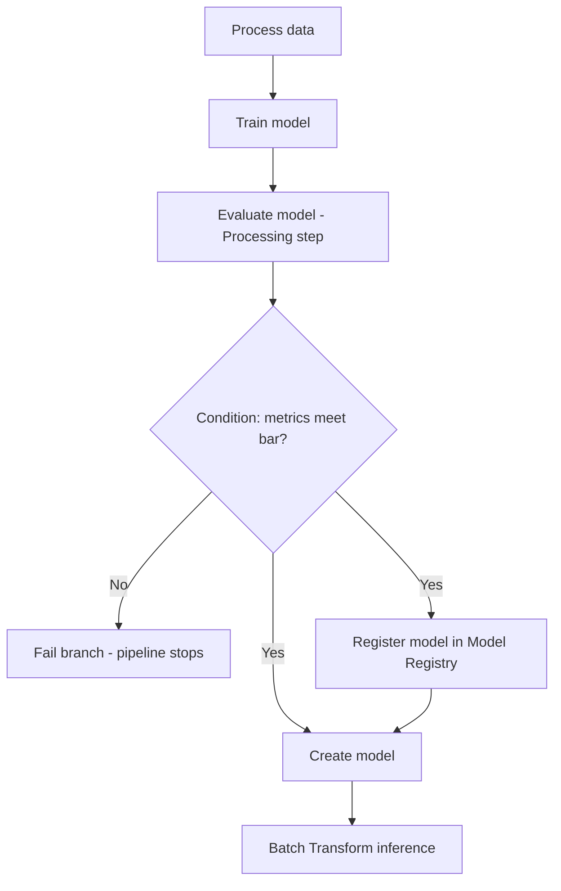
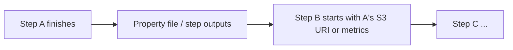

# SageMaker Pipelines

## :material-school: What you'll learn

!!! abstract "Learning objectives"
    You will orchestrate end-to-end ML and AI workflows with :simple-amazonaws: <a href="https://docs.aws.amazon.com/sagemaker/latest/dg/pipelines-overview.html">Amazon SageMaker Pipelines</a>—from data prep and training through evaluation, quality gates, model registration, and <a href="https://docs.aws.amazon.com/sagemaker/latest/dg/batch-transform.html">batch inference</a>. You will read a pipeline as a **directed acyclic graph (DAG)**, define it in the <a href="https://docs.aws.amazon.com/sagemaker-unified-studio/latest/userguide/sagemaker-pipelines.html">visual pipeline designer</a> or JSON, and trigger runs that either promote a model or stop on failure.

## :material-book-open-variant: Key definitions

| Term | Definition |
|---|---|
| <a href="https://docs.aws.amazon.com/sagemaker/latest/dg/pipelines-overview.html">**SageMaker Pipelines**</a> | A managed workflow service on <a href="https://docs.aws.amazon.com/sagemaker/latest/dg/whatis.html">Amazon SageMaker AI</a> that chains ML steps (process, train, evaluate, register, deploy) into one automatable pipeline. |
| **Directed acyclic graph (DAG)** | A graph of steps with one-way dependencies and **no cycles**—each step runs after its inputs are ready, and execution never loops back to an earlier step. |
| <a href="https://docs.aws.amazon.com/sagemaker/latest/dg/build-and-manage-steps.html#step-type-processing">**Processing step**</a> | Runs a <a href="https://docs.aws.amazon.com/sagemaker/latest/dg/processing-job.html">SageMaker Processing</a> job—for example ETL, train/validation splits, or **model evaluation** on holdout data. |
| <a href="https://docs.aws.amazon.com/sagemaker/latest/dg/build-and-manage-steps.html#step-type-training">**Training step**</a> | Launches a <a href="https://docs.aws.amazon.com/sagemaker/latest/dg/how-it-works-training.html">training job</a> that consumes processed data and writes **model artifacts** to Amazon S3. |
| <a href="https://docs.aws.amazon.com/sagemaker/latest/dg/build-and-manage-steps.html#step-type-condition">**Condition step**</a> | A branch gate that compares metrics (for example evaluation error) against a threshold and routes the run down **success** or **failure** paths. |
| <a href="https://docs.aws.amazon.com/sagemaker/latest/dg/build-and-manage-steps.html#step-type-register-model">**RegisterModel step**</a> | Registers an approved artifact as a versioned package in the <a href="https://docs.aws.amazon.com/sagemaker/latest/dg/model-registry.html">SageMaker Model Registry</a>. |
| <a href="https://docs.aws.amazon.com/sagemaker/latest/dg/build-and-manage-steps.html#step-type-create-model">**CreateModel step**</a> | Creates a deployable SageMaker **model** resource from training output in preparation for inference. |
| <a href="https://docs.aws.amazon.com/sagemaker/latest/dg/build-and-manage-steps.html#step-type-transform">**Transform step**</a> | Runs <a href="https://docs.aws.amazon.com/sagemaker/latest/dg/batch-transform.html">Batch Transform</a> to score a dataset offline—no persistent real-time endpoint required. |
| <a href="https://aws-sagemaker-mlops.github.io/sagemaker-model-building-pipeline-definition-JSON-schema/">**Pipeline definition JSON**</a> | The machine-readable DAG schema describing steps, dependencies, and parameters—editable in code or exported from the designer. |

## :material-scale-balance: Key distinctions / comparisons

| Item | Notes |
|---|---|
| **Manual notebook workflow** | You run process → train → evaluate → deploy by hand; easy for exploration, hard to reproduce and audit at scale. |
| **SageMaker Pipelines** | Same stages become **versioned, repeatable DAG runs** you can schedule, parameterize, and wire to CI/CD. |
| **Visual pipeline designer vs JSON** | The <a href="https://docs.aws.amazon.com/sagemaker-unified-studio/latest/userguide/sagemaker-pipelines.html">Unified Studio visual editor</a> is the fast path for teams; JSON (or the <a href="https://sagemaker.readthedocs.io/en/stable/workflows/pipelines/sagemaker.workflow.pipelines.html">SageMaker Python SDK</a>) suits automation and code review. |
| **Condition failure vs training failure** | A failed **training** job stops the run early; a **condition** failure means training succeeded but **quality did not meet your bar**—you intentionally skip registry and deployment. |
| **Batch Transform vs real-time endpoint** | The example pipeline ends with **batch scoring** over a dataset; use a <a href="https://docs.aws.amazon.com/sagemaker/latest/dg/realtime-endpoints.html">real-time endpoint</a> when you need low-latency online inference instead. |

## Why this matters

- 🔄 You automate the full lifecycle—kick off a run with new training data and get either a **registered, batch-scoring model** or a **controlled stop** when metrics fail.
- 📐 The DAG makes dependencies explicit: downstream steps never start until upstream outputs (S3 URIs, metrics, artifacts) are ready.
- 👥 Teams align on one definition of “production ready”—evaluation plus a **condition step** encodes your quality bar instead of informal checks.
- 🧭 Pipelines live inside the same surfaces you already use: <a href="https://docs.aws.amazon.com/sagemaker-unified-studio/latest/userguide/sagemaker-pipelines.html">SageMaker Unified Studio</a> and classic <a href="https://docs.aws.amazon.com/sagemaker/latest/dg/studio-updated.html">SageMaker Studio</a> / SageMaker AI APIs.

!!! info "What “orchestration” means here"
    SageMaker Pipelines does not replace your training or inference algorithms—it **coordinates** SageMaker jobs (and selected integrated steps) so one execution carries data and metadata from step to step without you stitching scripts together each time.

## :material-map: Walk through the example DAG

The canonical pattern matches what you see in the pipeline designer: **prepare data → train → evaluate → gate → register & create model → batch deploy**.



Follow the execution path step by step:

1. **Process data** — Incoming training data is cleaned, split, or featurized (typical <a href="https://docs.aws.amazon.com/sagemaker/latest/dg/processing-job.html">processing</a> work).
2. **Train model** — A training step consumes processed channels and writes artifacts to S3.
3. **Evaluate model** — Another processing step scores the trained model on test or validation data produced earlier.
4. **Condition** — Compare evaluation output (for example mean squared error) to your threshold. If quality is **not** good enough, the run follows the **failure** branch and **stops**—no registry entry and no deployment.
5. **On success** — **Register** the model package in the registry and **create** the SageMaker model resource (these can proceed once the condition passes).
6. **Batch inference** — A transform step runs predictions over the batch dataset you specify.

!!! success "Two outcomes from one pipeline run"
    When you start a pipeline execution with fresh training data, you end in one of two states: a **new model registered and batch scoring completed**, or a **clean failure** at the condition gate with no production promotion.

## How the DAG is wired

SageMaker builds the DAG from **data dependencies**: you pass a prior step’s **properties** (resolved at runtime) into the next step’s inputs—often S3 paths from processing outputs into training, or evaluation metrics into a condition.



!!! info "JsonPath-style references"
    Dependencies use paths such as `step_process.properties.ProcessingOutputConfig.Outputs["train"].S3Output.S3Uri` so the graph reflects **real data flow**, not just draw-order in the designer. See <a href="https://docs.aws.amazon.com/sagemaker/latest/dg/build-and-manage-steps.html">Pipelines steps</a> and the <a href="https://github.com/json-path/JsonPath">JsonPath</a> notation pipelines rely on.

!!! warning "Exam trap: DAG must be acyclic"
    A pipeline cannot loop back (“train again until good enough”) inside the same DAG definition. Use a **condition** to skip downstream work, or start a **new pipeline execution** from your application or scheduler when you need iterative retraining.

## :material-code-braces: Define and run a pipeline

### In Unified Studio (visual designer)

Under **AI/ML → ML pipelines**, choose **Create in visual editor**, connect step types (processing, training, condition, register, create model, transform), and **Execute** with a name and optional parameters. You can also **import** an existing <a href="https://aws-sagemaker-mlops.github.io/sagemaker-model-building-pipeline-definition-JSON-schema/">pipeline definition JSON</a> file.

### With boto3 (register and execute)

Most teams **author** the DAG with the visual tool or <a href="https://sagemaker.readthedocs.io/en/stable/workflows/pipelines/sagemaker.workflow.pipelines.html">Pipelines SDK</a>, then **register** and **start** runs through the API. <a href="https://docs.aws.amazon.com/sagemaker/latest/APIReference/API_CreatePipeline.html">CreatePipeline</a> accepts the JSON definition; <a href="https://docs.aws.amazon.com/sagemaker/latest/APIReference/API_StartPipelineExecution.html">StartPipelineExecution</a> kicks off a run.

```python
import boto3
import json

sm = boto3.client("sagemaker", region_name="us-east-1")

# In practice: export PipelineDefinition from the designer/SDK, not hand-written stubs
pipeline_definition = {
    "Version": "2020-12-01",
    "Metadata": {},
    "Parameters": [],
    "PipelineExperimentConfig": {},
    "Steps": [],  # Processing, Training, Condition, RegisterModel, CreateModel, Transform, ...
}

sm.create_pipeline(
    PipelineName="churn-training-pipeline",
    RoleArn="arn:aws:iam::123456789012:role/SageMakerPipelineRole",
    PipelineDefinition=json.dumps(pipeline_definition),
    PipelineDescription="Process, train, evaluate, gate, register, batch score",
)

execution = sm.start_pipeline_execution(
    PipelineName="churn-training-pipeline",
    PipelineExecutionDescription="Weekly retrain with new features",
    # PipelineParameters=[{"Name": "InputDataUri", "Value": "s3://bucket/new/"}],
)
print(execution["PipelineExecutionArn"])
```

### Monitor an execution

Use <a href="https://docs.aws.amazon.com/sagemaker/latest/APIReference/API_DescribePipelineExecution.html">DescribePipelineExecution</a> (and per-step describe APIs) to see whether you are still training, failed the condition, or completed batch transform.

```python
import boto3

sm = boto3.client("sagemaker", region_name="us-east-1")

detail = sm.describe_pipeline_execution(
    PipelineExecutionArn="<pipeline-execution-arn>",
)
print(detail["PipelineExecutionStatus"])  # Executing, Succeeded, Failed, Stopped

steps = sm.list_pipeline_execution_steps(
    PipelineExecutionArn="<pipeline-execution-arn>",
)
for step in steps["PipelineExecutionSteps"]:
    print(step["StepName"], step["StepStatus"])
```

!!! warning "💰 Failed runs still consume resources"
    Steps that **completed before** a condition failure (for example training and evaluation) already incurred compute cost. Design thresholds and caching (<a href="https://docs.aws.amazon.com/sagemaker/latest/dg/pipelines-caching.html">pipeline step caching</a>) so you do not pay for full retrains on every minor data refresh.

## :material-alert: Limitations / edge cases

- 🔒 The pipeline **execution role** must allow every step type you use (S3, training, registry, transform)—IAM gaps show up as step failures, not designer errors.
- 📦 **Condition steps** branch logic; they do not fix a bad model—you still need sound evaluation code in the processing step.
- 🔁 **Selective execution** and **caching** help reruns, but they do not replace a well-designed DAG—see <a href="https://docs.aws.amazon.com/sagemaker/latest/dg/pipelines-selective-ex.html">selective execution</a> when iterating on one step.
- 🌐 **Cross-account** pipelines need extra setup (<a href="https://docs.aws.amazon.com/sagemaker/latest/dg/build-and-manage-xaccount.html">cross-account support</a>) beyond a single-account tutorial DAG.

## :material-lightbulb: Key takeaways

- 🔑 <a href="https://docs.aws.amazon.com/sagemaker/latest/dg/pipelines-overview.html">SageMaker Pipelines</a> is your **DAG-based orchestrator** for ML workflows on SageMaker AI.
- 📊 A typical production path is **process → train → evaluate → condition → register + create model → batch transform**.
- 🎨 Use the **visual designer** in Unified Studio for speed; use **JSON/SDK** when pipelines belong in Git and CI/CD.
- ⚡ **Data dependencies** between steps define the DAG—outputs flow via step **properties**, not ad hoc scripts.
- 🛑 A **condition failure** is a deliberate **stop** before registry or deployment when quality checks fail.

## Industry scenarios

- 🏦 **Credit risk modeling** — Nightly pipeline runs ingest refreshed loan performance data, retrains a gradient-boosted model, evaluates AUC on a holdout set, and only registers the package when AUC beats the prior champion; batch transform writes scores back to the warehouse for downstream rules engines.
- 🏥 **Medical imaging QA** — A hospital team processes DICOM-derived tensors, trains a segmentation model, evaluates Dice coefficient in a processing step, and blocks registry promotion unless the condition passes—avoiding deployment of a model that fails clinical validation thresholds.
- 🛒 **Demand forecasting** — Retailers chain seasonal feature engineering, distributed training, and error-metric gates; on success they register the model and run batch inference over the next week’s SKU list without keeping a 24/7 endpoint warm for bulk planning jobs.

## :material-link-variant: Internal References

- [SageMaker Unified Studio](../11-sagemaker-unified-studio/index.md)
- [Data Processing, Training, and Deployment with SageMaker](../02-data-processing-training-and-deployment-with-sagemaker/index.md)
- [SageMaker Model Registry](../07-sagemaker-model-registry/index.md)
- [SageMaker Deployment Safeguards](../03-sagemaker-deployment-safeguards/index.md)
- [SageMaker Lineage Tracking](../08-sagemaker-lineage-tracking/index.md)
- [Section 5: Managing Models with SageMaker AI](../index.md)

## External References

- :fontawesome-solid-link: <a href="https://docs.aws.amazon.com/sagemaker/latest/dg/pipelines-overview.html">Pipelines overview</a>
- :fontawesome-solid-link: <a href="https://docs.aws.amazon.com/sagemaker/latest/dg/pipelines-build.html">Pipelines actions</a>
- :fontawesome-solid-link: <a href="https://docs.aws.amazon.com/sagemaker/latest/dg/build-and-manage-steps.html">Pipelines steps</a>
- :fontawesome-solid-link: <a href="https://docs.aws.amazon.com/sagemaker/latest/dg/build-and-manage-steps.html#step-type-condition">Condition step</a>
- :fontawesome-solid-link: <a href="https://docs.aws.amazon.com/sagemaker/latest/dg/model-registry.html">Model Registry</a>
- :fontawesome-solid-link: <a href="https://docs.aws.amazon.com/sagemaker/latest/dg/batch-transform.html">Batch transform</a>
- :fontawesome-solid-link: <a href="https://docs.aws.amazon.com/sagemaker-unified-studio/latest/userguide/sagemaker-pipelines.html">Pipelines in SageMaker Unified Studio</a>
- :fontawesome-solid-link: <a href="https://docs.aws.amazon.com/sagemaker/latest/dg/define-pipeline.html">Define a pipeline</a>
- :fontawesome-solid-link: <a href="https://docs.aws.amazon.com/sagemaker/latest/dg/run-pipeline.html">Run a pipeline</a>
- :fontawesome-solid-link: <a href="https://docs.aws.amazon.com/sagemaker/latest/dg/pipelines-caching.html">Caching pipeline steps</a>
- :fontawesome-solid-link: <a href="https://docs.aws.amazon.com/sagemaker/latest/APIReference/API_CreatePipeline.html">CreatePipeline API</a>
- :fontawesome-solid-link: <a href="https://docs.aws.amazon.com/sagemaker/latest/APIReference/API_StartPipelineExecution.html">StartPipelineExecution API</a>
- :fontawesome-solid-link: <a href="https://aws-sagemaker-mlops.github.io/sagemaker-model-building-pipeline-definition-JSON-schema/">Pipeline definition JSON schema</a>
- :fontawesome-solid-link: <a href="https://sagemaker.readthedocs.io/en/stable/workflows/pipelines/sagemaker.workflow.pipelines.html">SageMaker Python SDK — Pipelines</a>
