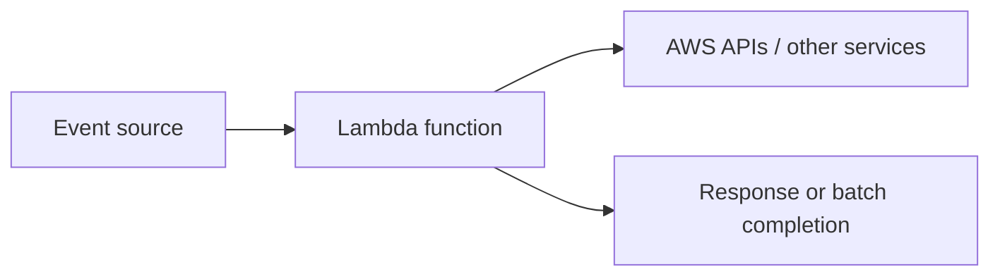
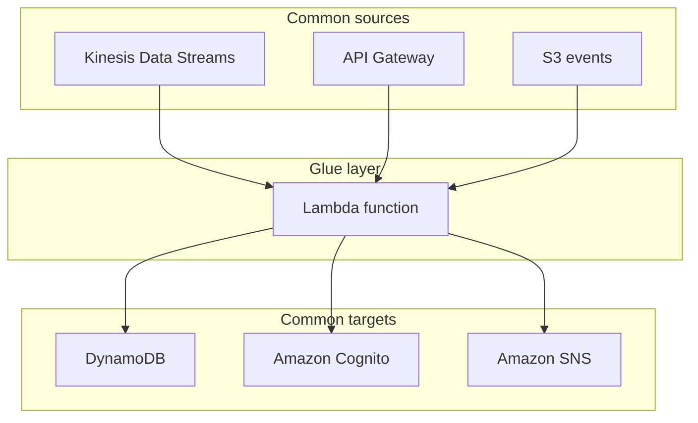
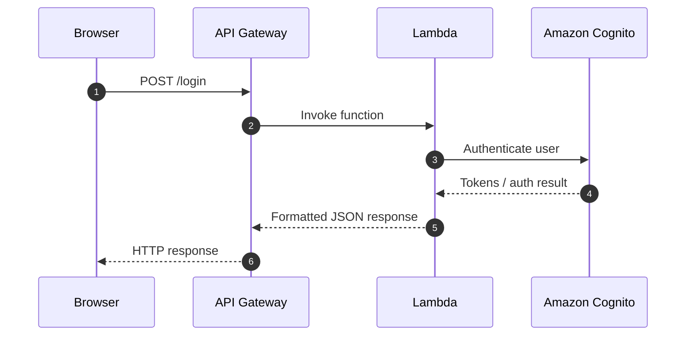
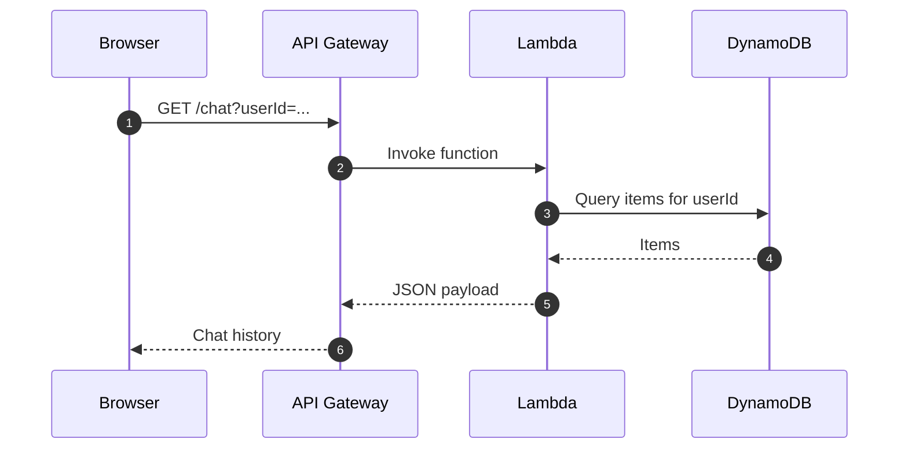
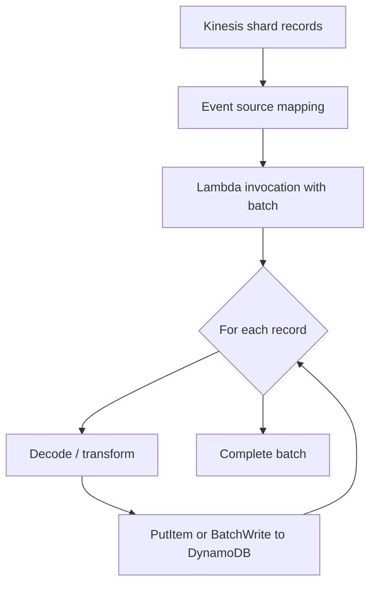
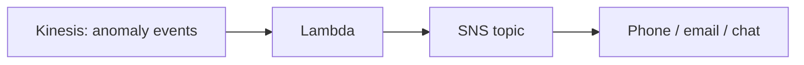

# AWS Lambda

## :material-school: What you'll learn

!!! abstract "Learning objectives"
    You will use :simple-amazonaws: <a href="https://docs.aws.amazon.com/lambda/latest/dg/welcome.html">AWS Lambda</a> as **serverless compute**—run small, stateless functions without provisioning servers, let AWS scale concurrency with incoming load, and wire Lambda between services that do not talk to each other natively (streams, APIs, databases, auth, notifications).

## :material-book-open-variant: Key definitions

| Term | Definition |
|---|---|
| <a href="https://docs.aws.amazon.com/lambda/latest/dg/welcome.html">**AWS Lambda**</a> | A managed service that runs your code in response to events; you supply the function logic and AWS handles execution, scaling, and the underlying compute. |
| **Serverless compute** | You focus on **what** the code does; AWS provisions and scales execution capacity on demand—you do not manage EC2 instances for each small task. |
| <a href="https://docs.aws.amazon.com/lambda/latest/dg/concepts-basics.html">**Function handler**</a> | The entry point in your code (for example `lambda_handler(event, context)`) that Lambda invokes when an event arrives. |
| <a href="https://docs.aws.amazon.com/lambda/latest/dg/concepts-basics.html">**Event / trigger**</a> | The signal that starts a run—an API request, a batch of stream records, a schedule, an S3 upload, and many other integrations. |
| **Glue / integration layer** | Short-lived Lambda code that **transforms, routes, or orchestrates** calls between AWS services (format payloads, call downstream APIs, return responses). |
| <a href="https://docs.aws.amazon.com/lambda/latest/dg/invocation-eventsourcemapping.html">**Event source mapping**</a> | Lambda-managed polling from stream or queue sources (for example <a href="https://docs.aws.amazon.com/kinesis/latest/dev/introduction.html">Amazon Kinesis Data Streams</a>); delivers **batches** of records to your function. |
| <a href="https://docs.aws.amazon.com/serverless/latest/devguide/welcome.html">**Serverless application**</a> | An architecture built from managed services (Lambda, <a href="https://docs.aws.amazon.com/apigateway/latest/developerguide/welcome.html">API Gateway</a>, <a href="https://docs.aws.amazon.com/AmazonS3/latest/userguide/WebsiteHosting.html">Amazon S3</a> static hosting, etc.) with minimal server operations. |

## :material-scale-balance: Key distinctions / comparisons

| Item | Notes |
|---|---|
| **Lambda vs self-managed EC2** | EC2 fits long-running processes you control end to end; Lambda fits **short, event-driven** work (including stream consumers) where you do not want to patch, scale, or pay for idle servers. |
| **Direct service integration vs Lambda glue** | Some services integrate natively; when they do not—or you need custom transformation—Lambda sits in the middle with arbitrary code. |
| **Serverless website vs fully dynamic site** | Static HTML/JS from S3 plus AJAX to API Gateway + Lambda works well; highly dynamic server-rendered UIs usually need more than static assets alone. |
| **Synchronous invoke (API) vs stream batch** | API Gateway calls expect a **timely HTTP response**; Kinesis mappings deliver **batches of records** your handler loops over and acknowledges via the event source mapping lifecycle. |

## Why this matters

- ⚡ You run **small snippets of code** in the cloud without choosing instance types or cluster sizes—Lambda scales concurrency as load grows or shrinks.
- 🔗 In data pipelines, Lambda is the **adapter** between services: ingest from a stream, reshape records, write to a database, or fan out alerts.
- 💰 For glue work (login proxy, stream-to-table loader, alert notifier), Lambda often costs less operational overhead than maintaining a dedicated EC2 consumer.
- 🧩 Because Lambda is “just code,” the same pattern repeats everywhere: **trigger → transform → call next service → return or complete**.

!!! info "Big data and streaming context"
    When large volumes of events flow continuously, Lambda **scales out concurrent executions** to process batches in parallel (subject to <a href="https://docs.aws.amazon.com/lambda/latest/dg/gettingstarted-limits.html">service quotas</a>). That makes it a natural fit for **moving and reshaping data** as it travels between AWS services.

## How Lambda works

At a high level, an **event** arrives, Lambda starts an **execution environment**, runs your **handler**, and then either returns a response (synchronous patterns) or finishes processing a batch (stream/queue patterns).



Core behaviors you should internalize:

- 🔑 **Stateless by design** — Treat each invocation as independent; persist state in <a href="https://docs.aws.amazon.com/amazondynamodb/latest/developerguide/Introduction.html">DynamoDB</a>, S3, or another store, not in local memory across runs.
- 📈 **Automatic scaling** — More incoming events generally mean more concurrent executions, without you resizing a fleet.
- 🛠️ **You own the code** — Runtime, dependencies, and business logic are yours; AWS owns capacity and the execution sandbox.

!!! warning "Exam trap: 'serverless' ≠ 'no servers'"
    **Serverless** means **you** do not provision or manage servers for that component. AWS still runs your code on managed infrastructure—you trade operational control for elasticity and reduced undifferentiated heavy lifting.

## Lambda as the glue between services

Many architectures need a component that:

1. Receives data from **service A** (stream, HTTP request, file upload).
2. **Transforms** it (parse JSON, filter fields, enrich IDs).
3. Calls **service B** (database, auth, messaging).

Lambda fills that role because it can invoke virtually any AWS API your <a href="https://docs.aws.amazon.com/lambda/latest/dg/lambda-intro-execution-role.html">execution role</a> allows.



## Serverless website pattern

You can host a **mostly static** front end from S3 (HTML + JavaScript). The browser uses **AJAX** calls for dynamic behavior; **API Gateway** is the controlled front door; **Lambda** implements backend logic.

**Login example** — API Gateway forwards the request; Lambda talks to <a href="https://docs.aws.amazon.com/cognito/latest/developerguide/cognito-user-pools.html">Amazon Cognito</a> and returns tokens to the client.



**Chat history example** — After login, the client requests history for a `userId`. API Gateway triggers Lambda; Lambda **queries DynamoDB** and returns messages.



!!! success "When this pattern shines"
    Marketing sites, internal tools, and SPAs with clear API boundaries: **static assets on S3**, **HTTPS APIs on API Gateway**, **business rules in Lambda**—no EC2 web tier you patch on weekends.

## Your course workloads on Lambda

### Kinesis → DynamoDB (replace the EC2 consumer)

Previously, an **EC2-hosted Kinesis consumer** bridged a data stream (server logs) into DynamoDB for long-term storage. That is simple glue work—**Lambda is the better default**: no servers to manage, scaling follows stream throughput.

Processing model:

1. <a href="https://docs.aws.amazon.com/lambda/latest/dg/services-kinesis-create.html">Event source mapping</a> polls the stream.
2. Each invocation receives a **batch** of records in `event["Records"]`.
3. Your handler **loops** records, decodes payloads, and writes to DynamoDB.



### Kinesis → SNS (transaction rate alarm)

Later you will build an **alarm path**: unusual events land on Kinesis; Lambda formats an alert and calls <a href="https://docs.aws.amazon.com/sns/latest/dg/welcome.html">Amazon SNS</a> to notify operators (for example SMS or email). Same glue idea—different target service.



## :material-code-braces: How to apply it

### API Gateway handler (login proxy sketch)

Behind API Gateway, your handler parses the HTTP body and calls Cognito. Wire IAM so the function can use `cognito-idp` actions you need (often via a tightly scoped execution role).

```python
import boto3
import json

cognito = boto3.client("cognito-idp", region_name="us-east-1")

def lambda_handler(event, context):
    body = json.loads(event.get("body") or "{}")
    response = cognito.initiate_auth(
        ClientId="<app-client-id>",
        AuthFlow="USER_PASSWORD_AUTH",
        AuthParameters={
            "USERNAME": body["username"],
            "PASSWORD": body["password"],
        },
    )
    return {
        "statusCode": 200,
        "headers": {"Content-Type": "application/json"},
        "body": json.dumps(response["AuthenticationResult"]),
    }
```

See <a href="https://docs.aws.amazon.com/lambda/latest/dg/services-apigateway.html">Invoking Lambda from API Gateway</a> for proxy integration, event format, and permissions.

### Stream batch → DynamoDB

Map each Kinesis record to a DynamoDB write. Use `batch_writer()` for throughput; handle partial failures per <a href="https://docs.aws.amazon.com/lambda/latest/dg/invocation-eventsourcemapping.html">batching and retry semantics</a>.

```python
import base64
import json
import boto3

dynamodb = boto3.resource("dynamodb", region_name="us-east-1")
table = dynamodb.Table("<server-logs-table>")

def lambda_handler(event, context):
    with table.batch_writer() as batch:
        for record in event["Records"]:
            payload = json.loads(base64.b64decode(record["kinesis"]["data"]))
            batch.put_item(
                Item={
                    "pk": payload["host"],
                    "sk": payload["timestamp"],
                    "message": payload["message"],
                }
            )
    return {"statusCode": 200}
```

Configure the mapping with <a href="https://docs.aws.amazon.com/lambda/latest/dg/services-kinesis-parameters.html">Kinesis event source parameters</a> (batch size, starting position, parallelization) for your throughput and latency goals.

### Publish an alert to SNS

```python
import json
import boto3

sns = boto3.client("sns", region_name="us-east-1")

def lambda_handler(event, context):
    for record in event["Records"]:
        detail = json.loads(record["kinesis"]["data"])
        sns.publish(
            TopicArn="arn:aws:sns:us-east-1:123456789012:ops-alerts",
            Subject="Unusual transaction rate",
            Message=json.dumps(detail),
        )
    return {"statusCode": 200}
```

## Examples

!!! success "Walkthrough: serverless login + chat read"
    1. Browser loads static pages from S3.
    2. Login `POST` hits API Gateway → Lambda → Cognito; browser stores returned tokens.
    3. Authenticated `GET` for chat history hits API Gateway → Lambda → DynamoDB `Query` on `userId` → JSON returned to the browser.

!!! success "Walkthrough: server log archival"
    1. Producers write log events to a Kinesis data stream.
    2. Lambda event source mapping delivers batches.
    3. Handler decodes each record and persists rows in DynamoDB for analytics—no EC2 consumer fleet.

## :material-alert: Limitations / edge cases

!!! warning "Stateless handlers need external state"
    Do not rely on in-memory caches surviving across invocations. Use DynamoDB, ElastiCache, or another durable store when you need session or chat state.

!!! warning "Serverless websites are not a fit for every UI"
    Heavy server-side rendering, large binary uploads without front-door design, or long-lived WebSocket sessions may need additional services (or a different compute tier)—plan beyond “S3 + Lambda only.”

- ⏱️ **Timeouts and memory** — Long CPU work or huge batches can hit Lambda limits; tune memory, batch size, or split processing.
- 🔁 **Idempotency** — Stream and queue sources can redeliver; make writes safe to repeat (conditional writes, natural keys).
- 🔒 **Least privilege** — Each function’s execution role should allow only the APIs that function calls (Cognito, DynamoDB, SNS, etc.).

## :material-lightbulb: Key takeaways

- 🔑 <a href="https://docs.aws.amazon.com/lambda/latest/dg/welcome.html">AWS Lambda</a> runs **small, stateless code** on demand—you do not provision EC2 for every glue task.
- ⚡ Lambda **scales with event volume**, which suits streaming and API traffic spikes alike.
- 🔗 Lambda is the **integration glue** between services that lack a native connector or need custom transformation.
- 🌐 **Serverless websites** combine S3 static assets, API Gateway, Lambda, and backends like Cognito and DynamoDB.
- 📊 In this course, you will replace an **EC2 Kinesis consumer** with Lambda (**Kinesis → DynamoDB**) and later add **Kinesis → SNS** alerting.

## Industry scenarios

- 🏥 **HL7 / FHIR stream normalization** — Hospital interfaces push raw messages to Kinesis; Lambda validates, maps fields, and writes curated rows to DynamoDB for a clinical dashboard—no always-on ingestion servers.
- 🏦 **Fraud signal fan-out** — Payment anomalies hit a stream; Lambda enriches the event and publishes to SNS so on-call analysts get SMS within seconds of the pattern detector firing.
- 🛒 **Order-status micro-API** — A retailer serves static product pages from S3; checkout status and loyalty login go through API Gateway + Lambda to Cognito and DynamoDB, keeping the public surface small and scalable on sale days.

## :material-link-variant: Internal References

- [Lambda Integration](../02-lambda-integration/index.md)
- [Lambda with Bedrock](../03-lambda-with-bedrock/index.md)
- [Amazon API Gateway](../04-amazon-api-gateway/index.md)
- [Amazon API Gateway and Generative AI Applications](../05-amazon-api-gateway-and-generative-ai-applications/index.md)
- [Amazon SNS](../24-amazon-sns/index.md)
- [Using Comprehend, Lambda, and Bedrock together](../../section-2/15-using-comprehend-lambda-and-bedrock-together/index.md)
- [Amazon DynamoDB Basic APIs](../../section-2/36-amazon-dynamodb-basic-apis/index.md)
- [Section 6: Building Applications Around Your AI System](../index.md)

## External References

- :fontawesome-solid-link: <a href="https://docs.aws.amazon.com/lambda/latest/dg/welcome.html">What is AWS Lambda?</a>
- :fontawesome-solid-link: <a href="https://docs.aws.amazon.com/lambda/latest/dg/concepts-basics.html">How Lambda works</a>
- :fontawesome-solid-link: <a href="https://docs.aws.amazon.com/lambda/latest/dg/concepts-application-design.html">Designing Lambda applications</a>
- :fontawesome-solid-link: <a href="https://docs.aws.amazon.com/lambda/latest/dg/gettingstarted-limits.html">Lambda quotas</a>
- :fontawesome-solid-link: <a href="https://docs.aws.amazon.com/lambda/latest/dg/services-apigateway.html">Lambda with API Gateway</a>
- :fontawesome-solid-link: <a href="https://docs.aws.amazon.com/lambda/latest/dg/services-kinesis-create.html">Process Kinesis records with Lambda</a>
- :fontawesome-solid-link: <a href="https://docs.aws.amazon.com/lambda/latest/dg/invocation-eventsourcemapping.html">Stream and queue event source mappings</a>
- :fontawesome-solid-link: <a href="https://docs.aws.amazon.com/apigateway/latest/developerguide/welcome.html">What is Amazon API Gateway?</a>
- :fontawesome-solid-link: <a href="https://docs.aws.amazon.com/AmazonS3/latest/userguide/WebsiteHosting.html">Hosting a static website on Amazon S3</a>
- :fontawesome-solid-link: <a href="https://docs.aws.amazon.com/cognito/latest/developerguide/cognito-user-pools.html">Amazon Cognito user pools</a>
- :fontawesome-solid-link: <a href="https://docs.aws.amazon.com/amazondynamodb/latest/developerguide/Introduction.html">What is Amazon DynamoDB?</a>
- :fontawesome-solid-link: <a href="https://docs.aws.amazon.com/kinesis/latest/dev/introduction.html">Amazon Kinesis Data Streams</a>
- :fontawesome-solid-link: <a href="https://docs.aws.amazon.com/sns/latest/dg/welcome.html">What is Amazon SNS?</a>
- :fontawesome-solid-link: <a href="https://docs.aws.amazon.com/serverless/latest/devguide/welcome.html">Serverless development on AWS</a>
- :fontawesome-solid-link: <a href="https://docs.aws.amazon.com/hands-on/latest/build-web-app-s3-lambda-api-gateway-dynamodb/index.html">Build a basic web application (hands-on)</a>
